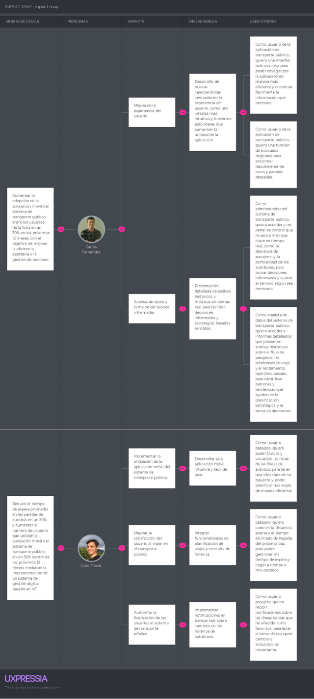

# Capítulo III: Requirements Specification

## 3.1 To-Be Scenario Mapping

### 3.1.1 Pasajeros

### 3.1.2 Empresa de transporte público

## 3.2 User Stories

<table border="2">
    <tr>
        <td>
           
<b>Epic/Story ID</b>

        </td>
        <td>
          
<b>Título</b>

        </td>
        <td>
          
<b>Descripción</b>

        </td>
        <td>
          
<b>Criterios de aceptación</b>

        </td>
        <td>
          
<b>Relacionado con (Epic ID)</b>

        </td>
    </tr>
    <tr>
        <td>EP01</td>
        <td>Gestión de cuenta</td>
        <td>Como usuario, deseo acceder a mi cuenta para ingresar a la aplicación</td>
        <td> - </td>
        <td> - </td>
    </tr>
    <tr>
        <td>EP02</td>
        <td>Gestión de lineas de transporte</td>
        <td>Como encargado de flota de autobuses, deseo administrar la información en tiempo real de mi flota</td>
        <td> - </td>
        <td> - </td>
    </tr>
    <tr>
        <td>EP03</td>
        <td>Información presentada en el sitio web estático</td>
        <td>Como visitante, deseo encontrar información acerca de la aplicación para conocer si esta me resultará útil</td>
        <td> - </td>
        <td> - </td>
    </tr>
    <tr>
        <td>EP04</td>
        <td>Gestión de dispositivos IOT</td>
        <td>Como desarrollador, quiero configurar los dispositivos IOT a mi sistema</td>
        <td> - </td>
        <td> - </td>
    </tr>
    <tr>
        <td>EP05</td>
        <td>Gestión de suscripciones</td>
        <td>Como pasajero, quiero cambiar mi plan de suscripción</td>
        <td> - </td>
        <td> - </td>
    </tr>
    <tr>
        <td>EP06</td>
        <td>Gestión de servicios</td>
        <td>Como desarrollador, quiero crear endpoints que me ayuden con el desarrollo de mi solución</td>
        <td> - </td>
        <td> - </td>
    </tr>
    <tr>
        <td>EP07</td>
        <td>Información de líneas de transportes</td>
        <td>Como pasajero, quiero obtener información en tiempo real sobre líneas de transporte</td>
        <td> - </td>
        <td> - </td>
    </tr>

<tr>
        <td>US01</td>
        <td>Redirección de la landing Page a tiendas de aplicaciones</td>
        <td>Como visitante del segmento pasajero, deseo dirigirme a la aplicación móvil correspondiente para descargarla en mi dispositivo móvil
        </td>
        <td>
            <b>Scenario 1: Redirección a Google Play</b>  
            <b>Dado</b> que el visitante del segmento pasajero se encuentra en la vista principal de la landing page 
            <b>Cuando</b> el visitante selecciona descargar la aplicación para Android 
            <b>Entonces</b> el visitante es redirigido a la página de descarga de la aplicación en Google Play   
            <b>Scenario 2: Redirección a App Store</b>  
             <b>Dado</b> que el visitante del segmento pasajero se encuentra en la vista principal de la landing page 
             <b>Cuando</b> el visitante selecciona descargar la aplicación para iOS 
             <b>Entonces</b> el visitante es redirigido a la página de descarga de la aplicación en la App Store de iOS  
            <b>Scenario 3: Falla en la Redirección a Google Play</b>  
             <b>Dado</b> que el visitante del segmento pasajero se encuentra en la vista principal de la landing page 
             <b>Cuando</b> el visitante selecciona descargar la aplicación para Android 
             <b>Entonces</b> no es redirigido a la página de descarga de la aplicación en Google Play 
             <b>Y</b> recibe un mensaje de error o una página no encontrada  
            <b>Scenario 4: Falla en la Redirección a App Store</b>  
             <b>Dado</b> que el visitante del segmento pasajero se encuentra en la vista principal de la landing page 
             <b>Cuando</b> el visitante selecciona descargar la aplicación para iOS 
             <b>Entonces</b> no es redirigido a la página de descarga de la aplicación en la App Store de iOS 
             <b>Y</b> recibe un mensaje de error o una página no encontrada  
             <b>Scenario 5: No se encuentra la Aplicación en Google Play</b>  
            <b>Dado</b> que el visitante del segmento pasajero se encuentra en la vista principal de la landing page 
            <b>Y</b> la aplicación no se encuentra subida en la Play Store 
            <b>Cuando</b> el visitante selecciona descargar la aplicación para Android 
            <b>Entonces</b> es redirigido a la página principal de Google Play  
            <b>Scenario 6: No se Encuentra la Aplicación en App Store</b>  
            <b>Dado</b> que el visitante del segmento pasajero se encuentra en la vista principal de la landing page 
            <b>Y</b> la aplicación no se encuentra subida en la App Store 
            <b>Cuando</b> el visitante selecciona descargar la aplicación para iOS 
            <b>Entonces</b> es redirigido a la página principal de la App Store de iOS 
        </td>
        <td></td>
    </tr>
<tr>
    <td>US02</td>
        <td>Redirección de la landing Page a la aplicación web</td>
        <td>Como visitante del segmento encargado de flota de autobuses, deseo ingresar a la aplicación web mediante la landing page para usarla en mi navegador favorito</td>
        <td>
            <b>Scenario 1: Redirección a la aplicación web de ChapaTuBus</b>  
            <b>Dado</b> que el visitante del segmento encargado de la flota de autobuses se encuentra en la sección de empresa de la landing page 
            <b>Cuando</b> el visitante decide redirigirse a la aplicación web 
            <b>Entonces</b> el visitante es redirigido a la aplicación web de ChapaTuBus  
            <b>Scenario 2: Redirección fallida debido a la aplicación web caída</b>  
            <b>Dado</b> que el visitante se encuentra en la sección de empresa de la landing page 
            <b>Cuando</b> el visitante elige redirigirse a la aplicación web 
            <b>Y</b> la aplicación web de ChapaTuBus se encuentra caída o no disponible 
            <b>Entonces</b> el visitante no es redirigido y recibe un mensaje informando sobre la indisponibilidad temporal de la aplicación web  
            <b>Scenario 3: Redirección interrumpida por un error en el sistema</b>  
            <b>Dado</b> que el visitante se encuentra en la sección de empresa de la landing page 
            <b>Cuando</b> el visitante elige redirigirse a la aplicación web 
            <b>Y</b> el sistema experimenta un error interno 
            <b>Entonces</b> el visitante no es redirigido y recibe un mensaje de error 
        </td>
        <td></td>
    </tr>
<tr>
        <td>US03</td>
        <td>Envío de mensaje a través de un formulario de contacto</td>
        <td>Como visitante de cualquier segmento, deseo enviar un mensaje a los desarrolladores para enviar sugerencias, quejas u mensajes con otro motivo que yo desee</td>
        <td>
    <b>Scenario 1: Envío exitoso del formulario de contacto</b>  
    <b>Dado</b> que el visitante de cualquier segmento se encuentra en la sección de contacto de la landing page 
    <b>Cuando</b> el visitante completa todos los campos del formulario de contacto con la información solicitada 
    <b>Y</b> ordena enviar el formulario 
    <b>Entonces</b> la información proporcionada es enviada correctamente al correo electrónico de ChapaTuBus  
    <b>Scenario 2: Envío fallido por campos incompletos en el formulario</b>  
    <b>Dado</b> que el visitante de cualquier segmento se encuentra en la sección de contacto de la landing page 
    <b>Cuando</b> el visitante completa parcialmente los campos requeridos en el formulario de contacto 
    <b>Y</b> ordena enviar el formulario 
    <b>Entonces</b> se muestra un mensaje de error indicando los campos que aún necesitan ser completados  
    <b>Scenario 3: Envío del formulario con información inválida</b>  
    <b>Dado</b> que el visitante de cualquier segmento se encuentra en la sección de contacto de la landing page 
    <b>Cuando</b> el visitante proporciona información inválida en uno o más campos del formulario de contacto 
    <b>Y</b> ordena enviar el formulario 
    <b>Entonces</b> se muestra un mensaje de error indicando los campos con información incorrecta  
    <b>Scenario 4: Cancelación del envío del formulario</b>  
    <b>Dado</b> que el visitante de cualquier segmento se encuentra en la sección de contacto de la landing page 
    <b>Cuando</b> el visitante ha llenado o parcialmente llenado el formulario de contacto 
    <b>Y</b> decide cancelar el envío del formulario 
    <b>Entonces</b> el formulario no es enviado y se mantiene la información ingresada por el usuario en los campos correspondientes  
    <b>Scenario 5: Redirección a otra sección tras el envío exitoso</b>  
    <b>Dado</b> que el visitante de cualquier segmento ha enviado con éxito el formulario de contacto 
    <b>Cuando</b> el visitante recibe la confirmación del envío exitoso 
    <b>Entonces</b> es redirigido automáticamente a una página de agradecimiento o a otra sección relevante de la landing page 
</td>
        <td></td>
    </tr>
<tr>
        <td>US04</td>
        <td>Conocimiento del Equipo desarrollador de la aplicación</td>
        <td> Como visitante, deseo conocer al equipo que está desarrollando la aplicación para tener una mayor confianza en las personas detrás del proyecto.</td>
        <td>
    <b>Scenario 1: Navegación a la sección de Preguntas Frecuentes</b>  
    <b>Dado</b> que el visitante se encuentra en la página principal de la Landing Page 
    <b>Cuando</b> el visitante se desplaza hasta la sección de Preguntas Frecuentes 
    <b>Entonces</b> el visitante encuentra la sección de Preguntas Frecuentes.  
    <b>Scenario 2: Acceso a preguntas y respuestas específicas</b>  
    <b>Dado</b> que el visitante se encuentra en la sección de Preguntas Frecuentes 
    <b>Cuando</b> el visitante selecciona una pregunta de la lista 
    <b>Entonces</b> se despliega la respuesta correspondiente de manera clara y concisa. 
</td>
        <td></td>
    </tr>
<tr>
        <td>US05</td>
        <td>Sección de Preguntas Frecuentes</td>
        <td>Como visitante, deseo acceder a una sección de Preguntas Frecuentes para resolver mis inquietudes sobre el servicio ofrecido.</td>
        <td>
        <b>Scenario 1: Navegación a la sección de Preguntas Frecuentes</b>  
        <b>Dado</b> que el visitante se encuentra en la página principal de la Landing Page 
        <b>Cuando</b> el visitante se desplaza hasta la sección de Preguntas Frecuentes 
        <b>Entonces</b> el visitante encuentra la sección de Preguntas Frecuentes.  
        <b>Scenario 2: Acceso a preguntas y respuestas específicas</b>  
        <b>Dado</b> que el visitante se encuentra en la sección de Preguntas Frecuentes 
        <b>Cuando</b> el visitante selecciona una pregunta de la lista 
        <b>Entonces</b> se despliega la respuesta correspondiente de manera clara y concisa. 
</td>
        <td></td>
    </tr>
<tr>
        <td>US06</td>
        <td>Navegación y Contenido Informativo en el Footer</td>
        <td>Como visitante ,deseo tener acceso fácil y claro a información relevante y enlaces útiles en el footer para una navegación más eficiente e acceder rápidamente a secciones importantes del sitio.</td>
        <td>
    <b>Scenario 1: Acceso a información relevante en el footer</b>  
    <b>Dado</b> que el visitante se encuentra en cualquier página del sitio web 
    <b>Cuando</b> el visitante desplaza hacia abajo hasta el footer 
    <b>Entonces</b> el visitante encuentra información relevante y enlaces útiles claramente organizados y visibles.  
    <b>Scenario 2: Enlaces a secciones importantes en el footer</b>  
    <b>Dado</b> que el visitante está en el footer  
    <b>Cuando</b> el visitante busca enlaces a secciones importantes como "Inicio", "Nosotros", "Contacto", entre otros 
    <b>Entonces</b> el visitante encuentra estos enlaces de forma clara y directa.  
    <b>Scenario 3: Acceso rápido a redes sociales</b>  
    <b>Dado</b> que el visitante está en el footer del sitio web 
    <b>Cuando</b> el visitante elige algún ícono de las redes sociales disponibles 
    <b>Entonces</b> el visitante es redirigido a la red social elegida 
</td>
        <td>
        <!--
            <b>Criterios de Aceptación:</b> 
            1. El botón de Google Play en la landing page debe ser funcional y redirigir al usuario a la página de descarga de la aplicación en Google Play Store. 
            2. El botón de App Store en la landing page debe ser funcional y redirigir al usuario a la página de descarga de la aplicación en la App Store de iOS. 
            3. La redirección debe ser inmediata y sin errores, proporcionando al usuario una experiencia fluida. 
            4. Los botones de acción deben ser claramente visibles y distinguibles para el usuario.-->
        </td>
    </tr>
<tr>
        <td>US07</td>
        <td>Diseño Responsivo de la Landing Page</td>
        <td>Como visitante, deseo que la página se adapte correctamente a diferentes dispositivos y tamaños de pantalla (como móviles, tablets y desktops), para una experiencia de usuario óptima y consistente en cualquier dispositivo que utilice.</td>
        <td>
    <b>Scenario 1: Visualización adecuada en dispositivos móviles</b>  
    <b>Dado</b> que el visitante accede a la landing page desde un dispositivo móvil 
    <b>Cuando</b> el visitante visualiza la página 
    <b>Entonces</b> la página se adapta correctamente al tamaño y resolución de pantalla del dispositivo móvil, manteniendo la legibilidad y la funcionalidad de todos los elementos.  
    <b>Scenario 2: Visualización adecuada en tablets</b>  
    <b>Dado</b> que el visitante accede a la landing page desde una tablet 
    <b>Cuando</b> el visitante visualiza la página 
    <b>Entonces</b> la página se adapta correctamente al tamaño y resolución de pantalla de la tablet, asegurando que todos los elementos y contenidos sean fácilmente accesibles y legibles.  
    <b>Scenario 3: Visualización adecuada en desktops</b>  
    <b>Dado</b> que el visitante accede a la landing page desde un ordenador de escritorio 
    <b>Cuando</b> el visitante visualiza la página 
    <b>Entonces</b> la página se presenta de forma óptima, aprovechando el espacio de la pantalla y manteniendo una distribución equilibrada de los elementos.  
    <b>Scenario 4: Consistencia en la experiencia de usuario</b>  
    <b>Dado</b> que el visitante navega por la landing page en diferentes dispositivos 
    <b>Cuando</b> el visitante cambia entre dispositivos (móvil, tablet, desktop) 
    <b>Entonces</b> la experiencia de usuario es consistente en todos ellos, con una navegación fluida y una presentación coherente de la información y diseño.  
    <b>Scenario 5: Funcionalidad de los elementos interactivos en todos los dispositivos</b>  
    <b>Dado</b> que el visitante interactúa con los elementos de la landing page 
    <b>Cuando</b> el visitante realiza acciones como clics, desplazamientos o interacciones táctiles 
    <b>Entonces</b> todos los elementos interactivos funcionan correctamente en todos los dispositivos, garantizando una experiencia de usuario sin errores ni fallos. 
</td>
        <td>
        <!--
            <b>Criterios de Aceptación:</b> 
            1. El botón de redirección en la sección de empresa de la landing page debe ser funcional y redirigir al usuario a la aplicación web de ChapaTuBus. 
            2. La redirección debe ser inmediata y sin errores, proporcionando al usuario una experiencia fluida. 
            3. El diseño y la estructura de la aplicación web deben ser coherentes con la marca y ofrecer una navegación intuitiva para el usuario. 
            4. El botón de redirección debe ser claramente visible y distinguible para el usuario, utilizando un diseño que invite a hacer clic.-->
        </td>
    </tr>
<tr>
        <td>US08</td>
        <td>Incorporación de Testimonios en la Landing Page</td>
        <td>Como visitante, deseo tener acceso a testimonios reales de usuarios o clientes para conocer experiencias positivas y comentarios sobre el servicio ofrecido.</td>
        <td>
        <b>Scenario 1: Visualización de testimonios en la landing page</b>  
        <b>Dado</b> que el visitante accede a la landing page 
        <b>Cuando</b> se desplaza hasta la sección de testimonios 
        <b>Entonces</b> se muestran testimonios reales de usuarios o clientes, con nombres, fotos (si están disponibles) y comentarios sobre su experiencia positiva con el servicio.  
        <b>Scenario 2: Navegación entre testimonios</b>  
        <b>Dado</b> que el visitante visualiza múltiples testimonios en la sección de testimonios 
        <b>Cuando</b> el visitante utiliza controles de navegación  
        <b>Entonces</b> el visitante puede desplazarse fácilmente entre diferentes testimonios para leer las experiencias de distintos usuarios o clientes. 
        </td>
        <td>
        <!--
            <b>Criterios de Aceptación:</b> 
            1. El formulario de contacto debe contener campos claros y relevantes para capturar la información necesaria del visitante (nombre, correo electrónico, mensaje, etc.). 
            2. Al enviar el formulario, el sistema debe realizar una validación para asegurarse de que todos los campos requeridos estén completos antes de enviar la información. 
            3. Después de enviar el formulario con éxito, el visitante debe recibir una confirmación visual o mensaje de éxito en la página, indicando que su mensaje ha sido enviado correctamente. 
            4. La información del formulario debe ser enviada de manera segura al correo electrónico de ChapaTuBus, garantizando la privacidad y seguridad de los datos del visitante. -->
        </td>
    </tr>
<tr>
        <td>US09</td>
        <td>Sección de Características del producto</td>
        <td>Como visitante, quiero tener una sección claramente definida que muestre las características principales del producto o servicio, para entender rápidamente sus funcionalidades y beneficios.</td>
        <td>
    <b>Scenario 1: Visualización de la sección de características</b>  
    <b>Dado</b> que el visitante accede a la landing page 
    <b>Cuando</b> el visitante busca la sección de características del producto 
    <b>Entonces</b> se muestra una sección claramente definida con las características principales del producto o servicio, presentadas de forma organizada y fácil de leer.  
    <b>Scenario 2: Detalle de las características</b>  
    <b>Dado</b> que el visitante visualiza la sección de características del producto 
    <b>Cuando</b> el visitante explora cada característica listada 
    <b>Entonces</b> se proporciona una descripción detallada de cada característica, explicando sus funcionalidades y beneficios de manera comprensible.  
    <b>Scenario 3: Iconografía y diseño</b>  
    <b>Dado</b> que el visitante visualiza la sección de características del producto 
    <b>Cuando</b> el visitante observa la presentación visual de las características (como iconos, imágenes o gráficos) 
    <b>Entonces</b> la iconografía y el diseño utilizados son claros, coherentes y facilitan la comprensión rápida de las funcionalidades y beneficios del producto. 
</td>
    </tr>
<tr>
        <td>US10</td>
        <td>Sección de Inicio de la Landing Page</td>
        <td>Como visitante , deseo ser recibido con una Hero Section impactante y atractiva en la Landing Page, para que me proporcione una visión clara y concisa del valor y propósito del producto o servicio, capturando mi interés y motivándome a explorar más sobre lo que se ofrece.</td>
        <td>
    <b>Scenario 1: Visualización de la Hero Section</b>  
    <b>Dado</b> que el visitante accede a la landing page 
    <b>Cuando</b> el visitante carga la página inicial 
    <b>Entonces</b> se muestra una Hero Section impactante y atractiva que ocupa un lugar prominente en la página.  
    <b>Scenario 2: Contenido de la Hero Section</b>  
    <b>Dado</b> que el visitante visualiza la Hero Section 
    <b>Cuando</b> el visitante lee el contenido presentado 
    <b>Entonces</b> el contenido comunica claramente el valor y propósito del producto o servicio, proporcionando una visión concisa y atractiva de lo que se ofrece. 
</td>
        <td></td>
    </tr>
<tr>
         <td>US11</td>
        <td>Visualizar paraderos con mayor afluencia</td>
        <td>Como empresa de transporte público, quiero tener información sobre los paraderos donde se sube más gente durante el día, para poder identificar las rutas con mayor demanda
        </td>
        <td>
            <b>Scenario 1: Visualización correcta de datos</b>  
            <b>Dado</b> que la empresa de transporte público ha iniciado sesión en la aplicación 
            <b>Y</b> selecciona la opción “Visualizar paradas con mayor afluencia” 
            <b>Cuando</b> la aplicación carga la información de las paradas 
            <b>Entonces</b> se muestra información detallada sobre la afluencia en diferentes momentos del día  
            <b>Scenario 2: Filtrado de paradas</b>  
            <b>Dado</b> que la empresa de transporte público desea ver solo las paradas con mayor afluencia en un horario específico 
            <b>Cuando</b> la empresa de transporte público selecciona un filtro de horario 
            <b>Entonces</b> la información detallada de las paradas se actualiza para mostrar solo la información del horario seleccionado
        </td>
        <td>
        </td>
    </tr>
<tr>
         <td>US12</td>
        <td>Visualizar horarios de mayor afluencia</td>
        <td>Como empresa de transporte público, quiero ver un gráfico estadístico con los horarios de mayor afluencia en cada paradero, para poder ajustar la frecuencia de los buses
        </td>
        <td>
            <b>Scenario 1: Visualización correcta del gráfico</b>  
            <b>Dado</b> que la empresa de transporte público ha iniciado sesión en la aplicación 
            <b>Y</b> selecciona la opción “Visualizar afluencia según horarios” 
            <b>Cuando</b> la aplicación carga la información del gráfico 
            <b>Entonces</b> se muestra un gráfico con la afluencia de personas en cada paradero 
            <b>Scenario 2: Descarga del gráfico</b>  
            <b>Dado</b> que la empresa de transporte público desea compartir el gráfico con otros usuarios 
            <b>Cuando</b> selecciona la opción de descargar el gráfico 
            <b>Entonces</b> se le ofrece la opción de descargar el gráfico en diferentes formatos
        </td>
        <td>
        </td>
</tr>
<tr>
         <td>US13</td>
        <td>Visualizar aforo en buses</td>
        <td>Como empresa de transporte público, quiero tener información con la cantidad de personas en cada bus en tiempo real, para poder identificar los buses con mayor ocupación
        </td>
        <td>
            <b>Scenario 1: Visualización correcta del aforo</b>  
            <b>Dado</b> que la empresa de transporte público ha iniciado sesión en la aplicación 
            <b>Y</b> selecciona la opción “Visualizar aforo” 
            <b>Cuando</b> la aplicación carga la información del aforo 
            <b>Entonces</b> al seleccionar un bus se muestra información detallada sobre la cantidad de personas a bordo en tiempo real 
            <b>Scenario 2: Filtrado de buses</b>  
            <b>Dado</b> que la empresa de transporte público desea ver solo los buses con mayor cantidad de personas a bordo en una ruta específica 
            <b>Cuando</b> selecciona un filtro de ruta 
            <b>Entonces</b> la información detallada de los buses también se actualiza para mostrar solo la información de la ruta seleccionada
        </td>
        <td>
        </td>
</tr>
<tr>
         <td>US14</td>
        <td>Visualizar ubicación de la flota en tiempo real</td>
        <td>Como empresa de transporte público, quiero ver la ubicación de mi flota en tiempo real, para poder monitorizar el estado del servicio
        </td>
        <td>
            <b>Scenario 1: Visualización correcta de la ubicación</b>  
            <b>Dado</b> que la empresa de transporte público ha iniciado sesión en la aplicación 
            <b>Y</b> selecciona la opción “Visualizar ubicación en tiempo real” 
            <b>Cuando</b> la aplicación carga la información de la ubicación 
            <b>Entonces</b> se muestra un mapa con los buses representados por íconos, donde cada ícono indica la ubicación actual del bus 
            <b>Scenario 2: Seguimiento de un bus</b>  
            <b>Dado</b> que la empresa de transporte público desea seguir el recorrido de un bus específico 
            <b>Cuando</b> selecciona la opción “Seguir un bus" 
            <b>Entonces</b> el mapa se centra en el bus seleccionado y se actualiza en tiempo real 
        </td>
        <td>
        </td>
</tr>
<tr>
         <td>US15</td>
        <td>Visualizar estado de los conductores</td>
        <td>Como empresa de transporte público, quiero ver el estado de mis conductores en tiempo real, para poder identificar a los que puedan estar cansados o estresados
        </td>
        <td>
            <b>Scenario 1: Visualización correcta del estado</b>  
            <b>Dado</b> que la empresa de transporte público ha iniciado sesión en la aplicación 
            <b>Y</b> selecciona la opción “Visualizar estado de conductor” 
            <b>Cuando</b> la aplicación carga la información del estado de los conductores 
            <b>Entonces</b> se muestra una lista con los conductores y su estado actual 
            <b>Scenario 2: Visualizar estado detallado</b>  
            <b>Dado</b> que la empresa de transporte público selecciona un conductor 
            <b>Cuando</b> la aplicación carga la información del estado del conductor seleccionado 
            <b>Entonces</b> se muestra información detallada sobre su estado como ubicación, nivel de fatiga, estado de ánimo, entre otros
        </td>
        <td>
        </td>
</tr>
<tr>
         <td>US16</td>
        <td>Recibir notificaciones</td>
        <td>Como empresa de transporte público, quiero recibir notificaciones en tiempo real sobre eventos relevantes para estar al tanto de posibles incidentes
        </td>
        <td>
            <b>Scenario 1: Recepción correcta de notificaciones</b>  
            <b>Dado</b> que la empresa de transporte público ha iniciado sesión en la aplicación 
            <b>Y</b> ha activado las notificaciones 
            <b>Cuando</b> se produce un evento relevante (ej. retraso de un bus, accidente, parada no programada) 
            <b>Entonces</b> la empresa de transporte público recibe una notificación en tiempo real en la aplicación con el tipo de evento, la ubicación, la hora e información adicional 
            <b>Scenario 2: Personalización de notificaciones</b>  
            <b>Dado</b> que la empresa de transporte público desea personalizar las notificaciones que recibe 
            <b>Cuando</b> selecciona la opción "Personalizar Notificaciones" 
            <b>Entonces</b> la empresa de transporte público puede elegir qué tipos de eventos quiere recibir notificaciones (ej. solo retrasos, solo accidentes)  
            <b>Y</b> puede elegir cómo quiere recibir las notificaciones (ej. en la aplicación, por correo electrónico, por SMS)
        </td>
        <td>
        </td>
</tr>
<tr>
         <td>US17</td>
        <td>Cambiar rutas de la flota</td>
        <td>Como empresa de transporte público, quiero poder cambiar las rutas de mi flota en tiempo real, para poder ajustar el servicio a las condiciones del tráfico o a la demanda de pasajeros
        </td>
        <td>
            <b>Scenario 1: Modificación correcta de rutas</b>  
            <b>Dado</b> que la empresa de transporte público ha iniciado sesión en la aplicación 
            <b>Y</b> ha seleccionado la opción "Cambiar Rutas de la Flota" 
            <b>Cuando</b> la empresa de transporte público selecciona un bus 
            <b>Y</b> modifica su ruta 
            <b>Entonces</b> la ruta del bus se actualiza en tiempo real en el mapa 
            <b>Y</b> los pasajeros son notificados del cambio de ruta a través de la aplicación o por mensaje de texto 
            <b>Scenario 2: Historial de cambios de ruta</b>  
            <b>Dado</b> que la empresa de transporte público desea ver el historial de cambios de ruta que se han realizado 
            <b>Cuando</b> selecciona la opción "Ver historial de cambios de ruta" 
            <b>Entonces</b> se muestra una lista con todos los cambios de ruta que se han realizado, incluyendo la fecha, hora, bus afectado y ruta original y nueva
        </td>
        <td>
        </td>
</tr>
<tr>
         <td>US18</td>
        <td> Visualizar gráfico de línea con el tiempo de pulso de los conductores</td>
        <td>Como representante de una empresa de transporte, quiero ver un gráfico de línea con el tiempo de pulso de mis conductores en tiempo real, para poder identificar a los que puedan estar bajo estrés o con problemas de salud</td>
        <td>
    <b>Escenario 1: Visualización correcta del gráfico</b>  
    <b>Dado</b> que un representante de la empresa de transporte ha iniciado sesión en la aplicación 
    <b>Y</b> ha seleccionado la opción "Visualizar gráfico de línea de pulso de conductores" 
    <b>Cuando</b> la aplicación carga la información del pulso de los conductores 
    <b>Entonces</b> se muestra un gráfico de línea con el tiempo de pulso de cada conductor en tiempo real 
    <b>Y</b> el gráfico se actualiza en tiempo real a medida que cambia el tiempo de pulso de los conductores.  
    <b>Escenario 2: Error al visualizar el gráfico</b>  
    <b>Dado</b> que un representante de la empresa intenta acceder a la información del tiempo de pulso con una conexión a internet deficiente 
    <b>Cuando</b> la aplicación intenta cargar la información 
    <b>Entonces</b> se muestra un mensaje informativo que indica la causa del problema (ej. "No se pudo conectar al servidor. Intente nuevamente más tarde"). 
    <b>Y</b> se ofrece al usuario la opción de volver a intentar cargar la información.  
    <b>Escenario 3: Visualización de zonas de pulso</b>  
    <b>Dado</b> que un representante de la empresa desea ver zonas de pulso que indiquen posibles estados de salud o estrés 
    <b>Cuando</b> se selecciona la opción "Ver zonas de pulso" 
    <b>Entonces</b> se superponen al gráfico de línea zonas de colores que indican diferentes estados de salud o estrés (ej. verde para normal, amarillo para elevado, rojo para alto). 
</td>
        <td>
        </td>
</tr>
<tr>
         <td>US19</td>
        <td>Registrar empresa de transporte</td>
        <td>Como representante de una empresa de transporte, quiero poder registrar mi empresa en el sistema</td>
        <td>
    <b>Escenario 1: Registro correcto de la empresa</b>  
    <b>Dado</b> que un representante de la empresa de transporte ha accedido al portal de registro del sistema 
    <b>Cuando</b> el representante introduce la información completa y válida de la empresa en el formulario de registro 
    <b>Entonces</b> se valida la información de la empresa en tiempo real (ej. mediante consulta a bases de datos públicas) 
    <b>Y</b> se crea una cuenta para la empresa en el sistema  
    <b>Escenario 2: Error al registrar la empresa</b>  
    <b>Dado</b> que un representante introduce información incompleta o inválida en el formulario de registro 
    <b>Cuando</b> el sistema detecta un error en la información proporcionada 
    <b>Entonces</b> se muestra un mensaje informativo al representante indicando el error y cómo corregirlo 
    <b>Y</b> se ofrece al representante la opción de volver a intentar registrar la empresa 
</td>
        <td>
        </td>    
</tr>
<tr>
         <td>US20</td>
        <td>Registrar línea de transporte</td>
        <td>Como representante de una empresa de transporte, quiero poder registrar una línea de transporte en el sistema
        </td>
        <td>
    <b>Escenario 1: Registro correcto de la línea de transporte</b>  
    <b>Dado</b> que un representante de la empresa de transporte ha iniciado sesión en el sistema 
    <b>Y</b> ha seleccionado la opción "Registrar línea de transporte" 
    <b>Cuando</b> el representante introduce la información completa y válida de la línea de transporte en el formulario de registro 
    <b>Entonces</b> se valida la información 
    <b>Y</b> se crea una entrada para la línea de transporte en el sistema 
    <b>Y</b> se informa al representante del éxito del registro  
    <b>Escenario 2: Error al registrar la línea de transporte</b>  
    <b>Dado</b> que un representante introduce información incompleta o inválida en el formulario de registro 
    <b>Cuando</b> el sistema detecta un error en la información proporcionada 
    <b>Entonces</b> se muestra un mensaje informativo al representante indicando el error y cómo corregirlo 
    <b>Y</b> se ofrece al representante la opción de volver a intentar registrar la línea de transporte  
    <b>Escenario 3: Validación de datos</b>  
    <b>Dado</b> que el sistema necesita verificar la información de la línea de transporte 
    <b>Cuando</b> el representante ingresa la información de la línea de transporte en el formulario de registro 
    <b>Entonces</b> el sistema valida la información en tiempo real mediante solicitud de documentación adicional (ej. permisos de operación) 
    <b>Y</b> se informa al representante el estado de la validación  
    <b>Escenario 4: Configuración de la línea de transporte</b>  
    <b>Dado</b> que la línea de transporte ha completado el registro 
    <b>Cuando</b> el representante accede a la configuración de la línea de transporte 
    <b>Entonces</b> la empresa puede configurar la información de la línea de transporte, como nombre de la línea, ruta, horario de servicio, tarifas y paradas 
</td>
<td>
        </td>    
</tr>
<tr>
         <td>US21</td>
        <td>Visualizar recorrido de una línea de bus</td>
        <td>Como usuario pasajero, quiero poder buscar y visualizar las rutas de las líneas de autobús, para tener una idea clara de su trayecto y poder planificar mis viajes de manera eficiente.</td>
        <td>
    <b>Scenario 1: Consulta de la línea del bus</b>  
    <b>Dado</b> que el usuario quiere conocer la ruta del bus 
    <b>Cuando</b> ingresé el nombre de una línea de autobús 
    <b>Entonces</b> ve los detalles de la línea del bus, incluyendo paraderos y horario, considerando su ubicación y una dirección de ruta por defecto se mostrará el paradero del bus más cercano.  
    <b>Scenario 2: Consulta de líneas cercanas</b>  
    <b>Dado</b> que el usuario quiere ver las rutas de los buses cercanos sin tener un destino fijo 
    <b>Cuando</b> quiera verlos, serán recomendados considerando su ubicación 
    <b>Entonces</b> se mostrarán las rutas de los buses que pasen cerca de su posición actual  
    <b>Scenario 3: Dirección equivocada</b>  
    <b>Dado</b> que la aplicación asumió el sentido contrario al destino del usuario pasajero al mostrar los paraderos 
    <b>Cuando</b> cambie la dirección de los paraderos 
    <b>Entonces</b> la aplicación le mostrará el bus correspondiente a la dirección que desea 
</td>
        <td>
        </td>
</tr>
<tr>
         <td>US22</td>
        <td>Distancia del bus</td>
        <td>Como usuario pasajero, quiero conocer la distancia exacta y el tiempo estimado de llegada del próximo bus, para poder gestionar mi tiempo de espera y llegar a tiempo a mis destinos.</td>
        <td>
    <b>Scenario 1: Ubicación precisa del siguiente bus</b>  
    <b>Dado</b> que el usuario pasajero observa la ubicación del bus sin precisión 
    <b>Cuando</b> seleccione más detalles 
    <b>Entonces</b> la aplicación muestra un mapa de la ubicación del bus, su aforo y su tiempo estimado de llegada a su ubicación.  
    <b>Scenario 2: Bus fuera de servicio</b>  
    <b>Dado</b> que el usuario eligió una línea que actualmente no se encuentra circulando 
    <b>Cuando</b> quiera ver a detalle la ubicación del bus 
    <b>Entonces</b> verá el horario de circulación de la línea  
    <b>Scenario 3: Detalles de buses próximos</b>  
    <b>Dado</b> que el usuario desea ver detalles de los siguientes buses, no solo el más cercano 
    <b>Cuando</b> [acción del usuario] 
    <b>Entonces</b> [resultado esperado] 
</td>
        <td>
        </td>    
</tr>
<tr>
         <td>US23</td>
        <td>Lista de próximos autobuses</td>
        <td>Como usuario pasajero, quiero tener acceso a información sobre los próximos buses de una misma línea, para poder tomar decisiones informadas y optimizar mi experiencia.</td>
        <td>
    <b>Scenario 1: Detalles de los próximos buses</b>  
    <b>Dado</b> que un usuario premium ha seleccionado una línea de bus 
    <b>Cuando</b> seleccione la opción para ver los siguientes buses, 
    <b>Entonces</b> puede visualizar el aforo, el paradero más reciente y el tiempo de llegada aproximado a su posición de los próximos buses.  
    <b>Scenario 2: Funcionalidad bloqueada</b>  
    <b>Dado</b> que un usuario no premium ha seleccionado una línea de bus 
    <b>Cuando</b> seleccione la opción para ver los siguientes buses 
    <b>Entonces</b> será informado de que para utilizar dicha función necesita cambiar de plan. 
</td>
        <td>
        </td>    
</tr>
<tr>
         <td>US24</td>
        <td>Guardar líneas de transporte favoritas</td>
        <td>Como usuario pasajero, quiero guardar mís líneas favoritas para no buscarlas continuamente</td><td>
    <b>Scenario 1: Añadir líneas de bus a favoritos</b>  
    <b>Dado</b> que el usuario pasajero está viendo la información de una línea 
    <b>Cuando</b> la agregue a favoritos 
    <b>Entonces</b> esa línea de bus se guarda en su lista de favoritos.  
    <b>Scenario 2: Acceso rápido a líneas de bus favoritas</b>  
    <b>Dado</b> que el usuario pasajero quiere ver una línea de bus favorita 
    <b>Cuando</b> seleccione sus favoritos 
    <b>Entonces</b> verá una lista de todas las líneas de bus que ha añadido a favoritos y seleccionará cualquiera de ellas para ver su información detallada. 
</td>
        <td>
        </td>    
</tr>
<tr>
         <td>US25</td>
        <td>Recibir notificaciones sobre líneas de bus favoritas</td>
        <td>Como usuario pasajero, quiero recibir notificaciones sobre las líneas de bus que he añadido a mis favoritos, para estar al tanto de cualquier cambio o actualización importante. </td>
        <td>
    <b>Scenario 1: Notificaciones para líneas de bus favoritas</b>  
    <b>Dado</b> que el usuario pasajero ha añadido líneas de bus a favoritos 
    <b>Cuando</b> active las notificaciones para una línea de bus 
    <b>Entonces</b> recibe notificaciones sobre cualquier cambio o actualización importante relacionada con esa línea de bus.  
    <b>Scenario 2: Ver notificaciones de los favoritos</b>  
    <b>Dado</b> que el usuario pasajero ha activado las notificaciones para varias líneas de bus en favoritos 
    <b>Cuando</b> abre la sección de favoritos 
    <b>Entonces</b> ve una lista de todas las notificaciones que ha recibido. 
</td>
        <td>
        </td>    
</tr>

<tr><td colspan="5"> <b>Technical Stories</b> <td></tr>

<tr>
         <td>TS01</td>
        <td>Listado de Líneas de Buses</td>
        <td>Como desarrollador, quiero implementar un endpoint que devuelva un listado de todas las líneas de buses, para que la aplicación móvil pueda mostrarlas en la sección de explorar.</td>
        <td>
            <b>Scenario 1: Obtener el listado de líneas de buses exitosamente</b>  
            <b>Dado</b> que existen líneas de buses registradas en el sistema, 
            <b>Cuando</b> el usuario hace una petición GET, 
            <b>Entonces</b> el sistema debe devolver un 200 OK con un array de objetos con los detalles de cada línea.  
            <b>Escenario 2: Manejar la ausencia de líneas de buses</b>  
            <b>Dado</b> que no hay líneas de buses registradas en el sistema, 
            <b>Cuando</b> el usuario hace una petición GET, 
            <b>Entonces</b> el sistema debe devolver un 200 OK con un array vacío para indicar que no hay líneas disponibles.  
            <b>Escenario 3: Manejar errores en el listado de líneas de buses</b>  
            <b>Dado</b> que ocurre un error en el backend mientras se intenta recuperar la lista de líneas de buses, 
            <b>Cuando</b> el usuario hace una petición GET, 
            <b>Entonces</b> el sistema debe devolver un 500 Internal Server Error para indicar que algo salió mal en el proceso de recuperación de datos.
        </td>
        <td>
        </td>
</tr>
<tr>
         <td>TS02</td>
        <td>Búsqueda de Líneas de Bus</td>
        <td>Como desarrollador, quiero crear un endpoint para buscar líneas de bus por nombre, para que los usuarios puedan encontrar rápidamente las rutas que necesitan.</td>
        <td>
            <b>Escenario 1: Búsqueda exitosa con cadena válida</b>  
            <b>Dado</b> que el usuario envía una cadena de búsqueda válida, 
            <b>Cuando</b> el sistema procesa la solicitud, 
            <b>Entonces</b> el sistema debe devolver un 200 OK con una lista de líneas que coincidan con esa cadena.  
            <b>Escenario 2: Búsqueda fallida con cadena de búsqueda vacía o inválida</b>  
            <b>Dado</b> que el usuario envía una cadena de búsqueda vacía o inválida, 
            <b>Cuando</b> el sistema procesa la solicitud, 
            <b>Entonces</b> el sistema debe devolver un 400 Bad Request con un mensaje de error de validación.  
            <b>Escenario 3: Búsqueda sin resultados</b>  
            <b>Dado</b> que no hay resultados para la cadena de búsqueda proporcionada por el usuario, 
            <b>Cuando</b> el sistema procesa la solicitud, 
            <b>Entonces</b> el sistema debe devolver un 200 OK con una lista vacía para indicar que no hay líneas disponibles.
        </td>
        <td>
        </td>
</tr>
<tr>
         <td>TS03</td>
        <td>Gestión de Favoritos</td>
        <td>Como desarrollador, quiero crear un endpoint que permita a los usuarios marcar una línea de bus como favorita, para que puedan acceder rápidamente a sus líneas preferidas desde la sección de favoritos.</td>
        <td>
            <b>Escenario 1: Añadir una línea de bus a favoritos</b>  
            <b>Dado</b> que el usuario selecciona una línea de bus para añadir a favoritos y envía una solicitud POST a /api/favorites con el ID de la línea de bus, 
            <b>Cuando</b> el sistema procesa la solicitud, 
            <b>Entonces</b> el sistema debe añadir la línea de bus a la lista de favoritos del usuario y devolver un 201 Created con una confirmación de la acción.  
            <b>Escenario 2: Eliminar una línea de bus de favoritos</b>  
            <b>Dado</b> que el usuario desea eliminar una línea de bus de su lista de favoritos y envía una solicitud DELETE a con el ID de la línea de bus, 
            <b>Cuando</b> el sistema procesa la solicitud, 
            <b>Entonces</b> el sistema debe eliminar la línea de bus de la lista de favoritos del usuario y devolver un 200 OK con una confirmación de la acción.
        </td>
        <td>
        </td>
</tr>
<tr>
         <td>TS04</td>
        <td>Listado de Paraderos de una Línea de Bus</td>
        <td>Como desarrollador, quiero crear un endpoint que devuelva la lista de paraderos de una línea de bus específica, para que los usuarios puedan ver todos los paraderos disponibles para esa línea en la aplicación móvil.</td>
        <td>
            <b>Escenario 1: Obtener la lista de paraderos para una línea de bus</b>  
            <b>Dado</b> que el usuario envía una petición GET a /api/bus-lines/{lineId}/stops con un ID de línea de bus válido, 
            <b>Cuando</b> el sistema procesa la solicitud, 
            <b>Entonces</b> el sistema debe devolver un 200 OK con un array de objetos, donde cada objeto contiene al menos el nombre y ubicación del paradero.  
            <b>Escenario 2: Manejar la solicitud con un ID de línea de bus no existente</b>  
            <b>Dado</b> que el usuario envía una petición GET a /api/bus-lines/{lineId}/stops con un ID de línea de bus que no existe, 
            <b>Cuando</b> el sistema procesa la solicitud, 
            <b>Entonces</b> el sistema debe devolver un 404 Not Found indicando que la línea de bus no existe.  
            <b>Escenario 3: Manejar la solicitud sin ID de línea de bus</b>  
            <b>Dado</b> que el usuario envía una petición GET a /api/bus-lines/{lineId}/stops sin proporcionar un ID de línea de bus, 
            <b>Cuando</b> el sistema intenta procesar la solicitud, 
            <b>Entonces</b> el sistema debe devolver un 400 Bad Request indicando que falta el ID de la línea de bus en la solicitud.
        </td>
        <td>
        </td>
</tr>
<tr>
    <td>TS05</td>
        <td>Datos de Paraderos y Buses en Tiempo Real</td>
        <td>Como desarrollador, quiero implementar un endpoint /api/real-time/{lineId} que devuelva datos en tiempo real de paraderos y buses para una línea específica, para que los usuarios puedan ver la ubicación del bus en el mapa, el nombre del paradero, y el tiempo estimado de llegada.</td>
        <td>
            <b>Escenario 1: Obtener información en tiempo real de paraderos para una línea de bus</b>  
            <b>Dado</b> que existe información en tiempo real disponible para una línea de bus con un ID específico, 
            <b>Cuando</b> el desarrollador hace una petición GET a /api/real-time/{lineId}, 
            <b>Entonces</b> el sistema debe consultar el último estado de los buses de esa línea desde la base de datos en tiempo real o un sistema de mensajería/subscripción como WebSockets o MQTT, 
            <b>Y</b> devolver un 200 OK con un array de objetos que representan los paraderos, donde cada objeto contiene el nombre del paradero, la ubicación geográfica, y datos de tiempo estimado de llegada del próximo bus basado en su ubicación actual.  
            <b>Escenario 2: Obtener información de ubicación del bus para un paradero seleccionado</b>  
            <b>Dado</b> que el usuario selecciona un paradero específico y existe información en tiempo real disponible, 
            <b>Cuando</b> el desarrollador hace una petición GET a /api/real-time/{lineId}/stops/{stopId}, 
            <b>Entonces</b> el sistema calcula el tiempo estimado de llegada basándose en la velocidad actual del bus y las condiciones de tráfico, 
            <b>Y</b> devolver un 200 OK con un objeto que incluye la ubicación actual del bus y el tiempo estimado de llegada al paradero seleccionado.  
            <b>Escenario 3: Manejar la ausencia de datos en tiempo real</b>  
            <b>Dado</b> que no hay datos en tiempo real disponibles debido a un fallo de sensor o falta de conectividad, 
            <b>Cuando</b> el desarrollador hace una petición GET a cualquiera de los endpoints anteriores, 
            <b>Entonces</b> el sistema debe devolver un 502 Bad Gateway con un mensaje que indique que la información en tiempo real no está disponible.
        </td>
        <td>
        </td>
</tr>
<tr>
         <td>TS06</td>
        <td>Aforo en Tiempo Real de Buses</td>
        <td>Como desarrollador, quiero implementar un endpoint que devuelva el aforo en tiempo real de un bus específico, para que los usuarios puedan saber cuántas personas hay en el bus antes de que llegue al paradero.</td>
        <td>
            <b>Escenario 1: Obtener el aforo en tiempo real de un bus específico</b>  
            <b>Dado</b> que existen cámaras instaladas en un bus específico que están funcionando y enviando datos, 
            <b>Cuando</b> el desarrollador hace una petición GET a /api/real-time/bus-capacity/{busId} con un ID de bus válido, 
            <b>Entonces</b> el sistema debe consultar la última información de aforo recibida de los sensores, 
            <b>Y</b> devolver un 200 OK con el número actual de pasajeros en el bus.  
            <b>Escenario 2: Manejar buses sin datos de aforo debido a sensores desconectados o en error</b>  
            <b>Dado</b> que los sensores de un bus no están enviando datos debido a una desconexión o mal funcionamiento, 
            <b>Cuando</b> el desarrollador hace una petición GET a /api/real-time/bus-capacity/{busId}, 
            <b>Entonces</b> el sistema debe devolver un 503 Service Unavailable con un mensaje que indique que la información de aforo no está disponible temporalmente.  
            <b>Escenario 3: Manejar ID de bus inválido o inexistente</b>  
            <b>Dado</b> que se envía una petición con un ID de bus inválido o inexistente, 
            <b>Cuando</b> el desarrollador hace una petición GET a /api/real-time/aforo/{busId}, 
            <b>Entonces</b> el sistema debe validar el ID del bus, 
            <b>Y</b> si el bus no existe, debe devolver un 404 Not Found, 
            <b>O</b> si el ID es inválido, debe devolver un 400 Bad Request.
        </td>
        <td>
        </td>
</tr>
<tr>
         <td>TS07</td>
        <td>Datos Históricos de Paraderos por Fecha</td>
        <td>Como desarrollador, quiero implementar un endpoint /api/historical/stops/{date} que devuelva los datos históricos de los paraderos para una fecha específica, para que el dashboard de la aplicación web pueda mostrar un listado de paraderos ordenados según la cantidad de personas que subieron en cada uno en dicha fecha.</td>
        <td>
            <b>Escenario 1: Obtener datos históricos de paraderos por fecha específica</b>  
            <b>Dado</b> que existen registros históricos para la fecha proporcionada, 
            <b>Cuando</b> el desarrollador hace una petición GET a /api/historical/stops/{date} con una fecha en formato YYYY-MM-DD, 
            <b>Entonces</b> el sistema debe consultar la base de datos para esa fecha, 
            <b>Y</b> devolver un 200 OK con un array de objetos que representan los paraderos, donde cada objeto contiene el nombre del paradero y el número total de personas que subieron en ese paradero ese día.  
            <b>Escenario 2: Manejar una fecha sin registros históricos</b>  
            <b>Dado</b> que no existen registros históricos para la fecha proporcionada, 
            <b>Cuando</b> el desarrollador hace una petición GET a /api/historical/stops/{date}, 
            <b>Entonces</b> el sistema debe devolver un 204 No Content para indicar que no hay datos disponibles para esa fecha.  
            <b>Escenario 3: Manejar formato de fecha incorrecto en la solicitud</b>  
            <b>Dado</b> que el desarrollador envía una fecha en un formato incorrecto o inválido, 
            <b>Cuando</b> hace una petición GET a /api/historical/stops/{date}, 
            <b>Entonces</b> el sistema debe devolver un 400 Bad Request indicando que el formato de la fecha no es válido.
        </td>
        <td>
        </td>
</tr>
<tr>
         <td>TS08</td>
        <td>Histograma de Afluencia por Paradero</td>
        <td>Como desarrollador, quiero implementar un endpoint /api/stops/{stopId}/passenger-flow que devuelva los datos de afluencia de pasajeros para un paradero específico, para que el dashboard de la aplicación web pueda mostrar un histograma de la hora más concurrida en dicho paradero.</td>
        <td>
            <b>Escenario 1: Obtener datos de afluencia por paradero</b>  
            <b>Dado</b> que se han recopilado datos de afluencia para un paradero específico durante el día, 
            <b>Cuando</b> el desarrollador hace una petición GET a /api/stops/{stopId}/passenger-flow, 
            <b>Entonces</b> el sistema debe recuperar los datos de afluencia del paradero especificado, 
            <b>Y</b> devolver un 200 OK con un objeto que contenga una serie de pares clave-valor, donde cada clave es un rango horario y cada valor es el número total de pasajeros que subieron en ese paradero durante ese rango.  
            <b>Escenario 2: Manejar un paradero sin datos de afluencia</b>  
            <b>Dado</b> que no hay datos de afluencia disponibles para el paradero seleccionado, 
            <b>Cuando</b> el desarrollador hace una petición GET a /api/stops/{stopId}/passenger-flow, 
            <b>Entonces</b> el sistema debe devolver un 204 No Content para indicar que no hay datos disponibles para ese paradero.  
            <b>Escenario 3: Manejar una solicitud con ID de paradero inválido o inexistente</b>  
            <b>Dado</b> que el desarrollador envía un ID de paradero que no existe o es inválido, 
            <b>Cuando</b> realiza una petición GET a /api/stops/{stopId}/passenger-flow, 
            <b>Entonces</b> el sistema debe devolver un 404 Not Found indicando que el paradero no está registrado o el ID es incorrecto.
        </td>
        <td>
        </td>
</tr>
<tr>
         <td>TS09</td>
        <td>Visualización de Datos de Conductores y Buses</td>
        <td>Como desarrollador, quiero implementar un endpoint /api/drivers-info que devuelva una lista de todos los conductores con sus datos personales y detalles del bus que manejan, para que la aplicación web pueda mostrar esta información en el dashboard y permita a los administradores de flota o dueños de empresas monitorear y gestionar su personal y vehículos de manera efectiva.</td>
        <td>
            <b>Escenario 1: Obtener la lista de conductores y los buses que manejan</b>  
            <b>Dado</b> que existen registros de conductores y buses en el sistema, 
            <b>Cuando</b> el desarrollador hace una petición GET a /api/drivers-info, 
            <b>Entonces</b> el sistema debe consultar la base de datos y devolver un 200 OK con un array de objetos, donde cada objeto contiene la información del conductor (como nombre, número de identificación, etc.) y detalles del bus (como la placa, modelo, y estado actual).  
            <b>Escenario 2: Manejar la ausencia de conductores o buses</b>  
            <b>Dado</b> que no hay conductores o buses registrados en el sistema, 
            <b>Cuando</b> el desarrollador hace una petición GET a /api/drivers-info, 
            <b>Entonces</b> el sistema debe devolver un 204 No Content para indicar que actualmente no hay datos disponibles.  
            <b>Escenario 3: Manejar errores inesperados al recuperar información</b>  
            <b>Dado</b> que ocurre un error inesperado en el sistema al intentar recuperar la información de los conductores y buses, 
            <b>Cuando</b> el desarrollador hace una petición GET a /api/drivers-info, 
            <b>Entonces</b> el sistema debe devolver un 500 Internal Server Error indicando que no se pudo procesar la solicitud debido a un problema en el servidor.
        </td>
        <td>
        </td>
</tr>
<tr>
         <td>TS10</td>
        <td>Pulsaciones de Corazón del Conductor</td>
        <td>Como desarrollador, quiero implementar un endpoint /api/drivers/{driverId}/heart-rate que devuelva el rango de pulsaciones de corazón de un conductor específico durante un rango horario dado, para que el dashboard de la aplicación web pueda mostrar estos datos, permitiendo a los administradores de flota monitorear el bienestar de los conductores durante sus turnos.</td>
        <td>
            <b>Escenario 1: Obtener el rango de pulsaciones de corazón del conductor</b>  
            <b>Dado</b> que existen registros de las pulsaciones de corazón para un conductor en un rango horario específico, 
            <b>Cuando</b> el desarrollador hace una petición GET a /api/drivers/{driverId}/heart-rate con parámetros de consulta para el rango horario, 
            <b>Entonces</b> el sistema debe consultar la base de datos y devolver un 200 OK con un array de objetos, cada uno representando un intervalo de tiempo con las pulsaciones mínimas, máximas y promedio registradas en ese período.  
            <b>Escenario 2: Manejar solicitud de un conductor sin registros de pulsaciones</b>  
            <b>Dado</b> que no hay registros de pulsaciones para el conductor en el rango horario solicitado, 
            <b>Cuando</b> el desarrollador hace una petición GET a /api/drivers/{driverId}/heart-rate, 
            <b>Entonces</b> el sistema debe devolver un 204 No Content para indicar que no hay datos de pulsaciones disponibles para ese conductor en el rango horario especificado.  
            <b>Escenario 3: Manejar una solicitud con ID de conductor inválido o inexistente</b>  
            <b>Dado</b> que el desarrollador hace una petición GET a /api/drivers/{driverId}/heart-rate con un ID de conductor que no existe o es inválido, 
            <b>Cuando</b> el sistema intenta recuperar los datos, 
            <b>Entonces</b> el sistema debe devolver un 404 Not Found para indicar que el conductor no está registrado en el sistema o el ID proporcionado es incorrecto.
        </td>
        <td>
        </td>
</tr>
<tr>
         <td>TS11</td>
        <td>Alertas de Pulsaciones del Conductor</td>
        <td>Como desarrollador, quiero implementar un endpoint /api/drivers/alerts que monitoree las pulsaciones del corazón de los conductores y genere alertas cuando estas pulsaciones caigan por debajo de un mínimo o superen un máximo predeterminado, para que el sistema de notificaciones pueda informar a los administradores de flota sobre posibles situaciones de riesgo para la salud del conductor.</td>
        <td>
            <b>Escenario 1: Generar alertas por pulsaciones bajas</b>  
            <b>Dado</b> que el sistema recibe datos de pulsaciones de un conductor que caen por debajo del mínimo predeterminado, 
            <b>Cuando</b> estos datos son procesados por el endpoint /api/drivers/alerts, 
            <b>Entonces</b> el sistema debe generar una alerta y devolver un 200 OK con un mensaje de alerta, incluyendo el ID del conductor, la hora del evento y un mensaje indicando que las pulsaciones están anormalmente bajas.  
            <b>Escenario 2: Generar alertas por pulsaciones altas</b>  
            <b>Dado</b> que el sistema recibe datos de pulsaciones de un conductor que superan el máximo predeterminado, 
            <b>Cuando</b> estos datos son procesados por el endpoint /api/drivers/alerts, 
            <b>Entonces</b> el sistema debe generar una alerta y devolver un 200 OK con un mensaje de alerta, incluyendo el ID del conductor, la hora del evento y un mensaje indicando que las pulsaciones están anormalmente altas.  
            <b>Escenario 3: Manejar ausencia de datos de pulsaciones</b>  
            <b>Dado</b> que no se reciben datos de pulsaciones para un conductor durante un período prolongado, 
            <b>Cuando</b> se verifica la actividad del conductor a través del endpoint /api/drivers/alerts, 
            <b>Entonces</b> el sistema debe generar una alerta de "sin datos" y devolver un 200 OK con un mensaje indicando la falta de datos de pulsaciones y potencialmente sugerir verificar el dispositivo del conductor.
        </td>
        <td>
        </td>
</tr>
<tr>
         <td>TS12</td>
        <td>Autenticación de Usuarios</td>
        <td>Como desarrollador, quiero implementar un sistema de inicio de sesión que permita a los usuarios autenticarse utilizando su correo y contraseña o su cuenta de Google, para que puedan acceder de manera segura a la aplicación.</td>
        <td>
            <b>Escenario 1: Inicio de sesión con correo y contraseña</b>  
            <b>Dado</b> que un usuario desea iniciar sesión proporcionando un correo y contraseña, 
            <b>Cuando</b> el usuario envía una petición POST a /api/auth/login con su correo y contraseña, 
            <b>Entonces</b> el sistema debe validar las credenciales contra la base de datos, 
            Y si las credenciales son correctas, devolver un 200 OK con un token de acceso JWT (JSON Web Token), 
            Y si las credenciales son incorrectas, devolver un 401 Unauthorized indicando que el correo o contraseña no son válidos.  
            <b>Escenario 2: Inicio de sesión con cuenta de Google</b>  
            <b>Dado</b> que un usuario desea iniciar sesión utilizando su cuenta de Google, 
            <b>Cuando</b> el usuario selecciona la opción de inicio de sesión con Google y autoriza la aplicación a través de la API de Google, 
            <b>Entonces</b> el sistema debe recibir un token de Google, 
            Y el sistema debe validar el token con los servidores de Google, 
            Y si el token es válido, el sistema debe verificar si el usuario ya está registrado con ese correo de Google en la base de datos, 
            Si el usuario no está registrado, el sistema debe crear un nuevo usuario con los datos proporcionados por Google y devolver un 200 OK con un token de acceso JWT, 
            Si el usuario está registrado, simplemente devolver un 200 OK con un token de acceso JWT.  
            <b>Escenario 3: Manejar errores en la autenticación con Google</b>  
            <b>Dado</b> que ocurre un error al intentar autenticar con Google (por ejemplo, el token de Google es inválido o ha expirado), 
            <b>Cuando</b> el sistema intenta validar el token con Google, 
            <b>Entonces</b> el sistema debe devolver un 400 Bad Request o 401 Unauthorized indicando el error específico relacionado con la autenticación de Google.  
            <b>Escenario 4: Recuperación de Contraseña</b>  
            <b>Dado</b> que un usuario olvida su contraseña y necesita restablecerla, 
            <b>Cuando</b> el usuario solicita una recuperación de contraseña enviando su correo electrónico a /api/auth/recover-password, 
            <b>Entonces</b> el sistema debe verificar si el correo electrónico está asociado con una cuenta existente, 
            Y si el correo electrónico es válido, enviar un correo electrónico al usuario con un enlace de restablecimiento de contraseña, 
            Y si el correo electrónico no está registrado, devolver un 404 Not Found indicando que no se encontró la cuenta.  
            <b>Escenario 5: Restablecimiento de Contraseña</b>  
            <b>Dado</b> que un usuario recibe un enlace de restablecimiento de contraseña y proporciona una nueva contraseña, 
            <b>Cuando</b> el usuario envía la nueva contraseña a /api/auth/reset-password junto con el token de restablecimiento obtenido del correo electrónico, 
            <b>Entonces</b> el sistema debe validar el token de restablecimiento, 
            Y si el token es válido, actualizar la contraseña del usuario en la base de datos y devolver un 200 OK indicando que la contraseña ha sido restablecida con éxito, 
            Y si el token no es válido o ha expirado, devolver un 400 Bad Request o 401 Unauthorized indicando el problema con el token de restablecimiento.  
            <b>Escenario 6: Cierre de Sesión</b>  
            <b>Dado</b> que un usuario desea cerrar su sesión activa, 
            <b>Cuando</b> el usuario envía una petición POST a /api/auth/logout, 
            <b>Entonces</b> el sistema debe invalidar el token JWT actual del usuario, impidiendo su uso futuro para autenticación, 
            Y devolver un 200 OK confirmando que el usuario ha cerrado sesión correctamente.
        </td>
        <td>
        </td>
</tr>
<tr>
         <td>TS13</td>
        <td>Registro de Línea de Bus</td>
        <td>Como desarrollador, quiero implementar un endpoint /api/bus-lines/register que permita el registro de una nueva línea de bus, para que los administradores de flota o dueños de empresas puedan añadir nuevas líneas al sistema de manera eficiente.</td>
        <td>
            <b>Escenario 1: Registro exitoso de una nueva línea de bus</b>  
            <b>Dado</b> que el administrador de flota tiene los datos necesarios para registrar una nueva línea de bus, 
            <b>Cuando</b> envía una petición POST a /api/bus-lines/register con los detalles de la línea (nombre, ruta, horarios, información del bus, etc.), 
            <b>Entonces</b> el sistema debe validar la información proporcionada, 
            <b>Y</b> si la información es válida, registrar la nueva línea de bus en la base de datos, 
            <b>Y</b> devolver un 201 Created con los detalles de la línea de bus registrada, incluyendo un identificador único asignado por el sistema. 
            <b>Escenario 2: Manejar intento de registro con datos incompletos o inválidos</b>  
            <b>Dado</b> que el administrador de flota envía una petición POST a /api/bus-lines/register con datos incompletos o inválidos para la línea de bus, 
            <b>Cuando</b> el sistema intenta validar la información, 
            <b>Entonces</b> el sistema debe identificar los campos que son inválidos o faltantes, 
            <b>Y</b> devolver un 400 Bad Request con un mensaje que detalle los problemas encontrados en los datos proporcionados. 
            <b>Escenario 3: Prevención de duplicados en el registro de líneas de bus</b>  
            <b>Dado</b> que el administrador de flota intenta registrar una línea de bus que ya existe en el sistema, 
            <b>Cuando</b> envía una petición POST a /api/bus-lines/register con datos que coinciden con una línea existente, 
            <b>Entonces</b> el sistema debe verificar la base de datos para prevenir registros duplicados, 
            <b>Y</b> si se encuentra un duplicado, devolver un 409 Conflict indicando que la línea de bus ya está registrada. 
            <b>Escenario 4: Confirmación de registro a usuarios interesados</b>  
            <b>Dado</b> que una nueva línea de bus ha sido registrada exitosamente, 
            <b>Cuando</b> el registro se completa, 
            <b>Entonces</b> el sistema debe notificar a los usuarios interesados (por ejemplo, mediante un servicio de mensajería o correo electrónico) sobre la nueva línea de bus disponible, 
            <b>Y</b> incluir en la notificación los detalles básicos de la nueva línea para fomentar su utilización. 
        </td>
        <td>
        </td>
</tr>
<tr>
         <td>TS14</td>
        <td>Suscripción Premium</td>
        <td>Como desarrollador, quiero implementar un endpoint /api/subscriptions/premium/purchase que gestione la compra de suscripciones premium por parte de los usuarios, para que los usuarios puedan acceder a funcionalidades avanzadas y mejorar su experiencia con la aplicación.</td>
        <td>
            <b>Escenario 1: Compra exitosa de una suscripción premium</b>  
            <b>Dado</b> que un usuario desea adquirir una suscripción premium y tiene los medios de pago válidos, 
            <b>Cuando</b> envía una petición POST a /api/subscriptions/premium/purchase con los detalles de su medio de pago y la duración deseada de la suscripción, 
            <b>Entonces</b> el sistema debe validar los datos de pago, 
            <b>Y</b> si los datos son válidos, procesar el pago a través del sistema de gestión de pagos, 
            <b>Y</b> registrar la suscripción premium en la cuenta del usuario, actualizando su estado a premium, 
            <b>Y</b> devolver un 200 OK con la confirmación de la compra y los detalles de la suscripción. 
            <b>Escenario 2: Fallo en la validación o procesamiento del pago</b>  
            <b>Dado</b> que un usuario intenta comprar una suscripción premium pero proporciona datos de pago inválidos o hay un problema en el procesamiento del pago, 
            <b>Cuando</b> envía una petición POST a /api/subscriptions/premium/purchase, 
            <b>Entonces</b> el sistema debe intentar validar y procesar el pago, 
            <b>Y</b> si hay un fallo, devolver un 400 Bad Request o 402 Payment Required con un mensaje detallando el problema específico encontrado. 
            <b>Escenario 3: Compra de suscripción premium cuando ya se posee una activa</b>  
            <b>Dado</b> que un usuario con una suscripción premium activa intenta comprar otra suscripción premium, 
            <b>Cuando</b> envía una petición POST a /api/subscriptions/premium/purchase, 
            <b>Entonces</b> el sistema debe verificar el estado de suscripción actual del usuario, 
            <b>Y</b> si ya posee una suscripción activa, devolver un 409 Conflict indicando que ya existe una suscripción premium activa y no se requiere una nueva compra. 
            <b>Escenario 5: Cancelación exitosa de una suscripción premium</b>  
            <b>Dado</b> que un usuario con una suscripción premium activa desea cancelarla, 
            <b>Cuando</b> envía una petición POST a /api/subscriptions/premium/cancel con su identificador de usuario, 
            <b>Entonces</b> el sistema debe verificar la existencia de una suscripción premium activa para ese usuario, 
            <b>Y</b> si encuentra una suscripción activa, procesar la cancelación, lo que implica actualizar el estado de la suscripción a ""cancelada"" y desactivar el acceso a las funcionalidades premium

</tr>
<tr>
            <td>TS15</td>
            <td>Interconectar dispositivos Iot</td>
            <td>Como desarrollador del sistema de gestión de transporte público, quiero interconectar los dispositivos IoT, como camaras y pulsómetros, para recopilar datos relevantes en tiempo real.
            </td>
            <td>
                <b>Escenario 1: Conexión de Cámaras IoT</b> 
                <b>Dado</b> que las cámaras IoT están instaladas en los vehículos del transporte público. 
                <b>Cuando</b> se establece una conexión utilizando el protocolo RTSP. 
                <b>Entonces</b> la transmisión de video en tiempo real comienza y los datos se pueden visualizar en la plataforma de gestión. 

<b>Escenario 2: Conexión de Cámaras IoT Fallida</b> 
<b>Dado</b> que una cámara  instaladas en los vehículos del transporte público no responde 
<b>Cuando</b> se intenta establecer una conexión utilizando el protocolo RTSP. 
<b>Entonces</b> se recibe un código de error 404 indicando que la cámara no está disponible. 

<b>Escenario 3: Integración de Pulsómetros IoT</b> 
<b>Dado</b> que los pulsómetros IoT están instalados en los vehículos del transporte público. 
<b>Cuando</b> los pulsómetros envían datos utilizando el protocolo MQTT. 
<b>Entonces</b> los datos de ritmo cardíaco se reciben y se pueden procesar en tiempo real. 

<b>Escenario 4: Pulsómetro deja de enviar datos</b> 
<b>Dado</b> que el pulsómetro deja de enviar datos. 
<b>Cuando</b> se espera recibir datos del pulsómetro. 
<b>Entonces</b> después de un tiempo de espera, se recibe un código de error 408 indicando un tiempo de espera excedido. 

<b>Escenario 5: Integración con la Plataforma de Gestión IoT</b> 
<b>Dado</b> que todos los dispositivos IoT están instalados y operativos. 
<b>Cuando</b> se establece una conexión utilizando HTTP/REST con la plataforma de gestión IoT. 
<b>Entonces</b> los datos de todos los dispositivos se envían y se integran correctamente en la plataforma. 

<b>Escenario 6: Dispositivo no puede autenticarse con la plataforma</b> 
<b>Dado</b> que un dispositivo no puede autenticarse con la plataforma de gestión. 
<b>Cuando</b> se intenta establecer una conexión con la plataforma. 
<b>Entonces</b> se recibe un código de error 401 indicando que el acceso está prohibido. 
            </td>
</tr>
<tr>
<td>TS16</td>
            <td>Conectar dispositivos IoT hacia el Gateway o el Hub</td> 
            <td>Como desarrollador del sistema de gestión de transporte público, necesito establecer la conexión de los dispositivos IoT, como cámaras y pulsómetros, con el Gateway o Hub correspondiente para facilitar la transmisión de datos hacia el sistema central.
            </td> 
            <td>
                <b>Escenario 1: Configuración de Cámaras IoT</b> 
<b>Dado</b> que se han instalado cámaras IoT en estaciones y vehículos del transporte público. 
<b>Cuando</b> se asignan direcciones IP a las cámaras y se configuran para utilizar el protocolo RTSP. 
<b>Entonces</b> las cámaras están listas para conectarse al Gateway y transmitir datos de video en tiempo real. 

<b>Escenario 2: Conexión de Pulsómetros IoT</b> 
<b>Dado</b> que se han instalado pulsómetros IoT en los vehículos del transporte público. 
<b>Cuando</b> se establece una conexión Wi-Fi entre los pulsómetros y el Gateway, utilizando el protocolo MQTT. 
<b>Entonces</b> los pulsómetros están conectados y listos para enviar datos de ritmo cardíaco al sistema central. 

<b>Escenario 3: Pruebas de Conexión</b> 
<b>Dado</b> que todos los dispositivos IoT están configurados y listos para conectarse al Gateway o Hub. 
<b>Cuando</b> se envían datos de prueba desde los dispositivos IoT al Gateway. 
<b>Entonces</b> se verifica la recepción de los datos en el sistema central, confirmando una conexión exitosa. 

<b>Escenario 4: Gestión de Errores de Conexión</b> 
<b>Dado</b> que un dispositivo IoT no puede conectarse al Gateway debido a problemas de configuración. 
<b>Cuando</b> se realiza un intento de conexión desde el dispositivo. 
<b>Entonces</b> se registran los errores correspondientes y se notifica al administrador del sistema para resolver el problema. 
            </td>
            <td>
            </td>
</tr>
<td>TS17</td>
            <td>Enviar la información recopilada en los dispositivos IoT hacia el Gateway</td> 
    <td>Como desarrollador del sistema de gestión de transporte público, debo implementar la funcionalidad para enviar la información recopilada por los dispositivos IoT, como cámaras y pulsómetros, hacia el Gateway designado para su procesamiento y almacenamiento.</td> 
            <td>
                <b>Escenario 1: Envío de Video desde Cámaras IoT al Gateway</b> 
<b>Dado</b> que se recopila video en tiempo real de cámaras IoT instaladas en estaciones y vehículos del transporte público. 
      <b>Cuando</b> los datos de video se formatean en formato MPEG-4 y se envían al Gateway utilizando el protocolo RTSP. 
      <b>Entonces</b> el Gateway recibe los datos de video y los procesa para su almacenamiento o visualización en el sistema central.

<b>Escenario 2: Envío de Datos de Ritmo Cardíaco desde Pulsómetros IoT al Gateway</b> 
<b>Dado</b> que se recopila video en tiempo real de cámaras IoT instaladas en estaciones y vehículos del transporte público. 
      <b>Cuando</b> los datos de video se formatean en formato MPEG-4 y se envían al Gateway utilizando el protocolo RTSP. 
      <b>Entonces</b> el Gateway recibe los datos de video y los procesa para su almacenamiento o visualización en el sistema central. 
<b>Escenario 3: Verificación de Recepción de Datos en el Gateway</b> 
<b>Dado</b> que se envían datos desde dispositivos IoT al Gateway utilizando el protocolo CoAP. 
      <b>Cuando</b> los datos se envían correctamente desde un dispositivo IoT. 
      <b>Entonces</b> el Gateway envía una confirmación de recepción al dispositivo emisor, junto con un código de estado 200 OK para indicar una recepción exitosa. 
<b>Escenario 4: Gestión de Errores de Envío de Datos</b> 
<b>Dado</b> que un dispositivo IoT intenta enviar datos al Gateway, pero hay un problema de conexión. 
      <b>Cuando</b> se realiza un intento de envío de datos desde el dispositivo. 
      <b>Entonces</b> el Gateway devuelve un código de estado 503 Service Unavailable para indicar que el servicio no está disponible temporalmente, y el dispositivo IoT intenta enviar los datos nuevamente después de un intervalo de tiempo predeterminado. 
            </td>
            <td>
            </td>
</tr>
<tr>
    <td>TS18</td>
    <td>Mandar la información recopilada en el Gateway hacia una plataforma Cloud</td>
    <td>Como desarrollador del sistema de gestión de transporte público, debo desarrollar la funcionalidad para enviar la información recopilada en el Gateway hacia una plataforma Cloud, donde se realizará un procesamiento adicional y se almacenarán los datos de manera segura y accesible.</td> 
  <td>
    <b>Escenario 1: Envío Exitoso de Datos desde el Gateway hacia la Plataforma en la Nube</b>
    <b>Dado</b> que los datos recopilados en el Gateway están listos para ser enviados a la plataforma en la nube. 
      <b>Cuando</b> se establece una conexión segura utilizando el protocolo HTTPS y se envían los datos desde el Gateway hacia la plataforma en la nube. 
      <b>Entonces</b> la plataforma en la nube recibe los datos con éxito y envía una confirmación de recepción al Gateway junto con un código de estado HTTP 200 OK.

<b>Escenario 2: Falla en el Envío de Datos debido a una Conexión Perdida</b>
      <b>Dado</b> que se intenta enviar datos desde el Gateway hacia la plataforma en la nube. 
      <b>Cuando</b> durante el proceso de envío, se pierde la conexión a Internet. 
      <b>Entonces</b> el Gateway no puede establecer la conexión con la plataforma en la nube y recibe un código de error HTTP 503 Service Unavailable. Y el Gateway intentará reenviar los datos cuando la conexión se restablezca. 
  <b>Escenario 3: Error de Autenticación con la Plataforma en la Nube</b>
      <b>Dado</b> que se intenta enviar datos desde el Gateway hacia la plataforma en la nube. 
      <b>Cuando</b> el Gateway intenta autenticarse con la plataforma en la nube, pero las credenciales proporcionadas son incorrectas. 
      <b>Entonces</b> la plataforma en la nube rechaza la conexión y devuelve un código de estado HTTP 401 Unauthorized. Y el Gateway notifica al administrador del sistema sobre el error de autenticación para corregir las credenciales.
    </td>
  </tr>
  <tr>
    <td>TS19</td>
    <td>Conectar la información con el backend</td>
    <td>Como desarrollador del sistema de gestión de transporte público, necesito establecer una conexión entre la información recopilada desde los dispositivos IoT y almacenada en la plataforma Cloud con el backend del sistema, para permitir el procesamiento, análisis y gestión de los datos de manera efectiva.</td> 
  <td>
    <b>Escenario 1: Obtención Exitosa de Datos desde la Plataforma en la Nube al Backend</b>
      <b>Dado</b> que el backend del sistema necesita obtener datos almacenados en la plataforma en la nube. 
      <b>Cuando</b> se establece una conexión con la plataforma en la nube utilizando el protocolo HTTPS y se envían solicitudes para obtener los datos requeridos. 
      <b>Entonces</b> la plataforma en la nube responde con los datos solicitados, y el backend del sistema los recibe correctamente para su procesamiento. Se devuelve un código de estado HTTP 200 OK. 
<b>Escenario 2: Falla en la Conexión con la Plataforma en la Nube</b>
      <b>Dado</b> que el backend del sistema intenta obtener datos de la plataforma en la nube. 
      <b>Cuando</b> durante el proceso de conexión, se produce un error de red o la plataforma en la nube no responde. 
      <b>Entonces</b> el backend del sistema no puede establecer la conexión con la plataforma en la nube y recibe un código de error HTTP 503 Service Unavailable. Se notifica al administrador del sistema sobre el problema de conexión.
<b>Escenario 3: Error en la Autorización para Acceder a los Datos</b>
      <b>Dado</b> que el backend del sistema intenta acceder a datos protegidos en la plataforma en la nube. 
      <b>Cuando</b> el backend envía una solicitud de acceso, pero las credenciales proporcionadas son incorrectas o insuficientes. 
      <b>Entonces</b> la plataforma en la nube rechaza la solicitud y devuelve un código de estado HTTP 401 Unauthorized. El backend del sistema notifica al usuario sobre el error de autorización y solicita credenciales válidas. 
    </td>
  </tr>
  <tr>
    <td>TS20</td>
    <td>Conectar dispositivos IoT hacia internet</td>
    <td>Como desarrollador del sistema de gestión de transporte público, debo establecer la conexión de los dispositivos IoT, como cámaras y pulsómetros, a Internet para permitir la transmisión de datos en tiempo real y la comunicación con otros sistemas y servicios externos.</td> 
    <td>
    <b>Escenario 1: Conexión Exitosa de una Cámara IoT a Internet</b>
      <b>Dado</b> que una cámara IoT está configurada para conectarse a Internet. 
      <b>Cuando</b> la cámara se conecta a una red Wi-Fi utilizando el protocolo de seguridad adecuado como WPA2. 
      <b>Entonces</b> la cámara adquiere una dirección IP válida y establece una conexión a Internet. Se puede acceder a la cámara desde cualquier dispositivo conectado a la misma red. 
<b>Escenario 2: Falla en la Conexión de un Pulsómetro IoT a Internet</b>
      <b>Dado</b> que se intenta conectar un pulsómetro IoT a Internet. 
      <b>Cuando</b> el pulsómetro no puede conectarse a la red Wi-Fi debido a una señal débil o una configuración incorrecta. 
      <b>Entonces</b> el pulsómetro no adquiere una dirección IP válida y no puede establecer una conexión a Internet. Se genera un mensaje de error en el dispositivo indicando la falla en la conexión. 
<b>Escenario 3: Transmisión Exitosa de Datos de una Cámara IoT a un Servidor en la Nube</b>
      <b>Dado</b> que una cámara IoT está conectada a Internet y configurada para transmitir datos a un servidor en la nube. 
      <b>Cuando</b> la cámara detecta un evento y comienza a transmitir datos de video al servidor utilizando el protocolo HTTP. 
      <b>Entonces</b> el servidor en la nube recibe los datos de video de la cámara y devuelve un código de estado HTTP 200 OK para indicar una transmisión exitosa. 
<b>Escenario 4: Error de Protocolo al Transmitir Datos de un Pulsómetro IoT</b>
      <b>Dado</b> que un pulsómetro IoT está conectado a Internet y configurado para transmitir datos a un servidor en la nube. 
      <b>Cuando</b> el pulsómetro intenta enviar datos al servidor utilizando un protocolo no compatible. 
      <b>Entonces</b> el servidor en la nube rechaza la conexión y devuelve un código de estado HTTP 400 Bad Request para indicar un error de protocolo. El pulsómetro debe ser reconfigurado para utilizar un protocolo válido.
    </td>
  </tr>

</table>

## 3.3 Impact Mapping

 
[Link: Impact mapping](https://drive.google.com/file/d/1go_Aa0YjQsdT5iDzcisKCAy8dmJg3aCI/view?usp=sharing)

## 3.4 Product Backlog

<table border="2">
    <tr>
        <td>
           
<b># Orden</b>

        </td>
        <td>
          
<b>User Story ID</b>

        </td>
        <td>
          
<b>Título</b>

        </td>
        <td>
          
<b>Descripción</b>

        </td>
        <td>
          
<b>Story Points (1/2/3/5/8)</b>

        </td>
    </tr>
    <tr>
        <td></td>
        <td></td>
        <td></td>
        <td></td>
        <td></td>
    </tr>

</table>
