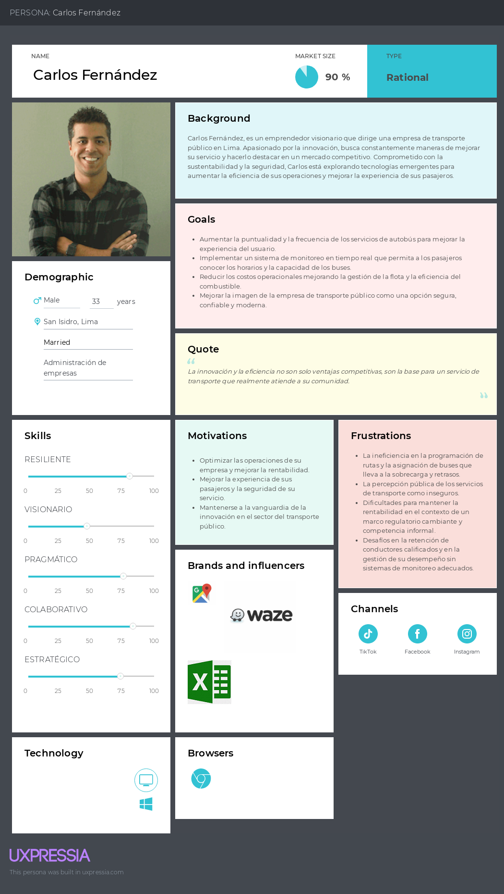
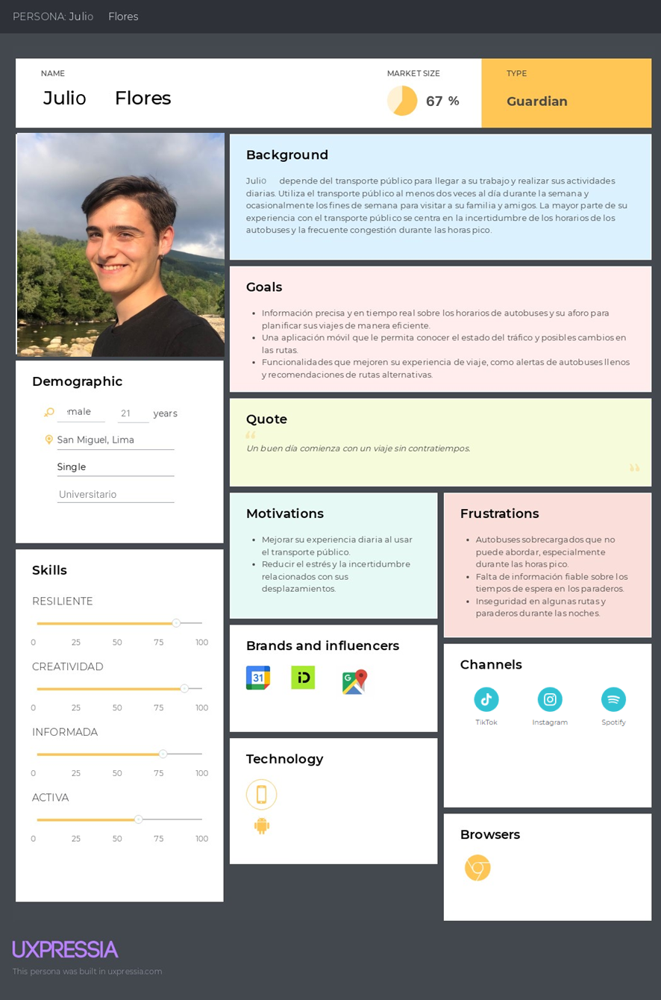

# Capítulo II: Requirements Elicitation & Analysis

## 2.1 Competidores

En esta sección se realiza la identificación y descripción de los principales competidores directos con modelos de negocio basados en productos digitales similares a ChapaTuBus, así como competidores indirectos con ofertas parcialmente similares.

**1.Moovit**

**Descripción:**  
Moovit es una aplicación de movilidad urbana que proporciona información en tiempo real sobre el transporte público, incluyendo rutas, horarios y aforo de buses y trenes. Además, ofrece opciones para planificar viajes y recibir alertas en tiempo real sobre incidencias y cambios en el servicio.

**Modelo de Negocio:**  
Moovit se basa en la recopilación de datos en tiempo real y la integración con diferentes sistemas de transporte público para ofrecer una experiencia de usuario mejorada y personalizada.

**2. TuRuta**

**Descripción:**  
TuRuta es una aplicación de transporte público que ofrece información detallada sobre las rutas, horarios y paraderos de buses y trenes. Además, permite a los usuarios planificar sus viajes y recibir actualizaciones en tiempo real sobre el estado del servicio.

**Modelo de Negocio:**  
TuRuta se centra en proporcionar información precisa y actualizada sobre el transporte público para mejorar la experiencia de viaje de los usuarios y facilitar la planificación y optimización de sus trayectos diarios.

**3. Google Maps:**

**Descripción:**  
Google Maps es una plataforma de mapas y navegación que ofrece información detallada sobre rutas, tráfico en tiempo real y opciones de transporte público, incluyendo horarios, paraderos y aforo de buses y trenes.

**Modelo de Negocio:**  
Google Maps se basa en la integración de diferentes servicios y datos para ofrecer una solución integral de navegación y movilidad que abarca una amplia variedad de opciones de transporte público y privado.

### 2.1.1 Análisis Competitivo

<table style="undefined;table-layout: fixed; width: 900px">
  <colgroup>
    <col style="width: 74px">
    <col style="width: 150px">
    <col style="width: 190px">
    <col style="width: 190px">
    <col style="width: 190px">
    <col style="width: 190px">
  </colgroup>
  <thead>
    <tr>
      <th colspan="6">Competitive Analysis Landscape</th>
    </tr>
  </thead>
  <tbody>
    <tr>
      <td colspan="2">¿Por qué llevar a cabo este análisis?</td>
      <td colspan="4">Escriba en el recuadro la pregunta que busca responder o el objetivo de este análisis</td>
    </tr>
    <tr>
      <td colspan="2"></td>
        <!-- </tr><tr> -->
        <!-- <td colspan="2" valign="top">(En la cabecera colocar por cada competidor nombre y logo)</td> -->
      <td>
        

          ChapaTuBus
          
        

      </td>
      <td>
        

          Moovit
          
        

      </td>
      <td>
        
 
          TuRuta
          
        

      </td>
      <td>
        

          Google Maps
          
        

      </td>
    </tr>
    <tr>
      <td rowspan="2">
        Perfil
      </td>
      <td>
        Overview
      </td>
      <td>
        Solución basada en tecnología IoT diseñada para mejorar la experiencia de usuario en el transporte público de Lima.
      </td>
      <td>
        Aplicación que ayuda a viajar en el transporte público. Obtienes indicaciones, rutas y líneas
      </td>
      <td>
        Aplicación que cuenta con información del transporte público en Lima.
      </td>
      <td>
        Servicio de mapas en línea desarrollado por Google. Permite a los usuarios buscar ubicaciones, obtener direcciones para llegar a destinos y explorar lugares de interés.
      </td>
    </tr>
    <tr>
      <td>
        Ventaja competitiva. ¿Qué valor ofrece a los clientes?
      </td>
      <td>
        Ofrece herramientas avanzadas de monitoreo y gestión para los dueños de empresas de transporte y una experiencia de viaje mejorada para los pasajeros, contribuyendo a un servicio más eficiente, seguro y cómodo para todos los involucrados en el transporte público en Lima y Callao.
      </td>
      <td>
        Incluye tarifas del viaje completo en transporte público, los tickets y costos adicionales. Además, incluye 3 tipos de transporte como: Autobús, Metro Y Ferry
      </td>
      <td>
        Rutas actuales, cuenta con el 99% de información del transporte en Lima. Además, trabaja de la mano con empresas de transporte oficiales.
      </td>
      <td>
        Proporciona una navegación precisa. Información en tiempo real sobre el tráfico, lugares de interés cercanos y una amplia base de datos.
      </td>
    </tr>
    <tr>
      <td rowspan="2">
        Perfil de Marketing
      </td>
      <td>
        Mercado Objetivo
      </td>
      <td>
        Dueños o encargados de líneas de transporte público así también como personas comunes que usan el transporte público en Lima.
      </td>
      <td>
        Usuarios que requieren movilidad, agencias y operadores de transporte público y ciudades y municipios.
      </td>
      <td>
        Usuarios de Transporte Público en Lima y usuarios de servicios de taxi.
      </td>
      <td>
        Usuarios que buscan herramientas de navegación, mapas e información en tiempo real.
      </td>
    </tr>
    <tr>
        <td>
          Estrategias de marketing
        </td>
        <td>
          Establecer alianzas con empresas nuevas de transporte público u autoridades locales, campañas de sensibilización y educación. Desarrollo de plataforma intuitiva y fácil de usar
        </td>
        <td>
          Promoción de Testimonios positivos, colaboración con partners.
        </td>
        <td>
          Testimonios y casos de éxito, información detallada de la aplicación, disponibilidad en múltiples plataformas, enfoque en solo Lima, alianzas estratégicas.
        </td>
        <td>
          Promoción a través de dispositivos móviles, integración con otros servicios de Google, funcionalidades avanzadas.
        </td>
    </tr>
    <tr>
      <td rowspan="3">
        Perfil de Producto
      </td>
      <td>
        Productos & Servicios
      </td>
      <td>
        Aplicación Movil ChapaTuBus, Aplicación Web orientado a dueños o encargados de líneas de transporte público: ChapaTuBus: Data
      </td>
      <td>
        Aplicación Moovit, Moovit ads, Moovit Autonomous OnDemand.
      </td>
      <td>
        Aplicación TuRuta, Información de Transporte Público en Tiempo Real, Servicio de Taxis.
      </td>
      <td>
        Google Maps, Google Maps Platform, Google Street View, Google Earth. Como servicios temenos la información de tráfico en tiempo real
      </td>
    </tr>
    <tr>
      <td>
        Precios y Costos
      </td>
      <td>
        Gratis, con planes de subscripción
      </td>
      <td>
        Aplicación principal gratuita, con posibilidades de subscripción premium.
      </td>
      <td>
        Aplicación Gratuita, sin subscripciones de por medio.
      </td>
      <td>
        Aplicación principal de uso gratuito.
      </td>
    </tr>
    <tr>
      <td>
        Canales de distribución (Web y/Móvil)      
      </td>
      <td>
        Web, Android/IOs
      </td>
      <td>
        Web, Android y IOs
      </td>
      <td>
        Android y IOS
      </td>
      <td>
        Web,Android,Ios
      </td>
    </tr>
    <tr>
      <td rowspan="4">
        Análisis SWOT
      </td>
      <td>
        Fortalezas
      </td>
      <td>
        Solución integral que aborda necesidades de los dueños de empresas de transporte como los pasajeros. Enfoque en el mercado Local de Lima. Uso de tecnología Avanzada e innovada con IoT
      </td>
      <td>
        Amplia cobertura de información del transporte público, conexión en tiempo real con buses a través de GPS, Integración con empresas de taxi como Uber o Cabify
      </td>
      <td>
        Información detallada y en tiempo real del transporte público. Amplia cobertura en el transporte público de la ciudad de Lima. Visualización e identificación de líneas de transporte con imágenes y aplicación gratuita.
      </td>
      <td>
        Amplia cobertura geográfica a nivel mundial, navegación paso a paso detallada para todo tipo de vehículos y transporte a pie. Información en tiempo real del tráfico.
      </td>
      </tr>
      <tr>
      <td>
        Debilidades
      </td>
      <td>
        Adopción de la Tecnología por parte de los usuarios, inversión mayor y costos.
      </td>
      <td>
        Dependencia de la información proporcionada por las agencias. Limitaciones en la cobertura geográfica en comparación con otros servicios. Necesidad de ampliar y mejorar las funcionalidades de la aplicación para ofrecer una experiencia de usuario más completa y personalizada. No permite visualizar imágenes del vehículo a tomar.
      </td>
      <td>
        Limitación geográfica, ya que se centra en Lima principalmente, esto puede limitar su alcance a otros usuarios fuera del área. Posibles problemas de precisión y actualización en las rutas sugeridas que da, algunas ya no son posibles. Rutas sugeridas que llevan mas tiempo que otras que no son mencionadas en la aplicación.
      </td>
      <td>
        Dependencia de la conectividad a Internet para acceder a funcionalidades completas e información en tiempo real. Posibles errores o imprecisiones en la información de navegación y tráfico que pueden llevar a tiempos estimados incorrectos.
      </td>
      </tr>
      <tr>
      <td>
        Oportunidades
      </td>
      <td>
        Mejora de funcionalidades ya existentes de la competencia o que aún no existen. Mejora de la seguridad frente a un sistema de monitoreo del conductor del vehículo, optimización del servicio dado.
      </td>
      <td>
        Expansión Geográfica, integración con otras plataformas, desarrollo de nuevas funcionalidades, alianzas estratégicas, análisis de datos.
      </td>
      <td>
        Expansión Geográfica, Monetización a través de publicidad y patrocinios, desarrollo de soluciones para empresas de transporte público que incorpore herramientas analíticas
      </td>
      <td>
        Integración de Nuevas tecnologías como Realidad Aumentada, Monetización a través de publicidad, colaboración con empresas y sectores específicos, análisis de datos y tendencias de movilidad.
      </td>
      </tr>
      <tr>
      <td>
        Amenazas
      </td>
      <td>
        Ser absorbidos por la competencia que se tiene, cambios regulatorios en las políticas de transporte público en el Perú.
      </td>
      <td>
        Competencia intensa, cambios en las políticas de Transporte Público, cambios en el comportamiento del Usuario, seguridad y privacidad de los datos.
      </td>
      <td>
        Competencia en el Mercado, cambios en políticas de transporte público, desafíos de monetización. Deslinde de las empresas de transporte público.
      </td>
      <td>
        Innovación y desarrollo de tecnologías emergentes, seguridad y privacidad de los datos de las personas. Cambios en preferencias o comportamientos de los usuarios, incluyendo la adopción de nuevas aplicaciones o servicios de navegación
      </td>
    </tr>
  </tbody>
</table>

### 2.1.2 Estrategias y tácticas frente a competidores

Basándonos en el análisis anterior, se propone la siguiente estrategia competitiva:

- Enfoque en la precisión y actualización de la información de buses y rutas, superando las limitaciones de TuRuta y Google Maps en este aspecto. Dado que Moovit y TuRuta enfrentan problemas de precisión y actualización en las rutas, centrarnos en garantizar información precisa y actualizada sobre la ubicación de los autobuses, los horarios de llegada y las rutas.
- Ofrecer una mejor experiencia de usuario, implementando funciones como notificaciones según las rutas favoritas del usuario, avisando al mismo sobre cambios en la ruta o imprevistos, visualización de imágenes de los buses para facilitar la identificación del vehículo correcto, características que Moovit no ofrece.
- Datos en caché para funcioens básicas offline. Dado que Google Maps depende de la conectividad a internet, ofrecer una función offline en la aplicación móvil para acceder a información básica sobre los buses y horarios que esten en favoritos.
- Uso de los datos obtenidos para mejorar las rutas mediante análisis de datos. Además de ofrecer información a usuarios pasajeros, proporcionaremos análisis de datos avanzados para los administradores de flotas de autobuses. Incluyendo datos como los paraderos más populares según la hora, estado del chofer, y demás, lo que ayudaría a optimizar la operación de la flota y mejorar la experiencia general del usuario.

## 2.2 Entrevistas

Esta sección se enfoca en la investigación, utilizando los datos recopilados a través de las entrevistas con representantes de los segmentos objetivo como punto de partida.

### 2.2.1 Diseño de entrevistas

**Preguntas generales**

- ¿Cuál es su nombre completo?
- ¿Qué edad tiene?
- ¿A qué se dedica?
- ¿Cuál es su estado civil?
- ¿En qué distrito reside?
- ¿Qué smartphone posee? ¿Android o IOS?
- ¿Cuál es su motor de búsqueda favorito?

**Preguntas para los pasajeros habituales de autobús**

- ¿Cuál/Cuales son los dispositivos que usa para planificar su viaje?
- ¿Cuáles son tus aplicaciones o plataformas digitales favoritas para recibir información o interactuar con servicios?
- ¿Cuáles son tus aplicaciones o plataformas digitales favoritas?
- ¿Con qué frecuencia utiliza el transporte público?
- Frente a un problema inesperado, ¿cuál es tu enfoque para resolverlo? ¿Podrías darme un ejemplo reciente?
- ¿Cuales son los principales desafíos que enfrenta al usar transporte público en su día a día?
- ¿Cuáles son tus aplicaciones o plataformas digitales favoritas para recibir información o interactuar con servicios de transporte público?
- ¿Ha utilizado algunas vez una aplicación móvil para ayudarse con la planificación de rutas u obtener información sobre el autobús?
- ¿Consideras importante tener acceso a información actualizada sobre el estado del tráfico y los cambios en las rutas de autobús en tiempo real?
- ¿Tener acceso en tiempo real sobre el aforo de los autobuses le ayudaría a planificar sus viajes?
- ¿Qué otras características apreciaría en una aplicación para que le ayude a elegir o mejorar su experiencia con el transporte público?
- ¿Estaría dispuesto/a a pagar por una aplicación premium con características adicionales o preferiría una aplicación gratuita con publicidad?
- ¿Qué opinión tiene sobre la privacidad de sus datos al utilizar una aplicación móvil de este tipo?

**Preguntas para los administradores de flota de buses**

- ¿Cuál es el nombre de su empresa de transporte?
- ¿Cuál/Cuales son los dispositivos que usa para administrar los buses?
- ¿Cuáles son tus aplicaciones o plataformas digitales favoritas?
- ¿Cuáles son las aplicaciones o plataformas digitales que usa para administrar la flota de buses?
- ¿Cuáles diría que son los mayores desafíos a los que se enfrenta su empresa en la actualidad?
- Frente a una crisis o un problema inesperado en la operación de la flota, ¿cuál es tu enfoque para resolverlo? ¿Podrías darme un ejemplo reciente?
- ¿Cómo cree que la tecnología podría ayudar a abordar algunos de estos desafíos?
- ¿Ha implementado previamente IoT en sus autobuses?
- ¿Qué opinión tiene sobre la idea de implementar tecnología IoT, como sensores para monitorear el aforo de los autobuses, estado del chofer, y ubicacion en su flota de autobuses?
- ¿Qué beneficios esperaría obtener al implementar dicha tecnología?
- ¿Tiene alguna preocupación sobre la implementación de la misma en su empresa?
- ¿Qué cree que serían los mayores beneficios para sus clientes si implementa esta tecnología en sus autobuses?
- ¿Qué factores consideraría al tomar una decisión sobre la implementación de esta tecnología en su empresa?

### 2.2.2 Registro de entrevistas

**Entrevista N°1**

- Segmento objetivo: **Administrador de flota de buses**
- Nombres y apellidos: **Juan Pérez Sánchez**
- Edad: **45**
- Distrito: **Jesús María**

- Enlace del video: **https://upcedupe-my.sharepoint.com/:v:/g/personal/u202115862_upc_edu_pe/ETeZ8JWxY7pMoTAAXF6H_DsBKdeZc1_u2YrohdilZ2Obqg?e=G3EseB**
- Timing: **00:06s-05:45s**
- Resumen:

Juan Pérez Sánchez, de 45 años y residente en el distrito de Jesús María en Lima, es el administrador de una flota de autobuses en la Empresa de Transporte Consorcio Vía. Casado y usuario de un smartphone Android y una computadora portátil para la administración de su flota, enfrenta desafíos diarios como mejorar la eficiencia en las rutas, controlar el aforo de los autobuses y gestionar el mantenimiento adecuado de la flota, además de abordar quejas de pasajeros sobre el servicio. Tiene un enfoque práctico y colaborativo para manejar crisis en la operación de su flota de autobuses. Cuando surge un problema, como una avería de un autobús, actúa rápidamente para minimizar las interrupciones. Su método incluye mantener la calma, recolectar toda la información relevante, y convocar reuniones con líderes del equipo para formular soluciones eficientes. Utiliza excel para la gestión de flotas y grupos de WhatsApp para la comunicación y coordinación,incluye Google Maps para la navegación y planificación de rutas. Prefiere Google como motor de búsqueda. Las redes sociales que más usa con frecuencia son Facebook e Instagram. Aunque no tiene experiencia previa con la tecnología IoT, ve su implementación como una oportunidad para optimizar la planificación y gestión de rutas, mejorar el aforo de los vehículos y reducir costos. Sus preocupaciones incluyen el costo inicial de la implementación y la capacitación del personal. Considera que los mayores beneficios de la tecnología serían una experiencia de viaje más enriquecedora para los clientes, con acceso a información en tiempo real sobre tráfico y ubicación de los autobuses, y datos sobre el rendimiento de los choferes. Evaluaría cuidadosamente el retorno de inversión, la compatibilidad con los sistemas actuales, la facilidad de uso y mantenimiento, así como el impacto en la calidad del servicio y la satisfacción del cliente antes de implementar nuevas tecnologías. 

**Entrevista N°2**

- Segmento objetivo: **Administrador de flota de buses**
- Nombres y apellidos: Jorge Antonio Carrascal Casca
- Edad: 28
- Distrito: Puente piedra

- Enlace del video: **https://upcedupe-my.sharepoint.com/:v:/g/personal/u202115862_upc_edu_pe/ETeZ8JWxY7pMoTAAXF6H_DsBKdeZc1_u2YrohdilZ2Obqg?e=G3EseB**
- Timing: **05:46s-09:01s**
- Resumen:

Por supuesto, aquí tienes una versión modificada del párrafo que refleja mejor las características únicas de Jorge Antonio Carrascal Casca, distinguiéndolo de otros perfiles:

Jorge Antonio Carrascal Casca, de 28 años y residente en Puente Piedra, es subgerente en la empresa de transporte Santa Rosa S.A. Afronta desafíos diarios como la optimización del mantenimiento de la flota de autobuses y el manejo del aforo vehicular. Jorge utiliza un smartphone y una laptop para supervisar la operación, empleando aplicaciones de gestión como Excel y plataformas de comunicación como Whatsapp para coordinar con su equipo. Su preferencia por Google como motor de búsqueda le facilita el acceso rápido a información crucial, y se apoya en herramientas como Google Maps para la navegación y la planificación de rutas eficientes. Las redes sociales que más usa con frecuencia son Facebook, Twitter  y TikTok. A pesar de su falta de experiencia con la tecnología IoT, Jorge ve en ella una oportunidad para mejorar la gestión de rutas y maximizar la capacidad de los autobuses, a la vez que se reducen los costos operativos. Le preocupan los costos iniciales y la capacitación del personal, además del riesgo a la privacidad de los datos de los pasajeros y la seguridad informática. Reconoce el potencial de la IoT para enriquecer la experiencia del cliente, pero es cauteloso y consideraría la escalabilidad del sistema, la disponibilidad de soporte técnico y el riesgo de interrupciones del servicio durante la implementación antes de decidir. Su método para manejar crisis implica una respuesta rápida y eficiente: evalúa la situación con detalle, realiza llamadas al personal involucrado para plantear de soluciones y mantiene una comunicación abierta y constante con su equipo y los usuarios afectados para minimizar impactos negativos.

**Entrevista N°3**

- Segmento objetivo: **Encargado de flota de autobuses**
- Nombres y apellidos: **Andy Casafranca Carrascal**
- Edad: **24**
- Distrito: **San Martin de Porres**

- Enlace del video: **https://upcedupe-my.sharepoint.com/:v:/g/personal/u202115862_upc_edu_pe/ETeZ8JWxY7pMoTAAXF6H_DsBKdeZc1_u2YrohdilZ2Obqg?e=G3EseB**
- Timing: **09:02s-14:22s**
- Resumen:

Andy Casafranca Carrascal, de 24 años y residente en San Martín de Porres, trabaja como ayudante en la gestión de rutas y control de conductores en la empresa Transportes Rápido Corre Caminos SA. Enfrenta retos diarios como la falta de información en tiempo real sobre la ubicación y estado de sus autobuses, y la gestión manual de rutas y conductores. Para gestionar estas tareas, Andy utiliza una combinación de herramientas tradicionales y digitales, incluyendo una laptop para el seguimiento en terreno. Emplea Whatsapp mantenerse en contacto con los conductores y utiliza plataformas como Waze para ajustes de ruta en tiempo real. Las redes sociales que más usa con frecuencia son Facebook, Instagram y TikTok. Aunque es nuevo en la aplicación de tecnología IoT, está entusiasmado con la perspectiva de integrar sensores para monitorear el aforo de los autobuses, el estado del conductor y la ubicación precisa de los vehículos. Andy tiene ciertas reservas sobre el posible mal uso de la tecnología, especialmente en términos de privacidad y dependencia excesiva en soluciones automatizadas. No obstante, está convencido de que los beneficios, como una mayor satisfacción del cliente y un aumento en la frecuencia de uso y ganancias, justificarían la inversión. En su proceso de toma de decisiones, Andy prestará especial atención a los costos de implementación, el tiempo necesario para integrar las nuevas tecnologías y la facilidad de uso para asegurarse de que se adaptan bien al entorno operativo existente. Su enfoque proactivo y su disposición para adaptar soluciones tecnológicas podrían significar un gran avance en la eficiencia y el servicio al cliente en Transportes Rápido Corre Caminos SA.

**Entrevista N°4**

- Segmento objetivo: **Pasajero**
- Nombres y apellidos: **Wilver Arana Ramos**
- Edad: **23**
- Distrito: **Carabayllo**

- Enlace del video: **https://upcedupe-my.sharepoint.com/:v:/g/personal/u202115862_upc_edu_pe/ETeZ8JWxY7pMoTAAXF6H_DsBKdeZc1_u2YrohdilZ2Obqg?e=G3EseB**
- Timing: **14:23s-18:12s**
- Resumen:

Wilver Arana Ramos, de 23 años y residente en el distrito de Carabayllo en Lima, es un estudiante universitario que enfrenta retos diarios en su viaje a la universidad debido al tráfico en horas pico y autobuses llenos, lo que frecuentemente resulta en tardanzas. Utiliza su teléfono inteligente Android para planificar sus desplazamientos y confía en Google Maps para la navegación y Moovit para horarios, aunque estas plataformas no siempre proporcionan información en tiempo real sobre la disponibilidad de los autobuses o cambios de ruta. Además, Wilver utiliza WhatsApp para comunicaciones. Spotify, Instagram y Tik Tok para entretenimiento durante sus viajes. Recientemente, cuando un autobús llegó lleno y no pudo abordar, recurrió a Google, su motor de búsqueda favorito, para encontrar una ruta alternativa a pie hasta la siguiente parada, donde logró tomar un autobús menos congestionado. Prefiere aplicaciones gratuitas con publicidad sobre las de suscripción premium y valora la privacidad de los datos, prefiriendo aplicaciones que solo soliciten información básica. Wilver cree que una aplicación ideal debería proporcionar información en tiempo real sobre la congestión de tráfico, la ocupación de los buses, y alertas sobre cambios de ruta, lo que le permitiría optimizar su tiempo y mejorar su experiencia de viaje.

**Entrevista N°5**

- Segmento objetivo: **Pasajero**
- Nombres y apellidos: **Yosef Castillo Carhuamaca**
- Edad: **18**
- Distrito: **San Martín de Porres**

- Enlace del video: **https://upcedupe-my.sharepoint.com/:v:/g/personal/u202115862_upc_edu_pe/ETeZ8JWxY7pMoTAAXF6H_DsBKdeZc1_u2YrohdilZ2Obqg?e=G3EseB**
- Timing: **18:13s-27:43s**
- Resumen:

Yosef, un estudiante de ingeniería de software, compartió su experiencia diaria con el sistema de transporte público, enfrentando desafíos como el tráfico y la alta ocupación de los buses. Para gestionar sus viajes, utiliza su teléfono inteligente Android, confiando en aplicaciones como TuRuta principalmente para rutas no habituales. Además, utiliza WhatsApp para comunicaciones. Spotify, Twitter y Facebook para entretenimiento durante sus viajes.  Valora el acceso a información actualizada sobre horarios y aforo de los buses, lo que le facilita evitar aglomeraciones y optimizar su tiempo. Prefiere aplicaciones que son gratuitas y destaca la importancia de funciones como la planificación de rutas y la recepción de notificaciones sobre demoras. Yosef también expresa interés en una función que le permita guardar sus rutas más usadas, y es crucial para él que la aplicación tenga una interfaz de usuario intuitiva y fácil de manejar. Su motor de búsqueda favorito es Opera y utiliza otras plataformas digitales como WhatsApp para la comunicación y YouTube para entretenimiento durante sus viajes. Frente a problemas inesperados, como un bus lleno o una ruta bloqueada, Yosef busca alternativas utilizando su aplicación de transporte o consulta rápidamente otras opciones en Google Maps. Subraya la necesidad de que la aplicación de transporte sea compatible con Android para asegurar su funcionamiento en una amplia gama de dispositivos.

**Entrevista N°6**

- Segmento objetivo: **Pasajero**
- Nombres y apellidos: **Diego Perez Garcia**
- Edad: **22**
- Distrito: **San Martin de Porres**

- Enlace del video: **https://upcedupe-my.sharepoint.com/:v:/g/personal/u202115862_upc_edu_pe/ETeZ8JWxY7pMoTAAXF6H_DsBKdeZc1_u2YrohdilZ2Obqg?e=G3EseB**
- Timing: **27:44s-35:54s**
- Resumen:

Diego Perez Garcia, un estudiante de 22 años de edad de Administración de Empresas en la Universidad Nacional Mayor de San Marcos y residente del distrito de San Martin de Porres en Lima, enfrenta diariamente los desafíos del transporte público. Diego se siente frustrado por la falta de puntualidad y la imprevisibilidad de los horarios de los autobuses, lo que a menudo resulta en largas esperas. Utiliza su smartphone Android y aplicaciones móviles para planificar sus rutas, pero encuentra que la información es a menudo imprecisa o desactualizada. Diego valora significativamente la posibilidad de tener acceso en tiempo real a información sobre el tráfico, los cambios en las rutas de autobús y el aforo de los vehículos, considerando que estas características son cruciales para mejorar su experiencia de viaje y evitar aglomeraciones. Además, le gustaría que las aplicaciones incluyeran la visualización del recorrido completo de las rutas y ofrecieran opciones alternativas en caso de interrupciones. Prefiere Google como su motor de búsqueda por su eficiencia y es usuario de plataformas digitales como WhatsApp para comunicaciones. Youtube, Instagram y Tik Tok para entretenimiento durante sus viajes. Frente a un problema inesperado, como una demora no anunciada, Diego busca rápidamente alternativas y se informa a través de su aplicación de transporte y Google Maps para encontrar la mejor opción. A pesar de estar dispuesto a pagar por una aplicación premium que ofrezca estas funcionalidades avanzadas, enfatiza la importancia de que la privacidad de sus datos sea respetada, esperando que la aplicación solo solicite información básica necesaria para su funcionamiento.

### 2.2.3 Análisis de entrevistas

En la sección de análisis se identifica con sustento estadístico todas las características objetivas y subjetivas que representan los aspectos más comunes de cada segmento, para sacar las tendencias de los usuarios.

En la sección de análisis se registra la información de las entrevistas de forma gráfica para sacar las tendencias de los usuarios.

**Segmento Pasajeros:**

- **¿Cuáles son los mayores desafíos que se enfrentan en el transporte público?**
  El 100% de los entrevistas señalaron que son el tráfico y lo saturado del transporte durante las horas pico, ocasionando experiencias desagradables y retrasos.
  Y un 66.7% menciono la falta de información sobre la llegada de los autobuses a los paraderos como el mayor problema,
- **¿Cuáles son los principales motivos para usar una aplicación como la ofrecida?**
  El 100% de los entrevistados indicaron como motivacion obtener informacion en tiempo real sobre horarios de los buses, el estado del tráfico, tambien si hay asientos disponibles.
- **¿Cualés son los requisitos para confiar tus datos al utilizar la aplicación?**
  La privación es una preocupación común entre los usuarios, con el 66.6% expresando un abierto interés en que respeten los protocolos de privacidad de datos.

**Análisis general de las entrevistas al segmento objetivo**

Tras analizar en detalle las entrevistas, se puede observar un consenso general respecto a los desafíos más prominentes que enfrentan al utilizar el transporte público en Lima. Todos los entrevistados coinciden en que el tráfico y la alta ocupación de los autobuses durante las horas pico son los principales obstáculos que impactan negativamente en su experiencia de viaje, generando retrasos y largas esperas en los paraderos. Este grupo demográfico, compuesto por jóvenes universitarios, principalmente solteros y residentes en distintos distritos de Lima, muestra una clara preferencia por el uso de aplicaciones móviles para obtener información en tiempo real sobre horarios de autobuses, con el fin de optimizar sus trayectos y llegar a tiempo a sus destinos. Además, la privacidad de los datos personales es una preocupación compartida entre los entrevistados, resaltando la importancia de garantizar la seguridad y confidencialidad de la información proporcionada por los usuarios. En términos de uso de tecnología, la mayoría de los entrevistados utiliza dispositivos Android y muestra interés en funciones como notificaciones sobre demoras y cambio de itinerarios de autobuses, así como en una interfaz de usuario intuitiva y fácil de manejar.

**Segmento Encargado de la flota de autobuses:**

- **¿Cuáles son los principales desafíos que enfrenta en su rol dentro de la empresa de transporte?**
  El 100% de los entrevistados identificaron desafíos comunes relacionados con la gestión de la flota de autobuses, el control del aforo de los vehículos y la optimización de las rutas. Además, el 66.7% mencionó desafíos específicos como mejorar la eficiencia en las rutas y abordar quejas de pasajeros sobre el servicio.

- **¿Qué beneficios espera obtener de la implementación de la tecnología IoT en su empresa?**
  El 100% de los entrevistados expresó expectativas positivas sobre los beneficios potenciales de la implementación de la tecnología IoT, incluyendo una mejora en la planificación y gestión de rutas, la optimización del aforo de los autobuses, la reducción de costos operativos y una experiencia de viaje más enriquecedora para los clientes.

- **¿Cuáles son sus preocupaciones principales respecto a la implementación de la tecnología IoT?**
  El 66.7% de los entrevistados manifestó preocupaciones sobre el costo inicial de la implementación, la capacitación del personal y la posibilidad de interrupciones en el servicio durante la fase de implementación. Solo el 33.3% mencionó preocupaciones relacionadas con la privacidad de los datos de los pasajeros y la seguridad cibernética de la empresa.

- **¿Qué factores consideraría al evaluar la implementación de la tecnología IoT en su empresa?**
  Al considerar la implementación de la tecnología IoT, el 100% de los entrevistados mencionó factores como el retorno de inversión, la compatibilidad con los sistemas actuales, la facilidad de uso y mantenimiento, la escalabilidad del sistema y la disponibilidad de soporte técnico. Además, el 66.7% mencionó la posibilidad de interrupciones en el servicio durante la fase de implementación como un factor importante a considerar.

**Análisis general de las entrevistas al segmento objetivo**

Tras examinar en detalle las entrevistas, se puede observar un consenso general en relación en los desafíos comunes de optimizar la eficiencia en las rutas, controlar el aforo de los autobuses y gestionar el mantenimiento adecuado de la flota, así como abordar las quejas de los pasajeros sobre el servicio. Además, muestran una actitud positiva hacia la implementación de la tecnología IoT para mejorar la gestión y planificación de rutas, así como para mejorar la experiencia de los clientes. Sin embargo, existen preocupaciones compartidas respecto al costo inicial de la implementación, la capacitación del personal y la posibilidad de interrupciones en el servicio durante la fase de implementación. Además, algunas preocupaciones incluyen la privacidad y seguridad de los datos de la empresa.

## 2.3 Needfinding

### 2.3.1 User Personas

Las fichas de User Persona que siguen se han creado para ilustrar claramente quiénes son los usuarios de ChapaTuBus. Están basadas en lo que se aprendió de entrevistas con usuarios, además se han identificado y resumido las necesidades, preferencias y desafíos diarios tanto de los dueños de empresas de transporte como de los pasajeros.
Estas fichas nos permiten enfocar nuestro desarrollo en características que realmente importan a nuestros usuarios, garantizando que ChapaTuBus responda a sus necesidades y se destaque en el mercado.

**Administrador de flota de buses**

**Pasajero**

### 2.3.2 User Task Matrix

Este User Task Matrix identifica y organiza las tareas esenciales que realizan nuestros dos segmentos principales: los dueños de empresas de transporte y los pasajeros. Cada tarea listada es una acción que los segmentos necesitan llevar a cabo regularmente para alcanzar sus objetivos diarios, independientemente de las herramientas tecnológicas que utilicen. En las siguientes columnas, asignamos una frecuencia y una importancia a estas tareas para cada User Persona, lo que nos ayuda a entender mejor sus prioridades y cómo nuestro servicio puede facilitar estas actividades cotidianas.

<table>
  <tr>
    <th>Tarea</th>
    <th colspan="2">Administrador de flota de buses</th>
    <th colspan="2">Pasajero</th>
  </tr>
  <tr>
    <td></td>
    <td>Frecuencia</td>
    <td>Importancia</td>
    <td>Frecuencia</td>
    <td>Importancia</td>
  </tr>
  <tr>
    <td>Inventario de Buses</td>
    <td>Alta</td>
    <td>Alta</td>
    <td>-</td>
    <td>-</td>
  </tr>
  <tr>
    <td>Registro de Personal</td>
    <td>Alta</td>
    <td>Alta</td>
    <td>-</td>
    <td>-</td>
  </tr>
  <tr>
    <td>Asignación de Conductores a Buses</td>
    <td>Alta</td>
    <td>Alta</td>
    <td>-</td>
    <td>-</td>
  </tr>
  <tr>
    <td>Planificación y Registro de Mantenimiento</td>
    <td>Media</td>
    <td>Alta</td>
    <td>-</td>
    <td>-</td>
  </tr>
  <tr>
    <td>Programación de Rutas y Horarios</td>
    <td>Alta</td>
    <td>Alta</td>
    <td>-</td>
    <td>-</td>
  </tr>
  <tr>
    <td>Gestión de Incidencias y Emergencias</td>
    <td>Media</td>
    <td>Alta</td>
    <td>-</td>
    <td>-</td>
  </tr>
  <tr>
    <td>Registro de papeletas</td>
    <td>Media</td>
    <td>Alta</td>
    <td>-</td>
    <td>-</td>
  </tr>
  <tr>
    <td>Esperar bus en paradero</td>
    <td>-</td>
    <td>-</td>
    <td>Alta</td>
    <td>Alta</td>
  </tr>
</table>

**Leyenda:**

***Frecuencia:***
- Alta: Tarea realizada diaria o en cada uso del servicio.
- Media: Tarea realizada con frecuencia, pero no necesariamente cada día.
- Baja: Tarea realizada ocasionalmente o a demanda.

***Importancia:***
- Alta: Tarea crucial que impacta directamente en la operatividad y experiencia del usuario.
- Media: Tarea importante que tiene un impacto significativo en la eficiencia y satisfacción.

### 2.3.3 User Journey Mapping

El administrador de la flota de autobuses se enfrenta a desafíos significativos en la gestión eficiente de la operación. Desde la planificación del itinerario hasta la supervisión en tiempo real, debe garantizar la puntualidad y la seguridad de los pasajeros. Identificar problemas, como retrasos o problemas técnicos, y tomar decisiones rápidas es crucial para mantener la calidad del servicio. A través de herramientas de comunicación efectivas y análisis de datos, el administrador busca optimizar la operación y mejorar la experiencia del pasajero.

Por otro lado, el viajero de transporte público experimenta un viaje marcado por la incertidumbre y la adaptación continua. Desde la planificación del viaje hasta la llegada a su destino, enfrenta desafíos como esperas prolongadas y la gestión de la sobrecarga en los autobuses. Con el apoyo de información en tiempo real y sistemas de abordaje eficientes, el pasajero busca una experiencia más predecible y cómoda en su viaje diario.

**Administrador de flota de buses**

**Pasajero**

### 2.3.4 Empathy Mapping

En esta sección, se presenta el resumen del proceso de elaboración de los Empathy Maps para cada uno de los User Personas identificados. Estos mapas fueron construidos con el objetivo de proporcionar una visión profunda de los pensamientos, sentimientos, entorno y comportamiento de los dueños de empresas de transporte y de los pasajeros. Los Empathy Maps son el resultado de un análisis detallado de las entrevistas con usuarios y reflejan las perspectivas únicas de cada segmento. 

**Administrador de flota de buses**

**Pasajero**

### 2.3.5 As-Is Scenario Mapping

#### 2.3.5.1 Pasajeros

#### 2.3.5.2 Empresa de transporte público

## 2.4 Ubiquitous Language

**Dominio:** Transporte público

**Términos:**

- **Itinerary:** Ruta de viaje que presenta una empresa de transporte público, todos los buses que están bajo una empresa tienen esta ruta 
- **Unit Bus:** Conformado por un conductor y un bus , es el equipo que sale a realizar su trabajo en la vía pública
- **Departure Schedule:** Agenda que tiene los horarios de las unidades de buses, a través de esta agenda se determina cuales unidades salen a operar durante días determinados
- **Stop:** Paradero formal de un bus  
