# Capítulo IV: Solution Software Design

## 4.1 Strategic-Level Domain-Driven Design

Este apartado se describe los enfoques fundamentales que se implementaron en el proceso de Domain Driven Design a nivel estratégico.

### 4.1.1 EventStorming

Se abordó un enfoque colaborativo y visual que permitió modelar el contexto del dominio. Se exploraron las etapas de Candidate Context Discovery, Domain Message Flows Modeling y la creación de Bounded Context Canvases.

**Unstructured Exploration**

    

**Timelines**

    

**Pain points**

    

**Pivotal points**

    

**Commands**

    

**Policies**

    

**Read Models**

    

**External Systems**

    

**Aggregates**

    

**Bounded Contexts**

    

Link de Event Storming: https://miro.com/app/board/uXjVKXmyt8I=/?share_link_id=548064409858

#### 4.1.1.1 Candidate Context Discovery

Para esta sección, nos hemos dedicado a identificar los principales candidatos de nuestro contexto, empleando la técnica de "start-with-value". Entre los eventos que hemos identificado como fundamentales en nuestra solución, se encuentran los siguientes:

Los eventos presentados en esta sección tienen la particularidad de pertenecer a los bounded contexts de Planificación y Ejecución/Manejo. Por consiguiente, dado el nivel de importancia que estos eventos tienen en nuestra solución, consideramos los bounded contexts que los engloban como core y de soporte, respectivamente. Dado que los eventos relacionados con el bounded context de Planificación son esenciales para el correcto funcionamiento de la aplicación, los consideramos como core. Por otro lado, los bounded contexts como el de Ejecución/Manejo, que también contienen eventos importantes y forman parte del dominio de negocio, aunque no son la base para la existencia de otros bounded contexts, los consideramos como bounded contexts de apoyo.

Al revisar nuestros eventos, también nos hemos percatado de que contamos con eventos relacionados con la gestión de cuentas, suscripciones y notificaciones:

#### 4.1.1.2 Domain Message Flows Modeling

#### 4.1.1.3 Bounded Context Canvases

### 4.1.2 Context Mapping

Claro, aquí tienes una versión más directa y sin florituras:

Proceso de Elaboración de Context Maps para el Proyecto "Gestión de Transporte Público"

Identificación de Capabilities y Bounded Contexts: Se identificaron los capabilities clave relacionados con la gestión de transporte, como seguimiento de buses, gestión de suscripciones y monitoreo de conductores. Estos se agruparon en bounded contexts como "Subscriptions", "Execution & Monitoring" y "Notifications".

Análisis de Movimiento de Capabilities: Se evaluó la reubicación de ciertos capabilities entre bounded contexts para mejorar la cohesión funcional y la modularidad del sistema.

Exploración de Descomposición y Consolidación de Bounded Contexts: Se discutió la posibilidad de dividir o combinar bounded contexts para optimizar la estructura del sistema.

Evaluación de Patrones de Relaciones: Se aplicaron patrones como Anti-corruption Layer para gestionar la comunicación entre bounded contexts y mantener la integridad del modelo de dominio.

Discusión y Selección de Alternativas: Se debatieron las diferentes opciones de context mapping y se seleccionó la más adecuada para las necesidades del proyecto.

### 4.1.3 Software Architecture.

#### 4.1.3.1. Software Architecture System Landscape Diagram.

#### 4.1.3.2. Software Architecture Context Level Diagrams.

#### 4.1.3.3. Software Architecture Container Level Diagrams.

#### 4.1.3.4. Software Architecture Deployment Diagrams.

## 4.2. Tactical-Level Domain-Driven Design

### 4.2.1. Bounded Context: Planification Bounded Context

#### 4.2.1.1. Domain Layer

**Clases a tomar en cuenta para este bounded context:**

**Entities:**
- **Driver:** Clase que representa un conductor para la empresa.
- **Bus:** Clase que representa una unidad de bus de la empresa.
- **BusLine:** Clase que representa la ruta que sigue una línea de bus.
- **WristDevice:** Dispositivo IOT.
- **DepartureSchedule:** Clase que representa la agenda del día anterior a la salida de buses.
- **Departure:** Salida individual perteneciente a la agenda del día anterior.

**ValueObjects:**
- **LicensePlate:** Placa del autobús.
- **BusModel:** Modelo del autobús.
- **GPSLocation:** Ubicación GPS actual del autobús.
- **RouteMap:** Mapa de la ruta de la línea de autobús.
- **Schedule:** Horario de la línea de autobús.
- **ContactInformation:** Información de contacto del conductor.
- **ShiftSchedule:** Horario de turno del conductor.

**Aggregates:**
- **PlanificaciónAggregate:** Encargado de manejar los eventos en el bounded context.

#### 4.2.1.2. Interface Layer

**Controllers a tomar en cuenta para este bounded context:**
- **DriverController:** Controlador encargado de realizar peticiones HTTPS de la entite en cuestión.
- **BusController:** Controlador encargado de realizar peticiones HTTPS de la entites.
- **BusLineController:** Controlador encargado de realizar peticiones HTTPS de la entites.
- **WristeDeviceController:** Controlador encargado de realizar peticiones HTTPS de la entites.

#### 4.2.1.3. Application Layer

Los flujos de nuestro negocio se manejan siguiendo un approach de Domain Driven Design por lo que serán usados eventos y comandos. Ante ello se tienen las siguientes clases EventHandler y CommandHandler:

**CommandHandler:**
- **DriverCommandHandler:** 
  - RegisterDriverCommand
  - AssignDriverCommand
  - ReassignDriverCommand
- **BusCommandHandler:**
  - RegisterBusCommand
  - UpdateBusInformationCommand
- **BusLineCommandHandler:**
  - RegisterBusLineCommand
  - UpdateBusLineProfileCommand
- **DepartureScheduleCommandHandler:**
  - CreateDepartureScheduleCommand
  - PublishDepartureScheduleCommand

**EventHandler:**
- **DriverEventHandler:** 
  - RegisteredDriverEvent
  - AssignedDriverEvent
  - DriverReassignedToBusEvent
- **BusEventHandler:**
  - BusRegisteredEvent
  - BusStateUpdatedEvent
- **BusLineEventHandler:**
  - BusLineRegisteredEvent
  - BusStateUpdatedEvent
- **DepartureScheduleEventHandler:**
  - DepartureScheduleCreatedEvent
  - DepartureSchedulePublishedEvent

#### 4.2.1.4. Infrastructure Layer

Las siguientes clases con acceso a base de datos de nuestra aplicación son las siguientes:

- **DriverRepository**
- **BusRepository**
- **BusLineRepository**
- **DepartureScheduleRepository**

#### 4.2.1.5. Bounded Context Software Architecture Component Level Diagrams

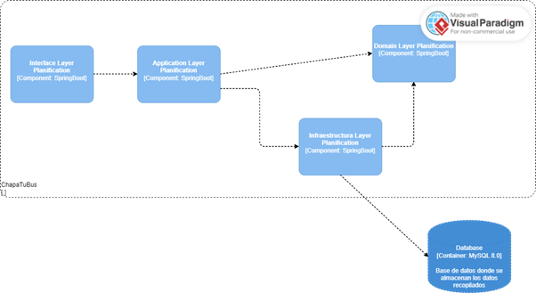

#### 4.2.1.6. Bounded Context Software Architecture Code Level Diagrams

##### 4.2.1.6.1. Bounded Context Domain Layer Class Diagrams

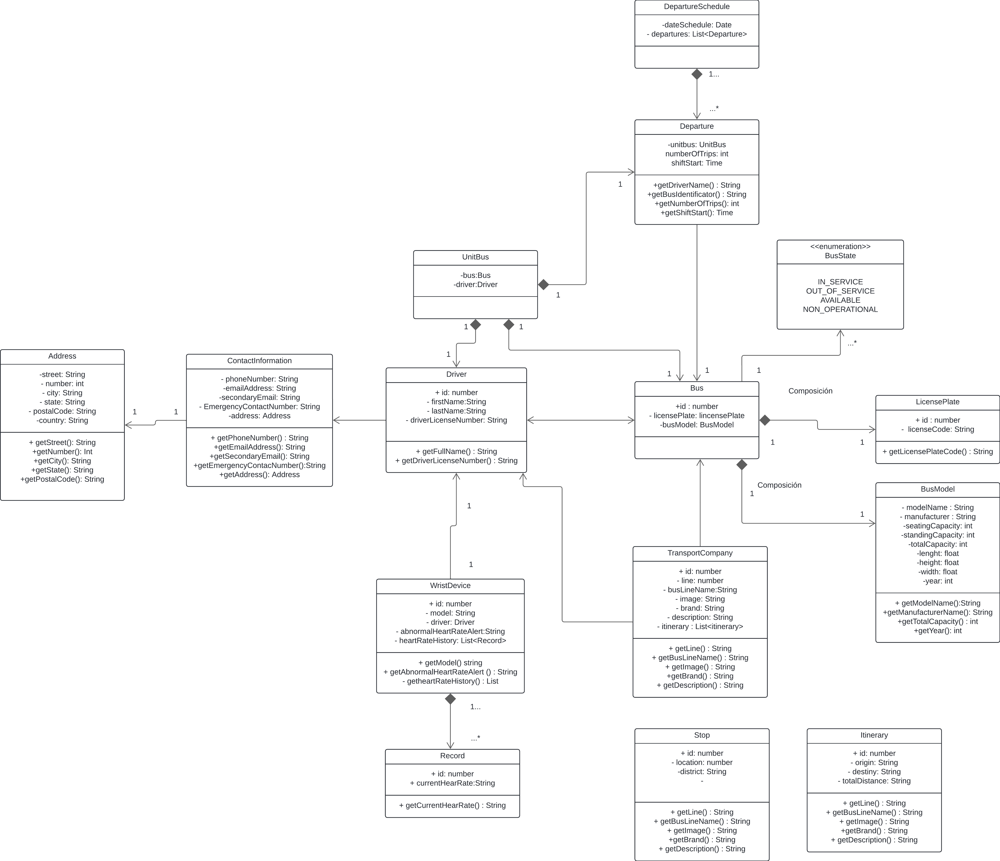

##### 4.2.1.6.2. Bounded Context Database Design Diagram

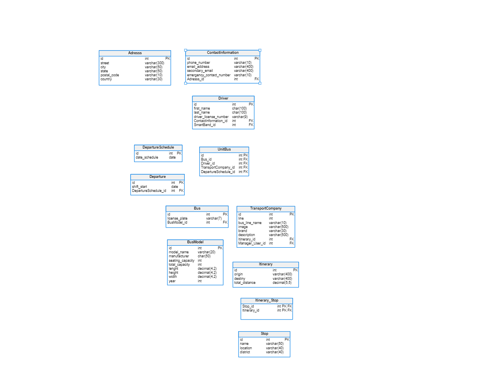

### 4.2.1. Bounded Context: Monitoring Bounded Context

#### 4.2.1.1. Domain Layer

**Entities:**
- **BusStop:** Representa una parada de autobús.
- **Bus:** Representa un autobús.
- **Itinerary:** Representa un itinerario de autobús.
- **Person:** Representa una persona.

**Value Objects:**
- **BusArrivalTime:** Objeto de valor que representa el tiempo estimado de llegada de un autobús a una parada.
- **BusPosition:** Objeto de valor que representa la posición actual de un autobús.
- **Heartbeat:** Objeto de valor que representa el latido del corazón utilizado para el monitoreo de la salud del sistema.

**Aggregates:**
- **BusStopAggregate:** Agrupa la entidad BusStop con sus relaciones y operaciones asociadas.
- **BusAggregate:** Agrupa la entidad Bus con sus relaciones y operaciones asociadas.
- **ItineraryAggregate:** Agrupa la entidad Itinerary con sus relaciones y operaciones asociadas.

**Factories:**
- **BusStopFactory:** Fábrica para crear instancias de BusStop.
- **BusFactory:** Fábrica para crear instancias de Bus.
- **ItineraryFactory:** Fábrica para crear instancias de Itinerary.

**Domain Services:**
- **ArrivalTimeCalculator:** Servicio de dominio para calcular el tiempo de llegada de un autobús a una parada.
- **BusPositionVerifier:** Servicio de dominio para verificar la posición de un autobús.
- **ItineraryStarter:** Servicio de dominio para iniciar un itinerario.
- **HeartbeatTracker:** Servicio de dominio para rastrear los latidos del corazón del sistema.
- **RateAlertService:** Servicio de dominio para alertar sobre una tasa anormal.
- **HeartbeatAnalyticsGenerator:** Servicio de dominio para generar análisis de latidos del corazón.
- **CapacityUpdater:** Servicio de dominio para actualizar la capacidad de un vehículo o lugar.
- **PeopleCounter:** Servicio de dominio para contar personas.
- **PersonDetector:** Servicio de dominio para detectar personas.

#### 4.2.1.2. Interface Layer

**Controllers:**
- **BusStopController:** Controlador que maneja las solicitudes relacionadas con las paradas de autobús como calcular el tiempo de llegada o verificar la posición del autobús en una parada.
- **BusController:** Controlador que maneja las solicitudes relacionadas con los autobuses como iniciar un itinerario o actualizar su capacidad.
- **HeartbeatController:** Controlador que maneja las solicitudes relacionadas con el monitoreo del sistema como el seguimiento del latido del corazón o la generación de análisis de latidos del corazón.

**Consumers:**
- **HeartbeatConsumer:** Consumidor que recibe eventos relacionados con el latido del corazón del sistema como alertas de tasa anormal.
- **PersonDetectionConsumer:** Consumidor que recibe eventos relacionados con la detección de personas como contar personas o detectar personas en ciertas áreas.

#### 4.2.1.3. Application Layer

**Command Handlers:**
- **CalculateBusArrivalTimeCommandHandler:** Maneja los comandos para calcular el tiempo de llegada de un autobús a una parada.
- **VerifyBusPositionCommandHandler:** Maneja los comandos para verificar la posición de un autobús.
- **StartItineraryCommandHandler:** Maneja los comandos para iniciar un itinerario.
- **UpdateCapacityCommandHandler:** Maneja los comandos para actualizar la capacidad de un vehículo o lugar.
- **CountPeopleCommandHandler:** Maneja los comandos para contar personas.
- **DetectPersonCommandHandler:** Maneja los comandos para detectar personas.

**Event Handlers:**
- **BusArrivalTimeCalculatedEventHandler:** Maneja los eventos cuando se calcula el tiempo de llegada de un autobús a una parada.
- **BusPositionVerifiedEventHandler:** Maneja los eventos cuando se verifica la posición de un autobús.
- **ItineraryStartedEventHandler:** Maneja los eventos cuando se inicia un itinerario.
- **CapacityUpdatedEventHandler:** Maneja los eventos cuando se actualiza la capacidad de un vehículo o lugar.
- **PeopleCountedEventHandler:** Maneja los eventos cuando se cuentan personas.
- **PersonDetectedEventHandler:** Maneja los eventos cuando se detecta una persona.

#### 4.2.1.4. Infrastructure Layer

**Repositories:**
- **BusStopRepositoryImpl:** Implementación del repositorio para acceder a la base de datos de paradas de autobús.
- **BusRepositoryImpl:** Implementación del repositorio para acceder a la base de datos de autobuses.
- **ItineraryRepositoryImpl:** Implementación del repositorio para acceder a la base de datos de itinerarios.
- **PersonRepositoryImpl:** Implementación del repositorio para acceder a la base de datos de personas.

#### 4.2.1.6. Bounded Context Software Architecture Component Level Diagrams

#### 4.2.1.7. Bounded Context Software Architecture Code Level Diagrams

##### 4.2.1.7.1. Bounded Context Domain Layer Class Diagrams

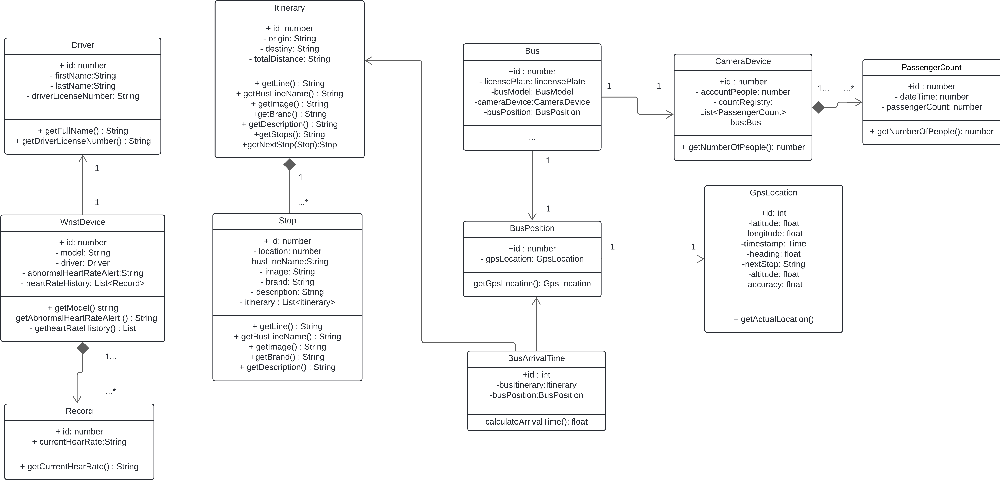

##### 4.2.1.7.2. Bounded Context Database Design Diagram

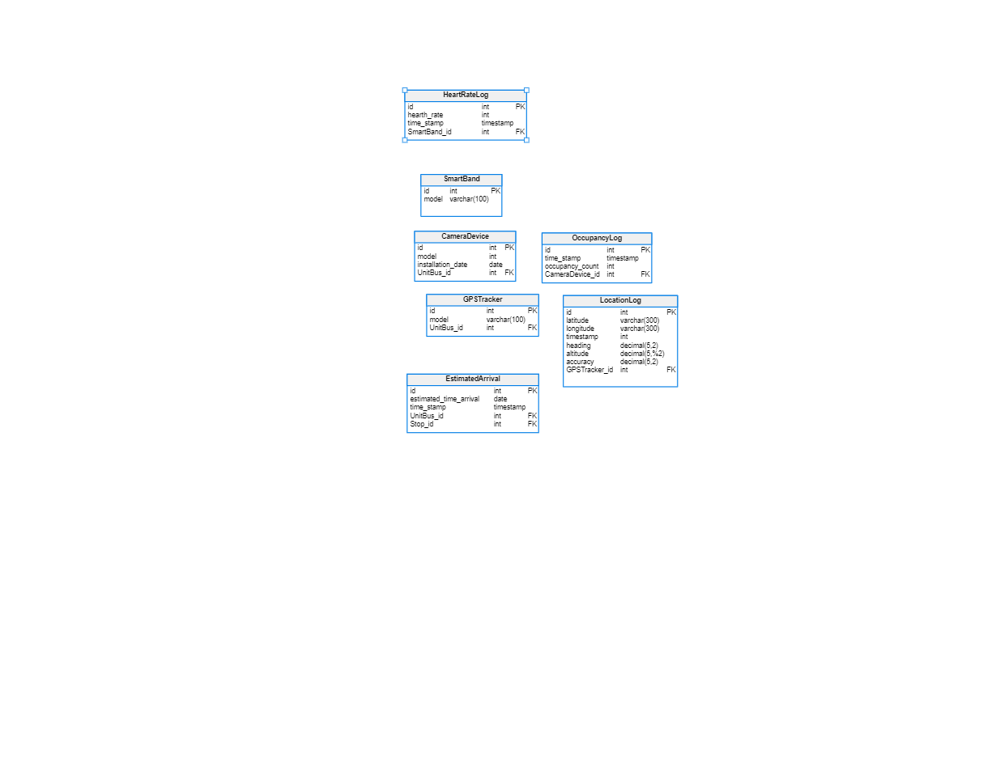

### 4.2.1. Bounded Context: Account Bounded Context

#### 4.2.1.1. Domain Layer

#### 4.2.1.2. Interface Layer

#### 4.2.1.3. Application Layer

#### 4.2.1.4. Infrastructure Layer

#### 4.2.1.6. Bounded Context Software Architecture Component Level Diagrams

#### 4.2.1.7. Bounded Context Software Architecture Code Level Diagrams

##### 4.2.1.7.1. Bounded Context Domain Layer Class Diagrams

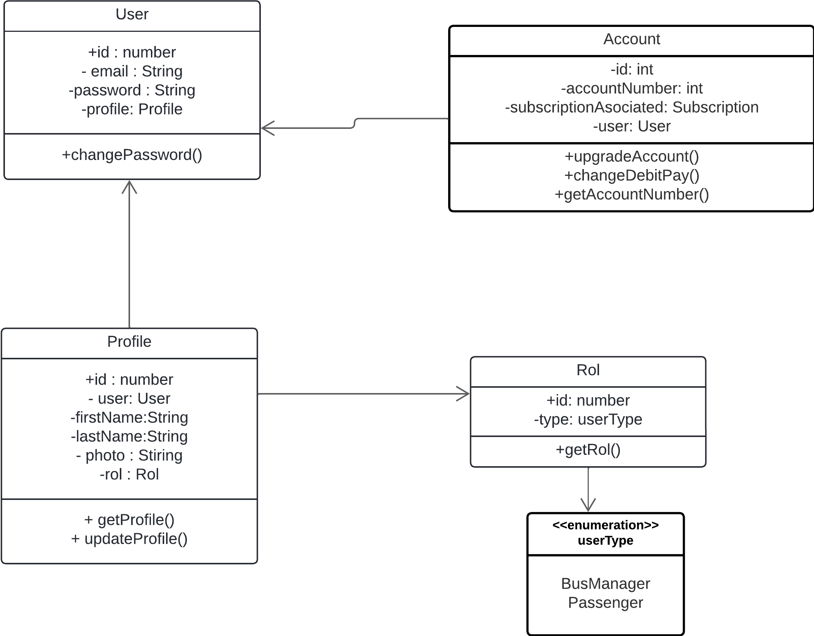

##### 4.2.1.7.2. Bounded Context Database Design Diagram

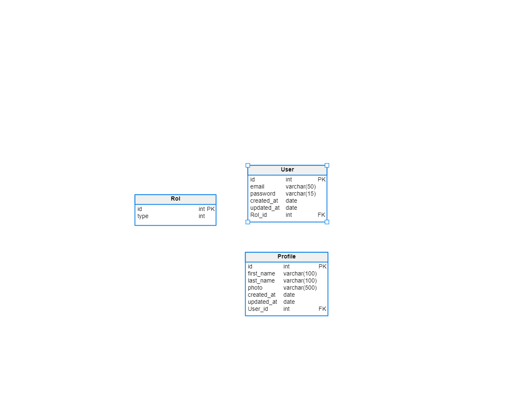

### 4.2.1. Bounded Context: Subscription Bounded Context

#### 4.2.1.1. Domain Layer

**Clases a tomar en cuenta para este bounded context:**

**Entities:**
- **Subscriber:** Clase que representa los datos de un usuario que se suscribe.

**ValueObjects:**
- **SubscriptionStatus:** Define el estado de la suscripción del usuario como activa, cancelada o renovada.
- **SubscriptionType:** Describe el tipo de suscripción como premium o estándar.

**Aggregates:**
- **Subscription:** Un agregado que encapsula la lógica relacionada con las suscripciones de los usuarios. Contiene la entidad Subscriber y los value objects SubscriptionStatus y SubscriptionType. Permite realizar operaciones como iniciar, cancelar y renovar suscripciones.

#### 4.2.1.2. Interface Layer

**Controllers a tomar en cuenta para este bounded context:**
- **SubscriptionController:** Este controlador manejaría las solicitudes HTTP relacionadas con las suscripciones como crear una nueva suscripción, cancelar una suscripción existente, renovar una suscripción, etc.
- **PaymentController:** Si las suscripciones requieren pagos, este controlador podría encargarse de recibir solicitudes de pago, validar pagos y actualizar el estado de la suscripción en consecuencia.

#### 4.2.1.3. Application Layer

**CommandHandler:**
- **SubscribeCommandHandler:**
  - CreateSubscriptionCommand
  - RenewSubscriptionCommand
  - CancelSubscriptionCommand
- **ValidateCardCommandHandler:**
  - ValidateCardCommand

**EventHandler:**
- **PaymentEventHandler:**
  - CreatePaymentEvent
  - ValidatePaymentEvent
  - ProcessPaymentFailureEvent

#### 4.2.1.4. Infrastructure Layer

**Repositories and Services:**
- **SubscriptionRepository**
- **PaymentGateway:** Si el proceso de suscripción involucra pagos, podríamos tener una clase que interactúe con un servicio externo de procesamiento de pagos como Stripe, PayPal u otro similar. Esta clase se encargaría de enviar la información del pago y recibir la respuesta del servicio de pagos.
- **EventBus:** Si estamos implementando un patrón de mensajería para manejar eventos relacionados con las suscripciones, podríamos tener una clase que interactúe con un sistema de mensajería como RabbitMQ o Kafka para publicar y consumir eventos de suscripción.

#### 4.2.1.6. Bounded Context Software Architecture Component Level Diagrams

#### 4.2.1.7. Bounded Context Software Architecture Code Level Diagrams

##### 4.2.1.7.1. Bounded Context Domain Layer Class Diagrams

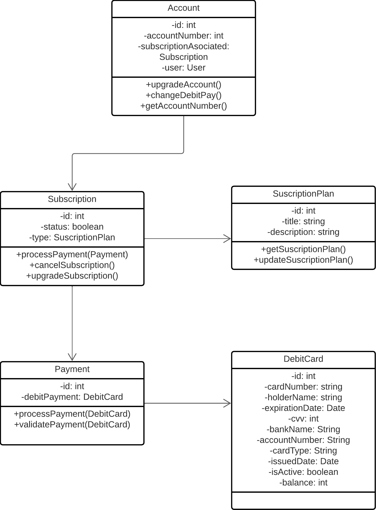

##### 4.2.1.7.2. Bounded Context Database Design Diagram

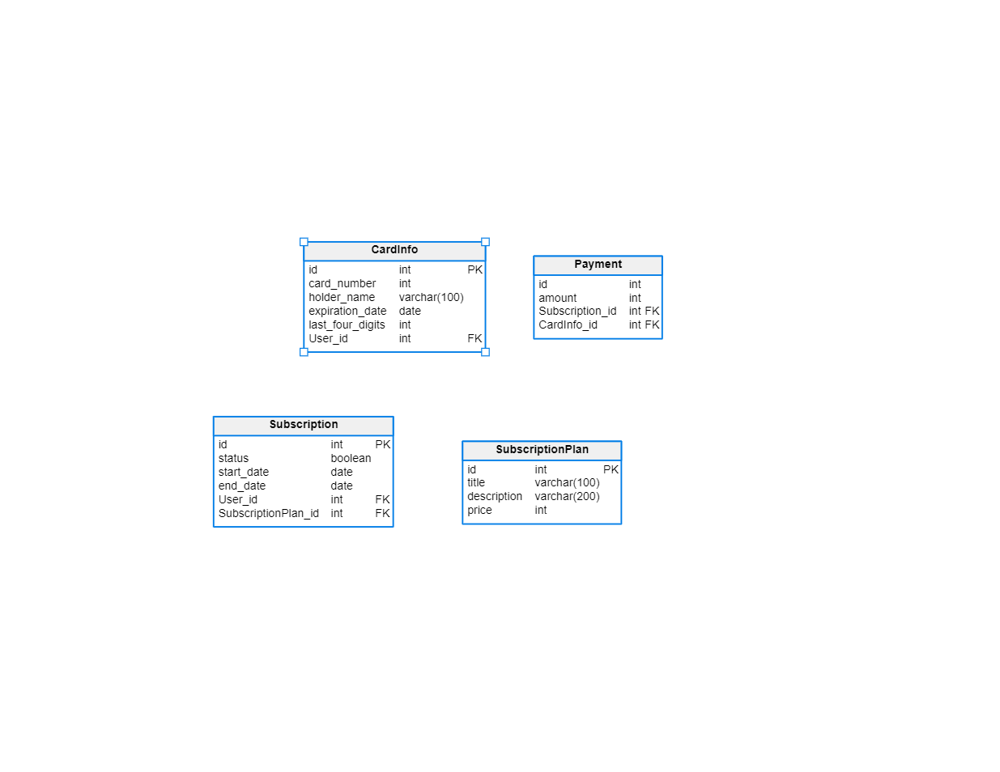

### 4.2.1. Bounded Context: Notification Bounded Context

#### 4.2.1.1. Domain Layer

#### 4.2.1.2. Interface Layer

#### 4.2.1.3. Application Layer

#### 4.2.1.4. Infrastructure Layer

#### 4.2.1.6. Bounded Context Software Architecture Component Level Diagrams

#### 4.2.1.7. Bounded Context Software Architecture Code Level Diagrams

##### 4.2.1.7.1. Bounded Context Domain Layer Class Diagrams

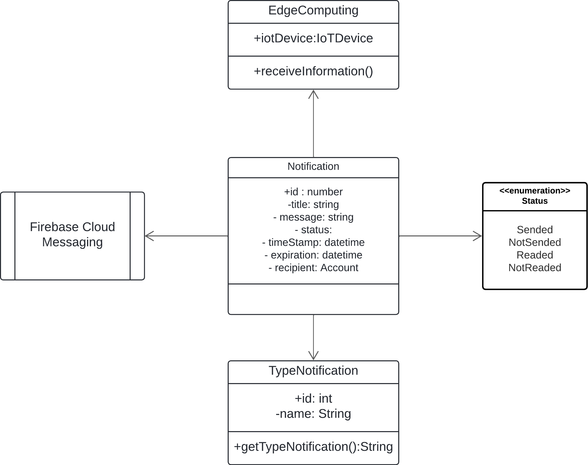

##### 4.2.1.7.2. Bounded Context Database Design Diagram

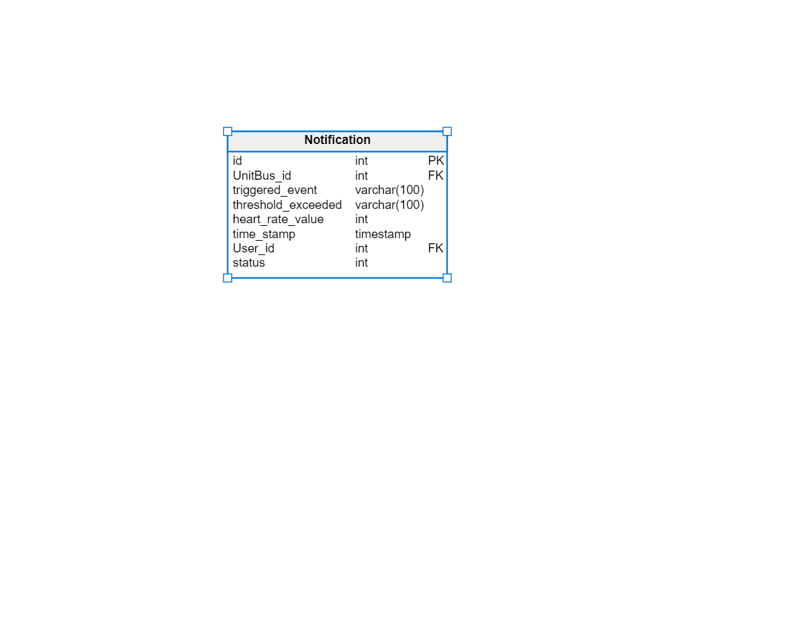