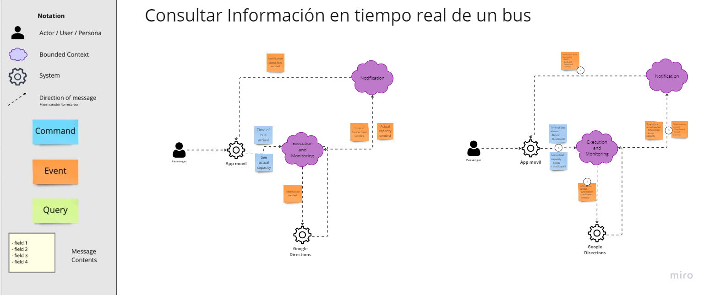

# Capítulo IV: Solution Software Design

## 4.1 Strategic-Level Domain-Driven Design

Este apartado se describe los enfoques fundamentales que se implementaron en el proceso de Domain Driven Design a nivel estratégico.

### 4.1.1 EventStorming

Se abordó un enfoque colaborativo y visual que permitió modelar el contexto del dominio. Se exploraron las etapas de Candidate Context Discovery, Domain Message Flows Modeling y la creación de Bounded Context Canvases.

**Unstructured Exploration**

    

**Timelines**

    

**Pain points**

    

**Pivotal points**

    

**Commands**

    

**Policies**

    

**Read Models**

    

**External Systems**

    

**Aggregates**

    

**Bounded Contexts**

    

Link de Event Storming: https://miro.com/app/board/uXjVKXmyt8I=/?share_link_id=548064409858

#### 4.1.1.1 Candidate Context Discovery

Para esta sección, nos hemos dedicado a identificar los principales candidatos de nuestro contexto, empleando la técnica de "start-with-value". Entre los eventos que hemos identificado como fundamentales en nuestra solución, se encuentran los siguientes:

Los eventos presentados en esta sección tienen la particularidad de pertenecer a los bounded contexts de Planificación y Ejecución/Manejo. Por consiguiente, dado el nivel de importancia que estos eventos tienen en nuestra solución, consideramos los bounded contexts que los engloban como core y de soporte, respectivamente. Dado que los eventos relacionados con el bounded context de Planificación son esenciales para el correcto funcionamiento de la aplicación, los consideramos como core. Por otro lado, los bounded contexts como el de Ejecución/Manejo, que también contienen eventos importantes y forman parte del dominio de negocio, aunque no son la base para la existencia de otros bounded contexts, los consideramos como bounded contexts de apoyo.

Al revisar nuestros eventos, también nos hemos percatado de que contamos con eventos relacionados con la gestión de cuentas, suscripciones y notificaciones:

#### 4.1.1.2 Domain Message Flows Modeling

#### 4.1.1.3 Bounded Context Canvases

### 4.1.2 Context Mapping

Claro, aquí tienes una versión más directa y sin florituras:

Proceso de Elaboración de Context Maps para el Proyecto "Gestión de Transporte Público"

Identificación de Capabilities y Bounded Contexts: Se identificaron los capabilities clave relacionados con la gestión de transporte, como seguimiento de buses, gestión de suscripciones y monitoreo de conductores. Estos se agruparon en bounded contexts como "Subscriptions", "Execution & Monitoring" y "Notifications".

Análisis de Movimiento de Capabilities: Se evaluó la reubicación de ciertos capabilities entre bounded contexts para mejorar la cohesión funcional y la modularidad del sistema.

Exploración de Descomposición y Consolidación de Bounded Contexts: Se discutió la posibilidad de dividir o combinar bounded contexts para optimizar la estructura del sistema.

Evaluación de Patrones de Relaciones: Se aplicaron patrones como Anti-corruption Layer para gestionar la comunicación entre bounded contexts y mantener la integridad del modelo de dominio.

Discusión y Selección de Alternativas: Se debatieron las diferentes opciones de context mapping y se seleccionó la más adecuada para las necesidades del proyecto.

### 4.1.3 Software Architecture.

#### 4.1.3.1. Software Architecture System Landscape Diagram.

#### 4.1.3.2. Software Architecture Context Level Diagrams.

#### 4.1.3.3. Software Architecture Container Level Diagrams.

#### 4.1.3.4. Software Architecture Deployment Diagrams.

## 4.2. Tactical-Level Domain-Driven Design

### 4.2.1. Bounded Context: <Bounded Context Name>

#### 4.2.1.1. Domain Layer

#### 4.2.1.2. Interface Layer

#### 4.2.1.3. Application Layer

#### 4.2.1.4. Infrastructure Layer

#### 4.2.1.5. Bounded Context Software Architecture Component Level Diagrams

#### 4.2.1.6. Bounded Context Software Architecture Code Level Diagrams

##### 4.2.1.6.1. Bounded Context Domain Layer Class Diagrams

##### 4.2.1.6.2. Bounded Context Database Design Diagram

<!-- ### 4.2.1. Bounded Context: <Bounded Context Name>

#### 4.2.1.1. Domain Layer

#### 4.2.1.2. Interface Layer

#### 4.2.1.3. Application Layer

#### 4.2.1.4. Infrastructure Layer

#### 4.2.1.6. Bounded Context Software Architecture Component Level Diagrams

#### 4.2.1.7. Bounded Context Software Architecture Code Level Diagrams

##### 4.2.1.7.1. Bounded Context Domain Layer Class Diagrams

##### 4.2.1.7.2. Bounded Context Database Design Diagram-->
