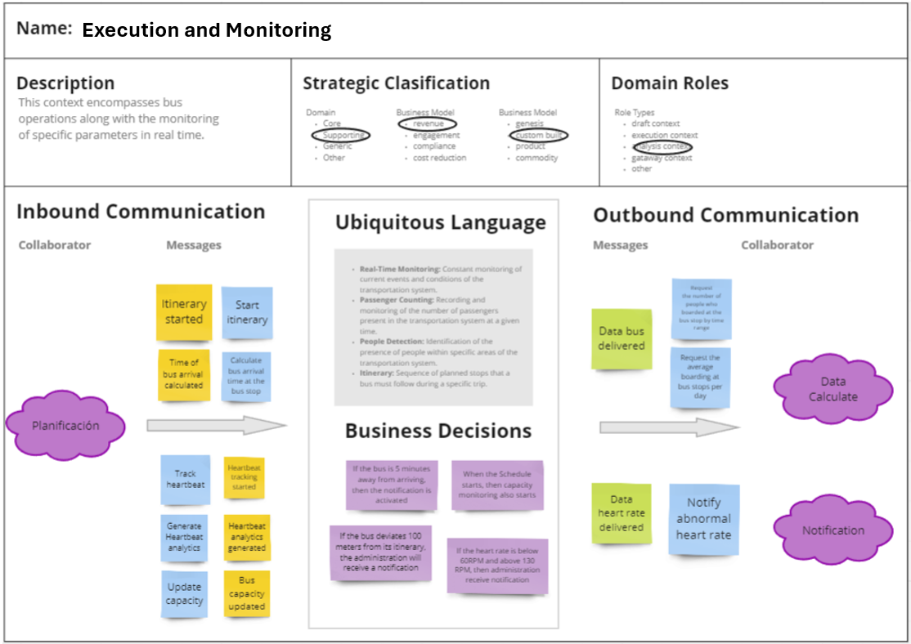
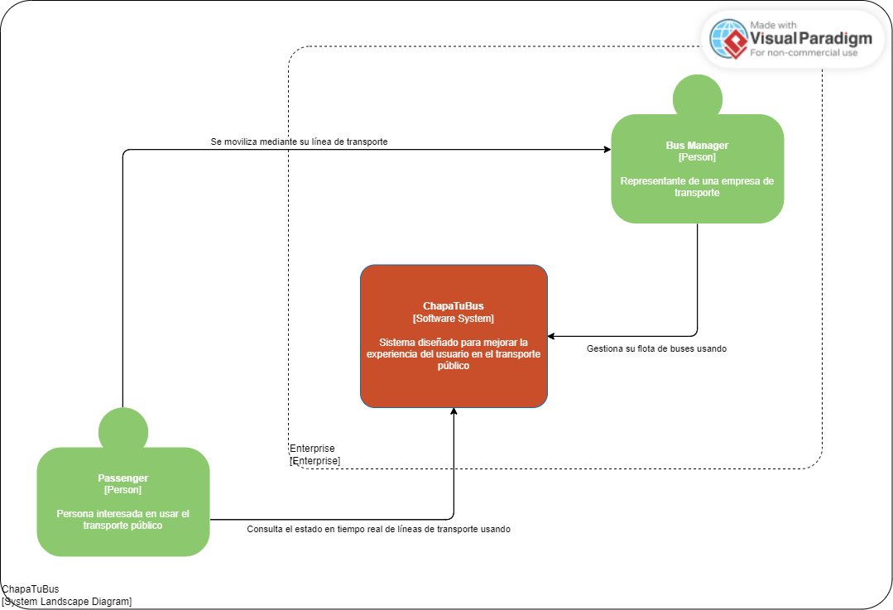

# Capítulo IV: Solution Software Design

## 4.1 Strategic-Level Domain-Driven Design

Este apartado se describe los enfoques fundamentales que se implementaron en el proceso de Domain Driven Design a nivel estratégico.

### 4.1.1 EventStorming

Se abordó un enfoque colaborativo y visual que permitió modelar el contexto del dominio. Se exploraron las etapas de Candidate Context Discovery, Domain Message Flows Modeling y la creación de Bounded Context Canvases.

**Unstructured Exploration**

En este primer paso, el equipo se reunió para compartir libremente ideas, eventos y conceptos relacionados con el dominio de nuestro problema que es la poca información en tiempo real del transporte público y cómo esto afecta tanto a pasajeros como a administradores de líneas de transporte. En dichas reuniones, no hubieron restricciones ni reglas específicas, lo que nos permitió una lluvia de ideas abierta y sin filtros.

    

**Timelines**

En este paso organizamos los eventos identificados en una línea de tiempo cronológica para comprender mejor el flujo de acciones y eventos en nuestro sistema. Esto nos ayudó a visualizar la secuencia temporal y las relaciones entre los diferentes eventos.

    

**Pain points**

En este paso identificamos y discutimos los puntos de dolor, es decir, los problemas, obstáculos o desafíos que enfrentan nuestros usuarios y nuestro sistema en nuestro dominio del problema planteado. Esto nos ayudó a comprender las áreas problemáticas que deben abordarse.

    

**Pivotal points**

Se identificaron los eventos o momentos críticos que tienen un impacto significativo en nuestro sistema y en nuestro flujo de trabajo. Estos puntos pivote influyeron en nuestra toma de decisiones pues nos permitió identificar qué puntos deberíamos añadir o modificar.

    

**Commands**

Identificamos las acciones que los usuarios podrían realizar en respuesta a eventos relacionados a la problemática planteada. Estos comandos representan las acciones que desencadenan cambios en el sistema y son fundamentales para comprender el comportamiento del mismo.

    

**Policies**

En este paso definimos las reglas, directrices o restricciones que rigen el comportamiento de nuestro sistema en ciertos contextos o situaciones. Estas políticas nos ayudaron a establecer límites y garantizar un comportamiento coherente y predecible del sistema.

    

**Read Models**

Se identificaron y definieron los modelos de lectura que representan el estado actual o proyectado del sistema desde la perspectiva de nuestro usuario. Estos modelos los utilizamos para consultar y mostrar información al usuario de manera efectiva.

    

**External Systems**

En este paso, identificamos los sistemas externos o componentes con los que el sistema interactúa, así como los eventos y acciones relacionadas con estas interacciones.

    

**Aggregates**

Definimos los agregados, que son conjuntos cohesivos de entidades relacionadas que se tratan como una sola unidad dentro del sistema. Estos agregados nos ayudan a organizar y gestionar la complejidad del dominio del problema.

    

**Bounded Contexts**

Finalmente, identificamos y delimitamos los contextos, que son límites conceptuales que definen el alcance y el significado de los modelos y eventos dentro de un determinado contexto en el dominio del problema. Esto nos ayudó a establecer límites claros y a garantizar una comprensión compartida del sistema entre los miembros de nuestro equipo.

    

Link de Event Storming: https://miro.com/app/board/uXjVKXmyt8I=/?share_link_id=548064409858

#### 4.1.1.1 Candidate Context Discovery

Para esta sección, nos hemos dedicado a identificar los principales candidatos de nuestro contexto, empleando la técnica de "start-with-value". Entre los eventos que hemos identificado como fundamentales en nuestra solución, se encuentran los siguientes:

Los eventos presentados en esta sección tienen la particularidad de pertenecer a los bounded contexts de Planificación y Ejecución/Manejo. Por consiguiente, dado el nivel de importancia que estos eventos tienen en nuestra solución, consideramos los bounded contexts que los engloban como core y de soporte, respectivamente. Dado que los eventos relacionados con el bounded context de Planificación son esenciales para el correcto funcionamiento de la aplicación, los consideramos como core. Por otro lado, los bounded contexts como el de Ejecución/Manejo, que también contienen eventos importantes y forman parte del dominio de negocio, aunque no son la base para la existencia de otros bounded contexts, los consideramos como bounded contexts de apoyo.

Al revisar nuestros eventos, también nos hemos percatado de que contamos con eventos relacionados con la gestión de cuentas, suscripciones y notificaciones:

#### 4.1.1.2 Domain Message Flows Modeling

Usamos esta técnica para visualizar cómo los componentes del sistema se comunican entre sí mediante mensajes. Utilizamos los siguientes diagramas para representar estas interacciones, lo que nos ayuda a entender cómo funcionan los diferentes elementos del sistema y cómo se coordinan para cumplir con los objetivos del negocio. Esto nos facilita la identificación de requisitos, la toma de decisiones de diseño y la detección de posibles problemas.

- **Consultar información en tiempo real de un bus**

  Describe el proceso mediante el cual los usuarios pueden obtener información actualizada sobre la ubicación y el estado de un autobús en tiempo real. Los usuarios envían una solicitud de consulta al sistema, que luego recupera los datos del autobús en cuestión y los presenta al usuario de manera clara y concisa.

- **Solicitud de número mayor de personas en paraderos**

  Describe cómo los usuarios pueden consultar la capacidad de los autobuses en paraderos específicos. Los usuarios envían una solicitud al sistema. El sistema evalúa la solicitud y, si es viable, brinda la información de la capacidad de los autobuses en ese paradero.

- **Cambio de estado de usuario normal a premium**

  Describe el proceso mediante el cual un usuario puede actualizar su estado de cuenta de normal a premium. Los usuarios realizan la solicitud de actualización a través del sistema, que luego procesa la solicitud y actualiza el estado de la cuenta del usuario, otorgándole acceso a funciones y privilegios adicionales.

- **Inicio de itinerario de los buses de acuerdo a la agenda planificada en los buses**

  Describe cómo se inicia el itinerario de los autobuses de acuerdo con la agenda planificada. El sistema recibe la agenda planificada de los autobuses, la procesa y configura los itinerarios correspondientes para cada autobús. Una vez que se activa el itinerario, los autobuses comienzan a seguir la ruta y los horarios establecidos en la agenda.

#### 4.1.1.3 Bounded Context Canvases

Este lienzo nos proporciona un marco estructurado para definir y visualizar los límites del contexto del dominio en nuestro sistema de software, así como sus interacciones con otros contextos limitados. Nos permite identificar claramente los límites del contexto del dominio, definir los términos del lenguaje ubicuo y establecer las reglas de colaboración entre los diferentes contextos.

- **Account management**

  Se centra en la gestión de cuentas de usuario dentro del sistema, incluyendo la creación, modificación y eliminación de cuentas, así como la gestión de permisos y roles asociados.

- **Subscription**

  Aborda el manejo de las suscripciones de usuarios al sistema, incluyendo la gestión de planes de suscripción, renovaciones automáticas, cancelaciones y pagos asociados.

- **Execution and Monitoring**

  Se enfoca en la ejecución y el monitoreo de procesos y operaciones dentro del sistema.

- **Notificactions**

  Se dedica a la gestión y envío de notificaciones dentro del sistema, abarcando la configuración de reglas de notificación, la programación de envíos y la gestión de canales de comunicación.

- **Data Calculate**

  Se concentra en la lógica y los cálculos de datos dentro del sistema, incluyendo la manipulación, transformación y procesamiento de datos para generar resultados y métricas específicas.

### 4.1.2 Context Mapping

Proceso de Elaboración de Context Maps para el Proyecto "Gestión de Transporte Público"

**Identificación de Capabilities y Bounded Contexts:** Se identificaron los capabilities clave relacionados con la gestión de transporte, como seguimiento de buses, gestión de suscripciones y monitoreo de conductores. Estos se agruparon en bounded contexts como "Subscriptions", "Execution & Monitoring" y "Notifications".

**Análisis de Movimiento de Capabilities:** Se evaluó la reubicación de ciertos capabilities entre bounded contexts para mejorar la cohesión funcional y la modularidad del sistema.

**Exploración de Descomposición y Consolidación de Bounded Contexts:** Se discutió la posibilidad de dividir o combinar bounded contexts para optimizar la estructura del sistema.

**Evaluación de Patrones de Relaciones:** Se aplicaron patrones como Anti-corruption Layer para gestionar la comunicación entre bounded contexts y mantener la integridad del modelo de dominio.

**Discusión y Selección de Alternativas:** Se debatieron las diferentes opciones de context mapping y se seleccionó la más adecuada para las necesidades del proyecto.

### 4.1.3 Software Architecture.

En este apartado definiremos la manera en que nuestro sistema estará organizado y cómo interactuarán sus diferentes partes para lograr los objetivos de funcionalidad, rendimiento, seguridad y otros requisitos no funcionales. Proporcionaremos un marco que guíe el desarrollo, la implementación y el mantenimiento del software a lo largo de su ciclo de vida.

#### 4.1.3.1. Software Architecture System Landscape Diagram.

#### 4.1.3.2. Software Architecture Context Level Diagrams.

#### 4.1.3.3. Software Architecture Container Level Diagrams.

#### 4.1.3.4. Software Architecture Deployment Diagrams.

## 4.2. Tactical-Level Domain-Driven Design

### 4.2.1. Bounded Context: Planification Bounded Context

#### 4.2.1.1. Domain Layer

Clases a tomar en cuenta para este bounded context:

**Entities:**

- **Driver:** Clase que representa un conductor para la empresa.
- **Bus:** Clase que representa una unidad de bus de la empresa.
- **BusLine:** Clase que representa la ruta que sigue una línea de bus.
- **WristDevice:** Dispositivo IOT.
- **DepartureSchedule:** Clase que representa la agenda del día anterior a la salida de buses.
- **Departure:** Salida individual perteneciente a la agenda del día anterior.

**ValueObjects:**

- **LicensePlate:** Placa del autobús.
- **BusModel:** Modelo del autobús.
- **GPSLocation:** Ubicación GPS actual del autobús.
- **RouteMap:** Mapa de la ruta de la línea de autobús.
- **Schedule:** Horario de la línea de autobús.
- **ContactInformation:** Información de contacto del conductor.
- **ShiftSchedule:** Horario de turno del conductor.

**Aggregates:**

- **PlanificaciónAggregate:** Encargado de manejar los eventos en el bounded context.

#### 4.2.1.2. Interface Layer

**Controllers a tomar en cuenta para este bounded context:**

- **DriverController:** Controlador encargado de realizar peticiones HTTPS de la entite en cuestión.
- **BusController:** Controlador encargado de realizar peticiones HTTPS de la entites.
- **BusLineController:** Controlador encargado de realizar peticiones HTTPS de la entites.
- **WristeDeviceController:** Controlador encargado de realizar peticiones HTTPS de la entites.

#### 4.2.1.3. Application Layer

Los flujos de nuestro negocio se manejan siguiendo un approach de Domain Driven Design por lo que serán usados eventos y comandos. Ante ello se tienen las siguientes clases EventHandler y CommandHandler:

**CommandHandler:**

- **DriverCommandHandler:**
  - RegisterDriverCommand
  - AssignDriverCommand
  - ReassignDriverCommand
- **BusCommandHandler:**
  - RegisterBusCommand
  - UpdateBusInformationCommand
- **BusLineCommandHandler:**
  - RegisterBusLineCommand
  - UpdateBusLineProfileCommand
- **DepartureScheduleCommandHandler:**
  - CreateDepartureScheduleCommand
  - PublishDepartureScheduleCommand

**EventHandler:**

- **DriverEventHandler:**
  - RegisteredDriverEvent
  - AssignedDriverEvent
  - DriverReassignedToBusEvent
- **BusEventHandler:**
  - BusRegisteredEvent
  - BusStateUpdatedEvent
- **BusLineEventHandler:**
  - BusLineRegisteredEvent
  - BusStateUpdatedEvent
- **DepartureScheduleEventHandler:**
  - DepartureScheduleCreatedEvent
  - DepartureSchedulePublishedEvent

#### 4.2.1.4. Infrastructure Layer

Las siguientes clases con acceso a base de datos de nuestra aplicación son las siguientes:

- **DriverRepository**
- **BusRepository**
- **BusLineRepository**
- **DepartureScheduleRepository**

#### 4.2.1.5. Bounded Context Software Architecture Component Level Diagrams

#### 4.2.1.6. Bounded Context Software Architecture Code Level Diagrams

##### 4.2.1.6.1. Bounded Context Domain Layer Class Diagrams

##### 4.2.1.6.2. Bounded Context Database Design Diagram

### 4.2.2. Bounded Context: Execution and Monitoring Bounded Context

#### 4.2.2.1. Domain Layer

**Entities:**

- **BusStop:** Representa una parada de autobús.
- **Bus:** Representa un autobús.
- **Itinerary:** Representa un itinerario de autobús.
- **Person:** Representa una persona.

**Value Objects:**

- **BusArrivalTime:** Objeto de valor que representa el tiempo estimado de llegada de un autobús a una parada.
- **BusPosition:** Objeto de valor que representa la posición actual de un autobús.
- **Heartbeat:** Objeto de valor que representa el latido del corazón utilizado para el monitoreo de la salud del sistema.

**Aggregates:**

- **BusStopAggregate:** Agrupa la entidad BusStop con sus relaciones y operaciones asociadas.
- **BusAggregate:** Agrupa la entidad Bus con sus relaciones y operaciones asociadas.
- **ItineraryAggregate:** Agrupa la entidad Itinerary con sus relaciones y operaciones asociadas.

**Factories:**

- **BusStopFactory:** Fábrica para crear instancias de BusStop.
- **BusFactory:** Fábrica para crear instancias de Bus.
- **ItineraryFactory:** Fábrica para crear instancias de Itinerary.

**Domain Services:**

- **ArrivalTimeCalculator:** Servicio de dominio para calcular el tiempo de llegada de un autobús a una parada.
- **BusPositionVerifier:** Servicio de dominio para verificar la posición de un autobús.
- **ItineraryStarter:** Servicio de dominio para iniciar un itinerario.
- **HeartbeatTracker:** Servicio de dominio para rastrear los latidos del corazón del sistema.
- **RateAlertService:** Servicio de dominio para alertar sobre una tasa anormal.
- **HeartbeatAnalyticsGenerator:** Servicio de dominio para generar análisis de latidos del corazón.
- **CapacityUpdater:** Servicio de dominio para actualizar la capacidad de un vehículo o lugar.
- **PeopleCounter:** Servicio de dominio para contar personas.
- **PersonDetector:** Servicio de dominio para detectar personas.

#### 4.2.2.2. Interface Layer

**Controllers:**

- **BusStopController:** Controlador que maneja las solicitudes relacionadas con las paradas de autobús como calcular el tiempo de llegada o verificar la posición del autobús en una parada.
- **BusController:** Controlador que maneja las solicitudes relacionadas con los autobuses como iniciar un itinerario o actualizar su capacidad.
- **HeartbeatController:** Controlador que maneja las solicitudes relacionadas con el monitoreo del sistema como el seguimiento del latido del corazón o la generación de análisis de latidos del corazón.

**Consumers:**

- **HeartbeatConsumer:** Consumidor que recibe eventos relacionados con el latido del corazón del sistema como alertas de tasa anormal.
- **PersonDetectionConsumer:** Consumidor que recibe eventos relacionados con la detección de personas como contar personas o detectar personas en ciertas áreas.

#### 4.2.2.3. Application Layer

**Command Handlers:**

- **CalculateBusArrivalTimeCommandHandler:** Maneja los comandos para calcular el tiempo de llegada de un autobús a una parada.
- **VerifyBusPositionCommandHandler:** Maneja los comandos para verificar la posición de un autobús.
- **StartItineraryCommandHandler:** Maneja los comandos para iniciar un itinerario.
- **UpdateCapacityCommandHandler:** Maneja los comandos para actualizar la capacidad de un vehículo o lugar.
- **CountPeopleCommandHandler:** Maneja los comandos para contar personas.
- **DetectPersonCommandHandler:** Maneja los comandos para detectar personas.

**Event Handlers:**

- **BusArrivalTimeCalculatedEventHandler:** Maneja los eventos cuando se calcula el tiempo de llegada de un autobús a una parada.
- **BusPositionVerifiedEventHandler:** Maneja los eventos cuando se verifica la posición de un autobús.
- **ItineraryStartedEventHandler:** Maneja los eventos cuando se inicia un itinerario.
- **CapacityUpdatedEventHandler:** Maneja los eventos cuando se actualiza la capacidad de un vehículo o lugar.
- **PeopleCountedEventHandler:** Maneja los eventos cuando se cuentan personas.
- **PersonDetectedEventHandler:** Maneja los eventos cuando se detecta una persona.

#### 4.2.2.4. Infrastructure Layer

**Repositories:**

- **BusStopRepositoryImpl:** Implementación del repositorio para acceder a la base de datos de paradas de autobús.
- **BusRepositoryImpl:** Implementación del repositorio para acceder a la base de datos de autobuses.
- **ItineraryRepositoryImpl:** Implementación del repositorio para acceder a la base de datos de itinerarios.
- **PersonRepositoryImpl:** Implementación del repositorio para acceder a la base de datos de personas.

#### 4.2.2.5. Bounded Context Software Architecture Component Level Diagrams

#### 4.2.2.6. Bounded Context Software Architecture Code Level Diagrams

##### 4.2.2.6.1. Bounded Context Domain Layer Class Diagrams

##### 4.2.1.6.2. Bounded Context Database Design Diagram

### 4.2.3. Bounded Context: Account Bounded Context

#### 4.2.3.1. Domain Layer

**Entities:**

- **User:** Representa los datos de un usuario registrado en el sistema.
- **Account:** Encapsula la información de la cuenta de usuario, como el nombre de usuario, correo electrónico, contraseña, etc.

**ValueObjects:**

- **AccountStatus:** : Define el estado de la cuenta del usuario, como activa, bloqueada o eliminada.
- **UserRole:** Describe el rol o roles asignados a un usuario dentro del sistema.

**Aggregates:**

- **UserAccount:** Un agregado que engloba la lógica relacionada con las cuentas de usuario. Contiene las entidades User y Account, así como los value objects AccountStatus y UserRole. Permite realizar operaciones como crear una cuenta, modificar el perfil, bloquear o eliminar una cuenta, etc.

#### 4.2.3.2. Interface Layer

- **UserController:** Este controlador manejaría las solicitudes HTTP relacionadas con la gestión de usuarios, como registrar un nuevo usuario, actualizar la información del perfil, cambiar la contraseña, etc.
- **AccountController:** Manejaría las solicitudes HTTP relacionadas con la gestión de cuentas de usuario, como iniciar sesión, cerrar sesión, recuperar contraseña, etc-

#### 4.2.3.3. Application Layer

**Command Handlers:**

- **AccountCommandHandler:**
  - CreateAccountCommand
  - UpdateAccountCommand
  - DeleteAccountCommand
  - ChangePasswordCommand
  - BlockAccountCommand
  - UnblockAccountCommand

**Event Handlers:**

- **AccountEventHandler:**
  - AccountCreatedEvent
  - AccountUpdatedEvent
  - AccountDeletedEvent
  - PasswordChangedEvent
  - AccountBlockedEvent
  - AccountUnblockedEvent

#### 4.2.3.4. Infrastructure Layer

- **AccountRepository:** Implementa la interfaz definida en el Domain Layer para acceder y manipular los datos de las cuentas de usuario en la base de datos.
- **EmailService:** Si se requiere enviar correos electrónicos para confirmar acciones como registro de usuario, cambio de contraseña, etc., esta clase se encargaría de interactuar con un servicio de correo electrónico para enviar los correos correspondientes.

#### 4.2.3.5. Bounded Context Software Architecture Component Level Diagrams

#### 4.2.3.6. Bounded Context Software Architecture Code Level Diagrams

##### 4.2.3.6.1. Bounded Context Domain Layer Class Diagrams

##### 4.2.3.6.2. Bounded Context Database Design Diagram

### 4.2.4. Bounded Context: Subscription Bounded Context

#### 4.2.4.1. Domain Layer

Clases a tomar en cuenta para este bounded context:

**Entities:**

- **Subscriber:** Clase que representa los datos de un usuario que se suscribe.

**ValueObjects:**

- **SubscriptionStatus:** Define el estado de la suscripción del usuario como activa, cancelada o renovada.
- **SubscriptionType:** Describe el tipo de suscripción como premium o estándar.

**Aggregates:**

- **Subscription:** Un agregado que encapsula la lógica relacionada con las suscripciones de los usuarios. Contiene la entidad Subscriber y los value objects SubscriptionStatus y SubscriptionType. Permite realizar operaciones como iniciar, cancelar y renovar suscripciones.

#### 4.2.4.2. Interface Layer

Controllers a tomar en cuenta para este bounded context:

- **SubscriptionController:** Este controlador manejaría las solicitudes HTTP relacionadas con las suscripciones como crear una nueva suscripción, cancelar una suscripción existente, renovar una suscripción, etc.
- **PaymentController:** Si las suscripciones requieren pagos, este controlador podría encargarse de recibir solicitudes de pago, validar pagos y actualizar el estado de la suscripción en consecuencia.

#### 4.2.4.3. Application Layer

**CommandHandler:**

- **SubscribeCommandHandler:**
  - CreateSubscriptionCommand
  - RenewSubscriptionCommand
  - CancelSubscriptionCommand
- **ValidateCardCommandHandler:**
  - ValidateCardCommand

**EventHandler:**

- **PaymentEventHandler:**
  - CreatePaymentEvent
  - ValidatePaymentEvent
  - ProcessPaymentFailureEvent

#### 4.2.4.4. Infrastructure Layer

**Repositories and Services:**

- **SubscriptionRepository**
- **PaymentGateway:** Si el proceso de suscripción involucra pagos, podríamos tener una clase que interactúe con un servicio externo de procesamiento de pagos como Stripe, PayPal u otro similar. Esta clase se encargaría de enviar la información del pago y recibir la respuesta del servicio de pagos.
- **EventBus:** Si estamos implementando un patrón de mensajería para manejar eventos relacionados con las suscripciones, podríamos tener una clase que interactúe con un sistema de mensajería como RabbitMQ o Kafka para publicar y consumir eventos de suscripción.

#### 4.2.4.5. Bounded Context Software Architecture Component Level Diagrams

#### 4.2.4.6. Bounded Context Software Architecture Code Level Diagrams

##### 4.2.4.6.1. Bounded Context Domain Layer Class Diagrams

##### 4.2.4.6.2. Bounded Context Database Design Diagram

### 4.2.5. Bounded Context: Notification Bounded Context

#### 4.2.5.1. Domain Layer

**Entities:**

- **BusApproachingNotification:** Representa una notificación de que un autobús se está acercando a una parada de autobús.
- **OffItineraryBusNotification:** Representa una notificación sobre un autobús fuera de su itinerario.
- **AbnormalHeartRateNotification:** Representa una notificación sobre una tasa cardíaca anormal.
- **ChangeOfBusDestinationNotification:** Representa una notificación sobre un cambio en el destino del itinerario de un autobús.

**Value Objects:**

- **NotificationMessage:** Objeto de valor que representa el mensaje de una notificación
- **NotificationRecipient:** Objeto de valor que representa el destinatario de una notificación.

**Aggregates:**

- **NotificationAggregate:** Agrupa las diferentes notificaciones con sus relaciones y operaciones asociadas.

**Factories:**

- **NotificationFactory:** Fábrica para crear instancias de notificaciones.

**Domain Services:**

- **NotificationService:** Servicio de dominio para manejar la lógica relacionada con las notificaciones, como enviar notificaciones, validar destinatarios, etc.

#### 4.2.5.2. Interface Layer

**Controllers:**

- NotificationController: Controlador que maneja las solicitudes relacionadas con las notificaciones, como solicitudes para enviar notificaciones de autobuses aproximándose, notificar sobre cambios de itinerario, etc.

\*\*Consumers:"

- **BusApproachingNotificationConsumer:** Consumidor que recibe eventos relacionados con autobuses aproximándose a una parada de autobús y toma medidas según sea necesario.
- **OffItineraryBusNotificationConsumer:** Consumidor que recibe eventos relacionados con autobuses fuera de itinerario y toma medidas según sea necesario.
- **AbnormalHeartRateNotificationConsumer:** Consumidor que recibe eventos relacionados con tasas cardíacas anormales y toma medidas según sea necesario.
- **ChangeOfBusDestinationNotificationConsumer:** Consumidor que recibe eventos relacionados con cambios de destino de itinerario de autobuses y toma medidas según sea necesario.

#### 4.2.5.3. Application Layer

**Command Handlers:**

- **NotifyBusApproachingCommandHandler:** Maneja los comandos para enviar notificaciones cuando un autobús se está aproximando a una parada de autobús.
- **NotifyOffItineraryBusCommandHandler:** Maneja los comandos para enviar notificaciones sobre autobuses fuera de itinerario.
- **NotifyAbnormalHeartRateCommandHandler:** Maneja los comandos para enviar notificaciones sobre tasas cardíacas anormales.
- **NotifyChangeOfBusDestinationCommandHandler:** Maneja los comandos para enviar notificaciones sobre cambios en el destino del itinerario de un autobús.

**Event Handlers:**

- **BusesSendedNotificationEventHandler:** Maneja los eventos cuando se envían notificaciones sobre autobuses (gestionado por el gestor de notificaciones).
- **AbnormalHeartRateSendedNotificationEventHandler:** Maneja los eventos cuando se envían notificaciones sobre tasas cardíacas anormales.
- **ChangeOnTheRouteSendedNotificationEventHandler:** Maneja los eventos cuando se envían notificaciones sobre cambios en la ruta.

#### 4.2.5.4. Infrastructure Layer

**Repositories:**

- **NotificationRepositoryImpl:** Implementación del repositorio para acceder a la base de datos de notificaciones.

**Services:**

- **DatabaseService:** Clase que maneja la conexión y las operaciones con la base de datos.
- **MessagingService:** Clase que maneja la conexión y las operaciones con el sistema de mensajería.
- **EmailService:** Clase que maneja el envío de correos electrónicos.

#### 4.2.5.5. Bounded Context Software Architecture Component Level Diagrams

#### 4.2.5.6. Bounded Context Software Architecture Code Level Diagrams

##### 4.2.5.6.1. Bounded Context Domain Layer Class Diagrams

##### 4.2.5.6.2. Bounded Context Database Design Diagram

### 4.2.6. Bounded Context: Data Calculate Bounded Context

#### 4.2.6.1. Domain Layer

**Entities:**

- **RequestedBoarding:** Representa la solicitud de abordaje de un usuario en una parada de autobús en un determinado intervalo de tiempo.

**Value Objects:**

- **TimeRange:** Define un rango de tiempo específico, como la hora de inicio y la hora de finalización.

**Aggregates:**

- **DataCalculateAggregate:** Agrupa los diferentes calculos realizados por los dispositivos.

#### 4.2.6.2. Interface Layer

#### 4.2.6.3. Application Layer

**Command Handlers:**

- **DataCalculateCommandHandler:**
  - RequestBoardingNumberByTimeRangeCommand
  - RequestAverageBoardingPerDayCommand

**Event Handlers:**

- **DataCalculateEventHandler:**
  - BoardingNumberCalculatedEvent
  - AverageBoardingPerDayCalculatedEvent
  - BusiestBusStopCalculatedEvent

#### 4.2.6.4. Infrastructure Layer

**Repositories:**

- **DataCalculateRepository:** Repositorio para acceder y manipular los datos relacionados con el cálculo.

**Services:**

- **DataCalculateService:** Servicio que realiza los cálculos de datos basados en las solicitudes recibidas.

#### 4.2.6.5. Bounded Context Software Architecture Component Level Diagrams

#### 4.2.6.6. Bounded Context Software Architecture Code Level Diagrams

##### 4.2.6.6.1. Bounded Context Domain Layer Class Diagrams

##### 4.2.6.6.2. Bounded Context Database Design Diagram
