# Capítulo VI: Product Implementation, Validation & Deployment

## 6.1. Software Configuration Management

### 6.1.1. Software Development Environment Configuration.

- **Project Management**:

  Para las actividades de Project Management se ha elegido hacer uso de Jira que es una herramienta de gestión de trabajo para los equipos de software que deben organizar y hacer un seguimiento de su trabajo. Se eligió
  esta herramienta por su flexibilidad y porque nos brinda la opción de personalizarla de acuerdo al flujo de trabajo del equipo.

  **Enlace:** https://www.atlassian.com/es/software/jira

- **Requirements Management**

  Para el manejo de requerimientos se eligió Pivotal Tracker pues es una herramienta gratuita de gestión de proyectos ágiles que se enfoca en la gestión de la pila de producto y métricas como la velocidad.
  Es esencial para nosotros como equipo pues nos permite trabajar de manera descentralizada.

  **Enlace:** https://www.pivotaltracker.com/

- **Product UX/UI Design**

  Para temas de diseño UX/UI de nuestro producto se eligió Figma pues es una herramienta donde podemos crear distintos conceptos como wireframes, diseños de webs y diseños de aplicaciones de manera gratuita. Nos es útil
  ya que nos brinda un amplio menú de funcionalidades y utilidades.

  **Enlace:** https://www.figma.com

- **Software Development**

  Para el desarrollo de software, se han elegido las siguientes herramientas:

  Para el desarrollo de nuestra Landing Page, Web Application y Mobile Application se eligió **Visual Studio Code** pues es un software de amplia compatibilidad con lenguajes y frameworks y potentes herramientas de depuración y pruebas.
  Además de que cuenta con integración nativa con Git y control de versiones y se adapta a nuestras necesidades.

  **Enlace**: https://visualstudio.microsoft.com/es/#vscode-section

  Para el desarrollo de nuestro Backend Service se eligió **IntelliJ IDEA** pues nos permite dedicar más tiempo a diseñar y crear productos, en lugar de a repetir código, identificar errores y resolverlos. Nos ayuda a
  trabajar de manera más eficaz y cuenta con una interfaz intuitiva.

  **Enlace**: https://www.jetbrains.com/idea/

- **Software Testing**

  En relación a Testing, se ha decidido usar las siguientes herramientas:

  Para el testing de la aplicación web, se eligió **SELENIUM IDE**, puesto que es una herramienta de código abierto con la cual resulta sencillo realizar casos de prueba.

  **Enlace**: https://chromewebstore.google.com/detail/selenium-ide/mooikfkahbdckldjjndioackbalphokd

  Para el testing de nuestro backend se decidieron utilizar **JUnit** y **Mockito** debido a que son bibliotecas populares de SpringBoot que permiten realizar un testing rápido y eficiente.

  **Enlace**:https://junit.org/junit5/
  **Enlace**:https://site.mockito.org/

- **Software Deployment**

  Para el deployment de nuestras soluciones hemos decidio usar:

  **Github pages** para el despliegue de nuestra Landing Page pues soporta sitios web estáticos y es gratuito.

  **Enlace**: https://pages.github.com/

  **Netlify** para el despliegue de nuestra Web Application pues es una plataforma intuitiva y fácil de usar.

  **Enlace**: https://www.netlify.com/

  **Render** para el despliegue de nuestro backend pues nos brinda un hosting rápido, sencillo e intuitivo.

  **Enlace:** https://render.com/

- **Software Documentation**

  La documentación de nuestro software desde el punto de vista de desarrollador será realizada en **Github** a través de un readme (informe), se usará github puesto que es una plataforma de código gratuita y con gran uso en el mundo del software.

  **Enlace:** https://github.com/

### 6.1.2. Source Code Management.

**Repositorios**

Se creó una organización llamada TechSolutions-2024-I-IOT en Github, en la cual el equipo cuenta con los repositorios donde se trabajarán las soluciones propuestas.

Enlace de la organización: https://github.com/TechSolutions-2024-I-IOT

<table border="2">
    <tr>
        <td>
           
<b>Solución</b>

        </td>
        <td>
          
<b>Nombre del repositorio</b>

        </td>
        <td>
          
<b>Enlace</b>

        </td>
    </tr>
  <tr>
        <td>
           
Landing Page

        </td>
        <td>
          
Landing-Page

        </td>
        <td>
          
https://github.com/TechSolutions-2024-I-IOT/Landing-Page.git

        </td>
    </tr>
  <tr>
        <td>
           
Frontend Web Application

        </td>
        <td>
          
Frontend

        </td>
        <td>
          
https://github.com/TechSolutions-2024-I-IOT/Frontend.git

        </td>
    </tr>
  <tr>
        <td>
           
Web Services

        </td>
        <td>
          
Backend

        </td>
        <td>
          
https://github.com/TechSolutions-2024-I-IOT/Backend.git

        </td>
    </tr>
  <tr>
        <td>
           
Mobile Application

        </td>
        <td>
          
ChapaTuBus-Mobile

        </td>
        <td>
          
https://github.com/TechSolutions-2024-I-IOT/ChapaTuBus-Mobile.git

        </td>
    </tr>
</table>

**Gitflow**

  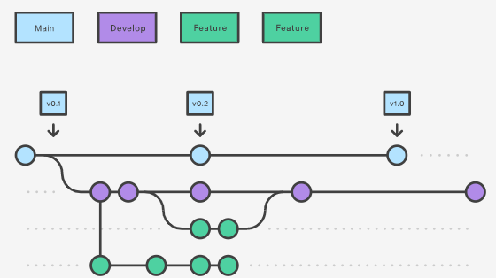

Para la implementación del flujo de trabajo Gitflow, usando la herramienta de control de versiones Git, se usó de referencia la entrada de blog “A successful Git branching model” de Vincent Driessen, que nos ayudó a detallar las siguientes convenciones que se usarán en el proyecto:

- **Main branch**
  La Main branch es la principal rama de desarrollo del proyecto. En esta rama se encontrará el código que se encuentra actualmente en producción.
  **Notación:** main

- **Develop branch**
  La Develop branch será la rama que contendrá las últimas actualizaciones y cambios agregados que se entregarán en la siguiente versión del proyecto.
  **Notación:** develop
  **Creación:** git checkout -b develop main

- **Feature branches**
  Las Feature branches se usarán para desarrollar nuevas características del producto que se agregarán en versiones futuras. Estas funcionalidades se deberán reunir o juntar eventualmente a la rama Develop.

  - Debe derivarse de la rama Develop.
  - Debe fusionarse de vuelta a la rama Develop.
    **Notación:** feature/[name of feature]
    **Creación:** git checkout -b feature/[name of feature] develop

- **Conventional Commits**
  Para la redacción de las siguientes convenciones de commits se utilizó de referencia el artículo Conventional Commits 1.0.0.

Types:

- add: se usará para indicar que se añadieron archivos o carpetas.
- fix: este tipo de commit se utilizará para la confirmación de una corrección de un error en el código.
- feat: este tipo de commit se utilizará para la confirmación de que se ha añadido una nueva funcionalidad.
- test: se usará para indicar que se añadieron archivos de test .
- docs: se usará para indicar que se añadieron actualizaciones a la documentación
- BREAKING CHANGE: este tipo de commit se utilizará para confirmar la introducción de un cambio importante en el código.

### 6.1.3. Source Code Style Guide & Conventions.

### Guía de Estilo y convenciones de codificación HTML

Para las convenciones de codificación HTML, adoptaremos las pautas delineadas en las referencias "Guía de Estilo y Convenciones de Codificación HTML" y "Guía de Estilo HTML/CSS de Google". Aquí algunos puntos clave:

**Convenciones de Nomenclatura:**

- Aplicar nomenclatura en inglés
- Utilizar letras minúsculas para todos los nombres de elementos HTML.
- Separar palabras en nombres de ID y clases con guiones (-).
- Utilizar nombres significativos y descriptivos para IDs y clases.

**Formato:**

- Sangrar elementos anidados para mejorar la legibilidad.
- Utilizar comillas dobles para los valores de atributos.
- Emplear etiquetas auto-cerradas para elementos.

**Comentarios:**

- Agregar comentarios para explicar secciones complejas o proporcionar contexto a futuros desarrolladores.
- Utilizar la sintaxis de comentarios HTML <!-- -->.

### Guía de Estilo y convenciones de codificación CSS

Para las convenciones de codificación CSS, seguiremos las pautas proporcionadas en la referencia "Google HTML/CSS Style Guide". Aquí tienes algunos puntos clave:

**Convenciones de nomenclatura:**

- Aplicar nomenclatura en inglés
- Usa letras minúsculas para todos los selectores CSS y nombres de propiedades.
- Separa palabras en nombres de clases con guiones (-).
- Utiliza nombres significativos y descriptivos para las clases.

**Formato:**

- Indenta estilos anidados para mejorar la legibilidad.
- Utiliza un estilo de indentación consistente, como dos espacios.
- Usa propiedades abreviadas cuando sea posible para mantener el código conciso.

**Comentarios:**

- Agrega comentarios para explicar estilos complejos o proporcionar contexto para futuros desarrolladores.
- Utiliza la sintaxis de comentarios CSS /\* \*/.

### Guía de Estilo y convenciones de codificación JavaScript/TypeScript

Para las convenciones de codificación JavaScript/TypeScript, adoptaremos las pautas proporcionadas en las referencias "Google JavaScript Style Guide" y "Google TypeScript Style Guide". Aquí tienes algunos puntos clave:

**Convenciones de nomenclatura:**

- Aplicar nomenclatura en inglés
- Utiliza camelCase para nombres de variables y funciones.
- Utiliza PascalCase para nombres de clases.
- Utiliza letras mayúsculas para constantes.

**Formato:**

- Utiliza un estilo de indentación consistente, como dos o cuatro espacios.
- Utiliza punto y coma al final de las sentencias.
- Evita el uso de variables globales siempre que sea posible.

**Comentarios:**

- Agrega comentarios para explicar lógica compleja o proporcionar contexto para futuros desarrolladores.
- Utiliza la sintaxis de comentarios JavaScript/TypeScript // para comentarios de una sola línea y /\* \*/ para comentarios de varias líneas.

### Guía de Estilo y convenciones de codificación Java

Para las convenciones de codificación Java, nos adheriremos a las pautas descritas en la referencia "Google Java Style Guide". Aquí tienes algunos puntos clave:

**Convenciones de nomenclatura:**

- Aplicar nomenclatura en inglés
- Utiliza camelCase para nombres de variables y métodos.
- Utiliza PascalCase para nombres de clases.
- Utiliza letras mayúsculas para constantes.

**Formato:**

- Utiliza un estilo de indentación consistente, como cuatro espacios.
- Coloca las llaves de apertura en la misma línea que la declaración.
- Utiliza nombres significativos para variables y métodos para mayor claridad.

**Comentarios:**

- Agrega comentarios para explicar algoritmos complejos o proporcionar contexto para futuros desarrolladores.
- Utiliza la sintaxis de comentarios Java // para comentarios de una sola línea y /\* \*/ para comentarios de varias líneas.

### 6.1.4. Software Deployment Configuration.

**Despliegue de la landing page en GitHub Pages**

- Ir a la configuración del repositorio

  

- Seleccionar la opción "Pages"

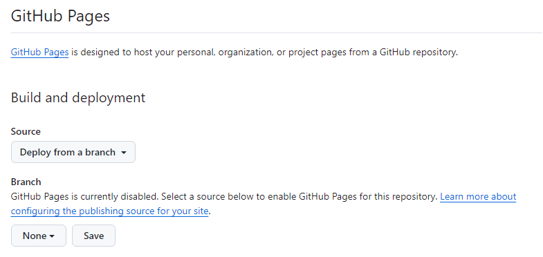

- Elegir la rama que se desea desplegar y dar click en "Save"

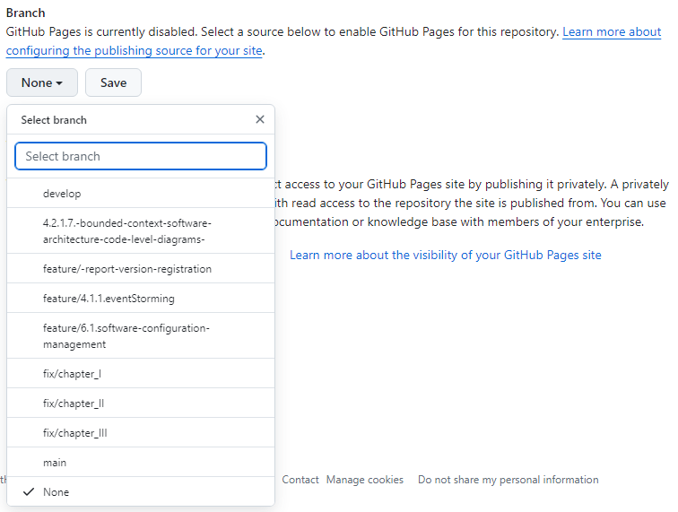

- Luego de unos segundos se mostrará el enlace de la página en la parte superior

[Enlace a nuestro landing page desplegado](https://techsolutions-2024-i-iot.github.io/chapatubus-landingpage.github.io/)

**Despliegue de web application en netlify**

- Elegimos la opción "Add new site"

  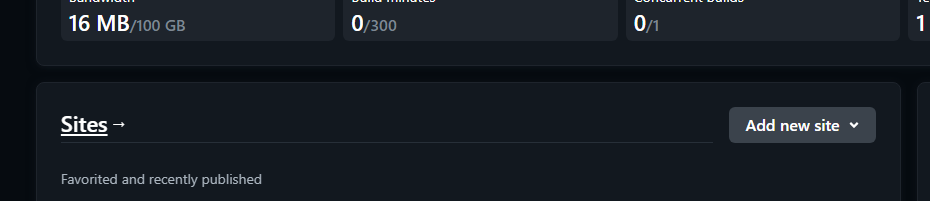
  

  
- Elegimos importar un projecto existente

  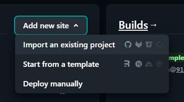
  

  
- Seleccionamos la opción "Deploy with github"
  

  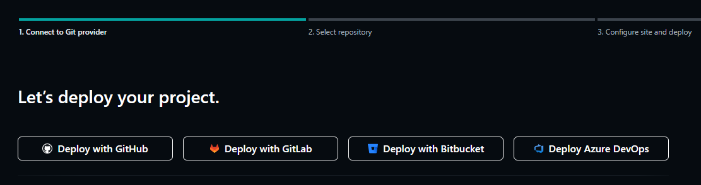
  

   
- Elegimos el repositorio

  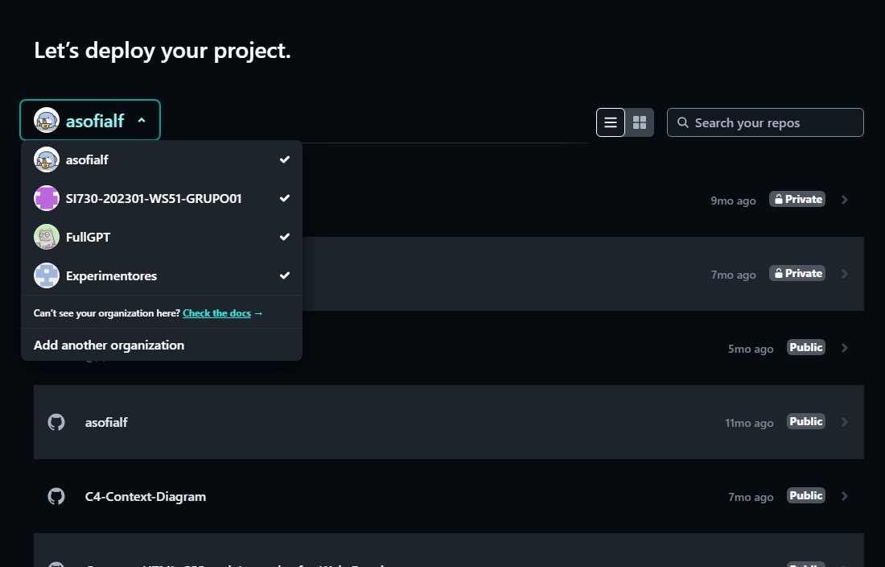
  

  
- Revisamos las configuraciones

  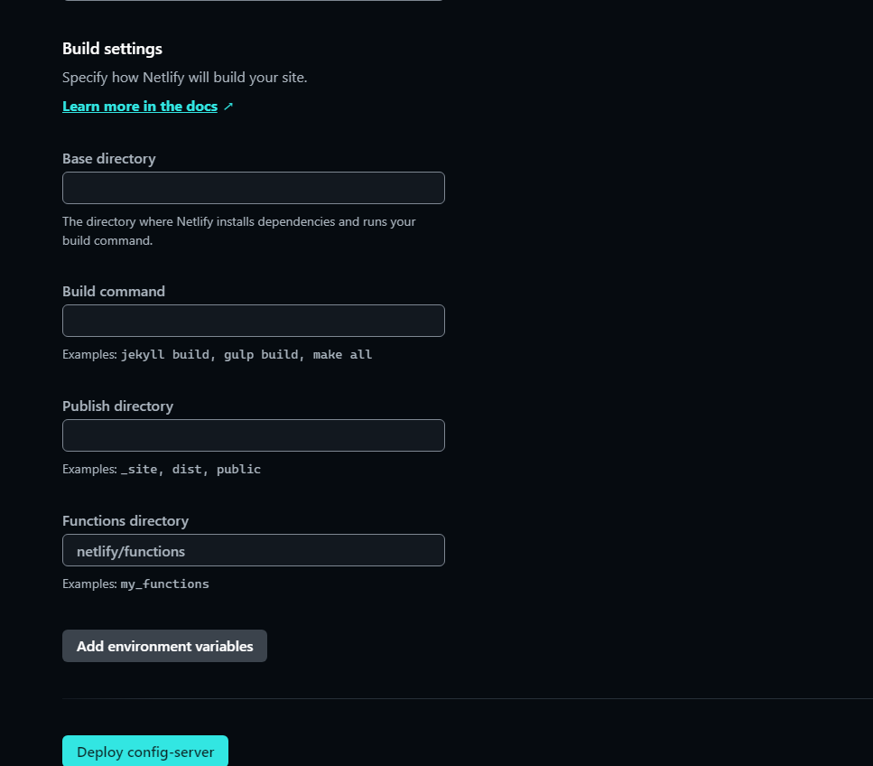
  

   
- Damos click en deploy

**Despliegue de web service en railway**

**Paso 1: Crear un esquema de MySQL en railway**

- Seleccionar Start a New Project

  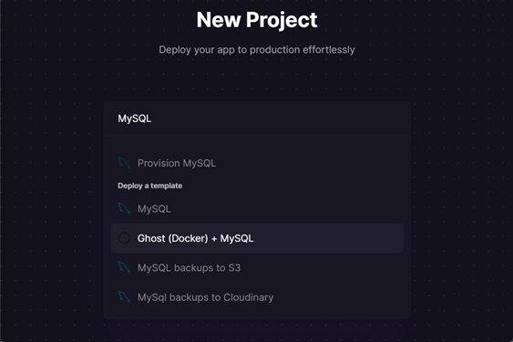
    

  
- Buscar MySql y seleccionarlo

  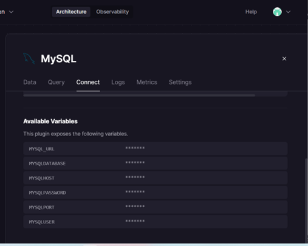
    

   
- Se crea la instancia y luego se selecciona en Connect, donde se encontrarán las variables para poder conectarnos a la base de datos.

  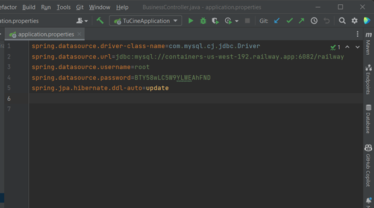
    

**Paso 2: Despliegue de la API**

- En el mismo entorno con click derecho y seleccionamos GitHub Repo

  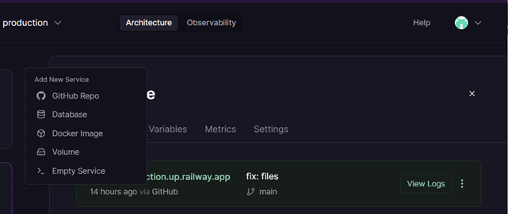
    

   
- Luego de ello nos abrirá una ventana pop-up y seleccionaremos el repositorio que queremos desplegar
  
- Luego vamos Settings y generamos el dominio de nuestro servicio

  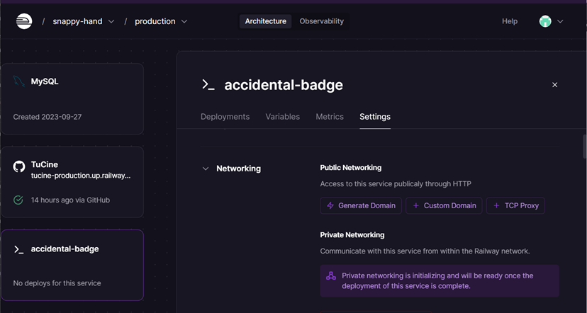
    

  
- En la sección Git Repository podemos elegir la rama desde donde queremos que se haga el deploy. Los cambios realizados en esta rama de GitHub se enviarán automáticamente a este entorno.

**Despliegue de mobile application en Firebase**

- Lo primero que debemos hacer es registrar nuestra aplicación en Firebase.

  
   

  
- Seleccionamos el tipo de aplicación que deseamos desplegar.

  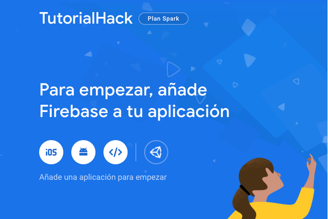
   

- Vamos a seleccionar la opción de Hosting en el menú lateral izquierdo.

  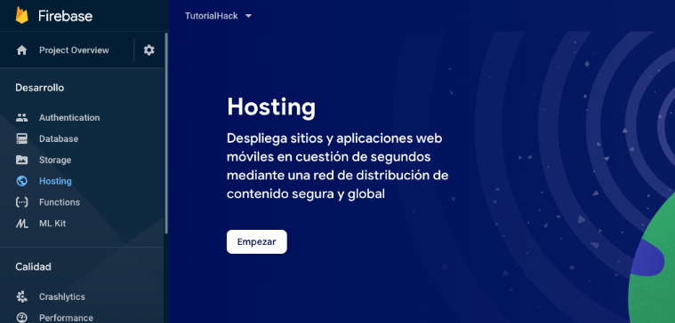
   

- Procedemos a instalar el CLI de Firebase

  
   

- El siguiente paso será situarnos en la carpeta de nuestro proyecto, autenticarnos e inicializarlo.
- Una vez hayamos inicializado firebase el siguiente paso será realizar el deploy. Para ello ejecutamos el siguiente comando.

  
   

  
## 6.2. Landing Page, Services & Applications Implementation.

### 6.2.1. Sprint 1

#### 6.2.1.1. Sprint Planning 1.

<table border="2">
    <tr>
        <td>
           
<b>Sprint #</b>

        </td>
        <td>
          
Sprint 1

        </td>
    </tr>
  <tr>
        <td  colspan="2">
           
<b>Sprint Planning Background</b>

        </td>
    </tr>
  <tr>
        <td>
           
Date

        </td>
        <td>
          
29-04-2024

        </td>
    </tr>
  <tr>
        <td>
           
Time

        </td>
        <td>
          
21:00

        </td>
    </tr>
  <tr>
        <td>
           
Location

        </td>
        <td>
          
Reunión virtual vía Discord

        </td>
    </tr>
  <tr>
        <td>
           
Prepared By

        </td>
        <td>
          
Tania Sadith Vasquez Sal Y Rosas

        </td>
    </tr>
  <tr>
        <td>
           
Attendees (to planning meeting)

        </td>
        <td>
          
Tania Sadith Vasquez Sal Y Rosas, Andrea Sofia Alfaro Salinas, Diego Martin Merino Mas, Axel Joshue Fiestas Santisteban, Rafael Wimmer Primo Estrada

        </td>
    </tr>
  <tr>
        <td>
           
Sprint 0 – 1 Review Summary

        </td>
        <td>
          
-

        </td>
    </tr>
  <tr>
        <td>
           
Sprint 0 – 1 Retrospective Summary

        </td>
        <td>
          
-

        </td>
    </tr>
   <tr>
        <td  colspan="2">
           
<b>Sprint Goal & User Stories</b>

        </td>
    </tr>
   <tr>
        <td>
           
Sprint 1 Goal

        </td>
        <td>
          
Desarrollar la landing page y primera versión de la aplicación web del proyecto y lanzarlas a producción

        </td>
    </tr>
  <tr>
        <td>
           
Sprint 1 Velocity

        </td>
        <td>
          
30

        </td>
    </tr>
  <tr>
        <td>
           
Sum of Story Points

        </td>
        <td>
          
30

        </td>
    </tr>
</table>

#### 6.2.1.2. Sprint Backlog 1.

El objetivo principal del sprint 1 es tener la landing page finalizada y una primera versión
de la aplicación web. Asimismo, tener ambos productos de software desplegados en la internet
también forma parte del alcance del sprint 1, de manera que cualquier persona con acceso a
internet pueda acceder a la landing page y a la aplicación web.

A continuación, se presenta un screenshot del sprint 1 en desarrollo realizado en Jira por
el equipo:

  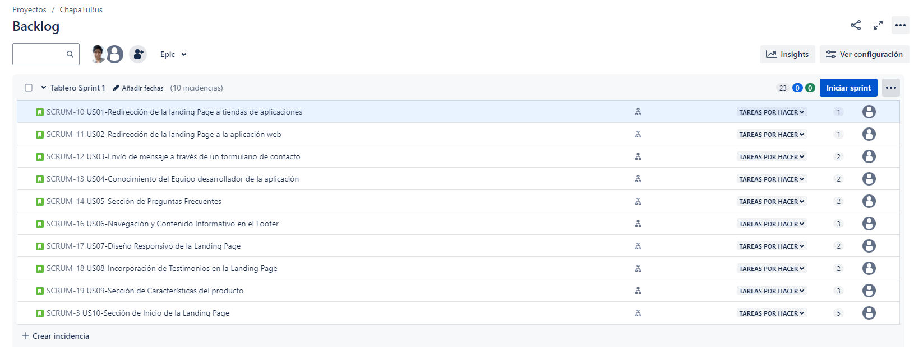

Asimismo, se presenta la tabla de nuestro primer sprint con las respectivas user stories a trabajar:

| Sprint #   | Sprint 1                                                 |     |                                                              |                                                                                                                                                                                                                    |                    |               |                                               |
| :--------- | :------------------------------------------------------- | :-- | :----------------------------------------------------------- | :----------------------------------------------------------------------------------------------------------------------------------------------------------------------------------------------------------------- | :----------------- | :------------ | :-------------------------------------------- |
| User Story | Work-Item /Task                                          |     |                                                              |                                                                                                                                                                                                                    |                    |               |                                               |
| Id         | Title                                                    | Id  | Title                                                        | Description                                                                                                                                                                                                        | Estimation (Hours) | Assigned To   | Status (To-do / In-Process/ To-Review / Done) |
| US01       | Redirección de la landing Page a tiendas de aplicaciones | 1   | Implementar enlaces de redirección a tiendas de aplicaciones | Configurar los enlaces en la Landing Page para redirigir a las tiendas de aplicaciones correspondientes (App Store y Google Play) según el dispositivo del usuario.                                                | 1                  | Diego Merino  | Done                                          |
| US02       | Redirección de la landing Page a la aplicación web       | 2   | Configurar enlace de redirección a la aplicación web         | Establecer un enlace en la Landing Page que dirija a los usuarios a la aplicación web, garantizando una experiencia fluida y coherente.                                                                            | 1                  | Andrea Alfaro | Done                                          |
| US03       | Envío de mensaje a través de un formulario de contacto   | 3   | Implementar formulario de contacto                           | Crear un formulario de contacto funcional en la Landing Page que permita a los usuarios enviar mensajes directamente al equipo de soporte.                                                                         | 3                  | Axel Fiestas  | Done                                          |
| US04       | Conocimiento del Equipo desarrollador de la aplicación   | 4   | Crear sección de equipo desarrollador                        | Diseñar y desarrollar una sección informativa en la Landing Page que presente al equipo de desarrollo de la aplicación, incluyendo información relevante sobre cada miembro.                                       | 4                  | Tania Vasquez | Done                                          |
| US05       | Sección de Preguntas Frecuentes                          | 5   | Integrar sección de preguntas frecuentes                     | Agregar una sección dedicada a preguntas frecuentes en la Landing Page, que aborde las consultas comunes de los usuarios y proporcione respuestas claras y concisas.                                               | 4                  | Rafael Primo  | Done                                          |
| US06       | Navegación y Contenido Informativo en el Footer          | 6   | Mejorar navegación y contenido en el Footer                  | Optimizar la navegación y agregar contenido informativo relevante en el Footer de la Landing Page para mejorar la experiencia del usuario y facilitar el acceso a información importante.                          | 4                  | Diego Merino  | Done                                          |
| US07       | Diseño Responsivo de la Landing Page                     | 7   | Implementar diseño responsivo                                | Desarrollar una versión responsiva de la Landing Page que se adapte automáticamente a diferentes tamaños de pantalla y dispositivos, garantizando una experiencia consistente y agradable para todos los usuarios. | 6                  | Andrea Alfaro | Done                                          |
| US09       | Sección de Características del producto                  | 8   | Crear sección de características del producto                | Diseñar y desarrollar una sección en la Landing Page que resalte las características y funcionalidades clave del producto, ayudando a los usuarios a comprender mejor su propósito y beneficios.                   | 3                  | Axel Fiestas  | Done                                          |
| US10       | Sección de Inicio de la Landing Page                     | 9   | Diseñar sección de inicio                                    | Elaborar el diseño y contenido inicial de la Landing Page, estableciendo la estructura y presentación general del sitio para captar la atención de los visitantes y orientarlos hacia la información relevante.    | 4                  | Tania Vasquez | Done                                          |

#### 6.2.1.3. Development Evidence for Sprint Review.

Durante este Sprint, completamos el desarrollo de la Landing Page en su totalidad. Logramos diseñar una interfaz atractiva y funcional que refleja nuestra marca y ofrece una experiencia de usuario óptima. Implementamos características clave, como la capacidad de descarga y acceso rápido a la información relevante para nuestros usuarios. Además, hemos realizado pruebas exhaustivas para garantizar su funcionamiento adecuado en diferentes dispositivos y navegadores.

En cuanto a la aplicación web, hemos desarrollado las primeras funcionalidades principales. Estas incluyen la autenticación de usuarios, la navegación básica y la visualización de contenido relevante. Desplegamos con éxito la primera versión de la aplicación en un entorno de producción y estamos satisfechos de haber cumplido con los objetivos establecidos al inicio del Sprint.

Para las suites de pruebas, nos enfocamos en la creación de escenarios de prueba utilizando Gherkin debido a la simplicidad de la solución desarrollada. Hemos elaborado casos de prueba exhaustivos que abarcan diferentes aspectos de la Landing Page y la aplicación web, asegurando la calidad y funcionalidad de nuestros productos.

| Repository   | Branch  | Commit ID | Commit Message                                                          | Commit Message Body | Commited on (Date) |
| :----------- | :------ | :-------- | :---------------------------------------------------------------------- | :------------------ | :----------------- |
| Landing-Page | develop | 924ab59   | Merge branch 'feature/US03' into develop                                | -                   | 01/05/2023         |
| Landing-Page | develop | b846187   | Merge pull request #9 from TechSolutions-2024-I-IOT/feature/us-4        | -                   | 01/05/2023         |
| Landing-Page | develop | 30eacc0   | Merge pull request #10 from TechSolutions-2024-I-IOT/feature/i18n       | -                   | 01/05/2023         |
| Landing-Page | develop | c3dbf7f   | Merge pull request #14 from TechSolutions-2024-I-IOT/feature/fix-doubts | -                   | 03/05/2023         |
| Frontend     | develop | 5c31484   | Merge pull request #1 from TechSolutions-2024-I-IOT/feature/us-29       | -                   | 02/05/2023         |
| Frontend     | develop | 7379879   | Merge branch 'feature/us-27' into feature/us-29                         | -                   | 02/05/2023         |
| Frontend     | develop | 5c31484   | Merge pull request #1 from TechSolutions-2024-I-IOT/feature/us-29       | -                   | 02/05/2023         |
| TestingSuite | main    | 31836ee   | update: sprint 1 testing                                                | -                   | 03/05/2023         |

**Network**

  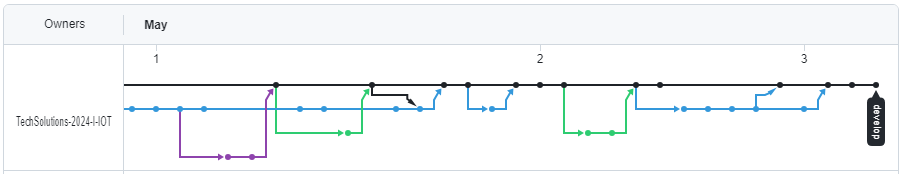   

  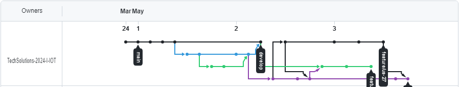   

#### 6.2.1.4. Testing Suite Evidence for Sprint Review.

| Repository   | Branch | Commit ID | Commit Message           | Commit Message Body | Commited on (Date) |
| :----------- | :----- | :-------- | :----------------------- | :------------------ | :----------------- |
| TestingSuite | main   | 31836ee   | update: sprint 1 testing | -                   | 03/05/2023         |

Para la revisión del Sprint 1, presentamos los Testing Suite Evidence, los cuales se desarrollaron utilizando Gherkin. Esta elección se basó en la simplicidad del proyecto, que consiste en el desarrollo del landing page y la primera versión del front-end. Gherkin proporcionó una forma clara y legible de especificar los comportamientos esperados del sistema a través de escenarios escritos en un lenguaje natural. Esto facilitó la colaboración entre el equipo de desarrollo y los stakeholders al definir y comprender los criterios de aceptación del sprint.

  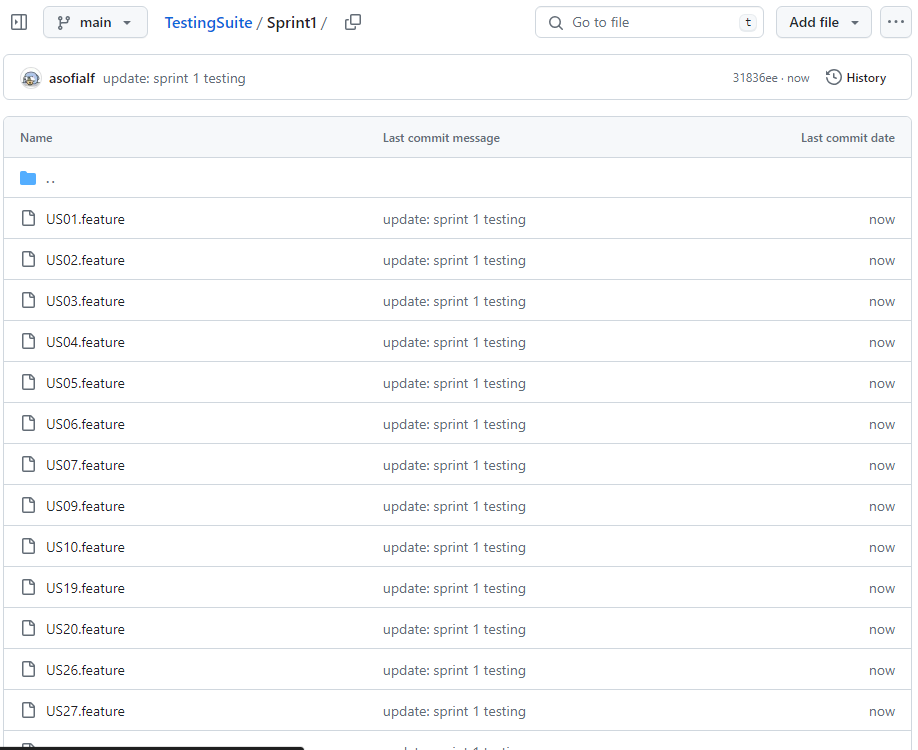   
  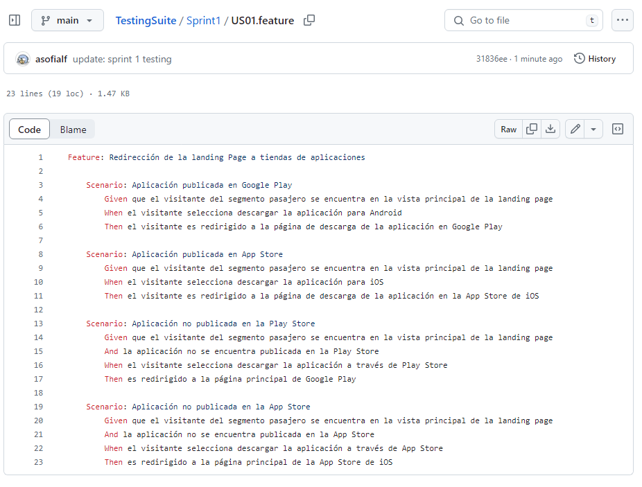

**Enlace del repositorio:** https://github.com/TechSolutions-2024-I-IOT/TestingSuite

#### 6.2.1.5. Execution Evidence for Sprint Review.

- **Landing Page**

Para el Sprint 1, se logró el desarrollo completo de la landing page, cumpliendo con los objetivos establecidos en cuanto a diseño y funcionalidad. Se implementaron las características acordadas, como la estructura de navegación, la disposición del contenido y la integración de elementos visuales. Además, se realizó una revisión exhaustiva para garantizar la coherencia del diseño y la correcta visualización en diferentes dispositivos y navegadores. El equipo también llevó a cabo pruebas de usabilidad para asegurar una experiencia de usuario fluida y satisfactoria.

  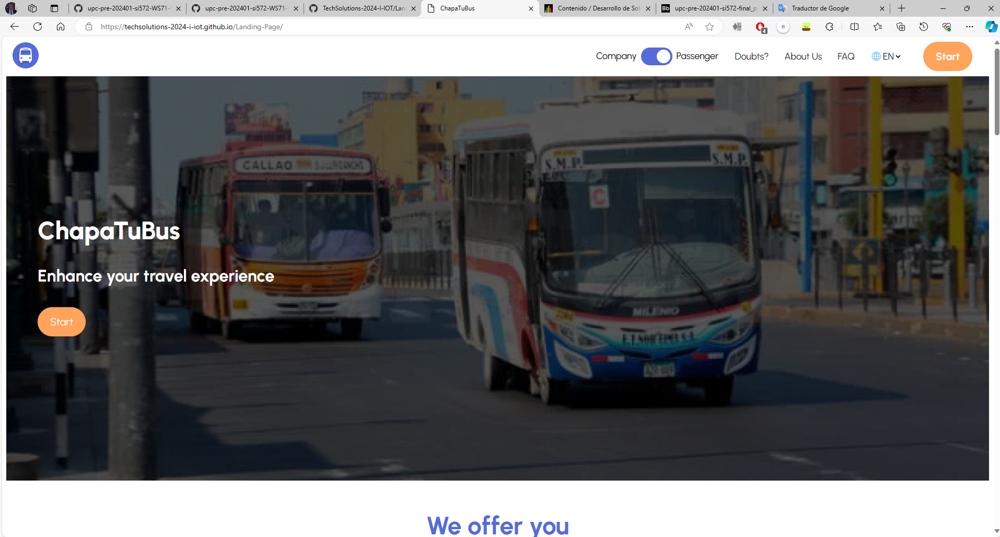   

- **Web Application**

Para el Sprint 1, se avanzó significativamente en el desarrollo del Web Application al implementar las primeras funcionalidades clave. Esto incluyó la creación de la interfaz de usuario inicial, la configuración de la navegación básica y la integración de componentes principales. Además, se llevó a cabo con éxito el despliegue de la primera versión del Web Application en el entorno de producción. Este hito marcó un paso importante hacia el objetivo final del proyecto. Se logró cumplir con los objetivos planteados al inicio del sprint, estableciendo así una base sólida para el desarrollo continuo y la expansión de la aplicación.

     

#### 6.2.1.6. Services Documentation Evidence for Sprint Review.

Para el Sprint 1, se enfocó principalmente en el desarrollo del front-end de la aplicación, y no se abordó el desarrollo del back-end en esta etapa. Como alternativa, los servicios necesarios se implementaron utilizando datos en formato JSON y se alojaron en My JSON Server. Esta decisión permitió avanzar de manera eficiente en el desarrollo del front-end, aprovechando las herramientas disponibles para simular y consumir datos hasta que el back-end esté completamente desarrollado en futuros sprints.

Se creó un repositorio para cada bounded context:

  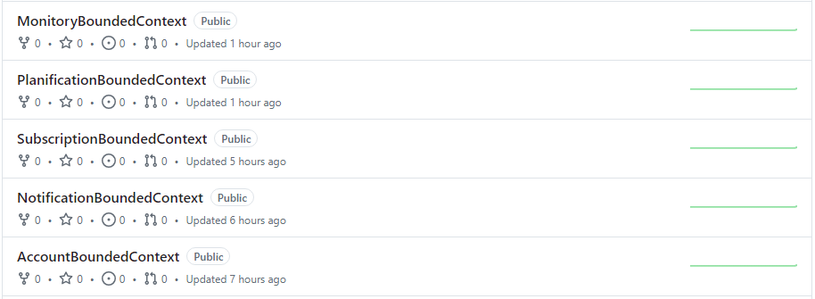 

Cada repositorio cuenta con su respecto "db.json" donde se encuentra información en formato json:

  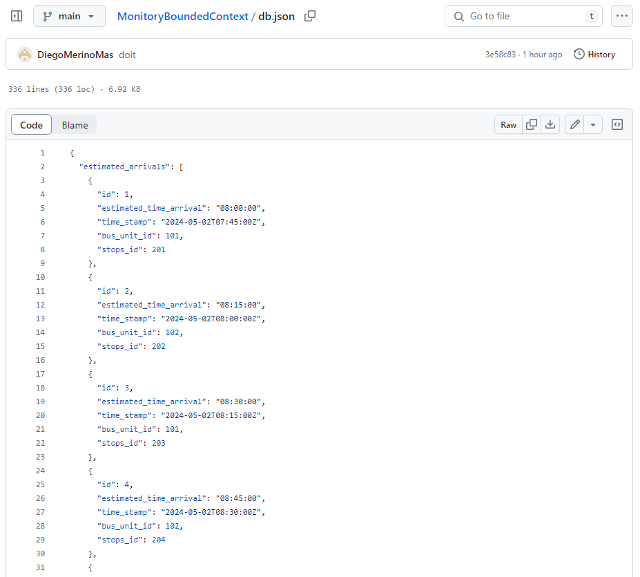   

#### 6.2.1.7. Software Deployment Evidence for Sprint Review.

- **Landing Page**

Para el despliegue de nuestra Landing Page, se eligió Pages pues es una herramienta de GitHub integrada que facilita la publicación de sitios web estáticos directamente desde los repositorios de GitHub. Esto permite una implementación rápida y sencilla sin la necesidad de configurar servidores adicionales ni preocuparse por la infraestructura de alojamiento. Además, Pages es altamente configurable y compatible con dominios personalizados, lo que permite una mayor personalización y profesionalismo en la presentación de nuestro sitio web.

  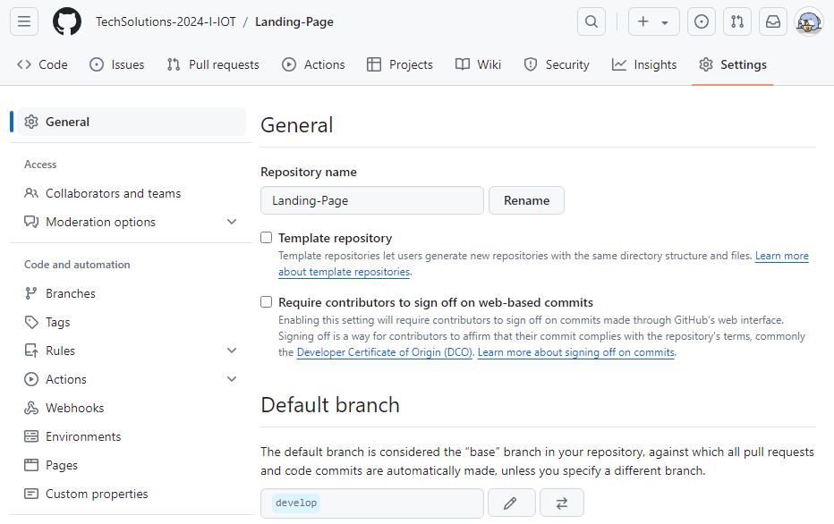

Vamos a Pages y en el apartado de "Build and Deployment" elegimos la rama y la carpeta que deseamos desplegar y le damos a "Save"

  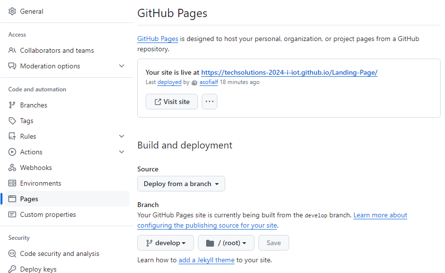

Finalmente se nos muestra el enlace de nuestra Landing Page desplegada con el dominio de GitHub.

  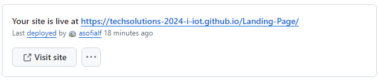

**Enlace de la landing page desplegada**: https://techsolutions-2024-i-iot.github.io/Landing-Page/

- **Web Application**

Para el despliegue de nuestra aplicación web, hemos optado por utilizar Netlify debido a su robustez, facilidad de uso y capacidades de integración continua. Netlify nos brinda un entorno de alojamiento altamente escalable y seguro, lo que garantiza una experiencia de usuario óptima. Además, su integración con repositorios Git permite implementaciones automáticas con cada actualización de código, lo que simplifica considerablemente el proceso de despliegue y facilita la colaboración entre el equipo de desarrollo.

  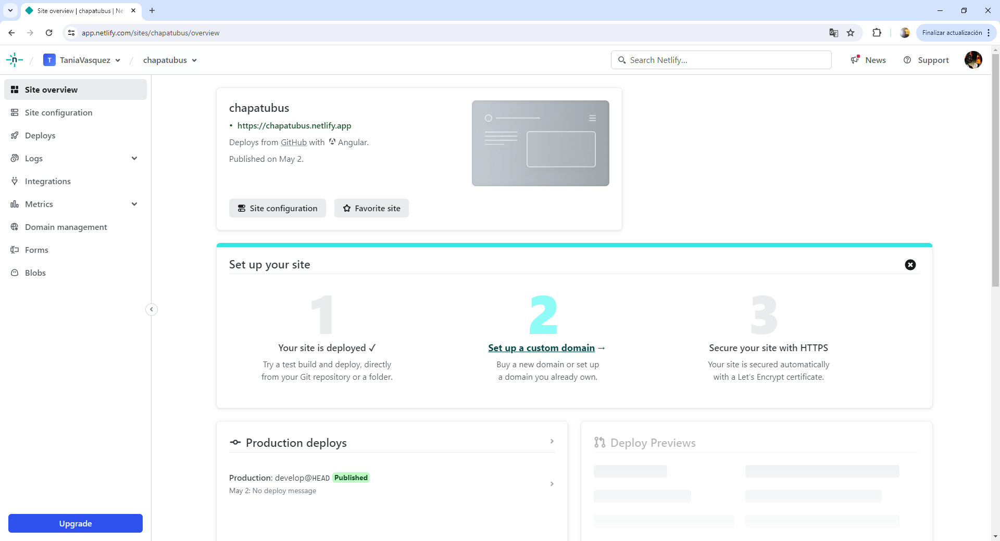
  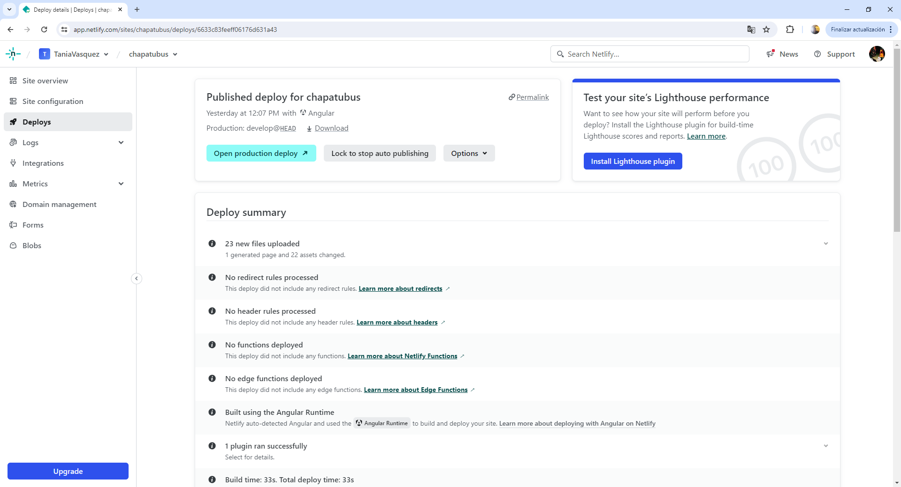

**Enlace de la web application desplegada**: https://chapatubus.netlify.app/

#### 6.2.1.8. Team Collaboration Insights during Sprint.

- **Contributors**

  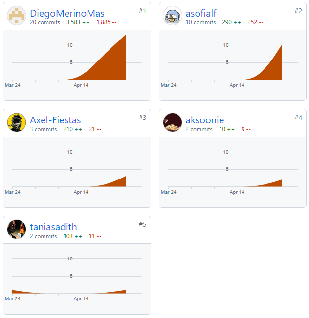
    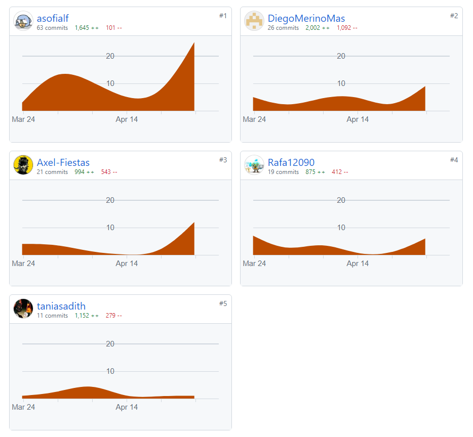

  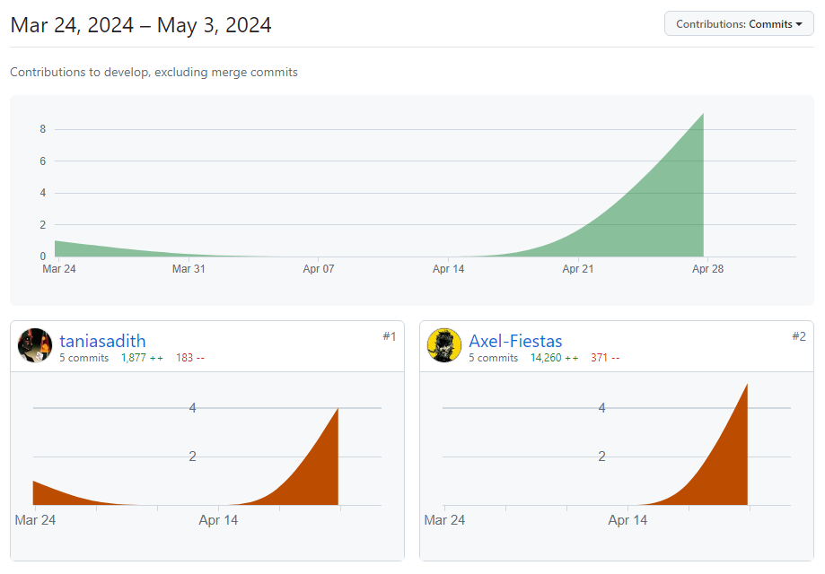

- **Pulse**

  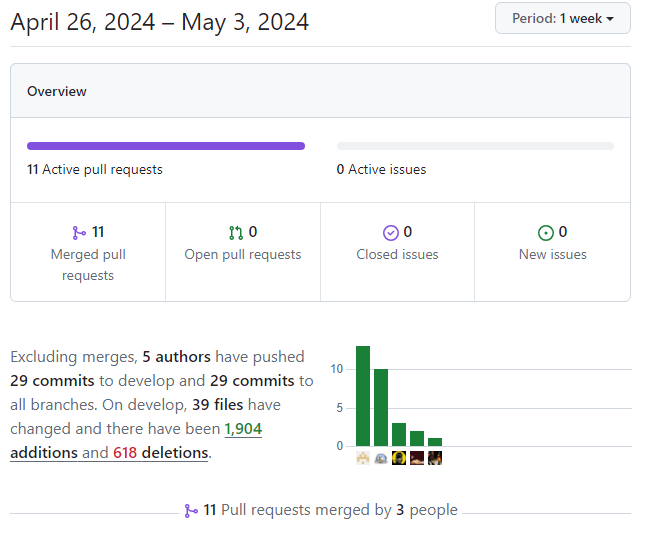
  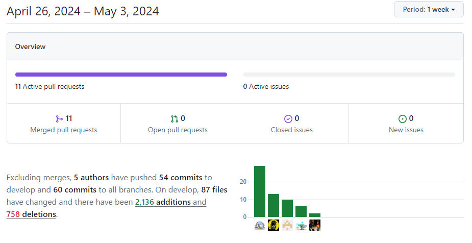

  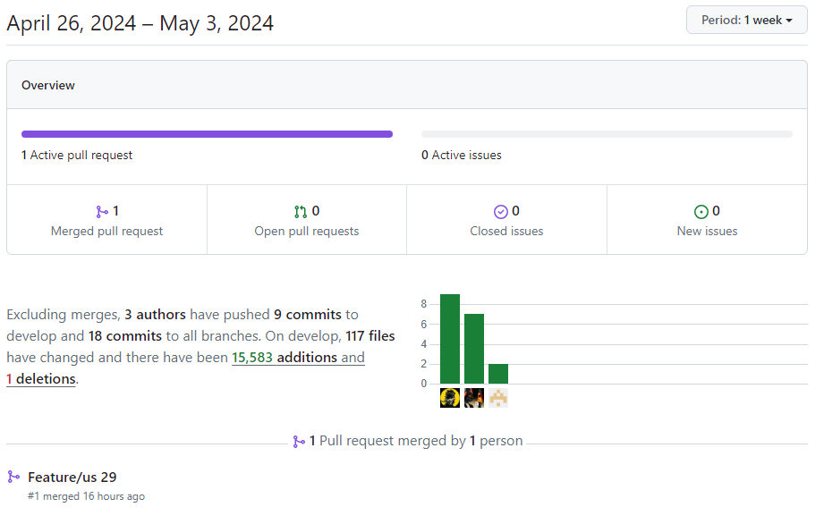

### 6.2.2. Sprint 2

#### 6.2.2.1. Sprint Planning 2.

<table border="2">
    <tr>
        <td>
           
<b>Sprint #</b>

        </td>
        <td>
          
Sprint 2

        </td>
    </tr>
  <tr>
        <td  colspan="2">
           
<b>Sprint Planning Background</b>

        </td>
    </tr>
  <tr>
        <td>
           
Date

        </td>
        <td>
          
20-05-2024

        </td>
    </tr>
  <tr>
        <td>
           
Time

        </td>
        <td>
          
21:00

        </td>
    </tr>
  <tr>
        <td>
           
Location

        </td>
        <td>
          
Reunión virtual vía Discord

        </td>
    </tr>
  <tr>
        <td>
           
Prepared By

        </td>
        <td>
          
Tania Sadith Vasquez Sal Y Rosas

        </td>
    </tr>
  <tr>
        <td>
           
Attendees (to planning meeting)

        </td>
        <td>
          
Tania Sadith Vasquez Sal Y Rosas, Andrea Sofia Alfaro Salinas, Diego Martin Merino Mas, Axel Joshue Fiestas Santisteban, Rafael Wimmer Primo Estrada

        </td>
    </tr>
  <tr>
        <td>
           
Sprint 1 – 2 Review Summary

        </td>
        <td>
          
En los Sprints 1 y 2, nuestro equipo se centró en establecer las bases del proyecto. Los objetivos principales incluyeron la configuración de la infraestructura del proyecto, completar el trabajo de diseño inicial y comenzar el desarrollo de las características fundamentales. Logramos configurar con éxito el entorno de desarrollo, el control de versiones y las canalizaciones de integración continua. Completamos los prototipos de diseño iniciales para la interfaz de usuario y finalizamos los flujos de experiencia del usuario con la aprobación de las partes interesadas. Implementamos el módulo de autenticación de usuarios, incluyendo funcionalidades de registro e inicio de sesión, y comenzamos el desarrollo del tablero principal, logrando un 70% de avance.

        </td>
    </tr>
  <tr>
        <td>
           
Sprint 1 – 2 Retrospective Summary

        </td>
        <td>
          
Lo que salió bien: La fuerte colaboración y comunicación dentro del equipo permitió una resolución eficiente de problemas. Las sesiones regulares de actualizaciones y retroalimentación con las partes interesadas aseguraron la alineación y la rápida resolución de discrepancias de diseño. Lo que se puede mejorar: Mejorar la estimación y asignación de tiempo para las tareas de configuración inicial para evitar retrasos futuros. Establecer un proceso de aprobación de diseño más detallado para minimizar revisiones y alinear expectativas desde el principio. Necesidad de una documentación más completa, especialmente en relación con los procesos de configuración.

        </td>
    </tr>
   <tr>
        <td  colspan="2">
           
<b>Sprint Goal & User Stories</b>

        </td>
    </tr>
   <tr>
        <td>
           
Sprint 2 Goal

        </td>
        <td>
          
Completar el Web Application de nuestro programa, así como el Web Services y mostrar un avance considerable del Mobile Application.

        </td>
    </tr>
  <tr>
        <td>
           
Sprint 2 Velocity

        </td>
        <td>
          
61

        </td>
    </tr>
  <tr>
        <td>
           
Sum of Story Points

        </td>
        <td>
          
61

        </td>
    </tr>
</table>

#### 6.2.2.2. Sprint Backlog 2.

El objetivo principal del sprint 2 es completar el Web Application de nuestro programa, así como el Web Services y mostrar un avance considerable del Mobile Application.

A continuación, se presenta un screenshot del sprint 2 en desarrollo realizado en Jira por el equipo:

  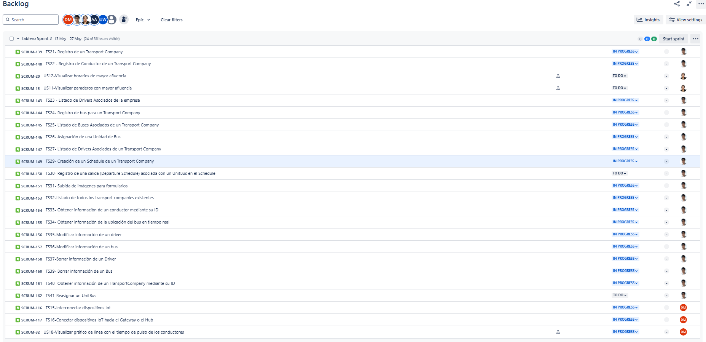

Asimismo, se presenta la tabla de nuestro primer sprint con las respectivas user stories a trabajar:

| Sprint #   | Sprint 2                                                              |     |                                                              |                                                                                                                                     |                    |               |                                               |
| :--------- | :-------------------------------------------------------------------- | :-- | :----------------------------------------------------------- | :---------------------------------------------------------------------------------------------------------------------------------- | :----------------- | :------------ | :-------------------------------------------- |
| User Story | Work-Item /Task                                                       |     |                                                              |                                                                                                                                     |                    |               |                                               |
| Id         | Title                                                                 | Id  | Title                                                        | Description                                                                                                                         | Estimation (Hours) | Assigned To   | Status (To-do / In-Process/ To-Review / Done) |
| TS21       | Registro de un Transport Company                                      | 1   | Registro de empresas de transporte                           | Que un usuario de la plataforma web pueda registrar a su empresa de transporte                                                      | 1                  | Axel Fiestas  | In Progress                                   |
| TS22       | Registro de Conductor de un Transport Company                         | 2   | Registro de conductores de empresas de transporte            | El usuario registrado como manager de la empresa de transporte debe registrar los conductores respectivos con los datos solicitados | 2                  | Axel Fiestas  | In Progress                                   |
| US12       | Visualizar horarios de mayor afluencia                                | 3   | Mostrar los horarios en que hay mayor afluencia de buses     | Mostrar un gráfico estadístico con los horarios de mayor afluencia en cada paradero, para poder ajustar la frecuencia de los buses  | 6                  | Tania Vasquez | To Do                                         |
| US11       | Visualizar paraderos con mayor afluencia                              | 4   | Mostrar los paraderos con más concurrencia                   | Mostrar información sobre los paraderos donde se sube más gente durante el día, para poder identificar las rutas con mayor demanda  | 6                  | Tania Vasquez | To Do                                         |
| TS23       | Listado de Drivers Asociados de la empresa                            | 5   | Listar los conductores asociados a una empresa de transporte | Mostrar de forma ordenada los conductores registrados en la empresa                                                                 | 1                  | Axel Fiestas  | In Progress                                   |
| TS24       | Registro de bus para un Transport Company                             | 6   | Registro de buses para empresas de transporte                | Añadir un bus a la flota de la empresa, después de introducir los datos requeridos                                                  | 1                  | Axel Fiestas  | In Progress                                   |
| TS25       | Listado de Buses Asociados de un Transport Company                    | 7   | Listar los buses asociados a una empresa de transporte       | Mostrar de forma ordenada los buses registrados a la flota de la empresa                                                            | 1                  | Axel Fiestas  | In Progress                                   |
| TS26       | Asignación de una Unidad de Bus                                       | 8   | Asignar una unidad de bus a un conductor                     | Al asignar un conductor a un bus se crea la unidad de bus                                                                           | 2                  | Axel Fiestas  | In Progress                                   |
| TS27       | Listado de Drivers Asociados de un Transport Company                  | 9   | Listar los conductores asociados a una empresa de transporte | Crear un endpoint para devolver los conductores ligados a la empresa con una correcta estructura                                    | 1                  | Axel Fiestas  | In Progress                                   |
| TS29       | Creación de un Schedule de un Transport Company                       | 10  | Crear un horario para una empresa de transporte              | Crear un horario para una empresa de transporte para mejorar la organización de salidas y llegadas                                  | 3                  | Axel Fiestas  | In Progress                                   |
| TS30       | Registro de una salida (Departure Schedule) asociada con              | 11  | Registro de salida de un bus                                 | Registrar la salida de un bus en el horario planificado                                                                             | 2                  | Axel Fiestas  | To Do                                         |
| TS31       | Subida de imágenes para formularios                                   | 12  | Subida de imágenes                                           | Permitir la subida de imágenes en los formularios para documentación visual                                                         | 2                  | Axel Fiestas  | In Progress                                   |
| US18       | Visualizar gráfico de línea con el tiempo de pulso de la              | 13  | Visualizar gráfico del pulso del conductor                   | Mostrar un gráfico de línea con el tiempo de pulso del conductor para monitorear su salud                                           | 4                  | Axel Fiestas  | To Do                                         |
| TS32       | Listado de todos los transport companies existentes                   | 14  | Listar todas las empresas de transporte                      | Listar todas las empresas de transporte registradas en la plataforma                                                                | 1                  | Axel Fiestas  | In Progress                                   |
| TS33       | Obtener información de un conductor                                   | 15  | Obtener información detallada de un conductor                | Obtener información detallada de un conductor por medio de su ID                                                                    | 2                  | Axel Fiestas  | In Progress                                   |
| TS34       | Obtener información de la ubicación del bus en tiempo re              | 16  | Obtener ubicación en tiempo real                             | Obtener la ubicación en tiempo real de los buses mediante GPS                                                                       | 6                  | Axel Fiestas  | To Do                                         |
| TS35       | Modificar información de un driver                                    | 17  | Modificar información de un conductor                        | Modificar datos de un conductor existente en la base de datos                                                                       | 2                  | Axel Fiestas  | In Progress                                   |
| TS36       | Modificar información de un bus                                       | 18  | Modificar información de un bus                              | Modificar datos de un bus existente en la base de datos                                                                             | 2                  | Axel Fiestas  | In Progress                                   |
| TS37       | Borrar información de un Driver                                       | 19  | Borrar información de un conductor                           | Eliminar datos de un conductor de la base de datos                                                                                  | 2                  | Axel Fiestas  | In Progress                                   |
| TS38       | Listado de Schedules Asociados de un TransportCompany                 | 20  | Listar horarios de una empresa de transporte                 | Listar los horarios asociados a una empresa de transporte                                                                           | 2                  | Rafael Primo  | In Progress                                   |
| TS39       | Borrar información de un Bus                                          | 21  | Borrar información de un bus                                 | Eliminar datos de un bus de la base de datos                                                                                        | 2                  | Axel Fiestas  | In Progress                                   |
| TS40       | Obtener información de un TransportCompany med...                     | 22  | Obtener información de una empresa por IoT                   | Obtener datos de una empresa de transporte mediante dispositivos IoT                                                                | 2                  | Axel Fiestas  | In Progress                                   |
| TS41       | Reasignar un UnitBus                                                  | 23  | Reasignar una unidad de bus                                  | Reasignar una unidad de bus a otro conductor o ruta                                                                                 | 2                  | Axel Fiestas  | To Do                                         |
| TS15       | Interconectar dispositivos Iot                                        | 24  | Interconectar dispositivos IoT                               | Configurar la interconexión de dispositivos IoT para la plataforma                                                                  | 2                  | Diego Merino  | To Do                                         |
| TS16       | Conectar dispositivos IoT hacia el Gateway o el Hub                   | 25  | Conectar dispositivos IoT al Gateway                         | Configurar la conexión de dispositivos IoT hacia el Gateway o Hub                                                                   | 2                  | Diego Merino  | To Do                                         |
| US18       | Visualizar gráfico de línea con el tiempo de pulso de los conductores | 26  | Visualizar gráfico del pulso de los conductores              | Mostrar un gráfico de línea con el tiempo de pulso de todos los conductores para monitorear su salud                                | 2                  | Diego Merino  | To Do                                         |

#### 6.2.2.3. Development Evidence for Sprint Review.

Durante este Sprint, realizamos las correcciones previas de la Landing Page, desarrollamos el Web Services, IoT Devices y Mobile Applications.

Para las suites de pruebas, nos enfocamos en la creación de escenarios de prueba utilizando Gherkin debido a la simplicidad de la solución desarrollada. Hemos elaborado casos de prueba exhaustivos que abarcan diferentes aspectos de la Landing Page y la aplicación web, asegurando la calidad y funcionalidad de nuestros productos.

| Repository                 | Branch  | Commit ID | Commit Message                                                                 | Commit Message Body | Commited on (Date) |
| :------------------------- | :------ | :-------- | :----------------------------------------------------------------------------- | :------------------ | :----------------- |
| Frontend                   | develop | c9b6e82   | Merge pull request #6 from TechSolutions-2024-I-IOT/feature/us-30              | -                   | 08/06/2024         |
| Frontend                   | develop | c73006b   | Merge pull request #4 from TechSolutions-2024-I-IOT/feature/us-18              | -                   | 06/06/2024         |
| Backend                    | develop | b44bac6   | Merge pull request #1 from TechSolutions-2024-I-IOT/feature/security           | -                   | 05/06/2024         |
| Backend                    | develop | abff06a   | Merge branch 'feature/TS-12' into feature/security                             | -                   | 05/06/2024         |
| EdgeBackendChapaTuBus      | main    | 459276a   | feat: integration to send information to backend cloud for real time ubication | -                   | 06/06/2024         |
| embedded-system-heart-rate | main    | 44bf0a1   | feat: simple connection and send data to backend edge layer                    | -                   | 02/06/2024         |
| ChapaTuBusApp-Mobile       | main    | fe130b2   | Merge pull request #1 from TechSolutions-2024-I-IOT/develop                    | -                   | 31/05/2024         |

**Network**

  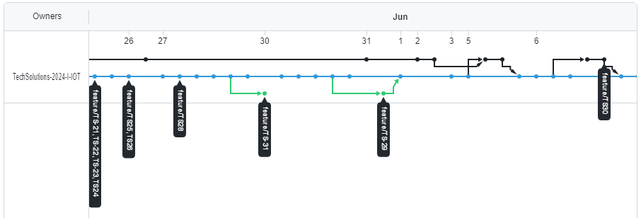   

     

#### 6.2.2.4. Testing Suite Evidence for Sprint Review.

| Repository   | Branch | Commit ID | Commit Message        | Commit Message Body | Commited on (Date) |
| :----------- | :----- | :-------- | :-------------------- | :------------------ | :----------------- |
| TestingSuite | main   | a72257e   | test: update sprint 2 | -                   | 08/06/2024         |

Para la revisión del Sprint 2, presentamos los Testing Suite Evidence, los cuales se desarrollaron utilizando Gherkin. Gherkin proporcionó una forma clara y legible de especificar los comportamientos esperados del sistema a través de escenarios escritos en un lenguaje natural. Esto facilitó la colaboración entre el equipo de desarrollo y los stakeholders al definir y comprender los criterios de aceptación del sprint.

  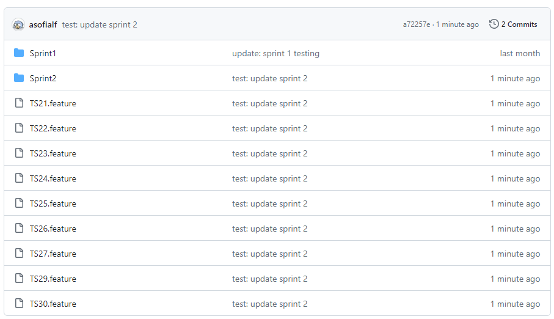   
  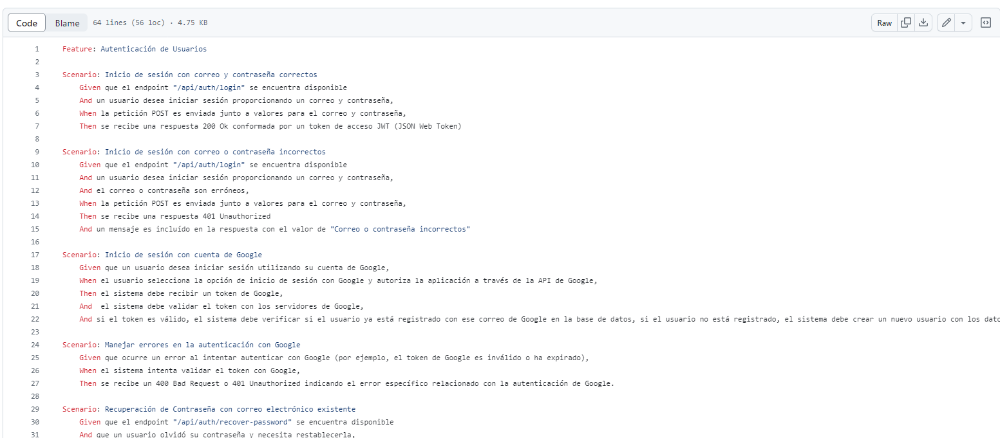

**Enlace del repositorio:** https://github.com/TechSolutions-2024-I-IOT/TestingSuite

#### 6.2.2.5. Execution Evidence for Sprint Review.

- **Landing Page**

Para el Sprint 2, se añadió la sección de planes de pagos para ambos segmentos para así brindar una mayor información a los visitantes.

  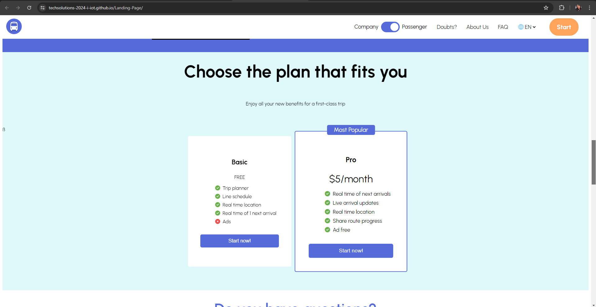   

  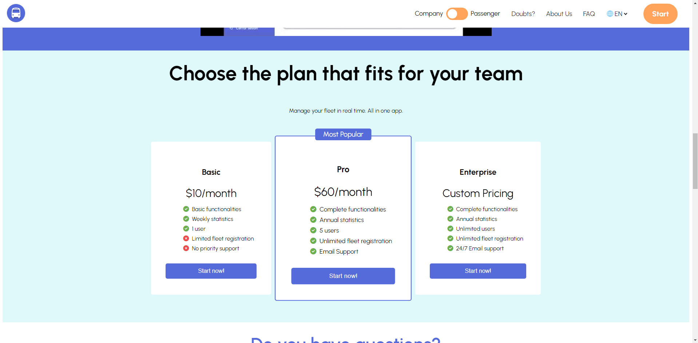   

- **Web Application**

Para el Sprint 2, se añadieron más pantallas relacionadas a nuestro core como la de la administración de los conductores, los buses, el registro de unidades de transporte, la visualización de los gráficos, entre otros.

  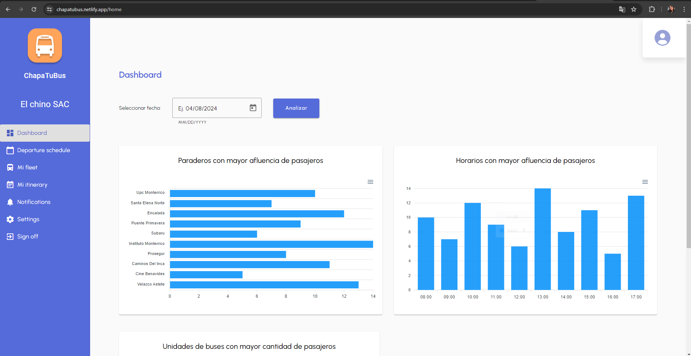   

- **Web Services**

  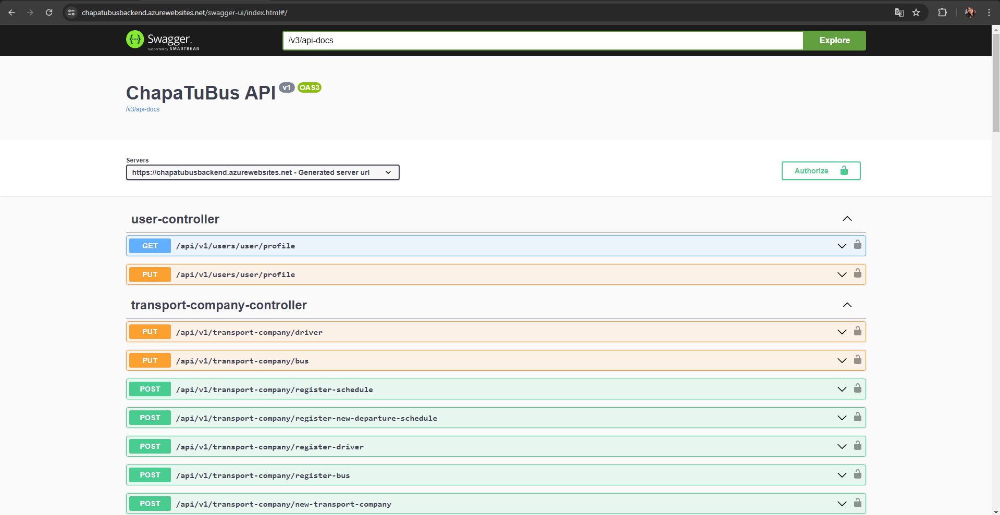   

- **IOT Devices**

  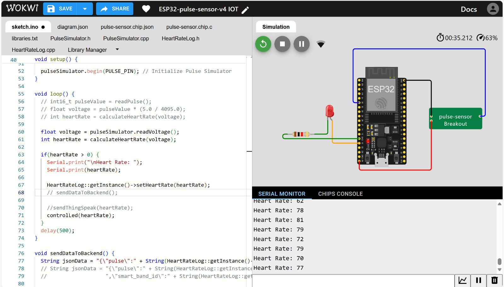   

#### 6.2.2.6. Services Documentation Evidence for Sprint Review.

Para el Sprint 2, se ha proporcionado evidencia visual de la documentación de los servicios desarrollados. A continuación, se presentan las imágenes correspondientes a los controladores implementados durante este sprint:

  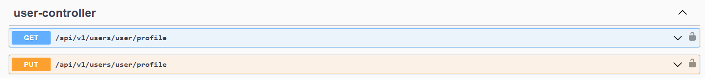   

  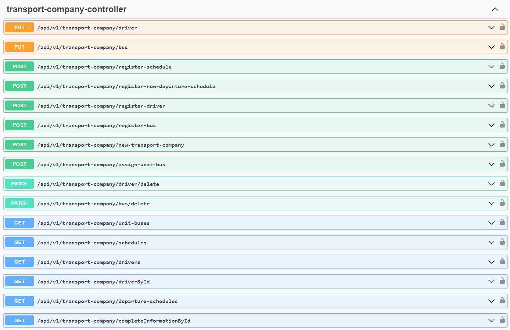   

  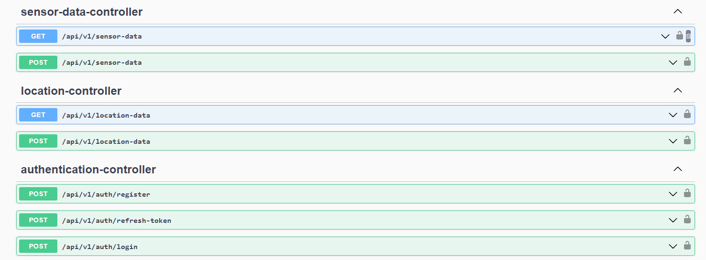   

Estas imágenes muestran la ejecución y estructura de los controladores, reflejando el progreso realizado en la integración y desarrollo de los servicios esenciales para el proyecto.

#### 6.2.2.7. Software Deployment Evidence for Sprint Review.

- **Landing Page**

Para el despliegue de nuestra Landing Page, se eligió Pages pues es una herramienta de GitHub integrada que facilita la publicación de sitios web estáticos directamente desde los repositorios de GitHub. Esto permite una implementación rápida y sencilla sin la necesidad de configurar servidores adicionales ni preocuparse por la infraestructura de alojamiento. Además, Pages es altamente configurable y compatible con dominios personalizados, lo que permite una mayor personalización y profesionalismo en la presentación de nuestro sitio web.

  

Vamos a Pages y en el apartado de "Build and Deployment" elegimos la rama y la carpeta que deseamos desplegar y le damos a "Save"

  

Finalmente se nos muestra el enlace de nuestra Landing Page desplegada con el dominio de GitHub.

  

**Enlace de la landing page desplegada**: https://techsolutions-2024-i-iot.github.io/Landing-Page/

- **Web Application**

Para el despliegue de nuestra aplicación web, hemos optado por utilizar Netlify debido a su robustez, facilidad de uso y capacidades de integración continua. Netlify nos brinda un entorno de alojamiento altamente escalable y seguro, lo que garantiza una experiencia de usuario óptima. Además, su integración con repositorios Git permite implementaciones automáticas con cada actualización de código, lo que simplifica considerablemente el proceso de despliegue y facilita la colaboración entre el equipo de desarrollo.

  
  

**Enlace de la web application desplegada**: https://chapatubus.netlify.app/

- **Web Services**

Para el despliegue de nuestros servicios web, hemos optado por utilizar Azure debido a su robustez, flexibilidad y amplio conjunto de herramientas integradas. Azure nos proporciona un entorno de alojamiento altamente escalable y seguro, lo que garantiza un rendimiento confiable para nuestros servicios. Además, su integración con repositorios Git y otras herramientas de desarrollo permite implementaciones automáticas con cada actualización de código, simplificando así el proceso de despliegue y fomentando la colaboración entre el equipo de desarrollo. Con Azure, tenemos la confianza de que nuestros servicios estarán disponibles de manera consistente y ofrecerán una experiencia óptima para nuestros usuarios.

  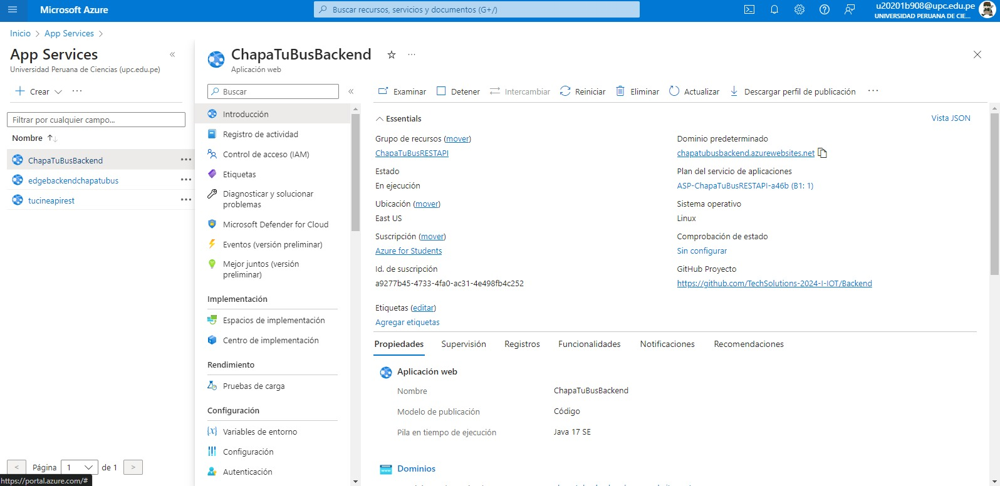

**Enlace del web service desplegado**: https://chapatubusbackend.azurewebsites.net/swagger-ui/index.html#/

- **IOT Edge Backend**

Para nuestro backend de IoT Edge, hemos elegido Azure debido a su potente conjunto de herramientas diseñadas específicamente para escenarios de IoT. Azure nos proporciona una plataforma sólida y escalable para desplegar y administrar nuestros dispositivos de borde de manera eficiente. La integración con Azure IoT Hub nos permite gestionar de forma centralizada la conectividad, la seguridad y la supervisión de nuestros dispositivos, lo que garantiza un funcionamiento confiable en todo momento. Además, la capacidad de implementar módulos personalizados en los dispositivos de borde nos brinda la flexibilidad necesaria para adaptar nuestro backend a las necesidades específicas de nuestro proyecto. Con Azure, tenemos la confianza de que nuestro backend de IoT Edge funcionará de manera óptima y segura, proporcionando una base sólida para nuestras soluciones de IoT.

  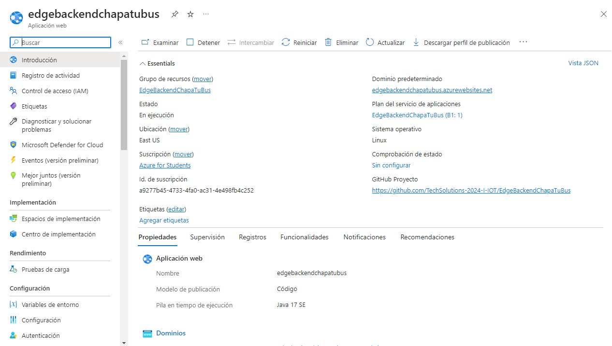

**Enlace del IOT Edge Backend desplegado**: https://edgebackendchapatubus.azurewebsites.net/swagger-ui/index.html

#### 6.2.2.8. Team Collaboration Insights during Sprint.

- **Contributors**

  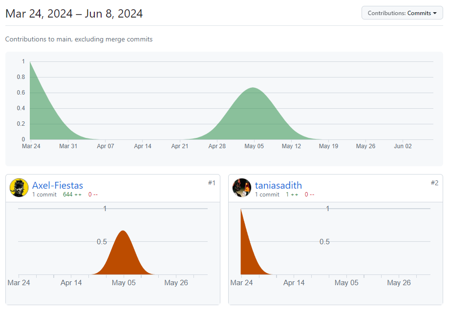
    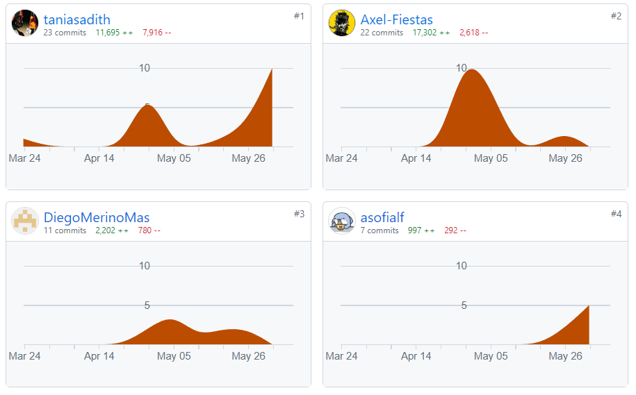

  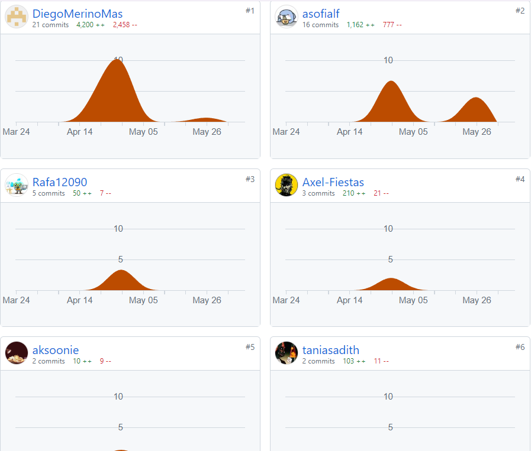
    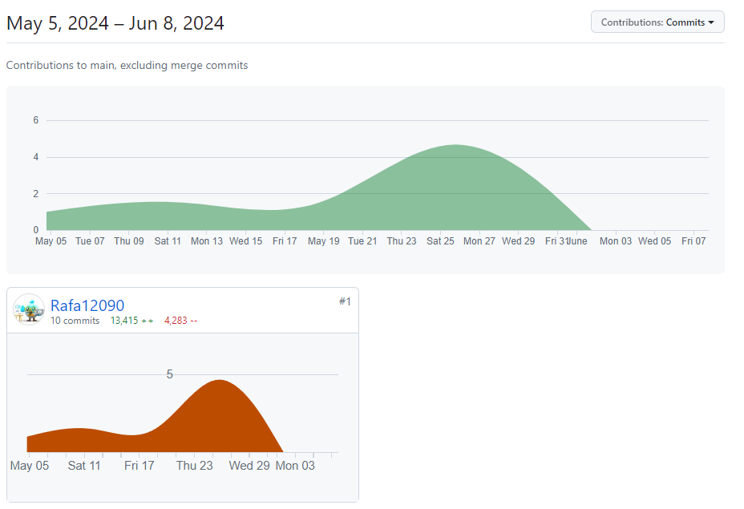

- **Pulse**

  
  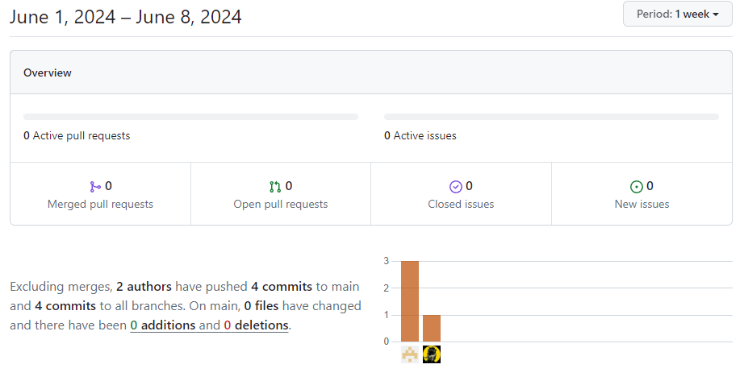

### 6.2.3. Sprint 3

#### 6.2.3.1. Sprint Planning 3.

#### 6.2.3.2. Sprint Backlog 3.

#### 6.2.3.3. Development Evidence for Sprint Review.

#### 6.2.3.4. Testing Suite Evidence for Sprint Review.

#### 6.2.3.5. Execution Evidence for Sprint Review.

#### 6.2.3.6. Services Documentation Evidence for Sprint Review.

#### 6.2.3.7. Software Deployment Evidence for Sprint Review.

#### 6.2.3.8. Team Collaboration Insights during Sprint.

## 6.3. Validation Interviews.

### 6.3.1. Diseño de Entrevistas.

- Preguntas de Validación para Administradores de Flota de Buses

_Sobre la Landing Page_

1. ¿La landing page explica claramente cómo ChapaTuBus puede beneficiar a los administradores de flota?
2. ¿Qué tan fácil fue para ti encontrar la información que buscabas en la landing page?
3. ¿Es fácil de entender el propósito de la aplicación desde la landing page?
4. ¿Qué te pareció el diseño y la navegación de la landing page?
5. ¿Hay alguna información que te gustaría ver en la landing page que no está actualmente?

_Sobre la Aplicación_

1. ¿Qué tan fácil te resultó registrar tu empresa y crear un perfil en la aplicación?
2. ¿Cómo evaluas la funcionalidad de monitoreo en tiempo real del estado de los conductores?
3. ¿Encontraste útil la información sobre la velocidad de los buses?
4. ¿La funcionalidad de consulta de horarios y paraderos con mayor afluencia es clara y accesible?
5. ¿Qué tan preciso encontraste el monitoreo del aforo de los buses basado en los sensores de peso?
6. ¿Hubo algún aspecto de la aplicación que te resultó confuso o difícil de usar?
7. ¿Qué características adicionales te gustaría ver en la aplicación para administradores de flota?

- Preguntas de Validación para Pasajeros

_Sobre la Landing Page_

1. ¿Qué opinas de la información presentada en la página principal de ChapaTuBus?
2. ¿Es fácil de entender el propósito de la aplicación desde la landing page?
3. ¿Qué te pareció el diseño y la navegación de la landing page?
4. ¿Hay alguna información que te gustaría ver en la landing page que no está actualmente?

_Sobre la Aplicación_

1. ¿Qué tan fácil te resultó iniciar sesión y personalizar tu perfil en la aplicación?
2. ¿Qué tan útil te resultó la funcionalidad de tiempo estimado de llegada de los buses?
3. ¿Cómo evaluas la función de guardar destinos frecuentes y consultar rutas?
4. ¿Las alertas de buses llenos fueron útiles y claras?
5. ¿Qué tan intuitiva te pareció la funcionalidad del mapa interactivo para localizar paraderos y trazar rutas?
6. ¿Hubo algún aspecto de la aplicación que te resultó confuso o difícil de usar?
7. ¿Qué características adicionales te gustaría ver en la aplicación para pasajeros?

### 6.3.3. Evaluaciones según heurísticas.

**UX Heuristics & Principles Evaluation**
**Usability – Inclusive Design – Information Architecture**

**CARRERA** : Ingeniería de Software
**CURSO** : Desarrollo de Soluciones IoT
**SECCIÓN** : Código de la sección
**PROFESORES** : Todos
**AUDITOR** : TechSolutions
**CLIENTE(S)** :

**SITE o APP A EVALUAR:** ChapaTuBus

**TAREAS A EVALUAR:**

El alcance de esta evaluación incluye la revisión de la usabilidad de las siguientes tareas:

1. Registro de un usuario nuevo
2. Inicio de sesión
3. Navegación por el panel principal
4. Creación de un nuevo vehículo en la flota
5. Asignación de conductores a vehículos
6. Monitoreo en tiempo real de la flota

No están incluidas en esta versión de la evaluación las siguientes tareas:

1. Integración con sistemas de terceros
2. Módulo de mantenimiento de vehículos
3. Gestión de permisos y roles avanzados
4. Exportación de datos a formatos externos

**ESCALA DE SEVERIDAD:**
Los errores serán puntuados tomando en cuenta la siguiente escala de severidad

| Nivel | Descripción                                                                                                                                                                                    |
| :---- | :--------------------------------------------------------------------------------------------------------------------------------------------------------------------------------------------- |
| 1     | Problema superficial: puede ser fácilmente superador por el usuario u ocurre con muy poco frecuencia. No necesita ser arreglado a no ser que exista disponibilidad de tiempo                   |
| 2     | Problema menor: puede ocurrir un poco más frecuentemente o es un poco más difícil de superar para el usuario. Se le debería asignar una prioridad baja resolverlo de cara al siguiente reléase |
| 3     | Problema mayor: ocurre frecuentemente o los usuarios no son capaces de resolverlos. Es importante que sean corregidos y se les debe asignar una prioridad alta.                                |
| 4     | Problema muy grave: un error de gran impacto que impide al usuario continuar con el uso de la herramienta. Es imperativo que sea corregido antes del lanzamiento.                              |

**TABLA RESUMEN:**

| #   | Problema                                   | Escala de severidad | Heurística/Principio violada(o)           |
| :-- | :----------------------------------------- | :------------------ | :---------------------------------------- |
| 1   | Dificultad para agregar paradas a la línea | 3                   | Consistencia y estándares                 |
| 2   | Tedioso asignar conductores a vehículos    | 3                   | Minimizar la carga de memoria del usuario |
| 3   | Complejidad en la asignación de horarios   | 4                   | Eficiencia y flexibilidad de uso          |

**DESCRIPCIÓN DE PROBLEMAS:**

- **PROBLEMA #1:**

Severidad: 3

Heurística violada: Consistencia y estándares

Problema: El proceso para agregar paradas a la línea es confuso y requiere varios pasos innecesarios, lo que dificulta completar la tarea correctamente.

  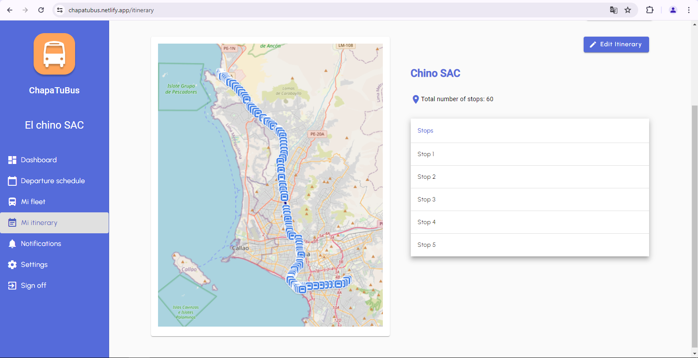

Recomendación: Simplificar el flujo para agregar paradas, asegurando que el proceso sea intuitivo y directo, con etiquetas claras y consistentes.

- **PROBLEMA #2:**

Severidad: 3

Heurística violada: Minimizar la carga de memoria del usuario

Problema: Asignar conductores a vehículos es un proceso tedioso que requiere navegar por múltiples menús y recordar información específica sobre los conductores y vehículos.

  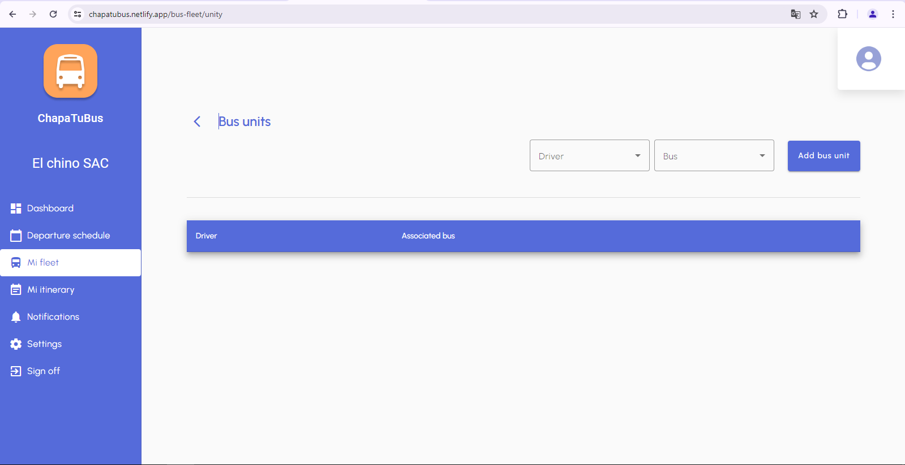

Recomendación: Rediseñar la interfaz de asignación para permitir una selección más rápida y fácil, posiblemente utilizando listas desplegables y autocompletado para minimizar la carga de memoria del usuario.

- **PROBLEMA #3:**

Severidad: 4

Heurística violada: Eficiencia y flexibilidad de uso

Problema: La asignación de horarios es compleja y no permite flexibilidad, con una interfaz que no es intuitiva y requiere muchos clics y confirmaciones.

  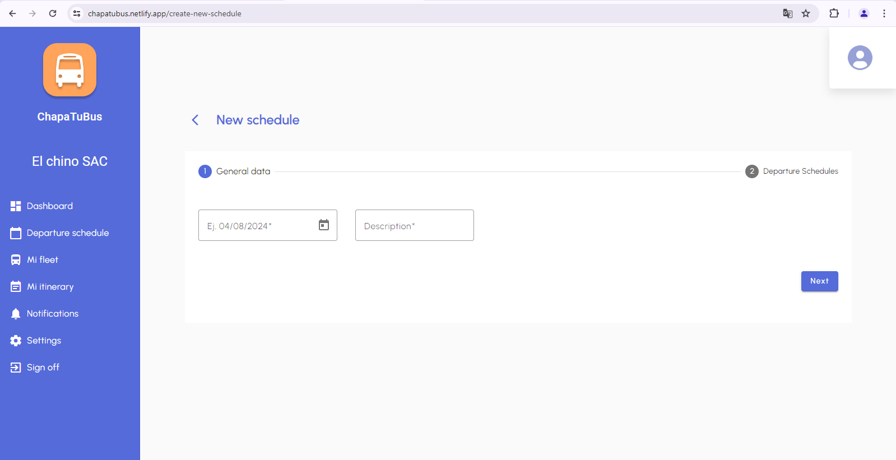

  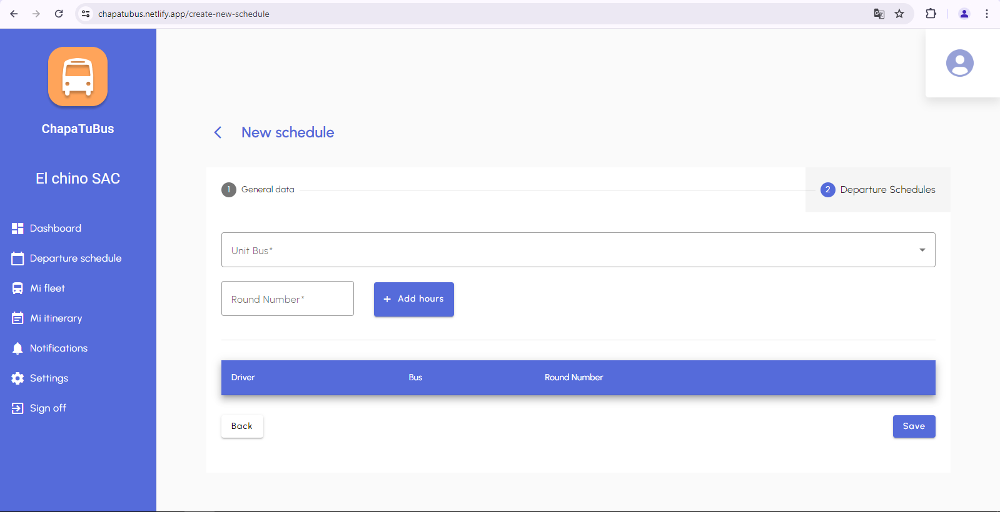

Recomendación: Simplificar y optimizar la interfaz para la asignación de horarios, permitiendo arrastrar y soltar y proporcionando plantillas predefinidas para agilizar el proceso.

## 6.4. Video About-the-Product.

A continuación, se presenta el video About The Product. Este tiene como objetivo presentar nuestro producto al público, por lo que en él se mostrarán las principales características con las que cuenta ChapaTuBus, la version Web. Captura de pantalla del video:

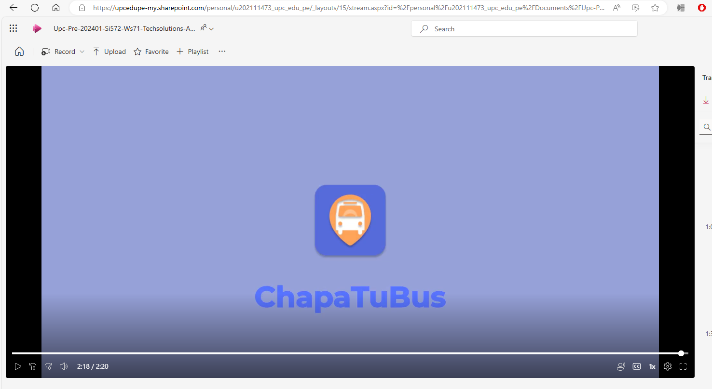

Link: https://upcedupe-my.sharepoint.com/:v:/g/personal/u202111473_upc_edu_pe/EUDbaT99xI9LpvWFVjHJ10QBDVPKtxGeaNsIF9OZUZxs3w?e=iykH72&nav=eyJyZWZlcnJhbEluZm8iOnsicmVmZXJyYWxBcHAiOiJTdHJlYW1XZWJBcHAiLCJyZWZlcnJhbFZpZXciOiJTaGFyZURpYWxvZy1MaW5rIiwicmVmZXJyYWxBcHBQbGF0Zm9ybSI6IldlYiIsInJlZmVycmFsTW9kZSI6InZpZXcifX0%3D
