# Capítulo VI: Product Implementation, Validation & Deployment

## 6.1. Software Configuration Management

### 6.1.1. Software Development Environment Configuration.

- **Project Management**:

  Para las actividades de Project Management se ha elegido hacer uso de Jira que es una herramienta de gestión de trabajo para los equipos de software que deben organizar y hacer un seguimiento de su trabajo. Se eligió
  esta herramienta por su flexibilidad y porque nos brinda la opción de personalizarla de acuerdo al flujo de trabajo del equipo.

  **Enlace:** https://www.atlassian.com/es/software/jira

- **Requirements Management**

  Para el manejo de requerimientos se eligió Pivotal Tracker pues es una herramienta gratuita de gestión de proyectos ágiles que se enfoca en la gestión de la pila de producto y métricas como la velocidad.
  Es esencial para nosotros como equipo pues nos permite trabajar de manera descentralizada.

  **Enlace:** https://www.pivotaltracker.com/

- **Product UX/UI Design**

  Para temas de diseño UX/UI de nuestro producto se eligió Figma pues es una herramienta donde podemos crear distintos conceptos como wireframes, diseños de webs y diseños de aplicaciones de manera gratuita. Nos es útil
  ya que nos brinda un amplio menú de funcionalidades y utilidades.

  **Enlace:** https://www.figma.com

- **Software Development**

  Para el desarrollo de software, se han elegido las siguientes herramientas:

  Para el desarrollo de nuestra Landing Page, Web Application y Mobile Application se eligió **Visual Studio Code** pues es un software de amplia compatibilidad con lenguajes y frameworks y potentes herramientas de depuración y pruebas.
  Además de que cuenta con integración nativa con Git y control de versiones y se adapta a nuestras necesidades.

  **Enlace**: https://visualstudio.microsoft.com/es/#vscode-section

  Para el desarrollo de nuestro Backend Service se eligió **IntelliJ IDEA** pues nos permite dedicar más tiempo a diseñar y crear productos, en lugar de a repetir código, identificar errores y resolverlos. Nos ayuda a
  trabajar de manera más eficaz y cuenta con una interfaz intuitiva.

  **Enlace**: https://www.jetbrains.com/idea/

- **Software Testing**

  En relación a Testing, se ha decidido usar las siguientes herramientas:

  Para el testing de la aplicación web, se eligió **SELENIUM IDE**, puesto que es una herramienta de código abierto con la cual resulta sencillo realizar casos de prueba.

  **Enlace**: https://chromewebstore.google.com/detail/selenium-ide/mooikfkahbdckldjjndioackbalphokd

  Para el testing de nuestro backend se decidieron utilizar **JUnit** y **Mockito** debido a que son bibliotecas populares de SpringBoot que permiten realizar un testing rápido y eficiente.

  **Enlace**:https://junit.org/junit5/
  **Enlace**:https://site.mockito.org/

- **Software Deployment**

  Para el deployment de nuestras soluciones hemos decidio usar:

  **Github pages** para el despliegue de nuestra Landing Page pues soporta sitios web estáticos y es gratuito.

  **Enlace**: https://pages.github.com/

  **Netlify** para el despliegue de nuestra Web Application pues es una plataforma intuitiva y fácil de usar.

  **Enlace**: https://www.netlify.com/

  **Render** para el despliegue de nuestro backend pues nos brinda un hosting rápido, sencillo e intuitivo.

  **Enlace:** https://render.com/

- **Software Documentation**

  La documentación de nuestro software desde el punto de vista de desarrollador será realizada en **Github** a través de un readme (informe), se usará github puesto que es una plataforma de código gratuita y con gran uso en el mundo del software.

  **Enlace:** https://github.com/

### 6.1.2. Source Code Management.

**Repositorios**

Se creó una organización llamada TechSolutions-2024-I-IOT en Github, en la cual el equipo cuenta con los repositorios donde se trabajarán las soluciones propuestas.

Enlace de la organización: https://github.com/TechSolutions-2024-I-IOT

<table border="2">
    <tr>
        <td>
           
<b>Solución</b>

        </td>
        <td>
          
<b>Nombre del repositorio</b>

        </td>
        <td>
          
<b>Enlace</b>

        </td>
    </tr>
  <tr>
        <td>
           
Landing Page

        </td>
        <td>
          
Landing-Page

        </td>
        <td>
          
https://github.com/TechSolutions-2024-I-IOT/Landing-Page.git

        </td>
    </tr>
  <tr>
        <td>
           
Frontend Web Application

        </td>
        <td>
          
Frontend

        </td>
        <td>
          
https://github.com/TechSolutions-2024-I-IOT/Frontend.git

        </td>
    </tr>
  <tr>
        <td>
           
Web Services

        </td>
        <td>
          
Backend

        </td>
        <td>
          
https://github.com/TechSolutions-2024-I-IOT/Backend.git

        </td>
    </tr>
  <tr>
        <td>
           
Mobile Application

        </td>
        <td>
          
ChapaTuBus-Mobile

        </td>
        <td>
          
https://github.com/TechSolutions-2024-I-IOT/ChapaTuBus-Mobile.git

        </td>
    </tr>
</table>

**Gitflow**

  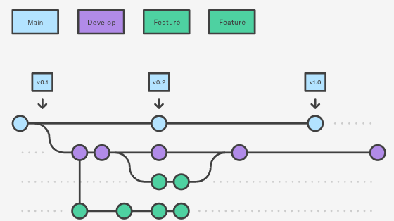

Para la implementación del flujo de trabajo Gitflow, usando la herramienta de control de versiones Git, se usó de referencia la entrada de blog “A successful Git branching model” de Vincent Driessen, que nos ayudó a detallar las siguientes convenciones que se usarán en el proyecto:

- **Main branch**
  La Main branch es la principal rama de desarrollo del proyecto. En esta rama se encontrará el código que se encuentra actualmente en producción.
  **Notación:** main

- **Develop branch**
  La Develop branch será la rama que contendrá las últimas actualizaciones y cambios agregados que se entregarán en la siguiente versión del proyecto.
  **Notación:** develop
  **Creación:** git checkout -b develop main

- **Feature branches**
  Las Feature branches se usarán para desarrollar nuevas características del producto que se agregarán en versiones futuras. Estas funcionalidades se deberán reunir o juntar eventualmente a la rama Develop.

  - Debe derivarse de la rama Develop.
  - Debe fusionarse de vuelta a la rama Develop.
    **Notación:** feature/[name of feature]
    **Creación:** git checkout -b feature/[name of feature] develop

- **Conventional Commits**
  Para la redacción de las siguientes convenciones de commits se utilizó de referencia el artículo Conventional Commits 1.0.0.

Types:

- add: se usará para indicar que se añadieron archivos o carpetas.
- fix: este tipo de commit se utilizará para la confirmación de una corrección de un error en el código.
- feat: este tipo de commit se utilizará para la confirmación de que se ha añadido una nueva funcionalidad.
- test: se usará para indicar que se añadieron archivos de test .
- docs: se usará para indicar que se añadieron actualizaciones a la documentación
- BREAKING CHANGE: este tipo de commit se utilizará para confirmar la introducción de un cambio importante en el código.

### 6.1.3. Source Code Style Guide & Conventions.

### Guía de Estilo y convenciones de codificación HTML

Para las convenciones de codificación HTML, adoptaremos las pautas delineadas en las referencias "Guía de Estilo y Convenciones de Codificación HTML" y "Guía de Estilo HTML/CSS de Google". Aquí algunos puntos clave:

**Convenciones de Nomenclatura:**

- Aplicar nomenclatura en inglés
- Utilizar letras minúsculas para todos los nombres de elementos HTML.
- Separar palabras en nombres de ID y clases con guiones (-).
- Utilizar nombres significativos y descriptivos para IDs y clases.

**Formato:**

- Sangrar elementos anidados para mejorar la legibilidad.
- Utilizar comillas dobles para los valores de atributos.
- Emplear etiquetas auto-cerradas para elementos.

**Comentarios:**

- Agregar comentarios para explicar secciones complejas o proporcionar contexto a futuros desarrolladores.
- Utilizar la sintaxis de comentarios HTML <!-- -->.

### Guía de Estilo y convenciones de codificación CSS

Para las convenciones de codificación CSS, seguiremos las pautas proporcionadas en la referencia "Google HTML/CSS Style Guide". Aquí tienes algunos puntos clave:

**Convenciones de nomenclatura:**

- Aplicar nomenclatura en inglés
- Usa letras minúsculas para todos los selectores CSS y nombres de propiedades.
- Separa palabras en nombres de clases con guiones (-).
- Utiliza nombres significativos y descriptivos para las clases.

**Formato:**

- Indenta estilos anidados para mejorar la legibilidad.
- Utiliza un estilo de indentación consistente, como dos espacios.
- Usa propiedades abreviadas cuando sea posible para mantener el código conciso.

**Comentarios:**

- Agrega comentarios para explicar estilos complejos o proporcionar contexto para futuros desarrolladores.
- Utiliza la sintaxis de comentarios CSS /\* \*/.

### Guía de Estilo y convenciones de codificación JavaScript/TypeScript

Para las convenciones de codificación JavaScript/TypeScript, adoptaremos las pautas proporcionadas en las referencias "Google JavaScript Style Guide" y "Google TypeScript Style Guide". Aquí tienes algunos puntos clave:

**Convenciones de nomenclatura:**

- Aplicar nomenclatura en inglés
- Utiliza camelCase para nombres de variables y funciones.
- Utiliza PascalCase para nombres de clases.
- Utiliza letras mayúsculas para constantes.

**Formato:**

- Utiliza un estilo de indentación consistente, como dos o cuatro espacios.
- Utiliza punto y coma al final de las sentencias.
- Evita el uso de variables globales siempre que sea posible.

**Comentarios:**

- Agrega comentarios para explicar lógica compleja o proporcionar contexto para futuros desarrolladores.
- Utiliza la sintaxis de comentarios JavaScript/TypeScript // para comentarios de una sola línea y /\* \*/ para comentarios de varias líneas.

### Guía de Estilo y convenciones de codificación Java

Para las convenciones de codificación Java, nos adheriremos a las pautas descritas en la referencia "Google Java Style Guide". Aquí tienes algunos puntos clave:

**Convenciones de nomenclatura:**

- Aplicar nomenclatura en inglés
- Utiliza camelCase para nombres de variables y métodos.
- Utiliza PascalCase para nombres de clases.
- Utiliza letras mayúsculas para constantes.

**Formato:**

- Utiliza un estilo de indentación consistente, como cuatro espacios.
- Coloca las llaves de apertura en la misma línea que la declaración.
- Utiliza nombres significativos para variables y métodos para mayor claridad.

**Comentarios:**

- Agrega comentarios para explicar algoritmos complejos o proporcionar contexto para futuros desarrolladores.
- Utiliza la sintaxis de comentarios Java // para comentarios de una sola línea y /\* \*/ para comentarios de varias líneas.

### 6.1.4. Software Deployment Configuration.

**Despliegue de la landing page en GitHub Pages**

- Ir a la configuración del repositorio

  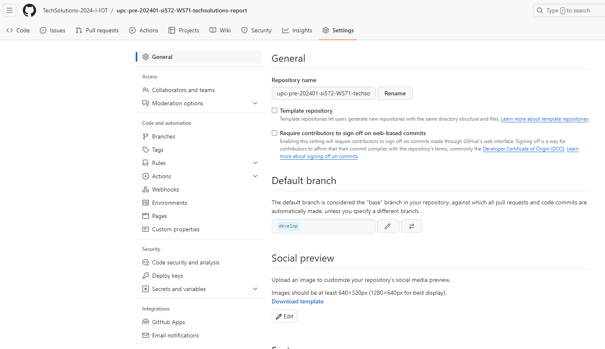

- Seleccionar la opción "Pages"

- Elegir la rama que se desea desplegar y dar click en "Save"

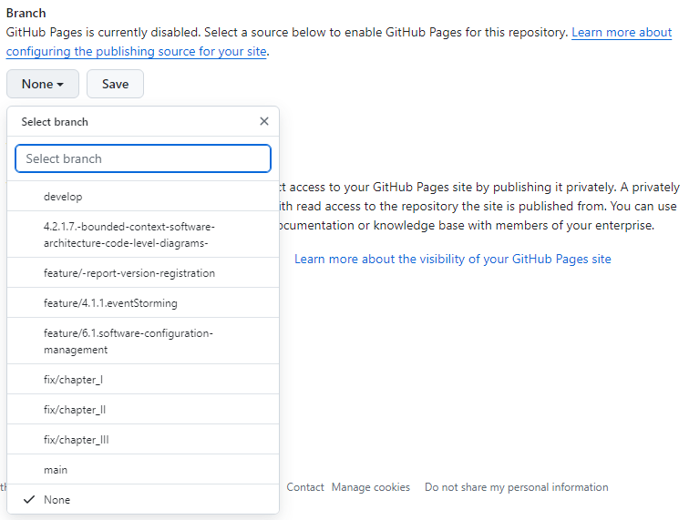

- Luego de unos segundos se mostrará el enlace de la página en la parte superior

[Enlace a nuestro landing page desplegado](https://techsolutions-2024-i-iot.github.io/chapatubus-landingpage.github.io/)

**Despliegue de web application en netlify**

- Elegimos la opción "Add new site"

  
  

  
- Elegimos importar un projecto existente

  
  

  
- Seleccionamos la opción "Deploy with github"
  

  
  

   
- Elegimos el repositorio

  
  

  
- Revisamos las configuraciones

  
  

   
- Damos click en deploy

**Despliegue de web service en railway**

**Paso 1: Crear un esquema de MySQL en railway**

- Seleccionar Start a New Project

  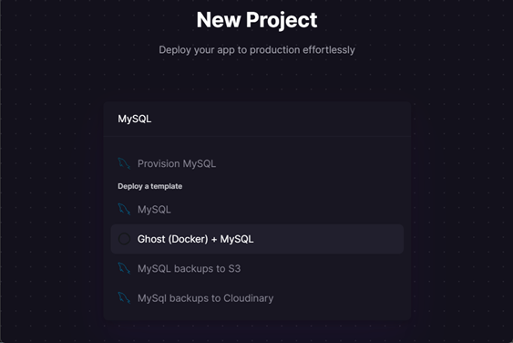
    

  
- Buscar MySql y seleccionarlo

  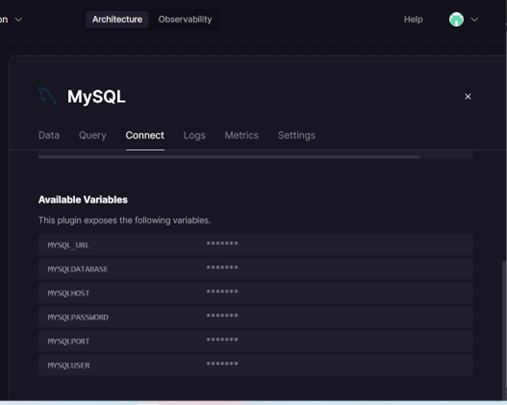
    

   
- Se crea la instancia y luego se selecciona en Connect, donde se encontrarán las variables para poder conectarnos a la base de datos.

  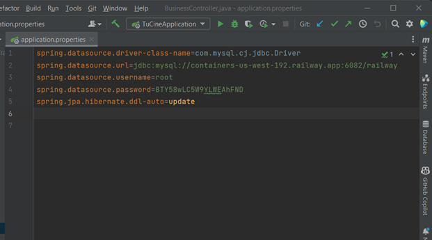
    

**Paso 2: Despliegue de la API**

- En el mismo entorno con click derecho y seleccionamos GitHub Repo

  
    

   
- Luego de ello nos abrirá una ventana pop-up y seleccionaremos el repositorio que queremos desplegar
  
- Luego vamos Settings y generamos el dominio de nuestro servicio

  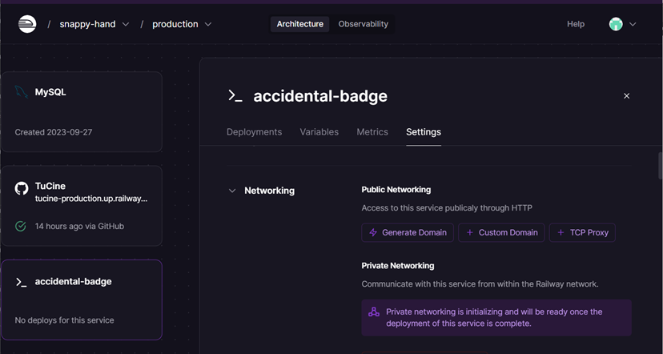
    

  
- En la sección Git Repository podemos elegir la rama desde donde queremos que se haga el deploy. Los cambios realizados en esta rama de GitHub se enviarán automáticamente a este entorno.

**Despliegue de mobile application en Firebase**

- Lo primero que debemos hacer es registrar nuestra aplicación en Firebase.

  
   

  
- Seleccionamos el tipo de aplicación que deseamos desplegar.

  
   

- Vamos a seleccionar la opción de Hosting en el menú lateral izquierdo.

  
   

- Procedemos a instalar el CLI de Firebase

  
   

- El siguiente paso será situarnos en la carpeta de nuestro proyecto, autenticarnos e inicializarlo.
- Una vez hayamos inicializado firebase el siguiente paso será realizar el deploy. Para ello ejecutamos el siguiente comando.

  
   

  
## 6.2. Landing Page, Services & Applications Implementation.

### 6.2.1. Sprint 1

#### 6.2.1.1. Sprint Planning 1.

<table border="2">
    <tr>
        <td>
           
<b>Sprint #</b>

        </td>
        <td>
          
Sprint 1

        </td>
    </tr>
  <tr>
        <td  colspan="2">
           
<b>Sprint Planning Background</b>

        </td>
    </tr>
  <tr>
        <td>
           
Date

        </td>
        <td>
          
29-04-2024

        </td>
    </tr>
  <tr>
        <td>
           
Time

        </td>
        <td>
          
21:00

        </td>
    </tr>
  <tr>
        <td>
           
Location

        </td>
        <td>
          
Reunión virtual vía Discord

        </td>
    </tr>
  <tr>
        <td>
           
Prepared By

        </td>
        <td>
          
Tania Sadith Vasquez Sal Y Rosas

        </td>
    </tr>
  <tr>
        <td>
           
Attendees (to planning meeting)

        </td>
        <td>
          
Tania Sadith Vasquez Sal Y Rosas, Andrea Sofia Alfaro Salinas, Diego Martin Merino Mas, Axel Joshue Fiestas Santisteban, Rafael Wimmer Primo Estrada

        </td>
    </tr>
  <tr>
        <td>
           
Sprint 0 – 1 Review Summary

        </td>
        <td>
          
-

        </td>
    </tr>
  <tr>
        <td>
           
Sprint 0 – 1 Retrospective Summary

        </td>
        <td>
          
-

        </td>
    </tr>
   <tr>
        <td  colspan="2">
           
<b>Sprint Goal & User Stories</b>

        </td>
    </tr>
   <tr>
        <td>
           
Sprint 1 Goal

        </td>
        <td>
          
Desarrollar la landing page y primera versión de la aplicación web del proyecto y lanzarlas a producción

        </td>
    </tr>
  <tr>
        <td>
           
Sprint 1 Velocity

        </td>
        <td>
          
30

        </td>
    </tr>
  <tr>
        <td>
           
Sum of Story Points

        </td>
        <td>
          
30

        </td>
    </tr>
</table>

#### 6.2.1.2. Sprint Backlog 1.

El objetivo principal del sprint 1 es tener la landing page finalizada y una primera versión
de la aplicación web. Asimismo, tener ambos productos de software desplegados en la internet
también forma parte del alcance del sprint 1, de manera que cualquier persona con acceso a
internet pueda acceder a la landing page y a la aplicación web.

A continuación, se presenta un screenshot del sprint 1 en desarrollo realizado en Jira por
el equipo:

  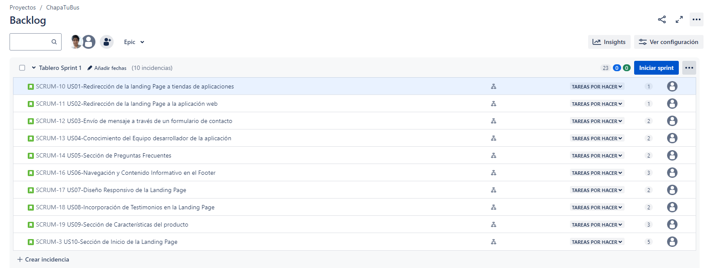

Asimismo, se presenta la tabla de nuestro primer sprint con las respectivas user stories a trabajar:

| Sprint #   | Sprint 1                                                 |     |                                                              |                                                                                                                                                                                                                    |                    |               |        |
| :--------- | :------------------------------------------------------- | :-- | :----------------------------------------------------------- | :----------------------------------------------------------------------------------------------------------------------------------------------------------------------------------------------------------------- | :----------------- | :------------ | :----- |
| User Story | Work-Item /Task                                          |     |                                                              |                                                                                                                                                                                                                    |                    |               |        |
| Id         | Title                                                    | Id  | Title                                                        | Description                                                                                                                                                                                                        | Estimation (Hours) | Assigned To   | Status |
| US01       | Redirección de la landing Page a tiendas de aplicaciones | 1   | Implementar enlaces de redirección a tiendas de aplicaciones | Configurar los enlaces en la Landing Page para redirigir a las tiendas de aplicaciones correspondientes (App Store y Google Play) según el dispositivo del usuario.                                                | 1                  | Diego Merino  | Done   |
| US02       | Redirección de la landing Page a la aplicación web       | 2   | Configurar enlace de redirección a la aplicación web         | Establecer un enlace en la Landing Page que dirija a los usuarios a la aplicación web, garantizando una experiencia fluida y coherente.                                                                            | 1                  | Andrea Alfaro | Done   |
| US03       | Envío de mensaje a través de un formulario de contacto   | 3   | Implementar formulario de contacto                           | Crear un formulario de contacto funcional en la Landing Page que permita a los usuarios enviar mensajes directamente al equipo de soporte.                                                                         | 3                  | Axel Fiestas  | Done   |
| US04       | Conocimiento del Equipo desarrollador de la aplicación   | 4   | Crear sección de equipo desarrollador                        | Diseñar y desarrollar una sección informativa en la Landing Page que presente al equipo de desarrollo de la aplicación, incluyendo información relevante sobre cada miembro.                                       | 4                  | Tania Vasquez | Done   |
| US05       | Sección de Preguntas Frecuentes                          | 5   | Integrar sección de preguntas frecuentes                     | Agregar una sección dedicada a preguntas frecuentes en la Landing Page, que aborde las consultas comunes de los usuarios y proporcione respuestas claras y concisas.                                               | 4                  | Rafael Primo  | Done   |
| US06       | Navegación y Contenido Informativo en el Footer          | 6   | Mejorar navegación y contenido en el Footer                  | Optimizar la navegación y agregar contenido informativo relevante en el Footer de la Landing Page para mejorar la experiencia del usuario y facilitar el acceso a información importante.                          | 4                  | Diego Merino  | Done   |
| US07       | Diseño Responsivo de la Landing Page                     | 7   | Implementar diseño responsivo                                | Desarrollar una versión responsiva de la Landing Page que se adapte automáticamente a diferentes tamaños de pantalla y dispositivos, garantizando una experiencia consistente y agradable para todos los usuarios. | 6                  | Andrea Alfaro | Done   |
| US09       | Sección de Características del producto                  | 8   | Crear sección de características del producto                | Diseñar y desarrollar una sección en la Landing Page que resalte las características y funcionalidades clave del producto, ayudando a los usuarios a comprender mejor su propósito y beneficios.                   | 3                  | Axel Fiestas  | Done   |
| US10       | Sección de Inicio de la Landing Page                     | 9   | Diseñar sección de inicio                                    | Elaborar el diseño y contenido inicial de la Landing Page, estableciendo la estructura y presentación general del sitio para captar la atención de los visitantes y orientarlos hacia la información relevante.    | 4                  | Tania Vasquez | Done   |

#### 6.2.1.3. Development Evidence for Sprint Review.

Durante este Sprint, completamos el desarrollo de la Landing Page en su totalidad. Logramos diseñar una interfaz atractiva y funcional que refleja nuestra marca y ofrece una experiencia de usuario óptima. Implementamos características clave, como la capacidad de descarga y acceso rápido a la información relevante para nuestros usuarios. Además, hemos realizado pruebas exhaustivas para garantizar su funcionamiento adecuado en diferentes dispositivos y navegadores.

En cuanto a la aplicación web, hemos desarrollado las primeras funcionalidades principales. Estas incluyen la autenticación de usuarios, la navegación básica y la visualización de contenido relevante. Desplegamos con éxito la primera versión de la aplicación en un entorno de producción y estamos satisfechos de haber cumplido con los objetivos establecidos al inicio del Sprint.

Para las suites de pruebas, nos enfocamos en la creación de escenarios de prueba utilizando Gherkin debido a la simplicidad de la solución desarrollada. Hemos elaborado casos de prueba exhaustivos que abarcan diferentes aspectos de la Landing Page y la aplicación web, asegurando la calidad y funcionalidad de nuestros productos.

| Repository   | Branch  | Commit ID | Commit Message                                                          | Commit Message Body | Commited on (Date) |
| :----------- | :------ | :-------- | :---------------------------------------------------------------------- | :------------------ | :----------------- |
| Landing-Page | develop | 924ab59   | Merge branch 'feature/US03' into develop                                | -                   | 01/05/2023         |
| Landing-Page | develop | b846187   | Merge pull request #9 from TechSolutions-2024-I-IOT/feature/us-4        | -                   | 01/05/2023         |
| Landing-Page | develop | 30eacc0   | Merge pull request #10 from TechSolutions-2024-I-IOT/feature/i18n       | -                   | 01/05/2023         |
| Landing-Page | develop | c3dbf7f   | Merge pull request #14 from TechSolutions-2024-I-IOT/feature/fix-doubts | -                   | 03/05/2023         |
| Frontend     | develop | 5c31484   | Merge pull request #1 from TechSolutions-2024-I-IOT/feature/us-29       | -                   | 02/05/2023         |
| Frontend     | develop | 7379879   | Merge branch 'feature/us-27' into feature/us-29                         | -                   | 02/05/2023         |
| Frontend     | develop | 5c31484   | Merge pull request #1 from TechSolutions-2024-I-IOT/feature/us-29       | -                   | 02/05/2023         |
| TestingSuite | main    | 31836ee   | update: sprint 1 testing                                                | -                   | 03/05/2023         |

**Network**

  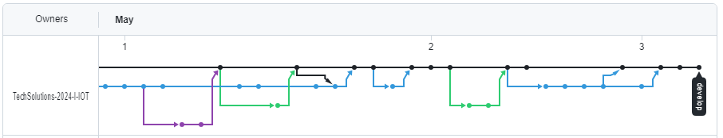   

  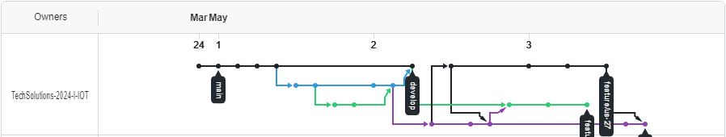   

#### 6.2.1.4. Testing Suite Evidence for Sprint Review.

| Repository   | Branch | Commit ID | Commit Message           | Commit Message Body | Commited on (Date) |
| :----------- | :----- | :-------- | :----------------------- | :------------------ | :----------------- |
| TestingSuite | main   | 31836ee   | update: sprint 1 testing | -                   | 03/05/2023         |

Para la revisión del Sprint 1, presentamos los Testing Suite Evidence, los cuales se desarrollaron utilizando Gherkin. Esta elección se basó en la simplicidad del proyecto, que consiste en el desarrollo del landing page y la primera versión del front-end. Gherkin proporcionó una forma clara y legible de especificar los comportamientos esperados del sistema a través de escenarios escritos en un lenguaje natural. Esto facilitó la colaboración entre el equipo de desarrollo y los stakeholders al definir y comprender los criterios de aceptación del sprint.

     
  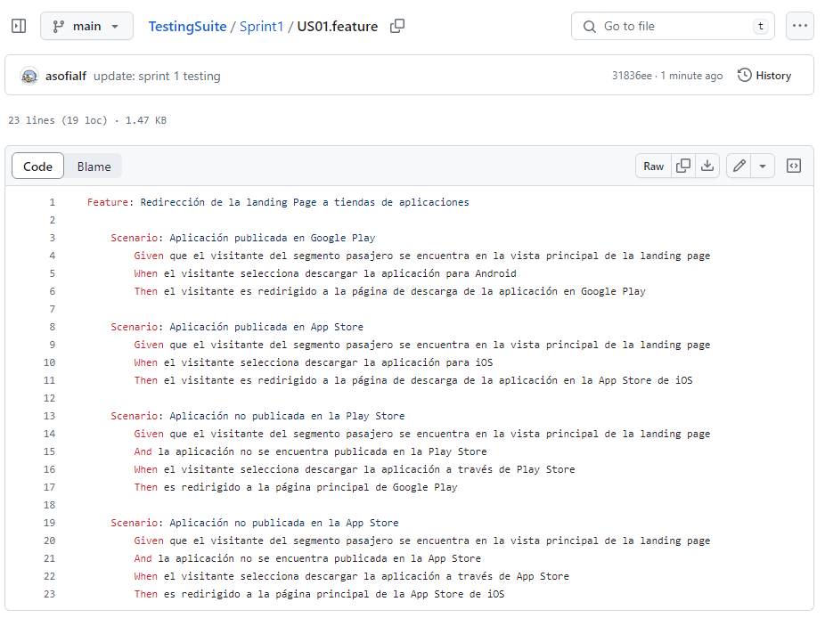

**Enlace del repositorio:** https://github.com/TechSolutions-2024-I-IOT/TestingSuite

#### 6.2.1.5. Execution Evidence for Sprint Review.

- **Landing Page**

Para el Sprint 1, se logró el desarrollo completo de la landing page, cumpliendo con los objetivos establecidos en cuanto a diseño y funcionalidad. Se implementaron las características acordadas, como la estructura de navegación, la disposición del contenido y la integración de elementos visuales. Además, se realizó una revisión exhaustiva para garantizar la coherencia del diseño y la correcta visualización en diferentes dispositivos y navegadores. El equipo también llevó a cabo pruebas de usabilidad para asegurar una experiencia de usuario fluida y satisfactoria.

     

- **Web Application**

Para el Sprint 1, se avanzó significativamente en el desarrollo del Web Application al implementar las primeras funcionalidades clave. Esto incluyó la creación de la interfaz de usuario inicial, la configuración de la navegación básica y la integración de componentes principales. Además, se llevó a cabo con éxito el despliegue de la primera versión del Web Application en el entorno de producción. Este hito marcó un paso importante hacia el objetivo final del proyecto. Se logró cumplir con los objetivos planteados al inicio del sprint, estableciendo así una base sólida para el desarrollo continuo y la expansión de la aplicación.

  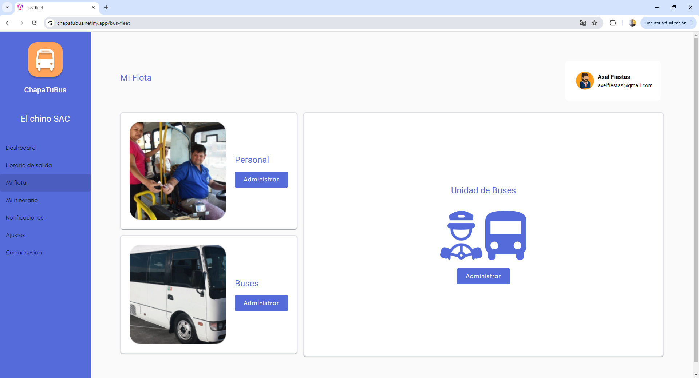   

#### 6.2.1.6. Services Documentation Evidence for Sprint Review.

Para el Sprint 1, se enfocó principalmente en el desarrollo del front-end de la aplicación, y no se abordó el desarrollo del back-end en esta etapa. Como alternativa, los servicios necesarios se implementaron utilizando datos en formato JSON y se alojaron en My JSON Server. Esta decisión permitió avanzar de manera eficiente en el desarrollo del front-end, aprovechando las herramientas disponibles para simular y consumir datos hasta que el back-end esté completamente desarrollado en futuros sprints.

Se creó un repositorio para cada bounded context:

  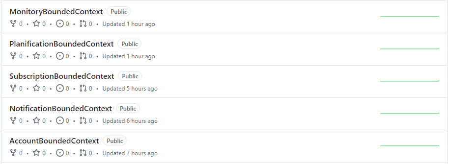 

Cada repositorio cuenta con su respecto "db.json" donde se encuentra información en formato json:

  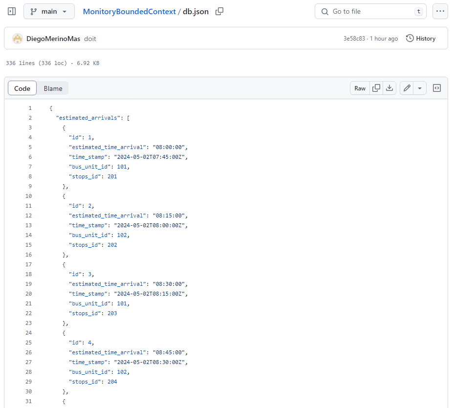   

#### 6.2.1.7. Software Deployment Evidence for Sprint Review.

- **Landing Page**

Para el despliegue de nuestra Landing Page, se eligió Pages pues es una herramienta de GitHub integrada que facilita la publicación de sitios web estáticos directamente desde los repositorios de GitHub. Esto permite una implementación rápida y sencilla sin la necesidad de configurar servidores adicionales ni preocuparse por la infraestructura de alojamiento. Además, Pages es altamente configurable y compatible con dominios personalizados, lo que permite una mayor personalización y profesionalismo en la presentación de nuestro sitio web.

  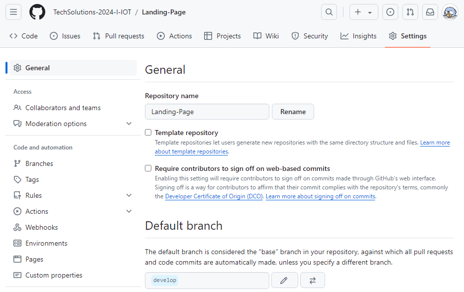

Vamos a Pages y en el apartado de "Build and Deployment" elegimos la rama y la carpeta que deseamos desplegar y le damos a "Save"

  

Finalmente se nos muestra el enlace de nuestra Landing Page desplegada con el dominio de GitHub.

  

**Enlace de la landing page desplegada**: https://techsolutions-2024-i-iot.github.io/Landing-Page/

- **Web Application**

Para el despliegue de nuestra aplicación web, hemos optado por utilizar Netlify debido a su robustez, facilidad de uso y capacidades de integración continua. Netlify nos brinda un entorno de alojamiento altamente escalable y seguro, lo que garantiza una experiencia de usuario óptima. Además, su integración con repositorios Git permite implementaciones automáticas con cada actualización de código, lo que simplifica considerablemente el proceso de despliegue y facilita la colaboración entre el equipo de desarrollo.

  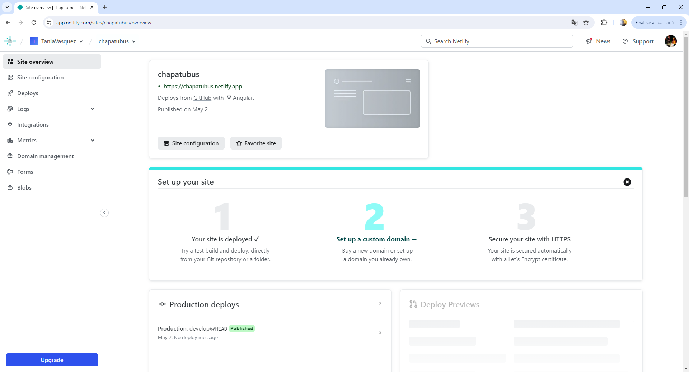
  

**Enlace de la web application desplegada**: https://chapatubus.netlify.app/

#### 6.2.1.8. Team Collaboration Insights during Sprint.

- **Contributors**

  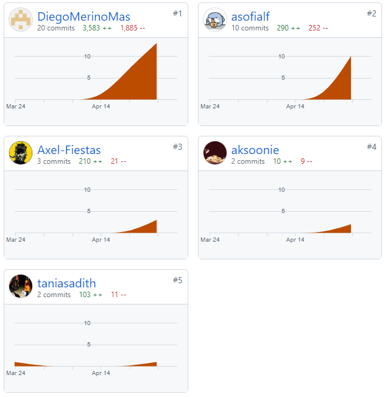
    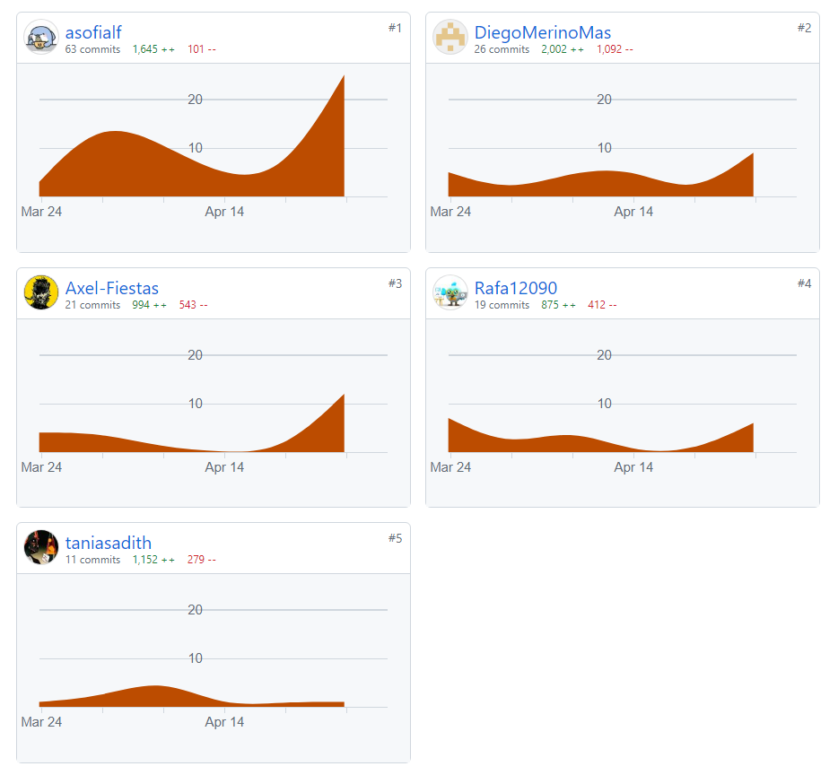

  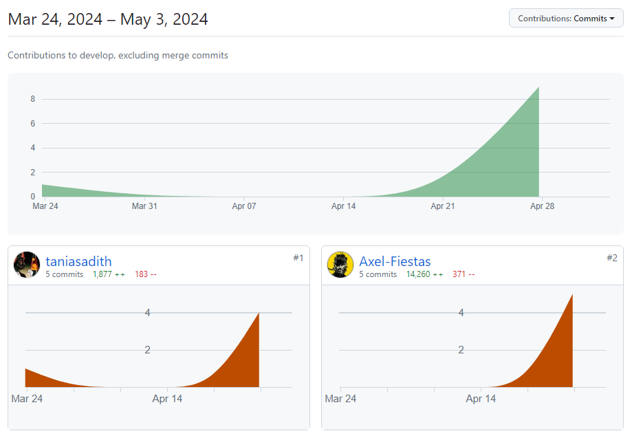

- **Pulse**

  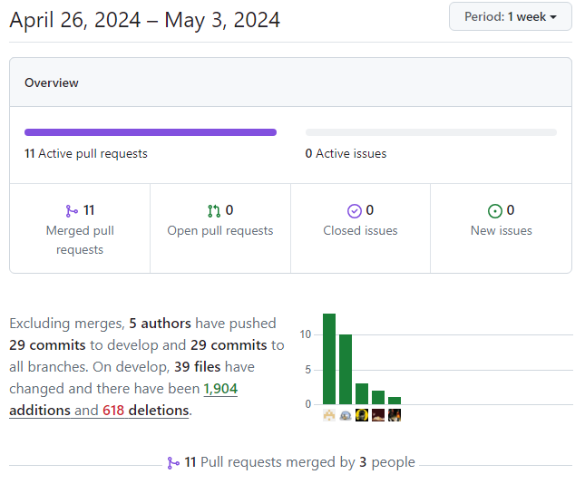
  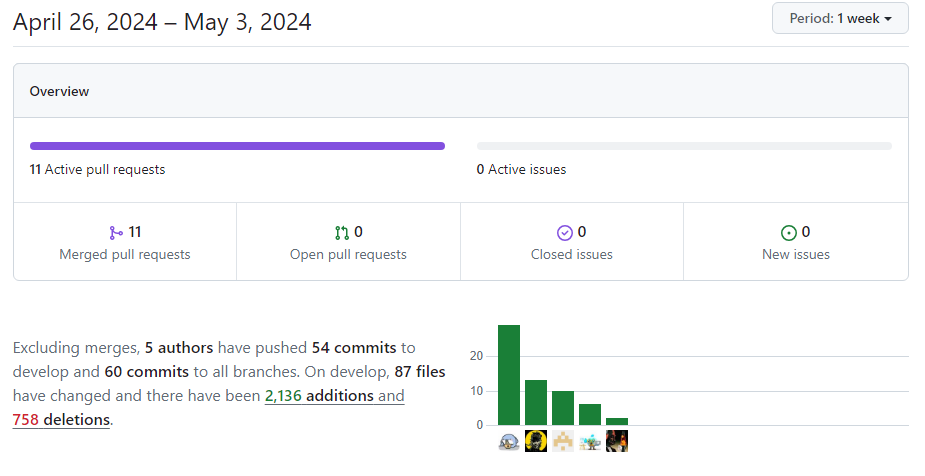

  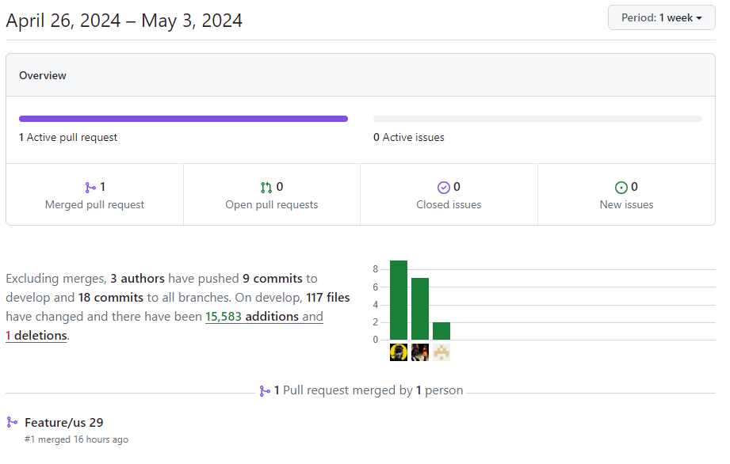

### 6.2.2. Sprint 2

#### 6.2.2.1. Sprint Planning 2.

<table border="2">
    <tr>
        <td>
           
<b>Sprint #</b>

        </td>
        <td>
          
Sprint 2

        </td>
    </tr>
  <tr>
        <td  colspan="2">
           
<b>Sprint Planning Background</b>

        </td>
    </tr>
  <tr>
        <td>
           
Date

        </td>
        <td>
          
20-05-2024

        </td>
    </tr>
  <tr>
        <td>
           
Time

        </td>
        <td>
          
21:00

        </td>
    </tr>
  <tr>
        <td>
           
Location

        </td>
        <td>
          
Reunión virtual vía Discord

        </td>
    </tr>
  <tr>
        <td>
           
Prepared By

        </td>
        <td>
          
Tania Sadith Vasquez Sal Y Rosas

        </td>
    </tr>
  <tr>
        <td>
           
Attendees (to planning meeting)

        </td>
        <td>
          
Tania Sadith Vasquez Sal Y Rosas, Andrea Sofia Alfaro Salinas, Diego Martin Merino Mas, Axel Joshue Fiestas Santisteban, Rafael Wimmer Primo Estrada

        </td>
    </tr>
  <tr>
        <td>
           
Sprint 1 – 2 Review Summary

        </td>
        <td>
          
En los Sprints 1 y 2, nuestro equipo se centró en establecer las bases del proyecto. Los objetivos principales incluyeron la configuración de la infraestructura del proyecto, completar el trabajo de diseño inicial y comenzar el desarrollo de las características fundamentales. Logramos configurar con éxito el entorno de desarrollo, el control de versiones y las canalizaciones de integración continua. Completamos los prototipos de diseño iniciales para la interfaz de usuario y finalizamos los flujos de experiencia del usuario con la aprobación de las partes interesadas. Implementamos el módulo de autenticación de usuarios, incluyendo funcionalidades de registro e inicio de sesión, y comenzamos el desarrollo del tablero principal, logrando un 70% de avance.

        </td>
    </tr>
  <tr>
        <td>
           
Sprint 1 – 2 Retrospective Summary

        </td>
        <td>
          
Lo que salió bien: La fuerte colaboración y comunicación dentro del equipo permitió una resolución eficiente de problemas. Las sesiones regulares de actualizaciones y retroalimentación con las partes interesadas aseguraron la alineación y la rápida resolución de discrepancias de diseño. Lo que se puede mejorar: Mejorar la estimación y asignación de tiempo para las tareas de configuración inicial para evitar retrasos futuros. Establecer un proceso de aprobación de diseño más detallado para minimizar revisiones y alinear expectativas desde el principio. Necesidad de una documentación más completa, especialmente en relación con los procesos de configuración.

        </td>
    </tr>
   <tr>
        <td  colspan="2">
           
<b>Sprint Goal & User Stories</b>

        </td>
    </tr>
   <tr>
        <td>
           
Sprint 2 Goal

        </td>
        <td>
          
Completar el Web Application de nuestro programa, así como el Web Services y mostrar un avance considerable del Mobile Application.

        </td>
    </tr>
  <tr>
        <td>
           
Sprint 2 Velocity

        </td>
        <td>
          
61

        </td>
    </tr>
  <tr>
        <td>
           
Sum of Story Points

        </td>
        <td>
          
61

        </td>
    </tr>
</table>

#### 6.2.2.2. Sprint Backlog 2.

El objetivo principal del sprint 2 es completar el Web Application de nuestro programa, así como el Web Services y mostrar un avance considerable del Mobile Application.

A continuación, se presenta un screenshot del sprint 2 en desarrollo realizado en Jira por el equipo:

  

Asimismo, se presenta la tabla de nuestro primer sprint con las respectivas user stories a trabajar:

| Sprint #   | Sprint 2                                                              |     |                                                              |                                                                                                                                     |                    |               |             |
| :--------- | :-------------------------------------------------------------------- | :-- | :----------------------------------------------------------- | :---------------------------------------------------------------------------------------------------------------------------------- | :----------------- | :------------ | :---------- |
| User Story | Work-Item /Task                                                       |     |                                                              |                                                                                                                                     |                    |               |             |
| Id         | Title                                                                 | Id  | Title                                                        | Description                                                                                                                         | Estimation (Hours) | Assigned To   | Status      |
| TS21       | Registro de un Transport Company                                      | 1   | Registro de empresas de transporte                           | Que un usuario de la plataforma web pueda registrar a su empresa de transporte                                                      | 1                  | Axel Fiestas  | In Progress |
| TS22       | Registro de Conductor de un Transport Company                         | 2   | Registro de conductores de empresas de transporte            | El usuario registrado como manager de la empresa de transporte debe registrar los conductores respectivos con los datos solicitados | 2                  | Axel Fiestas  | In Progress |
| US12       | Visualizar horarios de mayor afluencia                                | 3   | Mostrar los horarios en que hay mayor afluencia de buses     | Mostrar un gráfico estadístico con los horarios de mayor afluencia en cada paradero, para poder ajustar la frecuencia de los buses  | 6                  | Tania Vasquez | To Do       |
| US11       | Visualizar paraderos con mayor afluencia                              | 4   | Mostrar los paraderos con más concurrencia                   | Mostrar información sobre los paraderos donde se sube más gente durante el día, para poder identificar las rutas con mayor demanda  | 6                  | Tania Vasquez | To Do       |
| TS23       | Listado de Drivers Asociados de la empresa                            | 5   | Listar los conductores asociados a una empresa de transporte | Mostrar de forma ordenada los conductores registrados en la empresa                                                                 | 1                  | Axel Fiestas  | In Progress |
| TS24       | Registro de bus para un Transport Company                             | 6   | Registro de buses para empresas de transporte                | Añadir un bus a la flota de la empresa, después de introducir los datos requeridos                                                  | 1                  | Axel Fiestas  | In Progress |
| TS25       | Listado de Buses Asociados de un Transport Company                    | 7   | Listar los buses asociados a una empresa de transporte       | Mostrar de forma ordenada los buses registrados a la flota de la empresa                                                            | 1                  | Axel Fiestas  | In Progress |
| TS26       | Asignación de una Unidad de Bus                                       | 8   | Asignar una unidad de bus a un conductor                     | Al asignar un conductor a un bus se crea la unidad de bus                                                                           | 2                  | Axel Fiestas  | In Progress |
| TS27       | Listado de Drivers Asociados de un Transport Company                  | 9   | Listar los conductores asociados a una empresa de transporte | Crear un endpoint para devolver los conductores ligados a la empresa con una correcta estructura                                    | 1                  | Axel Fiestas  | In Progress |
| TS29       | Creación de un Schedule de un Transport Company                       | 10  | Crear un horario para una empresa de transporte              | Crear un horario para una empresa de transporte para mejorar la organización de salidas y llegadas                                  | 3                  | Axel Fiestas  | In Progress |
| TS30       | Registro de una salida (Departure Schedule) asociada con              | 11  | Registro de salida de un bus                                 | Registrar la salida de un bus en el horario planificado                                                                             | 2                  | Axel Fiestas  | To Do       |
| TS31       | Subida de imágenes para formularios                                   | 12  | Subida de imágenes                                           | Permitir la subida de imágenes en los formularios para documentación visual                                                         | 2                  | Axel Fiestas  | In Progress |
| US18       | Visualizar gráfico de línea con el tiempo de pulso de la              | 13  | Visualizar gráfico del pulso del conductor                   | Mostrar un gráfico de línea con el tiempo de pulso del conductor para monitorear su salud                                           | 4                  | Axel Fiestas  | To Do       |
| TS32       | Listado de todos los transport companies existentes                   | 14  | Listar todas las empresas de transporte                      | Listar todas las empresas de transporte registradas en la plataforma                                                                | 1                  | Axel Fiestas  | In Progress |
| TS33       | Obtener información de un conductor                                   | 15  | Obtener información detallada de un conductor                | Obtener información detallada de un conductor por medio de su ID                                                                    | 2                  | Axel Fiestas  | In Progress |
| TS34       | Obtener información de la ubicación del bus en tiempo re              | 16  | Obtener ubicación en tiempo real                             | Obtener la ubicación en tiempo real de los buses mediante GPS                                                                       | 6                  | Axel Fiestas  | To Do       |
| TS35       | Modificar información de un driver                                    | 17  | Modificar información de un conductor                        | Modificar datos de un conductor existente en la base de datos                                                                       | 2                  | Axel Fiestas  | In Progress |
| TS36       | Modificar información de un bus                                       | 18  | Modificar información de un bus                              | Modificar datos de un bus existente en la base de datos                                                                             | 2                  | Axel Fiestas  | In Progress |
| TS37       | Borrar información de un Driver                                       | 19  | Borrar información de un conductor                           | Eliminar datos de un conductor de la base de datos                                                                                  | 2                  | Axel Fiestas  | In Progress |
| TS38       | Listado de Schedules Asociados de un TransportCompany                 | 20  | Listar horarios de una empresa de transporte                 | Listar los horarios asociados a una empresa de transporte                                                                           | 2                  | Rafael Primo  | In Progress |
| TS39       | Borrar información de un Bus                                          | 21  | Borrar información de un bus                                 | Eliminar datos de un bus de la base de datos                                                                                        | 2                  | Axel Fiestas  | In Progress |
| TS40       | Obtener información de un TransportCompany med...                     | 22  | Obtener información de una empresa por IoT                   | Obtener datos de una empresa de transporte mediante dispositivos IoT                                                                | 2                  | Axel Fiestas  | In Progress |
| TS41       | Reasignar un UnitBus                                                  | 23  | Reasignar una unidad de bus                                  | Reasignar una unidad de bus a otro conductor o ruta                                                                                 | 2                  | Axel Fiestas  | To Do       |
| TS15       | Interconectar dispositivos Iot                                        | 24  | Interconectar dispositivos IoT                               | Configurar la interconexión de dispositivos IoT para la plataforma                                                                  | 2                  | Diego Merino  | To Do       |
| TS16       | Conectar dispositivos IoT hacia el Gateway o el Hub                   | 25  | Conectar dispositivos IoT al Gateway                         | Configurar la conexión de dispositivos IoT hacia el Gateway o Hub                                                                   | 2                  | Diego Merino  | To Do       |
| US18       | Visualizar gráfico de línea con el tiempo de pulso de los conductores | 26  | Visualizar gráfico del pulso de los conductores              | Mostrar un gráfico de línea con el tiempo de pulso de todos los conductores para monitorear su salud                                | 2                  | Diego Merino  | To Do       |

#### 6.2.2.3. Development Evidence for Sprint Review.

Durante este Sprint, realizamos las correcciones previas de la Landing Page, desarrollamos el Web Services, IoT Devices y Mobile Applications.

Para las suites de pruebas, nos enfocamos en la creación de escenarios de prueba utilizando Gherkin debido a la simplicidad de la solución desarrollada. Hemos elaborado casos de prueba exhaustivos que abarcan diferentes aspectos de la Landing Page y la aplicación web, asegurando la calidad y funcionalidad de nuestros productos.

| Repository                 | Branch  | Commit ID | Commit Message                                                                 | Commit Message Body | Commited on (Date) |
| :------------------------- | :------ | :-------- | :----------------------------------------------------------------------------- | :------------------ | :----------------- |
| Frontend                   | develop | c9b6e82   | Merge pull request #6 from TechSolutions-2024-I-IOT/feature/us-30              | -                   | 08/06/2024         |
| Frontend                   | develop | c73006b   | Merge pull request #4 from TechSolutions-2024-I-IOT/feature/us-18              | -                   | 06/06/2024         |
| Backend                    | develop | b44bac6   | Merge pull request #1 from TechSolutions-2024-I-IOT/feature/security           | -                   | 05/06/2024         |
| Backend                    | develop | abff06a   | Merge branch 'feature/TS-12' into feature/security                             | -                   | 05/06/2024         |
| EdgeBackendChapaTuBus      | main    | 459276a   | feat: integration to send information to backend cloud for real time ubication | -                   | 06/06/2024         |
| embedded-system-heart-rate | main    | 44bf0a1   | feat: simple connection and send data to backend edge layer                    | -                   | 02/06/2024         |
| ChapaTuBusApp-Mobile       | main    | fe130b2   | Merge pull request #1 from TechSolutions-2024-I-IOT/develop                    | -                   | 31/05/2024         |

**Network**

  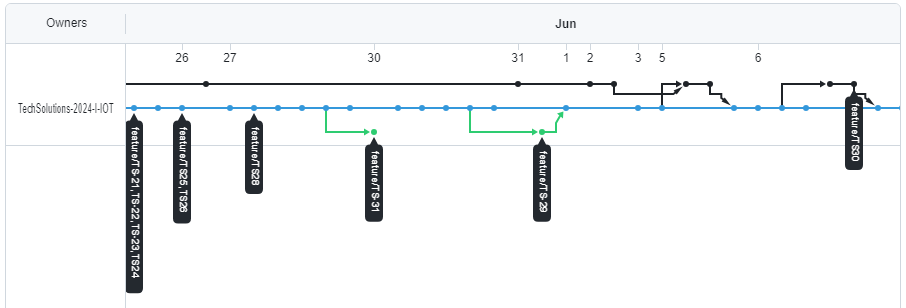   

  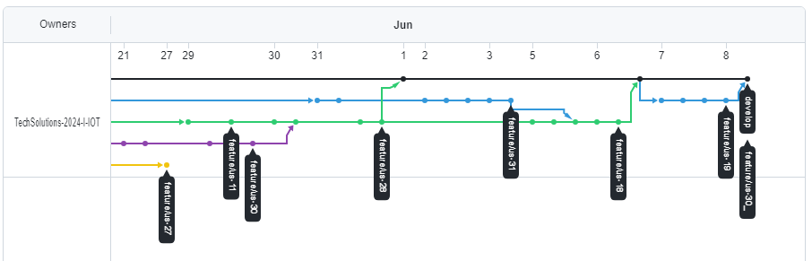   

#### 6.2.2.4. Testing Suite Evidence for Sprint Review.

| Repository   | Branch | Commit ID | Commit Message        | Commit Message Body | Commited on (Date) |
| :----------- | :----- | :-------- | :-------------------- | :------------------ | :----------------- |
| TestingSuite | main   | a72257e   | test: update sprint 2 | -                   | 08/06/2024         |

Para la revisión del Sprint 2, presentamos los Testing Suite Evidence, los cuales se desarrollaron utilizando Gherkin. Gherkin proporcionó una forma clara y legible de especificar los comportamientos esperados del sistema a través de escenarios escritos en un lenguaje natural. Esto facilitó la colaboración entre el equipo de desarrollo y los stakeholders al definir y comprender los criterios de aceptación del sprint.

  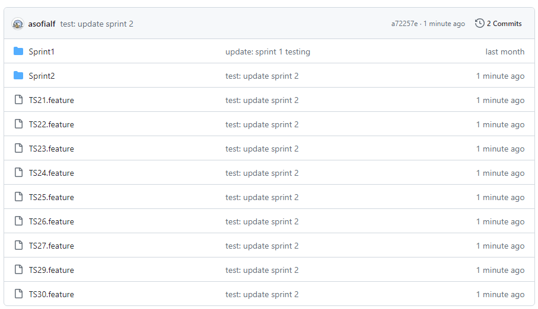   
  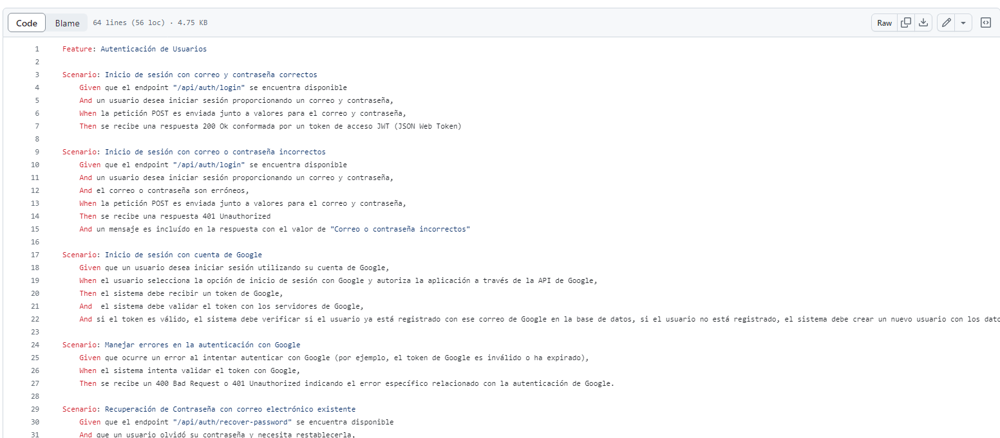

**Enlace del repositorio:** https://github.com/TechSolutions-2024-I-IOT/TestingSuite

#### 6.2.2.5. Execution Evidence for Sprint Review.

- **Landing Page**

Para el Sprint 2, se añadió la sección de planes de pagos para ambos segmentos para así brindar una mayor información a los visitantes.

  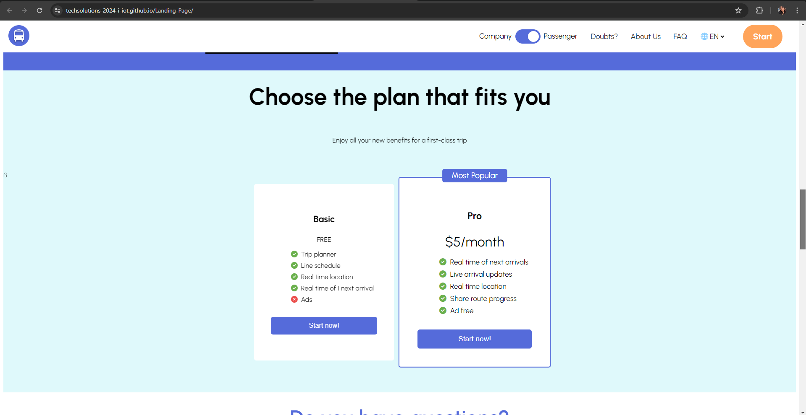   

  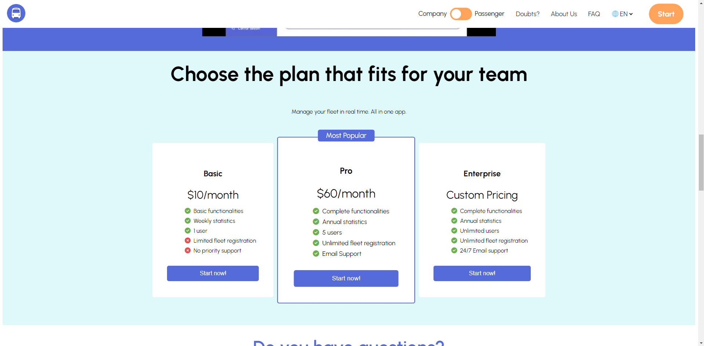   

- **Web Application**

Para el Sprint 2, se añadieron más pantallas relacionadas a nuestro core como la de la administración de los conductores, los buses, el registro de unidades de transporte, la visualización de los gráficos, entre otros.

  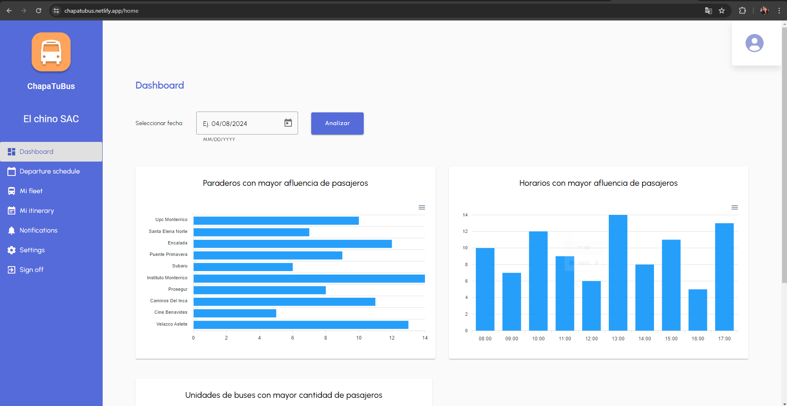   

- **Web Services**

  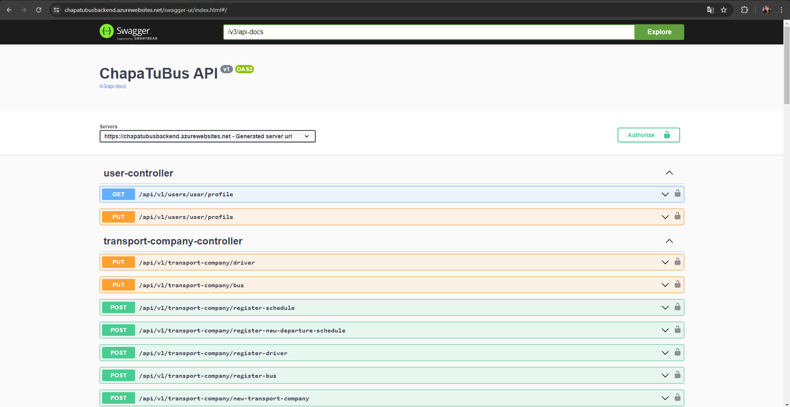   

- **IOT Devices**

  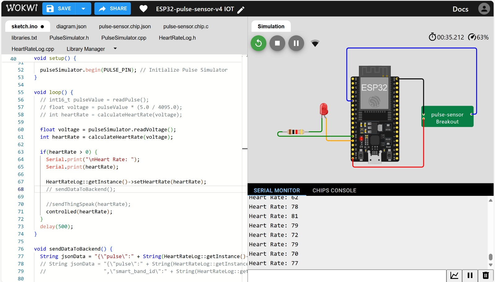   

#### 6.2.2.6. Services Documentation Evidence for Sprint Review.

Para el Sprint 2, se ha proporcionado evidencia visual de la documentación de los servicios desarrollados. A continuación, se presentan las imágenes correspondientes a los controladores implementados durante este sprint:

  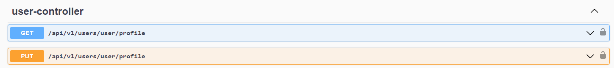   

  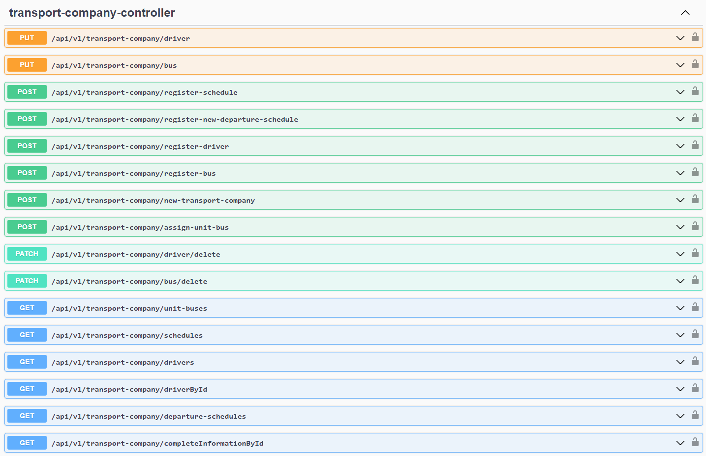   

  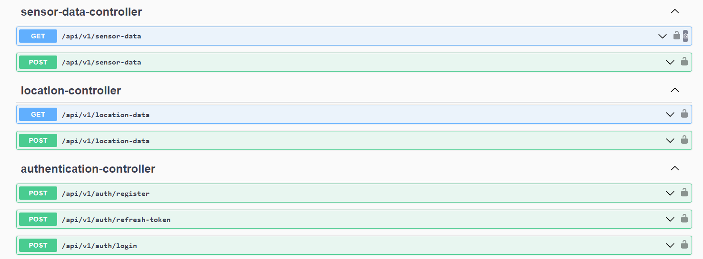   

Estas imágenes muestran la ejecución y estructura de los controladores, reflejando el progreso realizado en la integración y desarrollo de los servicios esenciales para el proyecto.

#### 6.2.2.7. Software Deployment Evidence for Sprint Review.

- **Landing Page**

Para el despliegue de nuestra Landing Page, se eligió Pages pues es una herramienta de GitHub integrada que facilita la publicación de sitios web estáticos directamente desde los repositorios de GitHub. Esto permite una implementación rápida y sencilla sin la necesidad de configurar servidores adicionales ni preocuparse por la infraestructura de alojamiento. Además, Pages es altamente configurable y compatible con dominios personalizados, lo que permite una mayor personalización y profesionalismo en la presentación de nuestro sitio web.

  

Vamos a Pages y en el apartado de "Build and Deployment" elegimos la rama y la carpeta que deseamos desplegar y le damos a "Save"

  

Finalmente se nos muestra el enlace de nuestra Landing Page desplegada con el dominio de GitHub.

  

**Enlace de la landing page desplegada**: https://techsolutions-2024-i-iot.github.io/Landing-Page/

- **Web Application**

Para el despliegue de nuestra aplicación web, hemos optado por utilizar Netlify debido a su robustez, facilidad de uso y capacidades de integración continua. Netlify nos brinda un entorno de alojamiento altamente escalable y seguro, lo que garantiza una experiencia de usuario óptima. Además, su integración con repositorios Git permite implementaciones automáticas con cada actualización de código, lo que simplifica considerablemente el proceso de despliegue y facilita la colaboración entre el equipo de desarrollo.

  
  

**Enlace de la web application desplegada**: https://chapatubus.netlify.app/

- **Web Services**

Para el despliegue de nuestros servicios web, hemos optado por utilizar Azure debido a su robustez, flexibilidad y amplio conjunto de herramientas integradas. Azure nos proporciona un entorno de alojamiento altamente escalable y seguro, lo que garantiza un rendimiento confiable para nuestros servicios. Además, su integración con repositorios Git y otras herramientas de desarrollo permite implementaciones automáticas con cada actualización de código, simplificando así el proceso de despliegue y fomentando la colaboración entre el equipo de desarrollo. Con Azure, tenemos la confianza de que nuestros servicios estarán disponibles de manera consistente y ofrecerán una experiencia óptima para nuestros usuarios.

  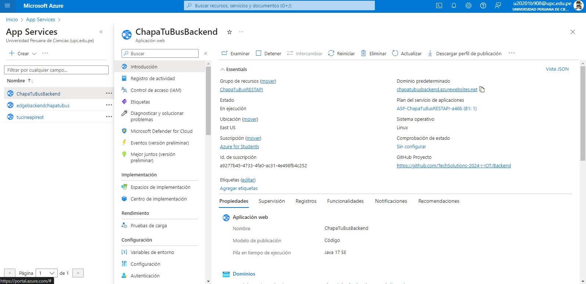

**Enlace del web service desplegado**: https://chapatubusbackend.azurewebsites.net/swagger-ui/index.html#/

- **IOT Edge Backend**

Para nuestro backend de IoT Edge, hemos elegido Azure debido a su potente conjunto de herramientas diseñadas específicamente para escenarios de IoT. Azure nos proporciona una plataforma sólida y escalable para desplegar y administrar nuestros dispositivos de borde de manera eficiente. La integración con Azure IoT Hub nos permite gestionar de forma centralizada la conectividad, la seguridad y la supervisión de nuestros dispositivos, lo que garantiza un funcionamiento confiable en todo momento. Además, la capacidad de implementar módulos personalizados en los dispositivos de borde nos brinda la flexibilidad necesaria para adaptar nuestro backend a las necesidades específicas de nuestro proyecto. Con Azure, tenemos la confianza de que nuestro backend de IoT Edge funcionará de manera óptima y segura, proporcionando una base sólida para nuestras soluciones de IoT.

  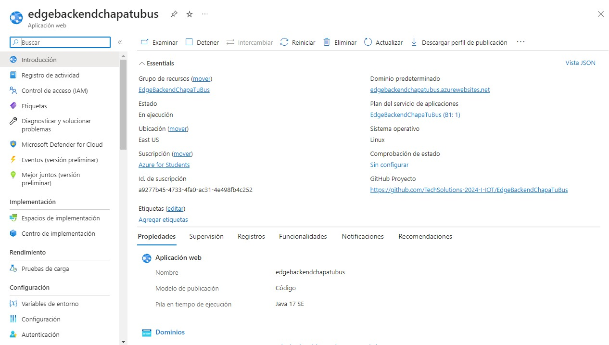

**Enlace del IOT Edge Backend desplegado**: https://edgebackendchapatubus.azurewebsites.net/swagger-ui/index.html

#### 6.2.2.8. Team Collaboration Insights during Sprint.

- **Contributors**

  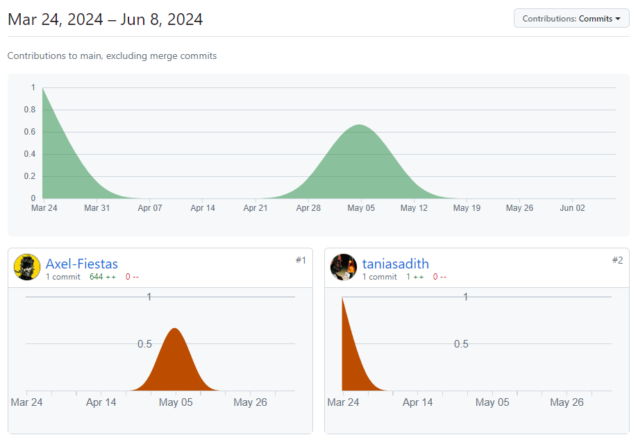
    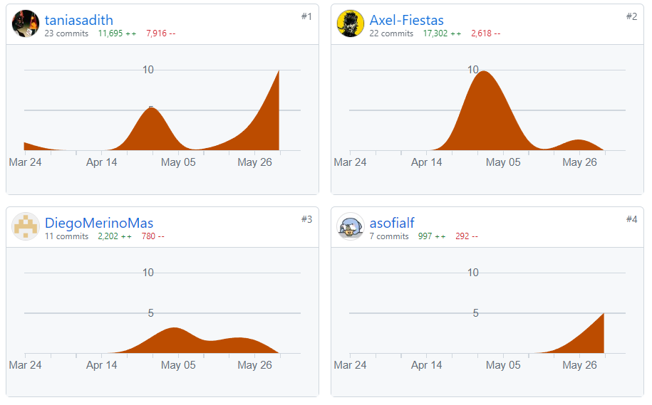

  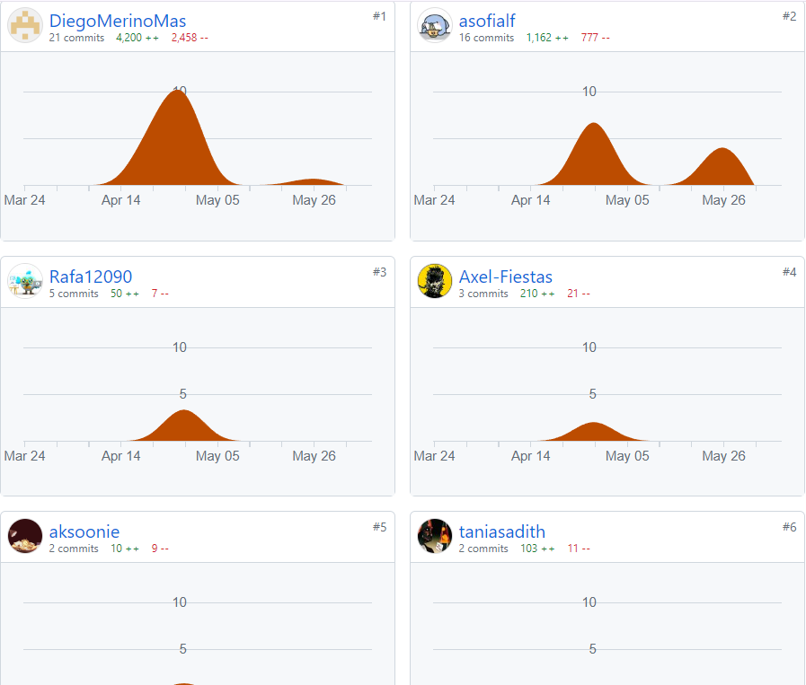
    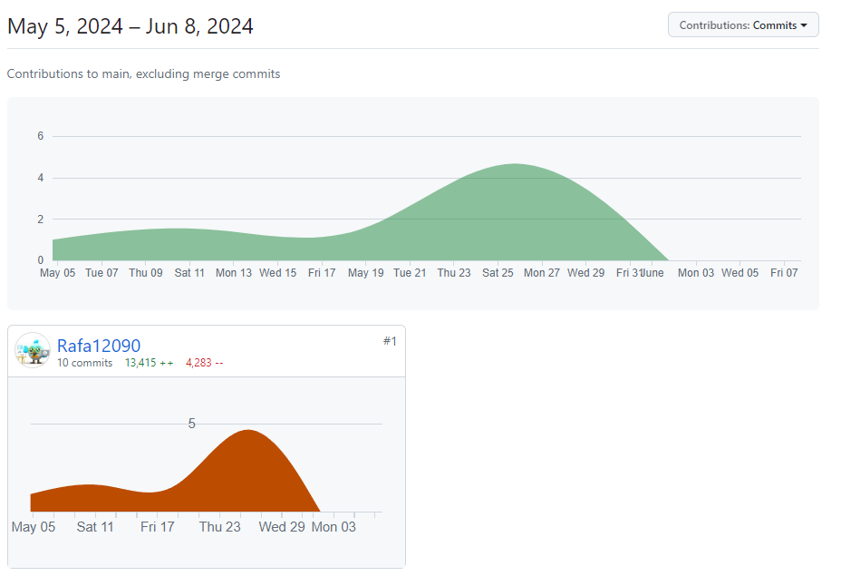

- **Pulse**

  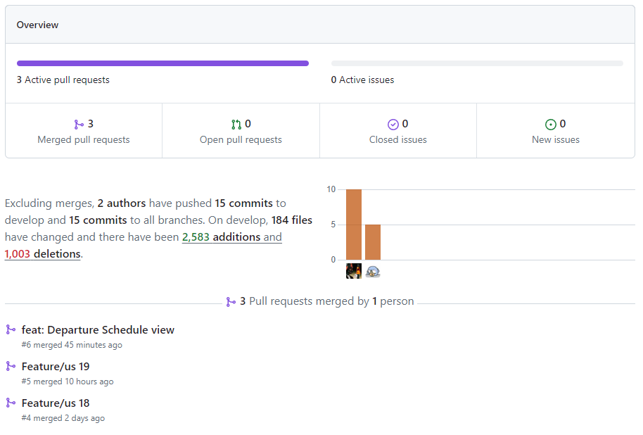
  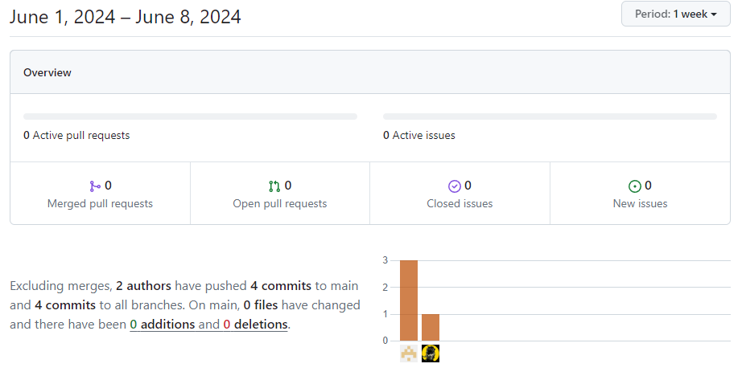

### 6.2.3. Sprint 3

Se tuvieron avances significativos en lo que respecta a los distintos productos que conforman
nuestro producto. Principalmente por el lado de la finalización de los dispositivos embedded IOT,
finalización de una versión base tanto de nuestros dos backends desplegados así como nuestra
aplicación web.

#### 6.2.3.1. Sprint Planning 3.

En la reunión presencial realizada, se identificaron los avances conseguidos y se llevó a cabo una retrospectiva para evaluar los procesos que el equipo estaba ejecutando de manera ineficiente. Se realizó un análisis paralelo para buscar soluciones con el objetivo de evitar cuellos de botella en los distintos productos desarrollados por el equipo, garantizando así que el avance del proyecto no se vea estancado. Como resultado, se dividieron las tareas de todos los productos (IoT, backend, frontend, móvil) entre todos los integrantes del equipo para asegurar una distribución equitativa y eficiente del trabajo.

<table border="2">
    <tr>
        <td>
           
<b>Sprint #</b>

        </td>
        <td>
          
Sprint 3

        </td>
    </tr>
  <tr>
        <td  colspan="2">
           
<b>Sprint Planning Background</b>

        </td>
    </tr>
  <tr>
        <td>
           
Date

        </td>
        <td>
          
21-06-2024

        </td>
    </tr>
  <tr>
        <td>
           
Time

        </td>
        <td>
          
11:00

        </td>
    </tr>
  <tr>
        <td>
           
Location

        </td>
        <td>
          
Reunión presencial en el salón de clases IOT

        </td>
    </tr>
  <tr>
        <td>
           
Prepared By

        </td>
        <td>
          
Tania Sadith Vasquez Sal Y Rosas

        </td>
    </tr>
  <tr>
        <td>
           
Attendees (to planning meeting)

        </td>
        <td>
          
Tania Sadith Vasquez Sal Y Rosas, Andrea Sofia Alfaro Salinas, Diego Martin Merino Mas, Axel Joshue Fiestas Santisteban, Rafael Wimmer Primo Estrada

        </td>
    </tr>
  <tr>
        <td>
           
Sprint n – 3 Review Summary

        </td>
<td>
    
En el Sprint 3, nuestro equipo se centró en continuar con los requisitos del proyecto. Los objetivos principales incluyeron el despliegue de todos los productos, la aplicación movil y web. Así como finalizar el backend y la configuración de los dispositivos IoT.

    
Logramos desplegar con éxito la aplicación movil, enviar información de manera eficiente a través de los dispositivos hacia el backend edge y manejar y enviar los datos desde el mismo hacia el backend cloud sin intervención.

    </tr>
  <tr>
        <td>
           
Sprint 3 Retrospective Summary

        </td>
  <td>
    
<b>Lo que salió bien:</b> La fuerte colaboración y comunicación dentro del equipo permitió una resolución eficiente de problemas. Las sesiones regulares de actualizaciones y retroalimentación con las partes interesadas aseguraron la alineación y la rápida resolución de discrepancias de diseño.

    
<b>Lo que se puede mejorar:</b> A pesar de la comunicación efectiva, los diferentes productos de software se aislaron, con una persona responsable por cada producto. Esto puede mejorarse fomentando una mayor integración y colaboración entre los responsables de los distintos productos.

</td>
    </tr>
   <tr>
        <td  colspan="2">
           
<b>Sprint Goal & User Stories</b>

        </td>
    </tr>
   <tr>
        <td>
           
Sprint 3 Goal

        </td>
        <td>
          
Completar los dispositivos IOT de nuestra solución, así como los Web Services (Edge y Cloud) y WebApplication así tambien como mostrar una versión final base de la aplicación móvil.

        </td>
    </tr>
  <tr>
        <td>
           
Sprint 3 Velocity

        </td>
        <td>
          
La velocidad del equipo es de 72 (promedio de los tres sprints)

        </td>
    </tr>
  <tr>
        <td>
           
Sum of Story Points

        </td>
        <td>
          
72

        </td>
    </tr>
</table>

#### 6.2.3.2. Sprint Backlog 3.

El objetivo principal del Sprint 3 es avanzar significativamente en el desarrollo de funcionalidades críticas y mejorar la integración de los diversos componentes del sistema, asegurando que cada parte del proyecto esté alineada y funcione de manera cohesiva. Nos enfocaremos en desplegar nuevas características, resolver problemas pendientes y mejorar el funcionamiento del sistema.

A continuación se presenta una captura de pantalla del Board para el Sprint en la herramienta de control utilizada, junto con el enlace público al Board para seguimiento en tiempo real:

  

**Enlace:** https://chapatubus.atlassian.net/jira/software/projects/SCRUM/boards/1?sprints=3 

A continuación, se incluye la tabla con los user stories asignados al sprint y last task resultantes:

| Sprint #   | Sprint 3                                                                  |     |                                                  |                                                                                      |                    |               |            |
| :--------- | :------------------------------------------------------------------------ | :-- | :----------------------------------------------- | :----------------------------------------------------------------------------------- | :----------------- | :------------ | :--------- |
| User Story | Work-Item /Task                                                           |     |                                                  |                                                                                      |                    |               |            |
| Id         | Title                                                                     | Id  | Title                                            | Description                                                                          | Estimation (Hours) | Assigned To   | Status     |
| TS21 | Implementación de Sensor de Peso | 1 | Diseño del Simulador de Peso | Implementar la lógica para simular el peso | 5 | Axel Fiestas | Done |
| TS14 | Suscripción Premium | 2 | Desarrollar la lógica de los métodos de pago al registrar | Implementar endpoints en el backend Cloud que se conecte al servicio externo Stripe | 3 | Andrea Alfaro  | Done  |
| US11 | Visualización de métricas de ocupación y capacidad de unidades de buses | 3 | Integración de gráficas que muestres información captada de los dispositivos IOT | Consumo de endpoints de los dispositos IOT  | 3 | Axel Fiestas  | Done |
| US34 | Obtener información de la ubicación del bus en tiempo real | 4 | Rastreo GPS de buses | Desarrollar un sistema para capturar y transmitir la ubicación GPS de cada bus en intervalos regulares | 5 | Tania Vasquez | Done |
| TS17 | Enviar la información recopilada en los dispositivos IoT hacia el Gateway | 5 | Transmisión de datos IoT al Gateway | Configurar los dispositivos IoT para enviar datos recopilados a un Gateway central de manera eficiente y segura. | 5 | Axel Fiestas | Done |
| TS42 | Obtener información de la ubicación del bus en tiempo real | 6 | Lectura de sensores de peso | Implementar la captura y procesamiento de datos de los sensores de peso instalados en los buses | 3 | Andrea Alfaro | Done |
| TS18 | Mandar la información recopilada en el Gateway hacia una plataforma Cloud | 7   | Sincronización Gateway-Cloud | Desarrollar un sistema para transferir automáticamente los datos del Gateway a una plataforma cloud seleccionada | 5 | Axel Fiestas | Done |
| TS43 | Enviar información del sensor de pulso al backend cloud | 8 | Transmisión de datos de pulso cardiaco | Configurar la transmisión de lecturas del sensor de pulso de los conductores al backend en la nube | 5 | Andrea Alfaro | Done |
| US-31 | Registro de Schedules | 9 | Gestión de horarios de buses | Crear una interfaz para registrar y administrar los horarios programados de las rutas de buses | 3 | Tania Vasquez | Done |
| US16 | Recibir notificaciones | 10  | Sistema de notificaciones | Implementar un sistema que envíe notificaciones relevantes a usuarios y personal sobre el servicio de buses | 2 | Andrea Alfaro | Done |
| TS13 | Registro de Itinerario | 11  | Creación de itinerarios | Desarrollar una funcionalidad para crear y almacenar itinerarios detallados de las rutas de buses. | 3 | Tania Vasquez | Done |
| TS09 | Visualización de Datos de Conductores y Buses | 12  | Dashboard de conductores y buses | Crear una interfaz que muestre información clave sobre conductores en servicio y estado de los buses | 3 | Diego Merino | Done |
| TS10 | Pulsaciones de Corazón del Conductor | 13  | Monitoreo cardiaco de conductores | Implementar un sistema para registrar y visualizar las pulsaciones cardiacas de los conductores en tiempo real | 5 | Andrea Alfaro | Done |
| TS11 | Alertas de Pulsaciones del Conductor | 14  | Alertas de ritmo cardiaco anormal | Desarrollar un sistema de alertas que se active cuando las pulsaciones de un conductor salgan de un rango saludable | 3 | Andrea Alfaro | Done |
| US13  | Visualizar aforo en buses | 15  | Monitor de aforo de pasajeros | Crear una interfaz que muestre en tiempo real el número de pasajeros en cada bus y su capacidad máxima | 3 | Rafael Primo | Done |
| US15 | Visualizar estado de los conductores | 16  | Panel de estado de conductores |  Implementar una vista que muestre el estado actual (en servicio, descanso, etc.) y condición de cada conductor | 3 | Diego Merino | Done |
| TS19 | Conectar la información con el backend | 17  | Integración de datos con backend | Desarrollar la conexión y sincronización de todos los datos recopilados con el sistema backend central | 5 | Andrea Alfaro  | Done |
| US14 | Visualizar ubicación de la flota en tiempo real | 18  | Mapa en vivo de la flota | Crear un mapa interactivo que muestre la ubicación en tiempo real de todos los buses en servicio | 5 | Rafael Primo | Done |
| US21 | Visualizar recorrido de una línea de bus |19  | Visor de rutas de buses | Implementar una función que permita ver el recorrido completo de una línea de bus específica en un mapa | 5 | Rafael Primo | Done |

#### 6.2.3.3. Development Evidence for Sprint Review

Durante este Sprint, terminamos las implementaciones a los backend desplegados, se termino de configurar los IoT devices, asi como el Web Services y Mobile Applications.

Para las suites de pruebas, nos enfocamos en la creación de escenarios de prueba utilizando Gherkin debido a la simplicidad de la solución desarrollada. Hemos elaborado casos de prueba exhaustivos que abarcan diferentes aspectos de la Landing Page y la aplicación web, asegurando la calidad y funcionalidad de nuestros productos.
| Repository | Branch | Commit Id | Commit Message | Commit Message Body | Committed on (Date) |
|------------|--------|-----------|--------------------------------------------------------|---------------------|---------------------|
| Backend | develop| 40c3a83 | feat: update unit buses endpoint | | Jun 26, 2024 |
| Backend | TS32 | ae6fc50 | add: get transport company by user id | | Jun 26, 2024 |
| Backend | develop| 24ff648 | fix: security | | Jun 26, 2024 |
| Backend | develop| 31d71e1 | fix: security | | Jun 26, 2024 |
| Backend | monitoringAndExecutionBoundedContext | 61bf8c7 | feat: Added controller of weight sensor | | Jun 25, 2024 |
| Backend | TS34 | baa8531 | add: gps tracker controller | | Jun 25, 2024 |
| Backend | develop| 4137e4c | fix: security | | Jun 25, 2024 |
| Backend | TS14 | 82a8c16 | feat: db credentials updated and some resources deleted | | Jun 24, 2024 |
| Backend | develop| 24c9b15 | fix: app properties | | Jun 24, 2024 |
| Backend | TS14 | 3d62a8f | feat: basic endpoints for SmartBand aggregate | | Jun 24, 2024 |
| Backend | develop| 3d62a8f | add: stripe payment endpoint | | Jun 19, 2024 |
| Backend | develop| 01b3a72 | feat: new database link updated | | Jun 17, 2024 |
| Backend | develop| 7b14c72 | fix: endpoint get transport company information by id | | Jun 17, 2024 |
| EdgeBackendChapaTuBus | feature/TS21 | 6c873e | add: sendRealTimeCapacityToCloudBackend | | Jun 26, 2024 |
| EdgeBackendChapaTuBus | fix/weight-batch-controller | 4ca6b9 | fix: weight batch controller | | Jun 26, 2024 |
| EdgeBackendChapaTuBus | develop | 2b8b6d | fix: conflict errors of merge | | Jun 26, 2024 |
| EdgeBackendChapaTuBus | develop | 9c798d | fix: add some import missing | | Jun 26, 2024 |
| EdgeBackendChapaTuBus | develop | 9715b5 | feat: add endpoint to send backend cloud gps data || Jun 25, 2024 |
| EdgeBackendChapaTuBus | feature/TS21 | 6c373f | add: weight batch controller | | Jun 25, 2024 |
| EdgeBackendChapaTuBus | develop | f1893f | fix: add missing endpoints | | Jun 25, 2024 |
| EdgeBackendChapaTuBus | develop | a73878 | fix: add missing endpoints | | Jun 25, 2024 |
| EdgeBackendChapaTuBus | feature/fixSendHeartBeatAverageToCloudBackend | a53333 | update: application properties | | Jun 24, 2024 |
| EdgeBackendChapaTuBus | feature/fixSendHeartBeatAverageToCloudBackend | db6e6c | fix: json | | Jun 24, 2024 |
| EdgeBackendChapaTuBus | feature/TS43 | 27d4dc | fix: sendHeartBeatAverageToCloudBackend() | | Jun 24, 2024 |
| EdgeBackendChapaTuBus | revert-3-feature/TS-34 | 26858d | Revert "fix: Data received from GPS sensor" | | Jun 24, 2024 |
| EdgeBackendChapaTuBus | feature/TS-34 | 9c833a | fix: Data received from GPS sensor | | Jun 24, 2024 |
| EdgeBackendChapaTuBus | revert-1-feature/TS-34 | 5b60bd | Revert "feature/TS-34" | | Jun 24, 2024 |
| EdgeBackendChapaTuBus | feature/TS-34 | f88a95 | feat: Add location controller | | Jun 24, 2024 |
| EdgeBackendChapaTuBus | feature/TS-34 | c6a75d | feat: Add domain / model | | Jun 24, 2024 |
| EdgeBackendChapaTuBus | develop | a8c527 | feat: Add for send the data to cloud | | Jun 24, 2024 |
| EdgeBackendChapaTuBus | develop | 1d602a | update: send heart beat pulse to cloud backend | | Jun 23, 2024 |
| Frontend | fix/us-11 | b313ff8 | fix: dependecies | | Jun 27, 2024 |
| Frontend | feature/us14 | b9c368b | feat: update dashboard component | | Jun 27, 2024 |
| Frontend | feature/us-11 | bd2a40b | feat: dashboard weight/capacity bus sensors | | Jun 27, 2024 |
| Frontend | develop | c5c5c17 | add: notifications | | Jun 27, 2024 |
| Frontend | develop | 3937803 | fix: notifications route | | Jun 27, 2024 |
| Frontend | develop | 269f3bb | add: logout | | Jun 27, 2024 |
| Frontend | develop | a5e49f3 | add: setting forms | | Jun 26, 2024 |
| Frontend | develop | 3fcc68f | fix: payment service and routes | | Jun 26, 2024 |
| Frontend | develop | 82e528d | fix: service | | Jun 26, 2024 |
| Frontend | feature/us-31 | 434dc7e | feat: Add creation of schedules | | Jun 26, 2024 |
| Frontend | develop | d6c4d18 | add: stripe service | | Jun 24, 2024 |
| Frontend | develop | 2da2729 | add: stripe payment component | | Jun 24, 2024 |
| Frontend | develop | 6d16db9 | add: stripe component | | Jun 24, 2024 |
| Frontend | develop | fca6628 | add: toolbar and routes | | Jun 22, 2024 |
| Frontend | develop | 8832e38 | add: subscription page base | | Jun 22, 2024 |
| Frontend | develop | 1b792f8 | fix (\*) - old router | | Jun 14, 2024 |
| Frontend | develop | 7d8a59a | fix: route | | Jun 8, 2024 |
| Mobile | feature/subscriptions | 44c9940 | feat: added subscriptions bounded context | | Jun 27, 2024 |
| Mobile | feature/router | fde7f42 | feat: added shared with router and navbar | | Jun 27, 2024 |
| Mobile | feature/home | b89e8ed | feat: added home screen | | Jun 27, 2024 |
| Mobile | feature/injections | 40eb906 | feat: added injections | | Jun 27, 2024 |
| Mobile | feature/executing-monitoring | 7a0c68d | feat: add executing monitoring bounded context | | Jun 27, 2024 |
| embedded-system-gps | main | a551b17 | feat: wokwi project gps updated | | Jun 25, 2024 |
| embedded-system-gps | main | 6e684e5 | feat: wokwi project updated | | Jun 25, 2024 |
| embedded-system-gps | main | fa80d07 | feat: Add embedded GPS system | | Jun 22, 2024 |
| embedded-system-gps | main | b540950 | Add files via upload | | Jun 21, 2024 |
| embedded-system-gps | main | 4a2e333 | Initial commit | | Jun 21, 2024 |
| embedded-system-weight-sensor | main | 07dd4cc | Update README.md | | Jun 26, 2024 |
| embedded-system-weight-sensor | main | 7ac5fd6 | feat: update sketch.ino and WeightSensor/Controller | | Jun 22, 2024 |
| embedded-system-weight-sensor | main | 454a345 | feat: simulatedWeighSensorController.h and cpp added | | Jun 22, 2024 |
| embedded-system-weight-sensor | main | 7b8601b | feat: SimulatedWeightSensor.cpp and .h added | | Jun 22, 2024 |
| embedded-system-weight-sensor | main | 0d373cf | feat: device.cpp and .h added | | Jun 22, 2024 |
| embedded-system-weight-sensor | main | a8f985d | feat: config.h added | | Jun 22, 2024 |
| embedded-system-weight-sensor | main | 1a8f5d9 | Add files via upload | | Jun 21, 2024 |
| embedded-system-weight-sensor | main | ea74010 | Initial commit | | Jun 21, 2024 |
| embedded-system-heart-rate | main | 4a2e333 | Update README | | Jun 26, 2024 |
| embedded-system-heart-rate | main | 4a2e333 | add: device.h | | Jun 22, 2024 |
| embedded-system-heart-rate | main | 4a2e333 | add: send smart band id | | Jun 22, 2024 |
| embedded-system-heart-rate | main | 4a2e333 | add wifi manager | | Jun 22, 2024 |
| embedded-system-heart-rate | main | 4a2e333 | add config.h | | Jun 22, 2024 |
| embedded-system-heart-rate | main | 4a2e333 | feat: simple connection and send data to backend edge layer | | Jun 2, 2024 |
| embedded-system-heart-rate | main | 4a2e333 | Update README.md | | Jun 2, 2024 |
| embedded-system-heart-rate | main | 4a2e333 | feat: First great advance in the hear rate sensor | | Jun 2, 2024 |
| embedded-system-heart-rate | main | 4a2e333 | Initial commit | | Jun 2, 2024 |

#### 6.2.3.4. Testing Suite Evidence for Sprint Review

| Repository   | Branch | Commit ID | Commit Message        | Commit Message Body | Commited on (Date) |
| :----------- | :----- | :-------- | :-------------------- | :------------------ | :----------------- |
| TestingSuite | main   | a72257e   | test: update sprint 3 | -                   | 27/06/2024         |

Para la revisión del Sprint 3, presentamos los Testing Suite Evidence, los cuales se desarrollaron utilizando Gherkin. Gherkin proporcionó una forma clara y legible de especificar los comportamientos esperados del sistema a través de escenarios escritos en un lenguaje natural. Esto facilitó la colaboración entre el equipo de desarrollo y los stakeholders al definir y comprender los criterios de aceptación del sprint.

  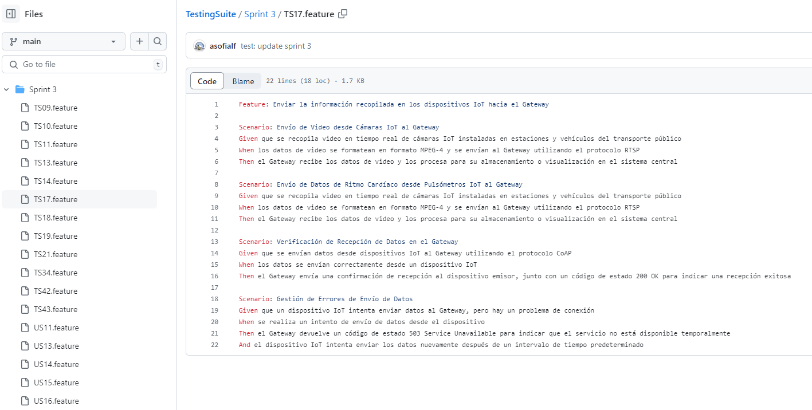   

**Enlace del repositorio:** https://github.com/TechSolutions-2024-I-IOT/TestingSuite

#### 6.2.3.5. Execution Evidence for Sprint Review

- **Web Application**

Para el Sprint 3, se añadieron las pantallas relacionadas a la administración de los conductores. El enfoque principal fue la generación y visualización de los gráficos y seguridad.

     

  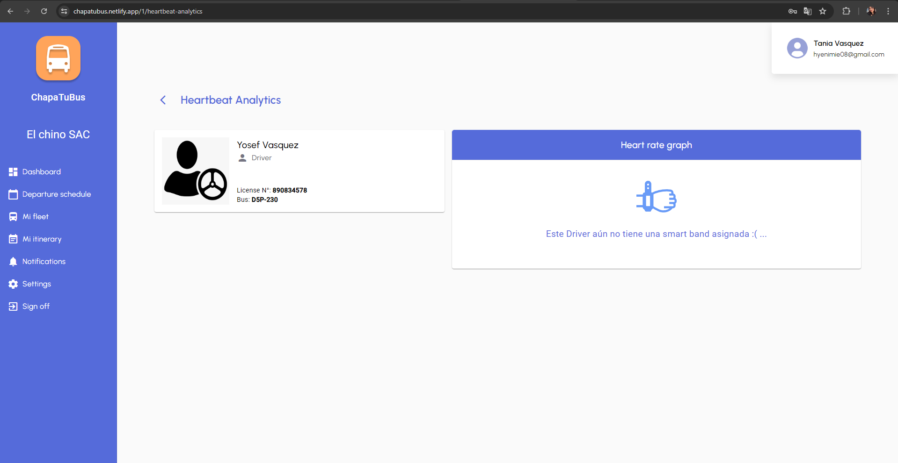   

  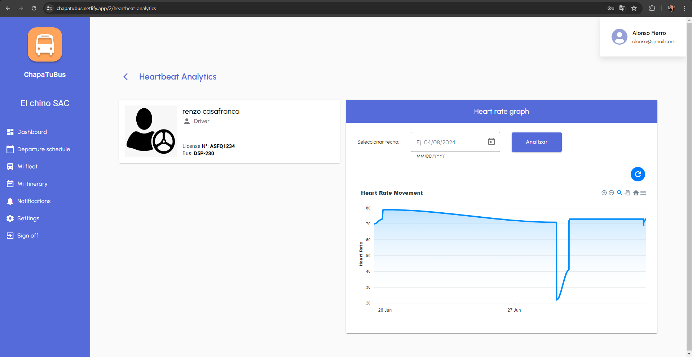   

  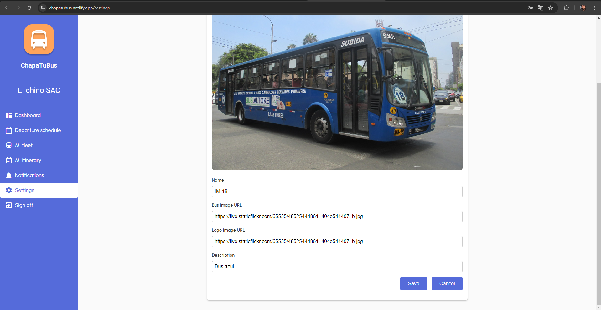   

**Enlace:** https://chapatubus.netlify.app/

- **Web Services**

Para el Sprint 3, se termino el edgebackend y la labor de logica y resumen que debe realizar antes de enviar la informacion de los devices al backend(cloud).

- Edgebackend

  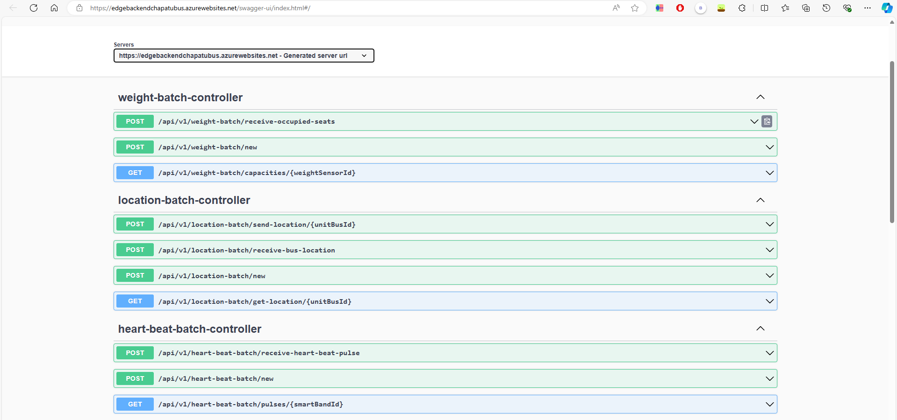   

**Enlace:** https://edgebackendchapatubus.azurewebsites.net/swagger-ui/index.html#/

- Backend

  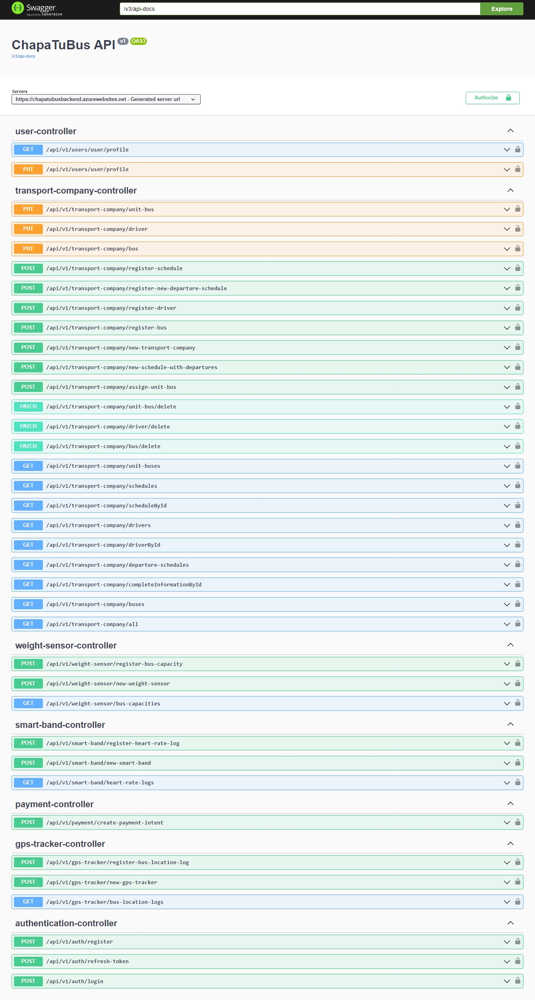   

**Enlace**: https://chapatubusbackend.azurewebsites.net/swagger-ui/index.html#

* **IOT Devices**

Para el Sprint 3, se termino la configuracion de los devices. Así como verificar el correcto envio de información al edge backend y los simuladores para que funcione sin intervención.

  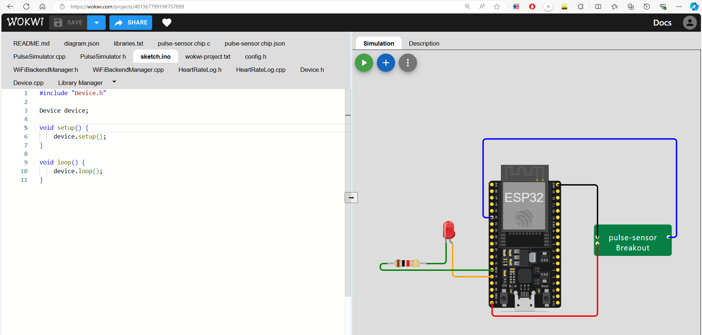   

  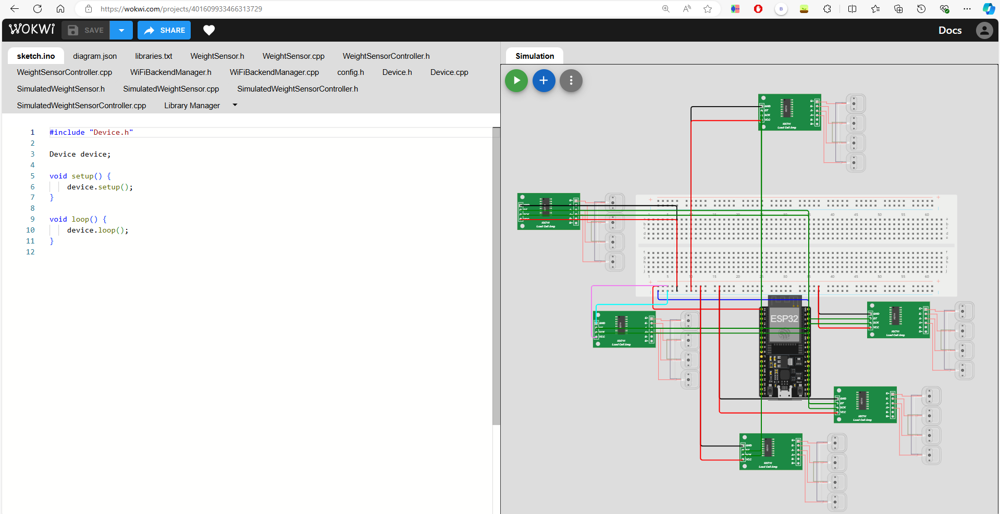   

     

**Enlace de explicación de los proyectos wokwi IOT y el backend edge:**
https://upcedupe-my.sharepoint.com/:v:/g/personal/u20181b530_upc_edu_pe/EcvbdBzmy5pCkP0Qpf2R9m4Blt2eRT_IV4pp_JktYCHifw?e=nFON6b&nav=eyJyZWZlcnJhbEluZm8iOnsicmVmZXJyYWxBcHAiOiJTdHJlYW1XZWJBcHAiLCJyZWZlcnJhbFZpZXciOiJTaGFyZURpYWxvZy1MaW5rIiwicmVmZXJyYWxBcHBQbGF0Zm9ybSI6IldlYiIsInJlZmVycmFsTW9kZSI6InZpZXcifX0%3D

**Enlace de explicación de la aplicación web y backend cloud:**
https://upcedupe-my.sharepoint.com/:v:/g/personal/u20181b530_upc_edu_pe/EQUU_88MDRJKlqxR1jxUvCMB036ogGdSsiqMF6WnpdSZtg?e=oiQMbD&nav=eyJyZWZlcnJhbEluZm8iOnsicmVmZXJyYWxBcHAiOiJTdHJlYW1XZWJBcHAiLCJyZWZlcnJhbFZpZXciOiJTaGFyZURpYWxvZy1MaW5rIiwicmVmZXJyYWxBcHBQbGF0Zm9ybSI6IldlYiIsInJlZmVycmFsTW9kZSI6InZpZXcifX0%3D

#### 6.2.3.6. Services Documentation Evidence for Sprint Review

En este Sprint 3, hemos logrado completar la documentación de todos los endpoints tanto para el backend cloud como para el backend edge utilizando OpenAPI. Este avance significativo permite una mejor comprensión y utilización de nuestros servicios web, facilitando la integración y el desarrollo de aplicaciones que consuman estos endpoints.

**Endpoints Documentados**

- Backend Cloud

A continuación se presentan capturas de pantalla de la interacción con los endpoints documentados, utilizando datos de muestra. Estas capturas ilustran las respuestas de los endpoints en diferentes escenarios de prueba.

**Autorización por tokens**

     

**transport-company-controller**

     

**payment-controller**

     

Enlace: https://chapatubusbackend.azurewebsites.net/swagger-ui/index.html#

- Backend Edge

Para el Sprint 3, también hemos finalizado la implementación y documentación de todos los endpoints necesarios para nuestro backend edge. Estos endpoints son cruciales para la comunicación y operación de dispositivos en el borde de nuestra red, facilitando la recolección y transmisión de datos en tiempo real.

**heart-beat-batch-controller**

     

**location-batch-controller**

     

**weight-batch-controller**

     

**Enlace:** https://edgebackendchapatubus.azurewebsites.net/swagger-ui/index.html#/

#### 6.2.3.7. Software Deployment Evidence for Sprint Review

#### 6.2.3.8. Team Collaboration Insights during Sprint

**Edge Devices**

- embedded-system-gps

     

     

- embedded-system-weight-sensor

     

     

- embedded-system-heart-rate

     

     

**Edge Backend**

     

     

**Cloud Backend**

     

     

**Frontend**

     

     

**Mobile**

     

     

## 6.3. Validation Interviews.

### 6.3.1. Diseño de Entrevistas.

- Preguntas de Validación para Administradores de Flota de Buses

_Sobre la Landing Page_

1. ¿La landing page explica claramente cómo ChapaTuBus puede beneficiar a los administradores de flota?
2. ¿Qué tan fácil fue para ti encontrar la información que buscabas en la landing page?
3. ¿Es fácil de entender el propósito de la aplicación desde la landing page?
4. ¿Qué te pareció el diseño y la navegación de la landing page?
5. ¿Hay alguna información que te gustaría ver en la landing page que no está actualmente?

_Sobre la Aplicación_

1. ¿Qué tan fácil te resultó registrar tu empresa y crear un perfil en la aplicación?
2. ¿Cómo evaluas la funcionalidad de monitoreo en tiempo real del estado de los conductores?
3. ¿Encontraste útil la información sobre la velocidad de los buses?
4. ¿La funcionalidad de consulta de horarios y paraderos con mayor afluencia es clara y accesible?
5. ¿Qué tan preciso encontraste el monitoreo del aforo de los buses basado en los sensores de peso?
6. ¿Hubo algún aspecto de la aplicación que te resultó confuso o difícil de usar?
7. ¿Qué características adicionales te gustaría ver en la aplicación para administradores de flota?

- Preguntas de Validación para Pasajeros

_Sobre la Landing Page_

1. ¿Qué opinas de la información presentada en la página principal de ChapaTuBus?
2. ¿Es fácil de entender el propósito de la aplicación desde la landing page?
3. ¿Qué te pareció el diseño y la navegación de la landing page?
4. ¿Hay alguna información que te gustaría ver en la landing page que no está actualmente?

_Sobre la Aplicación_

1. ¿Qué tan fácil te resultó iniciar sesión y personalizar tu perfil en la aplicación?
2. ¿Qué tan útil te resultó la funcionalidad de tiempo estimado de llegada de los buses?
3. ¿Cómo evaluas la función de guardar destinos frecuentes y consultar rutas?
4. ¿Las alertas de buses llenos fueron útiles y claras?
5. ¿Qué tan intuitiva te pareció la funcionalidad del mapa interactivo para localizar paraderos y trazar rutas?
6. ¿Hubo algún aspecto de la aplicación que te resultó confuso o difícil de usar?
7. ¿Qué características adicionales te gustaría ver en la aplicación para pasajeros?

### 6.3.2. Registro de Entrevistas.

**Entrevista N°1**

- Segmento objetivo: **Pasajero**
- Nombres y apellidos: ****
- Edad: ****
- Distrito: ****
- Timing: ****

- Resumen:

  #### Landing Page

  

  #### Aplicación móvil

**Entrevista N°2**

- Segmento objetivo: **Encargado de flota de autobuses**
- Nombres y apellidos: ****
- Edad: ****
- Distrito: ****
- Timing: ****

- Resumen:

  #### Landing Page

  #### Aplicación web

 

**Entrevista N°3**

- Segmento objetivo: **Encargado de flota de autobuses**
- Nombres y apellidos: **Leslie Silvera Melgarejo**
- Edad: **25**
- Distrito: **Comas**
- Timing: **22:42 - 27:24**

- Resumen:

  #### Landing Page

  Menciona que le fue fácil poder navegar a través de ella y la información fue acertada y se tiene un claro conocimiento de las funcionalidades de la aplicación. En cuanto diseño menciona que esta bien estructurada la aplicación con las secciones necesarias para poder comprender claramente el servicio que se ofrece.

  #### Aplicación web

  Inicio sesión con facilidad y que al momento de registrarse se pidio información concisa y oportuna, por lo que fue rápido el registro de la compañía de transporte en la que trabaja. Menciona que el monitoreo de los conductores en tiempo real es realmente algo valioso , ya que con ello se podría prevenir incluso accidentes de tránsito. Además, la velocidad de los buses es vital para saber si los conductores están acatando las normas de tránsito en conjunto los sensores de peso, para saber si están sobrepasando el aforo esperado. Menciona por último que podría ser conveniente un módulo en el cual se pueda administrar los ingresos monetarios qde la compañia.

**Entrevista N°4**

- Segmento objetivo: **Pasajero**
- Nombres y apellidos: **Uriel Velasquez**
- Edad: **20**
- Distrito: **San Martin de Porres**
- Timing: **13:12 - 22:41**

- Resumen:

  #### Landing Page

  El pasajero menciona que fue sencillo navegar a través de la landing page y le pareció interesante que la página tenga cambio de idioma, dentro de la información de funcionalidad le pareció clara la información. En cuanto al diseño, destaca que la aplicación que tiene las secciones necesarias para comprender claramente el servicio ofrecido. Aprecia cómo se ha diseñado para que los pasajeros puedan entender fácilmente el propósito de la aplicación desde la landing page.

  #### Aplicación movil

  La funcionalidad de tiempo estimado de llegada de los buses resultó ser extremadamente útil, permitiéndole planificar sus viajes a la universidad. La función de guardar destinos frecuentes y consultar rutas es muy práctica y facilita el acceso rápido a sus rutas habituales. Las alertas de buses llenos fueron claras y le ayudaron basicamente a saber si esperar el siguiente bus. El mapa interactivo le permitió de forma más sencilla localizar paraderos de forma más fácil, ya que no siempre se conoce la dirección exacta. No encontró ningún aspecto de la aplicación que le resultara confuso o difícil de usar. Le gustaría ver características adicionales como opciones de pago integradas y notificaciones en tiempo real sobre cambios en las rutas o retrasos.

### 6.3.3. Evaluaciones según heurísticas.

**UX Heuristics & Principles Evaluation**
**Usability – Inclusive Design – Information Architecture**

**CARRERA** : Ingeniería de Software
**CURSO** : Desarrollo de Soluciones IoT
**SECCIÓN** : WS71
**PROFESORES** : Angel Augusto Velasquez Nuñez
**AUDITOR** : TechSolutions
**CLIENTE(S)** : Pasajeros y administradores de líneas de transporte

**SITE o APP A EVALUAR:** ChapaTuBus

**TAREAS A EVALUAR:**

El alcance de esta evaluación incluye la revisión de la usabilidad de las siguientes tareas:

1. Registro de un usuario nuevo
2. Inicio de sesión
3. Navegación por el panel principal
4. Creación de un nuevo vehículo en la flota
5. Asignación de conductores a vehículos
6. Monitoreo en tiempo real de la flota
7. Visualización de rutas de buses en la app móvil
8. Consulta de la ubicación en tiempo real de buses específicos
9. Verificación del aforo de buses en la app móvil
10. Adición y gestión de rutas favoritas en la app móvil
11. Búsqueda de paradas cercanas en la app móvil
12. Planificación de viajes con múltiples rutas
13. Recepción de notificaciones sobre retrasos o cambios en el servicio
14. Eliminación de unidades de bus del sistema (web)

No están incluidas en esta versión de la evaluación las siguientes tareas:

1. Integración con sistemas de terceros
2. Módulo de mantenimiento de vehículos
3. Gestión de permisos y roles avanzados
4. Exportación de datos a formatos externos

**ESCALA DE SEVERIDAD:**
Los errores serán puntuados tomando en cuenta la siguiente escala de severidad

| Nivel | Descripción                                                                                                                                                                                    |
| :---- | :--------------------------------------------------------------------------------------------------------------------------------------------------------------------------------------------- |
| 1     | Problema superficial: puede ser fácilmente superador por el usuario u ocurre con muy poco frecuencia. No necesita ser arreglado a no ser que exista disponibilidad de tiempo                   |
| 2     | Problema menor: puede ocurrir un poco más frecuentemente o es un poco más difícil de superar para el usuario. Se le debería asignar una prioridad baja resolverlo de cara al siguiente reléase |
| 3     | Problema mayor: ocurre frecuentemente o los usuarios no son capaces de resolverlos. Es importante que sean corregidos y se les debe asignar una prioridad alta.                                |
| 4     | Problema muy grave: un error de gran impacto que impide al usuario continuar con el uso de la herramienta. Es imperativo que sea corregido antes del lanzamiento.                              |

**TABLA RESUMEN:**

| #   | Problema                                                    | Escala de severidad | Heurística/Principio violada(o)           |
| :-- | :---------------------------------------------------------- | :------------------ | :---------------------------------------- |
| 1   | Dificultad para agregar paradas a la línea                  | 3                   | Consistencia y estándares                 |
| 2   | Tedioso asignar conductores a vehículos                     | 3                   | Minimizar la carga de memoria del usuario |
| 3   | Complejidad en la asignación de horarios                    | 4                   | Eficiencia y flexibilidad de uso          |
| 4   | Falta de visibilidad del estado de los buses en tiempo real | 3                   | Visibilidad del estado del sistema        |
| 5   | Dificultad para agregar rutas favoritas en la app móvil     | 2                   | Control y libertad del usuario            |
| 6   | Confusión en la interpretación del aforo de buses           | 3                   | Coincidencia entre sistema y mundo real   |
| 7   | Falta de confirmación al eliminar rutas favoritas           | 3                   | Prevención de errores                     |
| 8   | Falta de confirmación al eliminar unidades de bus           | 3                   | Prevención de errores                     |

**DESCRIPCIÓN DE PROBLEMAS:**

- **PROBLEMA #1:** Dificultad para agregar paradas a la línea

Severidad: 3

Heurística violada: Consistencia y estándares

Problema: El proceso para agregar paradas a la línea en la interfaz web es confuso y requiere varios pasos innecesarios. Los usuarios se encuentran con inconsistencias en la terminología utilizada y en la ubicación de los controles para esta función. Por ejemplo, el botón para agregar una nueva parada se encuentra en una posición poco intuitiva, y los campos para ingresar la información de la parada no siguen un orden lógico. Esto resulta en una tasa de error significativa y un aumento en el tiempo necesario para completar esta tarea crucial.

  

Recomendación: Rediseñar el flujo de trabajo para agregar paradas, asegurando que el proceso sea intuitivo y directo. Implementar un diseño consistente con otras partes de la aplicación, utilizando etiquetas claras y ubicando los controles de manera lógica. Considerar la implementación de un asistente paso a paso para guiar a los usuarios a través del proceso, especialmente para usuarios nuevos o poco frecuentes.

- **PROBLEMA #2:** Tedioso asignar conductores a vehículos

Severidad: 3

Heurística violada: Minimizar la carga de memoria del usuario

Problema: La asignación de conductores a vehículos en la plataforma web es un proceso tedioso que impone una carga cognitiva significativa en los usuarios. Actualmente, requiere navegar por múltiples menús y recordar información específica sobre los conductores y vehículos. Los usuarios deben alternar entre diferentes pantallas para verificar la disponibilidad de conductores y las características de los vehículos, lo que aumenta la probabilidad de errores y reduce la eficiencia operativa.

  

Recomendación: Rediseñar la interfaz de asignación para permitir una selección más rápida y fácil. Implementar un sistema de búsqueda y filtrado avanzado que permita a los usuarios encontrar rápidamente conductores y vehículos basándose en criterios relevantes. Utilizar listas desplegables inteligentes y funciones de autocompletado para minimizar la entrada manual de datos. Mostrar información contextual relevante (como la disponibilidad del conductor y las características del vehículo) directamente en la interfaz de asignación para reducir la necesidad de cambiar entre pantallas.

- **PROBLEMA #3:** Complejidad en la asignación de horarios

Severidad: 4

Heurística violada: Eficiencia y flexibilidad de uso

Problema: La asignación de horarios en la plataforma web es excesivamente compleja y carece de la flexibilidad necesaria para adaptarse a las necesidades operativas cambiantes. La interfaz actual no es intuitiva y requiere numerosos clics y confirmaciones para realizar incluso ajustes menores. Los usuarios encuentran difícil visualizar los horarios de manera holística, lo que complica la detección de conflictos o la optimización de las programaciones. Además, la rigidez del sistema dificulta la realización de cambios rápidos en respuesta a eventos imprevistos o ajustes de última hora.

  

  

Recomendación: Desarrollar una interfaz de usuario más flexible y eficiente para la asignación de horarios. Implementar un sistema de arrastrar y soltar que permita a los usuarios manipular visualmente los horarios. Integrar una vista de calendario interactiva que muestre claramente las asignaciones y permita ajustes rápidos. Añadir funciones de autocompletado inteligente y sugerencias basadas en patrones históricos para acelerar el proceso de programación. Incorporar un sistema de alertas que identifique automáticamente conflictos potenciales y sugiera optimizaciones. Permitir la creación y aplicación de plantillas de horarios para escenarios comunes, reduciendo así el tiempo necesario para la programación rutinaria.

- **PROBLEMA #4:** Falta de visibilidad del estado de los buses en tiempo real

Severidad: 3

Heurística violada: Visibilidad del estado del sistema

Problema: En la aplicación móvil, la visualización de la ubicación en tiempo real de los buses es deficiente y no proporciona actualizaciones con la frecuencia necesaria. Los usuarios experimentan confusión y frustración debido a la discrepancia entre la posición mostrada en la app y la ubicación real de los vehículos. Esta falta de precisión afecta negativamente la confiabilidad percibida del servicio y puede llevar a los pasajeros a tomar decisiones erróneas sobre sus viajes.

Recomendación: Mejorar significativamente el sistema de seguimiento en tiempo real. Aumentar la frecuencia de actualización de la ubicación de los buses, asegurando que los datos se refresquen al menos cada 10-15 segundos. Implementar indicadores visuales claros que muestren cuándo se actualizó por última vez la información de cada bus. Añadir una función de "pulsar para actualizar" que permita a los usuarios solicitar manualmente una actualización inmediata. Considerar la implementación de un sistema de predicción que estime la posición del bus entre actualizaciones basándose en datos históricos y condiciones de tráfico en tiempo real.

- **PROBLEMA #5:** Dificultad para agregar rutas favoritas en la app móvil

Severidad: 2

Heurística violada: Visibilidad del estado del sistema

Problema: En la aplicación móvil, la visualización de la ubicación en tiempo real de los buses es deficiente y no proporciona actualizaciones con la frecuencia necesaria. Los usuarios experimentan confusión y frustración debido a la discrepancia entre la posición mostrada en la app y la ubicación real de los vehículos. Esta falta de precisión afecta negativamente la confiabilidad percibida del servicio y puede llevar a los pasajeros a tomar decisiones erróneas sobre sus viajes.

Recomendación: Mejorar significativamente el sistema de seguimiento en tiempo real. Aumentar la frecuencia de actualización de la ubicación de los buses, asegurando que los datos se refresquen al menos cada 10-15 segundos. Implementar indicadores visuales claros que muestren cuándo se actualizó por última vez la información de cada bus. Añadir una función de "pulsar para actualizar" que permita a los usuarios solicitar manualmente una actualización inmediata. Considerar la implementación de un sistema de predicción que estime la posición del bus entre actualizaciones basándose en datos históricos y condiciones de tráfico en tiempo real.

- **PROBLEMA #6:** Confusión en la interpretación del aforo de buses

Severidad: 3

Heurística violada: Coincidencia entre sistema y mundo real

Problema: La representación visual del aforo de buses en la aplicación móvil utiliza un sistema de codificación por colores que resulta ambiguo y poco intuitivo para muchos usuarios. El esquema actual no logra transmitir eficazmente la información sobre la disponibilidad de espacio en los vehículos, llevando a malinterpretaciones que pueden resultar en decisiones inadecuadas por parte de los pasajeros. La falta de claridad en esta información crítica disminuye la utilidad de la aplicación y puede contribuir a la congestión en ciertos buses mientras otros circulan con capacidad disponible.

Recomendación: Rediseñar completamente la visualización del aforo de buses para hacerla más intuitiva y fácil de interpretar a primera vista. Implementar un sistema que combine códigos de colores con iconos representativos y etiquetas de texto claras. Por ejemplo:

- Verde con icono de asiento: "Asientos disponibles"
- Amarillo con icono de personas de pie: "De pie con espacio"
- Rojo con icono de bus lleno: "Capacidad máxima"

Además, incluir un indicador numérico que muestre el porcentaje aproximado de ocupación. Considerar la adición de una leyenda explicativa accesible mediante un botón de información, para usuarios que necesiten clarificación adicional.

- **PROBLEMA #7:** Falta de confirmación al eliminar rutas favoritas

Severidad: 3

Heurística violada: Prevención de errores

Problema: La aplicación móvil permite a los usuarios eliminar rutas de su lista de favoritos sin solicitar ninguna confirmación, lo que frecuentemente resulta en eliminaciones accidentales. Esta falta de un mecanismo de seguridad causa frustración en los usuarios, especialmente cuando eliminan rutas que utilizan con frecuencia y que luego deben volver a agregar manualmente. El problema se agrava por la falta de una función de "deshacer" inmediata, lo que obliga a los usuarios a navegar nuevamente por la aplicación para restaurar sus rutas favoritas perdidas.

Recomendación: Implementar un sistema de confirmación de dos pasos para la eliminación de rutas favoritas. Cuando un usuario intente eliminar una ruta, mostrar un diálogo de confirmación que explique claramente las consecuencias de la acción y solicite una confirmación explícita. Incluir en este diálogo una opción para "No mostrar de nuevo" para usuarios avanzados que prefieran un proceso más rápido. Adicionalmente, implementar una función de "deshacer" que aparezca temporalmente después de la eliminación, permitiendo a los usuarios recuperar fácilmente una ruta eliminada por error. Considerar la creación de una "papelera" temporal que retenga las rutas eliminadas durante un período determinado (por ejemplo, 30 días) antes de eliminarlas permanentemente, ofreciendo así una capa adicional de seguridad.

- **PROBLEMA #8:** Falta de confirmación al eliminar unidades de bus

Severidad: 3

Heurística violada: Prevención de errores

Problema: En la interfaz web de administración de la flota, el sistema permite la eliminación de unidades de bus sin un proceso de confirmación adecuado. Esta falta de salvaguardas ha resultado en eliminaciones accidentales de vehículos de la flota, causando disrupciones significativas en la planificación y operación del servicio. Los administradores se ven obligados a recrear manualmente la información del bus eliminado, lo que consume tiempo y puede llevar a inconsistencias en los datos si no se recupera toda la información correctamente. Además, la ausencia de un registro claro de estas acciones dificulta la auditoría y la resolución de problemas relacionados con cambios no intencionales en la flota.

Recomendación: Implementar un robusto sistema de confirmación multi-paso para la eliminación de unidades de bus. Este proceso debe incluir:

- Un diálogo de confirmación inicial que muestre claramente los detalles del bus que se va a eliminar, incluyendo su número de identificación, ruta asignada y cualquier programación futura.
- Requerir que el usuario escriba una frase específica (por ejemplo, "ELIMINAR BUS [ID]") para confirmar la acción, reduciendo así la probabilidad de eliminaciones accidentales.
- Implementar un sistema de "soft delete" que mueva los buses eliminados a una sección de "Inactivos" en lugar de eliminarlos permanentemente. Esto permitiría una fácil recuperación en caso de eliminaciones erróneas.
- Enviar notificaciones automáticas a otros administradores del sistema cuando se elimine un bus, permitiendo una rápida intervención si la acción fue no intencional.

## 6.4. Video About-the-Product.

A continuación, se presenta el video About The Product. Este tiene como objetivo presentar nuestro producto al público, por lo que en él se mostrarán las principales características con las que cuenta ChapaTuBus, la version Web. Captura de pantalla del video:


Link: https://upcedupe-my.sharepoint.com/:v:/g/personal/u202111473_upc_edu_pe/EUDbaT99xI9LpvWFVjHJ10QBDVPKtxGeaNsIF9OZUZxs3w?e=iykH72&nav=eyJyZWZlcnJhbEluZm8iOnsicmVmZXJyYWxBcHAiOiJTdHJlYW1XZWJBcHAiLCJyZWZlcnJhbFZpZXciOiJTaGFyZURpYWxvZy1MaW5rIiwicmVmZXJyYWxBcHBQbGF0Zm9ybSI6IldlYiIsInJlZmVycmFsTW9kZSI6InZpZXcifX0%3D
