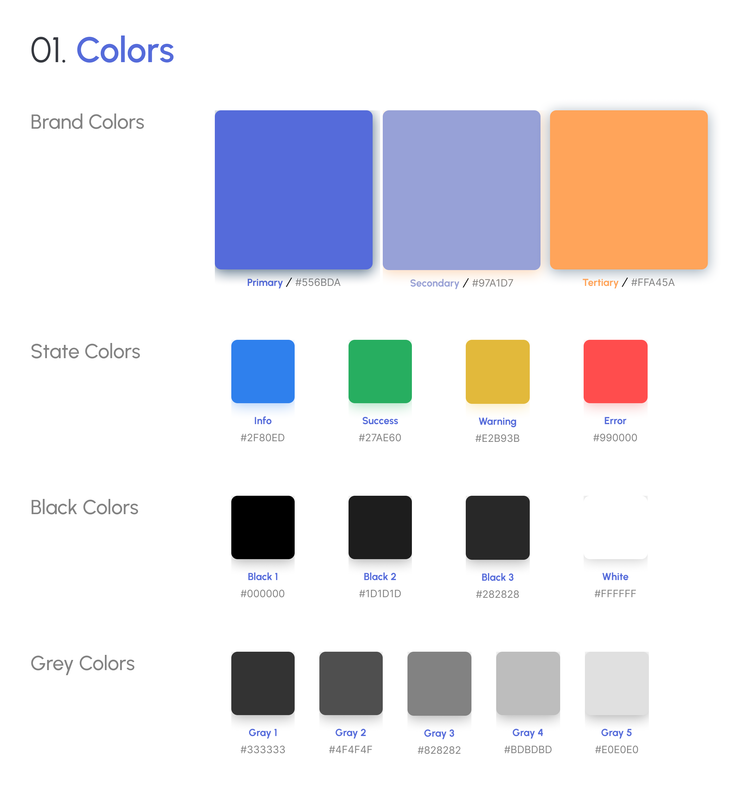
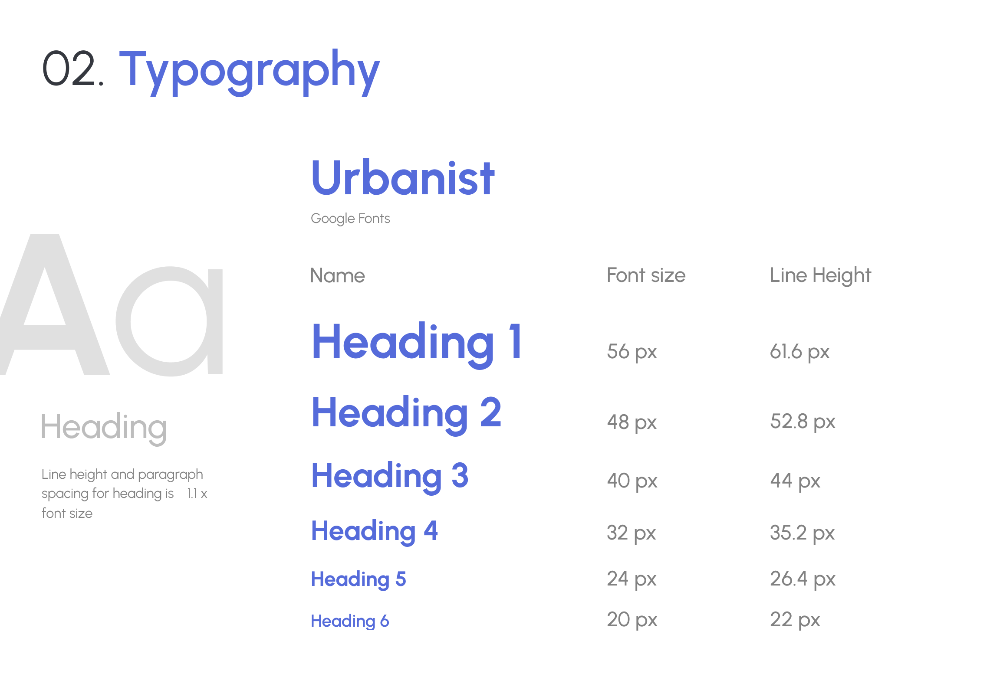
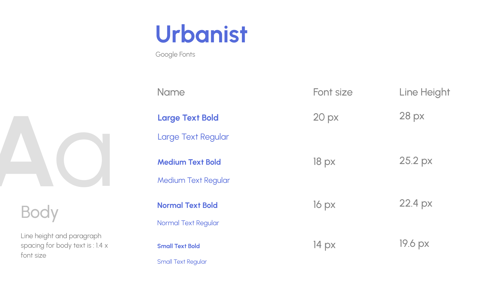
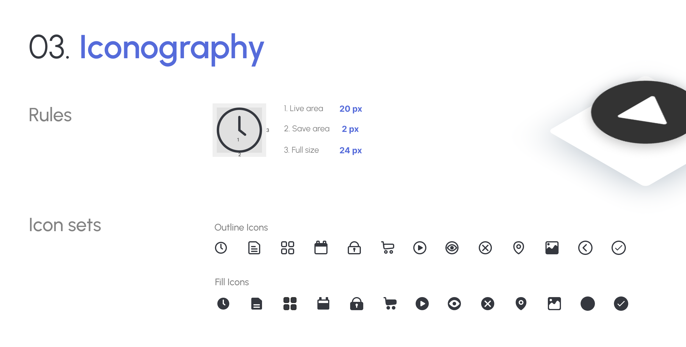
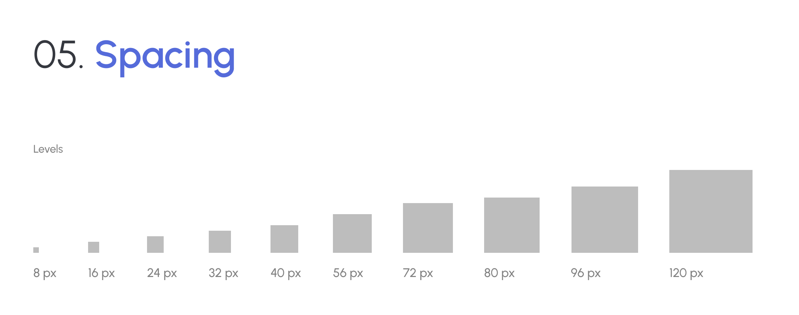
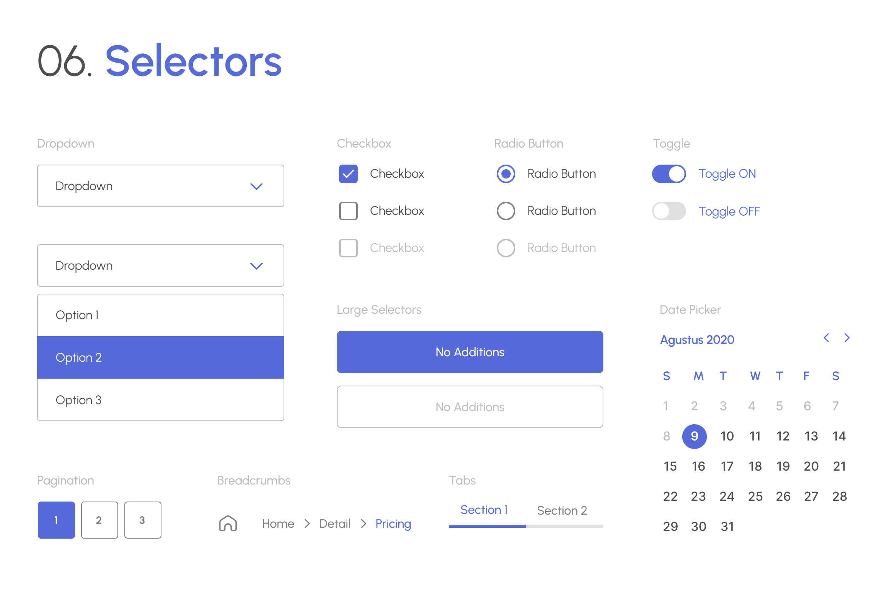
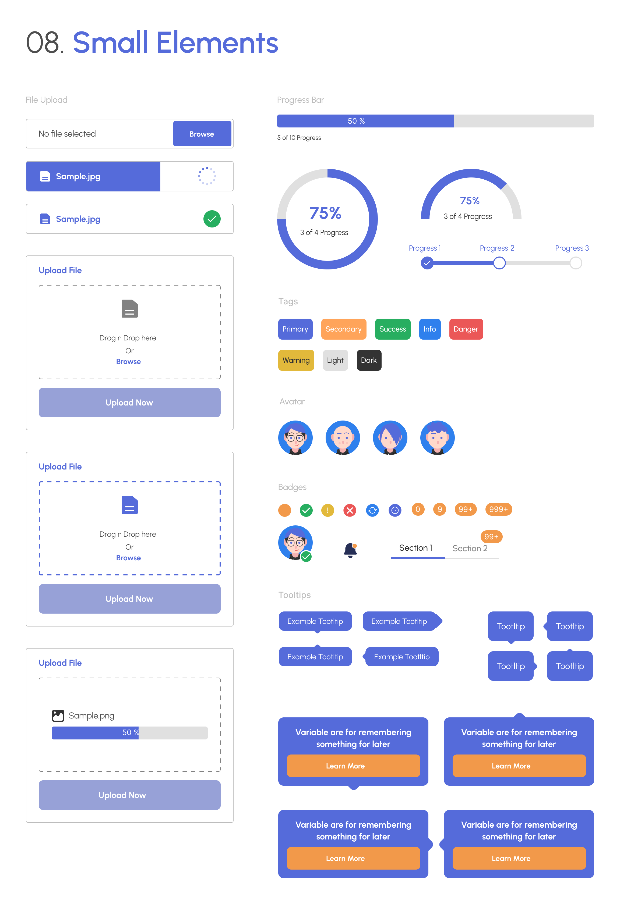
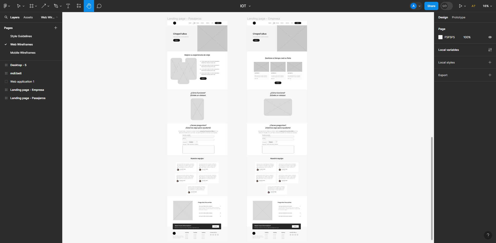

# Capítulo V: Solution UI/UX Design

## 5.1 Style Guidelines

### 5.1.1 General Style Guidelines

Para nuestra paleta de colores, hemos seleccionado tonos que evocan una sensación de confianza y profesionalismo. El color primario  transmite una sensación de seguridad y fiabilidad, mientras que el color secundario añade un toque de optimismo y claridad a nuestra interfaz. El color terciario aporta un elemento de calidez y vitalidad. Además de nuestra paleta de colores, hemos definido una tipografía clara y legible que refuerza la experiencia del usuario. Nuestro sistema de iconografía utiliza símbolos intuitivos y reconocibles para mejorar la navegación y comprensión de la interfaz. El sistema de cuadrícula garantiza una disposición ordenada y consistente de los elementos en la pantalla, mientras que el espaciado adecuado proporciona una experiencia visual equilibrada y agradable. Para los selectores, botones y elementos grandes y pequeños, hemos establecido estilos coherentes que aseguran una experiencia de usuario uniforme en toda la aplicación.

<div align="center">
    
</div>
<div align="center">


</div>
<div align="center">
    
    
</div>
<div align="center">
    
    
</div>
<div align="center">
    
    
</div>

### 5.1.2 Web, Mobile and IoT Style Guidelines

## 5.2 Information Architecture

### 5.2.1 Organization Systems

#### Visual:

Para este campo se decidio una organización jerárquica. Es decir, nos centramos en el diseño de elementos visuales que facilitan la comprensión de la información de manera intuitiva. Los elementos de mayor tamaño representan la jerarquía de primer nivel captando la atención inicial de nuestros usuarios, como el logo, títulos destacados y botones principales. Los elementos de segundo nivel complementan a los de primer orden e incluyen subtítulos, descripciones y campos de entrada de información. Por último, en el tercer nivel, se encuentran elementos independientes o complementarios, como el icono de búsqueda y las imágenes de perfil. Este enfoque garantiza una experiencia de usuario fluida y facilita la navegación intuitiva a través de nuestra plataforma.

#### Esquemas de categorización de contenido:

En esta sección, ofrecemos al usuario de la aplicación web la posibilidad de organizar el contenido mostrado según sus preferencias, mediante los criterios:
<strong>

- Cronológico:</strong> Ver los datos y estadísticas respectivas de los buses o paradas seleccionadas según la hora y fecha más reciente.

<strong>

- Según prioridad:</strong> Se muestran los perfiles de los trabajadores según el nivel de estres detectado o según el número de incidencias recibidas.

### 5.2.2 Labeling Systems

En nuestra interfaz de usuario, empleamos varios sistemas de etiquetado para mejorar la comprensión y la navegación del usuario:

<strong>

- Encabezados (Headings):</strong> Estas etiquetas se utilizan para estructurar y organizar el contenido de manera clara y legible. Permiten a los usuarios comprender rápidamente la información presentada en cada sección.

<strong>

- Etiquetas Textuales:</strong> Estas etiquetas son comunes en nuestra interfaz y se utilizan para identificar y categorizar diferentes secciones o elementos. Proporcionan una guía visual que ayuda a los usuarios a navegar y entender el contenido de manera eficiente.

<strong>

- Etiquetas Icónicas (Iconic Labels):</strong> Utilizamos imágenes o iconos junto con etiquetas textuales para proporcionar una representación visual intuitiva de las funciones o secciones específicas de la interfaz. Esto facilita la identificación rápida y la comprensión del contenido, especialmente para usuarios que prefieren un enfoque visual.

Estos sistemas de etiquetado se implementan de manera coherente en toda nuestra interfaz, incluida la barra de navegación de nuestro mockup, para garantizar una experiencia de usuario intuitiva y sin confusiones.

### 5.2.3 SEO Tags and Meta Tags

#### Para la Landing Page:

- Title:

```html
<title>ChapaTuBus | Solución IoT para Monitoreo de Buses</title>
```

- Meta Tags Description:

```html
<meta
  name="description"
  content="Descubre cómo nuestra tecnología IoT revoluciona el transporte público. Monitoreo de posición de buses, conductore y aforo en tiempo real. ¡Optimiza tus rutas o mejora la gestion con nuestras aplicaciones móviles y web!"
/>
```

- Meta Tags Keywords:

```html
<meta
  name="keywords"
  content="IoT, transporte público, monitoreo de buses, seguridad, aplicaciones móviles, aplicaciones web, aforo en tiempo real, dashboard, tecnología"
/>
```

- Autor:

```html
<meta name="author" content="TechSolutions" />
```

- Copyright:

```html
<meta name="copyright" content="© TechSolutions, 2024" />
```

#### Para la Aplicación Web (Dashboard):

- Title:

```html
<title>ChapaTuBus | BusMonitor</title>
```

- Meta Tags Description:

```html
<meta
  name="description"
  content="Optimiza tus rutas y mejora la seguridad con BusMonitor. Monitorea el pulso de los conductores, el aforo de los buses y recibe alertas en tiempo real. Planifica mejor tus servicios con nuestros análisis detallados y gráficos interactivos."
/>
```

- Meta Tags Keywords:

```html
<meta
  name="keywords"
  content="IoT, transporte público, monitoreo, buses, seguridad, dashboard, pulso del conductor, aforo en tiempo real, análisis de datos"
/>
```

- Author:

```html
<meta name="author" content="TechSolutions" />
```

- Copyright:

```html
<meta name="copyright" content="© TechSolutions, 2024" />
```

### 5.2.4 Searching Systems

En esta sección del informe, nos enfocamos en definir la arquitectura de la información para facilitar a los usuarios la búsqueda de datos dentro de nuestra aplicación móvil y dashboard. Después de un análisis exhaustivo, hemos observado que nuestro sistema alberga una gran cantidad de información. Por ejemplo, un usuario puede buscar ofertas de trabajo según diferentes criterios, como años de experiencia requeridos, rango salarial y habilidades necesarias.

Para mejorar la experiencia de búsqueda, hemos implementado las siguientes características:

**Aplicación móvil (para pasajeros):**

- Barra de búsqueda: Permite a los usuarios buscar líneas de autobús específicas, lo que les facilita encontrar información relevante de manera rápida y sencilla.
- Funcionalidad de búsqueda de paradas: Los usuarios pueden ubicar la parada de autobús más cercana utilizando su ubicación actual o seleccionando una parada específica. Además, hemos agregado la opción de cambiar la dirección del viaje con un simple botón, ofreciendo mayor flexibilidad a los usuarios en sus desplazamientos.

**Dashboard (para empresas de autobuses):**

- Selección por línea de autobús: Permite a las empresas acceder a estadísticas detalladas de una línea de autobús en particular, lo que les ayuda a comprender mejor el rendimiento y la eficiencia de sus servicios.
- Filtrado por día: Capacidad de visualizar datos estadísticos basados en un día específico dentro de un plazo de doce meses, lo que les permite realizar análisis detallados y tomar decisiones informadas.
- Vista por mayor aforo: Se mostrara por defecto la vista en la que se ordenara por una línea de buses, según la cantidad de personas que abordaron por paradero.
- Selección por autobús y conductor: Ofrece la posibilidad de visualizar datos relacionados con un autobús específico y el conductor asignado.

Nuestro enfoque en segmentar y categorizar la información tiene como objetivo principal garantizar una navegación fluida dentro de la aplicación. Nos esforzamos por proporcionar a nuestros usuarios las herramientas necesarias para encontrar fácilmente la información que están buscando, ya sea para planificar su viaje como pasajeros o para gestionar eficientemente su flota de autobuses como empresas de transporte.

<!-- Mencionar a más detalle como buscaran y se mostraraon los datos del dashboard -->

### 5.2.5 Navigation Systems

A través de nuestras aplicaciones, hemos implementado sistemas de navegación que permiten a los usuarios moverse de manera intuitiva y eficiente por todas las secciones disponibles. Esto se logra mediante:

<!-- TO REVIEW -->

**1. Uso de lenguaje claro y conciso:** Cada sección está etiquetada con términos comprensibles y directos, lo que facilita la identificación de las funcionalidades que ofrece la aplicación.

**2. Íconos representativos:** Los usuarios pueden hacer clic en los íconos correspondientes a cada sección para acceder directamente a la funcionalidad deseada. Estos íconos están diseñados de manera intuitiva para reflejar claramente el contenido de cada sección.

**3. Botones desplegables para interconectar secciones:** Implementamos botones desplegables que permiten a los usuarios explorar y acceder fácilmente a secciones relacionadas entre sí. Estos botones facilitan la navegación entre diferentes áreas de la aplicación y fomentan nuevas interacciones.

**4. Navegación aleatoria:** Los usuarios tienen la flexibilidad de explorar el contenido de manera aleatoria, lo que les permite acceder a cualquier sección en el momento que lo requieran. Esto ofrece una experiencia más dinámica y personalizada, adaptada a las necesidades individuales de cada usuario.

**5. Prioridad de páginas de registro e inicio de sesión:** En caso de que un usuario no esté registrado o no haya iniciado sesión, las páginas de registro o inicio de sesión siempre se muestran primero. Esto garantiza que los usuarios puedan acceder fácilmente a estas funciones esenciales y asegura una experiencia coherente para todos los usuarios, independientemente de su estado de inicio de sesión.

## 5.3. Landing Page UI Design

### 5.3.1. Landing Page Wireframe

Juntos, hemos trabajado en equipo utilizando la herramienta de diseño colaborativo Figma para crear las interfaces de usuario de nuestra landing page. Se consideraron nuestros dos segmentos objetivos para el planteamiento del diseño.

<div align="center">
    
</div>

Enlace de Figma: https://www.figma.com/file/97DXUycS74gm7Bu99vor2j/IOT?type=design&node-id=124%3A3&mode=design&t=mj2qihRGU3ibILKb-1

### 5.3.2. Landing Page Mock-up

## 5.4. Applications UX/UI Design

### 5.4.1. Applications Wireframes

### 5.4.2. Applications Wireflow Diagrams

### 5.4.2. Applications Mock-ups

### 5.4.3. Applications User Flow Diagrams

## 5.5. Applications Prototyping
