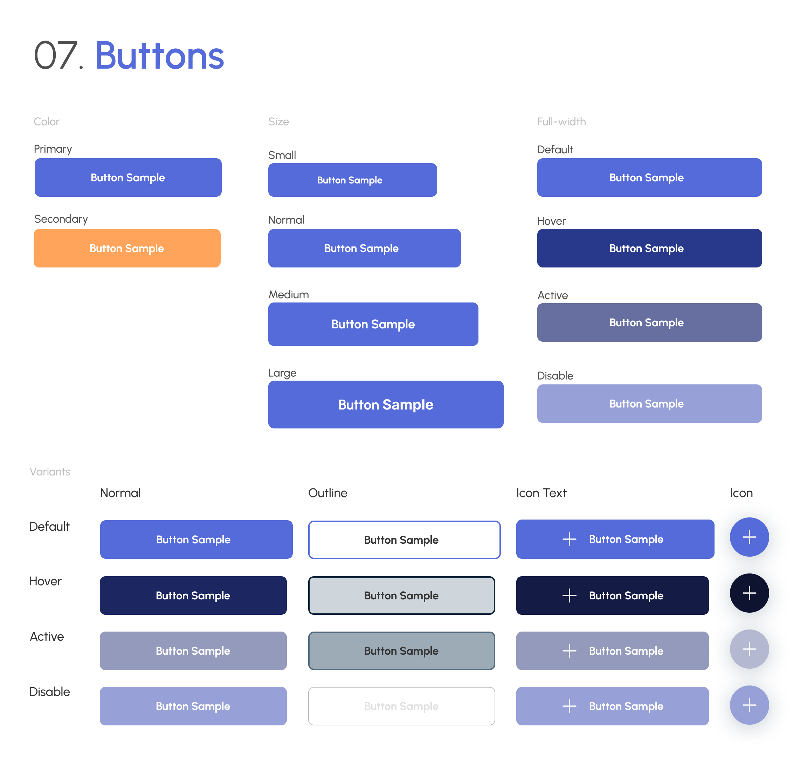

# Capítulo V: Solution UI/UX Design

## 5.1 Style Guidelines

Durante este punto se abrodarán las directrices que nuestra startup utilizará para presentar con un estilo conjunto y agradable nuestros productos.

### 5.1.1 General Style Guidelines

Para nuestra paleta de colores, hemos seleccionado tonos que evocan una sensación de confianza y profesionalismo. El color primario  transmite una sensación de seguridad y fiabilidad, mientras que el color secundario añade un toque de optimismo y claridad a nuestra interfaz. El color terciario aporta un elemento de calidez y vitalidad. Además de nuestra paleta de colores, hemos definido una tipografía clara y legible que refuerza la experiencia del usuario. Nuestro sistema de iconografía utiliza símbolos intuitivos y reconocibles para mejorar la navegación y comprensión de la interfaz. El sistema de cuadrícula garantiza una disposición ordenada y consistente de los elementos en la pantalla, mientras que el espaciado adecuado proporciona una experiencia visual equilibrada y agradable. Para los selectores, botones y elementos grandes y pequeños, hemos establecido estilos coherentes que aseguran una experiencia de usuario uniforme en toda la aplicación.

    

    
    

    
    

    
    

### 5.1.2 Web, Mobile and IoT Style Guidelines

## 5.2 Information Architecture

### 5.2.1. Organization Systems

### 5.2.2. Labeling Systems

### 5.2.3. SEO Tags and Meta Tags

### 5.2.4. Searching Systems

### 5.2.5. Navigation Systems

## 5.3. Landing Page UI Design

### 5.3.1. Landing Page Wireframe

### 5.3.2. Landing Page Mock-up

## 5.4. Applications UX/UI Design

### 5.4.1. Applications Wireframes

### 5.4.2. Applications Wireflow Diagrams

### 5.4.2. Applications Mock-ups

### 5.4.3. Applications User Flow Diagrams

## 5.5. Applications Prototyping
