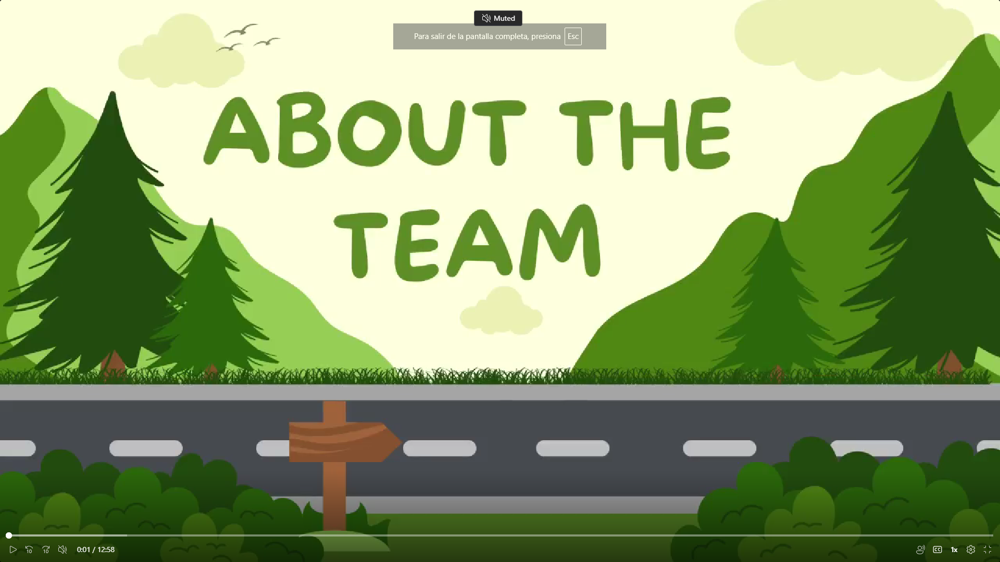

## Conclusiones

- El proyecto "ChapaTuBus" aborda de manera efectiva los problemas del transporte público en Lima, Perú, ofreciendo soluciones tanto para los administradores de flotas de buses como para los pasajeros. La combinación de tecnología IoT y software de gestión aporta una propuesta de valor significativa en un sector con grandes necesidades de optimización. Los dipositivos IoT proporcionan una mejor forma de monitoreo a tiempo real que permitirá a los usuarios poder tomar decisiones de forma mucho más rápida.

- La implementación del proyecto utilizando el enfoque de Domain-Driven Design (DDD) y las metodologías ágiles ha demostrado ser una estrategia eficiente para gestionar la complejidad del desarrollo de soluciones IoT. El uso de herramientas y tecnologías modernas ha permitido un desarrollo ágil y colaborativo del proyecto.

- El diseño de la interfaz de usuario (UI) y la experiencia de usuario (UX) ha sido cuidadosamente planificado y ejecutado, garantizando una navegación intuitiva y una comprensión clara de las funcionalidades por parte de los usuarios. Las entrevistas y pruebas realizadas con los usuarios finales han permitido refinar las historias de usuario y validar el diseño de las aplicaciones.

- La colaboración efectiva del equipo de desarrollo y la gestión ágil bajo Scrum con sprints han sido factores clave para el éxito del proyecto. La evidencia de desarrollo, pruebas y ejecución documentada en el informe demuestra una excelente coordinación y ejecución de las tareas asignadas.

- La validación del producto con usuarios finales y administradores de flotas de buses ha arrojado resultados positivos, indicando que la solución propuesta cumple con los requisitos y expectativas de los usuarios. Las funcionalidades como la predicción de tiempos de llegada, la gestión de rutas y la personalización de perfiles han sido bien recibidas.

- El proyecto "ChapaTuBus" tiene un gran potencial para mejorar la eficiencia y la calidad del transporte público en Lima. La escalabilidad de la solución y su capacidad para integrarse con otras plataformas de transporte público auguran un impacto significativo en la optimización de las operaciones y la experiencia de los usuarios.

- A lo largo del desarrollo del proyecto, el equipo ha adquirido valiosas experiencias y conocimientos sobre la gestión de proyectos IoT y el diseño de soluciones orientadas al usuario. La retroalimentación obtenida durante el proceso de validación será crucial para futuras mejoras y la evolución del producto.

## Video about the team

     

**Enlace:**
https://upcedupe-my.sharepoint.com/%3Av%3A/g/personal/u20181b530_upc_edu_pe/ESxl_RCRdKFFsSCL-T1TXJsBIbwxzi8ziGCytcVcouG-cQ?e=5B0lum&nav=eyJyZWZlcnJhbEluZm8iOnsicmVmZXJyYWxBcHAiOiJTdHJlYW1XZWJBcHAiLCJyZWZlcnJhbFZpZXciOiJTaGFyZURpYWxvZy1MaW5rIiwicmVmZXJyYWxBcHBQbGF0Zm9ybSI6IldlYiIsInJlZmVycmFsTW9kZSI6InZpZXcifX0%3D

## Recomendaciones

- Considerar la inclusión de funcionalidades adicionales en la aplicación móvil, como la posibilidad de realizar pagos electrónicos de pasajes directamente desde la app. Esto facilitaría aún más la experiencia del usuario y reduciría la dependencia de efectivo.

- Expandir la cobertura del sistema "ChapaTuBus" a otras ciudades importantes de Perú y eventualmente a nivel nacional. Esto permitirá que más usuarios se beneficien de las mejoras en eficiencia y experiencia de transporte público.

- Implementar la integración con otros modos de transporte, como trenes y bicicletas públicas, para ofrecer una solución de movilidad completa y fomentar el uso de transporte multimodal.

- Realizar campañas de educación y promoción para asegurar una adopción efectiva de la plataforma. Es crucial que tanto los administradores de flotas como los pasajeros entiendan y aprovechen al máximo las funcionalidades de la plataforma, mediante tutoriales en video, guías en línea y soporte técnico continuo.

- Establecer mecanismos para recoger retroalimentación continua de los usuarios por medio de las redes sociales, tanto administradores como pasajeros, para identificar áreas de mejora y adaptar la plataforma a las necesidades cambiantes del mercado.

- Analizar continuamente los datos generados por la plataforma para optimizar las rutas y mejorar la eficiencia operativa de las flotas de buses.

- Implementar inteligencia artificial (IA) para predecir la demanda de pasajeros y ajustar las rutas y horarios en tiempo real. Esto permitirá una utilización más eficiente de los recursos y una mejora en la satisfacción del usuario.

## About The Team

  

**Enlace:**
https://upcedupe-my.sharepoint.com/%3Av%3A/g/personal/u20181b530_upc_edu_pe/ESxl_RCRdKFFsSCL-T1TXJsBIbwxzi8ziGCytcVcouG-cQ?e=5B0lum&nav=eyJyZWZlcnJhbEluZm8iOnsicmVmZXJyYWxBcHAiOiJTdHJlYW1XZWJBcHAiLCJyZWZlcnJhbFZpZXciOiJTaGFyZURpYWxvZy1MaW5rIiwicmVmZXJyYWxBcHBQbGF0Zm9ybSI6IldlYiIsInJlZmVycmFsTW9kZSI6InZpZXcifX0%3D
