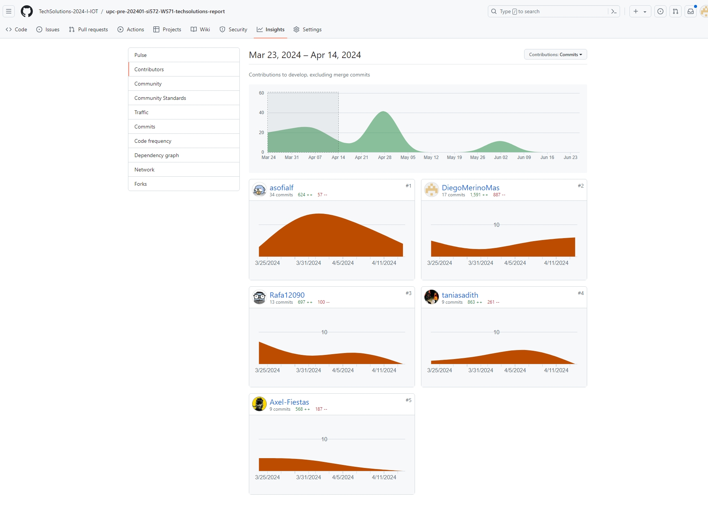
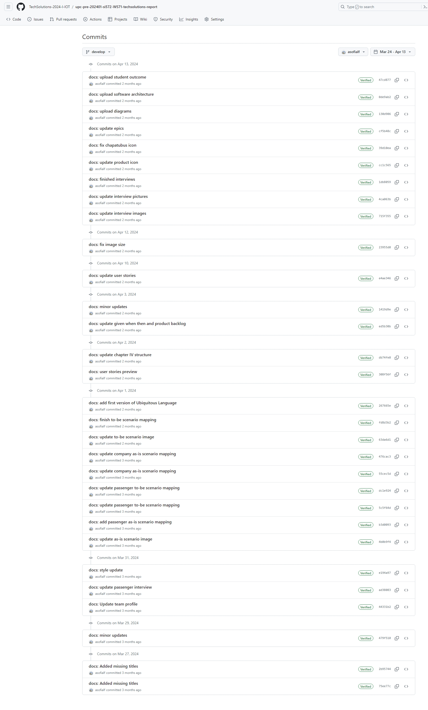
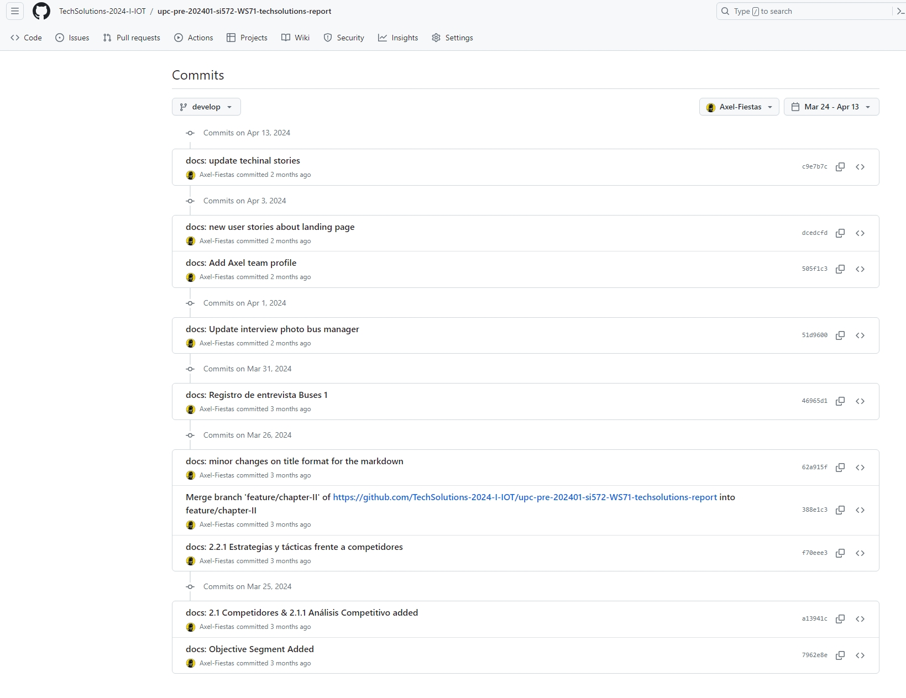
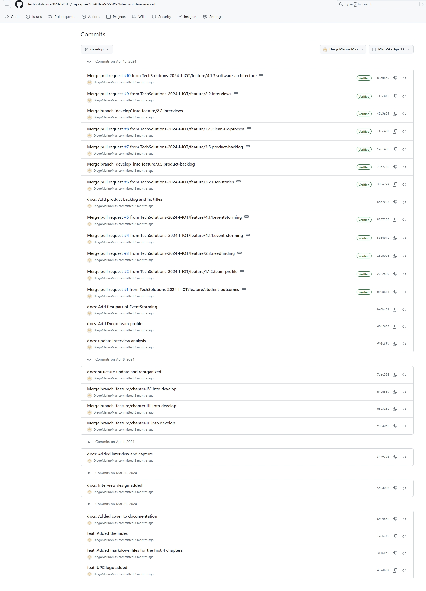
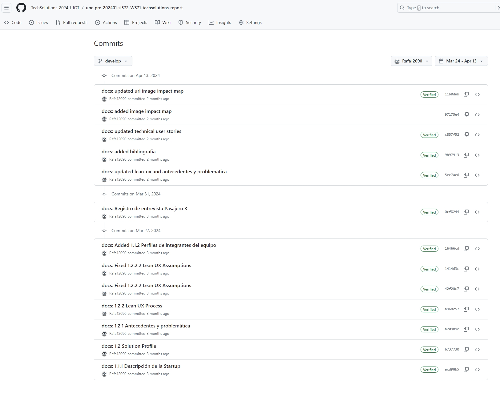
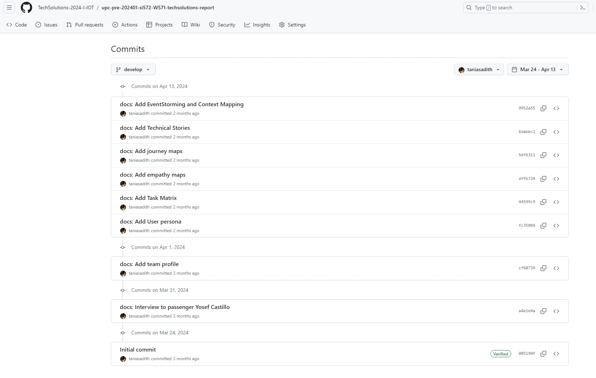
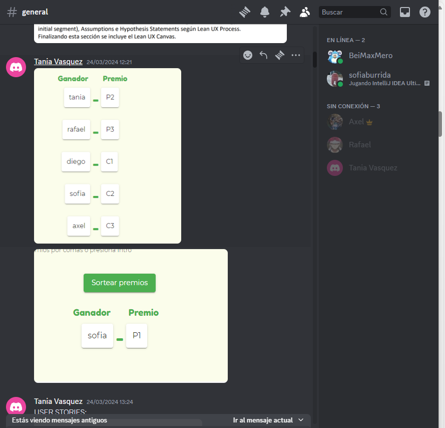
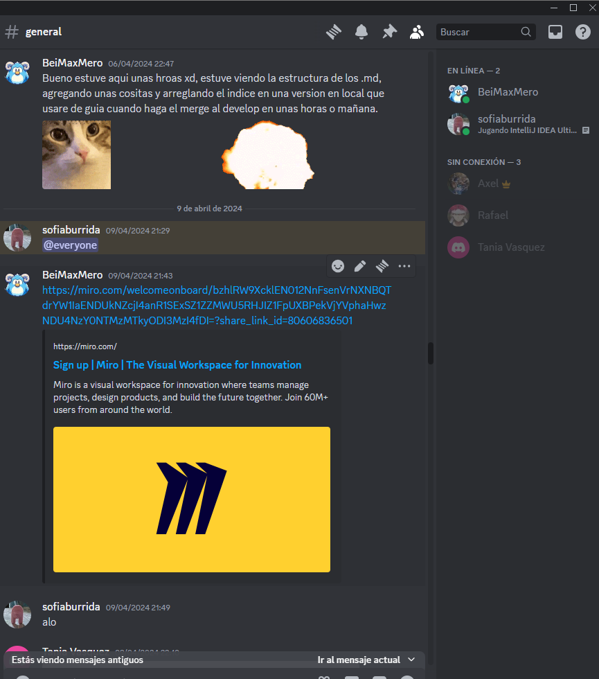

**Universidad Peruana de Ciencias Aplicadas**

**Ingeniería de Software**

Curso: Desarrollo de Soluciones IoT

Sección: WS71

Profesor: Angel Augusto Velásquez Núñez

Ciclo: 2024-1

---

# TechSolutions

## ChapaTuBus

### Team Members

| Integrante                               | Código     |
| ---------------------------------------- | ---------- |
| Alfaro Salinas, Andrea Sofia Del Milagro | U202115862 |
| Fiestas Santisteban, Axel Joshue         | U20201b908 |
| Merino Mas, Diego Martín                 | U202111473 |
| Primo Estrada, Rafael Wimmer             | U202023137 |
| Vasquez Sal Y Rosas, Tania Sadith        | U20181b530 |

Junio 2024

### Registro de Versiones del Informe

| Versión | Fecha      | Autor                   | Descripción de modificación                                                                                                                                                                                                                                                                                                                                                                                                                                                                                                                                                                                                                                                                                                                                                                                              |
| ------- | ---------- | ----------------------- | ------------------------------------------------------------------------------------------------------------------------------------------------------------------------------------------------------------------------------------------------------------------------------------------------------------------------------------------------------------------------------------------------------------------------------------------------------------------------------------------------------------------------------------------------------------------------------------------------------------------------------------------------------------------------------------------------------------------------------------------------------------------------------------------------------------------------ |
| 1.0     | 20/04/2024 | Todos los participantes | - Primera versión del informe entregada con los siguientes elementos: Carátula, Registro de Versiones del Informe, Project Report Collaboration Insights, Contenido, Student Outcome, Capítulo I: Introducción, Capítulo II: Requirements Elicitation & Analysis, Capítulo III: Requirements Specification, Capítulo IV: Solution Software Design, Avance de Conclusiones, Bibliografía y Anexos. - Entrega inicial de archivos: Final Project Documentation Report, Final Project Keynote, Final Project Individual Member Performance Report (by Team Leader), Archivo .zip con archivos complementarios. - Se utilizaron herramientas como Pandoc para la exportación del archivo a presentar. - Se realizó una revisión exhaustiva del informe en busca de mejoras y correcciones sugeridas por el docente. |
| 1.1     | 30/04/2024 | Todos los participantes | - Se realizaron correcciones según las sugerencias del profesor, incluyendo:  _ Utilización de Pandoc para la exportación del archivo.  _ Revisión y mejora del contenido relacionado con Lean UX, Eventstorming, y aspectos técnicos y de diseño.  _ Incorporación de un enfoque más medible en los outcomes del proyecto.  _ Adecuación de las User Personas y resumen de entrevistas.  _ Consideración de multas y papeletas para el proyecto.  _ Traducción del lenguaje ubícuo al inglés.  \* Revisión detallada de historias de usuario y técnicas, así como de la base de datos. - Se ajustaron y mejoraron los artefactos presentados inicialmente. - Se incluyó la versión corregida y mejorada del Registro de Versiones del Informe y otros elementos requeridos.                  |
| 2.0     | 01/05/2024 | Todos los participantes | - Entrega de la Trabajo Práctico (TP) con los siguientes elementos:  _ Despliegue de la primera versión del Landing Page y Frontend Web Applications.  _ Nuevos capítulos incluidos en el informe: Capítulo V: Solution UI/UX Design, Capítulo VI: Product Implementation, Validation & Deployment, con detalles sobre la implementación y configuración del software, así como del Landing Page y las aplicaciones.  _ Detalles sobre la implementación del Sprint 1, incluyendo la planificación, backlog, evidencia de desarrollo, pruebas, ejecución, documentación de servicios y despliegue.  _ Insights de colaboración del equipo durante el Sprint 1.  \* Actualización de artefactos entregados con la versión corregida y mejorada.                                                            |
| 3.0     | 08/06/2024 | Todos los participantes | - Entrega de la Trabajo (TB2) con los siguientes elementos:  _ Despliegue de la última versión del Landing Page, Frontend Web Applications, Web Services y Mobile Application.  _ Detalles sobre la implementación del Sprint 2, incluyendo la planificación, backlog, evidencia de desarrollo, pruebas, ejecución, documentación de servicios y despliegue.  _ Insights de colaboración del equipo durante el Sprint 2.  _ Actualización de artefactos entregados con la versión corregida y mejorada.                                                                                                                                                                                                                                                                                                      |
| 4.0     | 27/06/2024 | Todos los participantes | - Entrega de la Trabajo (TF) con los siguientes elementos:  _ Despliegue del Landing Page, Frontend Web Applications, Web Services y Mobile Application. Así como ultimas configuraciones a los dispositivos IoT  _ Detalles sobre la implementación del Sprint 3, incluyendo la planificación, backlog, evidencia de desarrollo, pruebas, ejecución, documentación de servicios y despliegue.  _ Insights de colaboración del equipo durante el Sprint 2.  _ Actualización de artefactos entregados con la versión corregida y mejorada.                                                                                                                                                                                                                                                                    |

### Project Report Collaboration Insights

Link de la organizacion: https://github.com/TechSolutions-2024-I-IOT
Link al documento en el repositorio de la organizacion: https://github.com/TechSolutions-2024-I-IOT/upc-pre-202401-si572-WS71-techsolutions-report

#### Entrega TB1

El equipo se reunió por discord para hacer las primeras coordinaciones y posteriormente todo el desarrollo y reuniones de avance lo realizamos mediante Discord. En cuanto al desarrollo del informe, se realizó una repartición de manera aleatoria mediante una ruleta. Sin embargo, todos los participantes dieron ideas sobre el Lean UX y para la formación de Bounded Context.

Evidencias de colaboración y commits - Github:

- Contributors Image of Github Insights

     

- Commits realizados por integrante

  - Andrea Sofia Alfaro Salinas
      

         
      

  - Axel
      

         
      

  - Diego Martin Merino Mas
      

         
      

  - Rafael
      

         
      

  - Tania
      

         
      

- Evidencias de colaboración - otras herramientas
  - Discord: Utilizado como medio de reuniones y para dejar preguntas y comentarios asi como guardar los links
    

       
    

    

       
    

#### Entrega TP

El equipo se reunió por discord para hacer las primeras coordinaciones y posteriormente todo el desarrollo y reuniones de avance lo realizamos mediante Discord. En cuanto al desarrollo del informe, se realizó una repartición de manera aleatoria mediante una ruleta. Sin embargo, todos los participantes dieron ideas sobre el Lean UX y para la formación de Bounded Context.

Evidencias de colaboración y commits - Github:

- Contributors Image of Github Insights

     

- Commits realizados por integrante

  - Andrea Sofia Alfaro Salinas
      

         
      

  - Axel
      

         
      

  - Diego Martin Merino Mas
      

         
      

  - Rafael
      

         
      

  - Tania
      

         
      

- Evidencias de colaboración - otras herramientas
  - Discord: Utilizado como medio de reuniones y para dejar preguntas y comentarios asi como guardar los links
    

       
    

    

       
    

#### Entrega TB2

#### Entrega TF

[Tabla de contenidos](./Tabla_de_contenidos.md)
